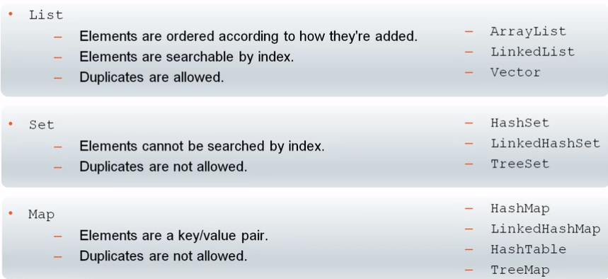

# Extra Material

Material which does not map to the exam topics but may be useful nonetheless. 

- [0.1 - Multi-Release JAR Files](#0-2)
- [0.2 - Enhancements to the Stream API](#0-3)
- [0.3 - JShell](#0-4)
- [0.4 - Convenience Methods for Collections](#0-5)
- [0.5 - Convenience Methods for Arrays](#0-6)
- [0.6 - Enhanced Deprecation](#0-7)
- [Quiz](#q)
- [Quiz Answers](#qa)

## <a name="0-1"></a>0.1 - Multi-Release JAR Files

### Packaging an Application for Different JDKs

- Maintaining and releasing an application targeting different JDKs is difficult
- Prior to Java SE 9, when packaging the application code for different JDKs, you needed to create 
a separate application JAR for each


- JDK 9 offers a new way of packaging application code so that it can support multiple JDK versions 
in a single JAR
- This type of JAR is called a multi-release JAR


### What is a Multi-Release JAR file?

A multi-release JAR (MRJAR) is a single unit of distribution, compatible with multiple major Java 
platform versions. For example:

- You can have an MRJAR that will work on Java SE 8 and Java SE 9
- The MRJAR will contain the class files compiled in Java SE 8, plus additional classes compiled in 
Java SE 9.
    - The classes compiled in Java SE 9 may take advantage of APIs only offered in Java SE 9 and 
    above

### Structure of a multi-release JAR file

A JAR has a root directory, which contains:

- A directory structure representing packages and classes
- A `META-INF` directory that is used to store metadata about the JAR (this contains a 
`META-INF/MANIFEST.MF` file containing its attributes)


An MRJAR extends the `META-INF` directory to store classes that are for a particular JDK version.

- These classes that are specific to particular JDK version are contained in a versions subdirectory 
in the `META-INF` directory.
- The versions directory may contain many subdirectories - each of them named as a JDK major version

Entries in a multi-release JAR file look like the following:


If ann MRJAR is used in an environment that does not support MRJAR then it is treated as a regular 
JAR. So, if the MRJAR is ued with:

- Pre JDK 9:
    - The contents in the root directory will be used and everything in `META-INF/versions/9` will 
    be ignored
- JDK 9+:
    - There are additional classes which will be used instead of those with the same name

#### Search process in an MRJAR

If more than one version of a class exists in an MRJAR:

- The JDK will use the first one it finds
- The search begins in the directory tree whose name matches the JDK major version number
- The search continues with successively lower-numbered directories until finally reaching the root 
directory
    - i.e., if the class has more than one version, for JDK 9 the search starts at `META-INF/versions/9`, 
    whilst for JDK 8, it starts at the root, `META-INF`  

### Creating a multi-release JAR file

The `jar` tool has been enhanced in JDK 9 to support creating MRJARs. In JDK 9, the `jar` tool 
accepts a new option called `--release`:

`jar <options> --release N <other options>`

Here, `N` is a JDK major version, such as 9 for JDK 9


You can list the entries in `foo.jar` by using the `--list` option:

````
jar --list --file foor.jar

META-INF/
META-INF/MANIFEST.MF
com/
com/foo/
com/foo/ListUtil.class
...
META-INF/versions/9/com/foo/ListUtil.class
...
````

You can run `foo.jar` on JDK 7, 8 or 9 with:

`java -jar foo.jar`

Different classes will be used in each run depending on the JDK version.

### Creating a modular multi-release JAR file

Here is the same project converted to a modular project by adding `module-info.java`:


Use the `--create` option from the `jar` tool as seen previously to create the modular MRJAR. If 
you ran `--list` on this, you'll see the `module-info.class` included in the directory/file list. 

Running can be done the same way as above. But now, because the project is modular we can also 
run it on the module path:

`java -p modular_foo.jar -m mymod`

## <a name="0-2"></a>0.2 - Enhancements to the Stream API

New `Stream` interfaces from Java 9 with code examples:

| Modifier and Type | Method | Description | Example |
| --- | --- | --- | --- |
| default Stream<T> | dropWhile​(Predicate<? super T> predicate) | Returns, if this stream is ordered, a stream consisting of the remaining elements of this stream after dropping the longest prefix of elements that match the given predicate. | [Example](https://github.com/rysharprules/Java-SE11-Upgrade-Exam/blob/master/src/ocp/study/part00/DropWhileExample.java) |
| static <T> Stream<T> | iterate​(T seed, Predicate<? super T> hasNext, UnaryOperator<T> next) | Returns a sequential ordered Stream produced by iterative application of the given next function to an initial element, conditioned on satisfying the given hasNext predicate. | [Example](https://github.com/rysharprules/Java-SE11-Upgrade-Exam/blob/master/src/ocp/study/part00/IterateExample.java) |
| default Stream<T> | takeWhile​(Predicate<? super T> predicate) | Returns, if this stream is ordered, a stream consisting of the longest prefix of elements taken from this stream that match the given predicate. | [Example](https://github.com/rysharprules/Java-SE11-Upgrade-Exam/blob/master/src/ocp/study/part00/TakeWhileExample.java) |

 _Note: `iterate` existed in Java 8 but is now overloaded since Java 9._

## <a name="0-3"></a>0.3 - JShell

Normal execution:
- You enter all your code ahead of time
- Compile your code
- The program runs once in its entirety
- If after the first run you realize you've made a mistake you need to run the entire program again
    
JShell:
- It's a command line interface
- It avoids the ceremony of creating a new program and gets right into testing code
- You enter one of code at a time
- You get feedback on that line
- At any time you can:
    - Explore an API, language features, a class you wrote; do other experiments with logic, 
    variables, or methods
    - Prototype ideas and incrementally write more-complex code
- You'll get instant feedback from the **Read Evaluate Print Loop (REPL)** process


Note that semicolons are optional on one liners but are mandatory on multi-line statements, e.g. for-loops.

- R \- The expression `Math.sqrt(8)` is **read** into JShell
- E \- The expression is **evaluated**
- P \- Its value is **printed**
- L \- The state of JShell **loops** back to where it began

You can use the `/edit` command to open the Edit Pad:


`jshell> Math.sqrt(8)` evaluated to `$2 ==> 2.8284271247461903`. The `$2` is a **scratch variable**.
Like most other variables, scratch variables store the result of a method call, can be referenced later,
have its value changed, be primitive or an Object type. Scratch variable names are auto generated.

Too many scratch variables can lead to confusion as there's no limit to how many you can make and their
names are not descriptive. Traditional variables have names which provide context for their purpose.
JShell allows you to declare, reference, and manipulate variables as you normally would.

The `/list` command shows you the expressions that have been passed into JShell:

````
jshell> /list
   1 : 2 + 3
   2 : Math.sqrt(8)
   3 : String name = "Sharp";
   4 : name += " test"
````

The `/var` command shows you the variables in the current JShell instance:

````
jshell> /var
|    int $1 = 5
|    double $2 = 2.8284271247461903
|    String name = "Sharp test"
|    String $4 = "Sharp test"
````

JShell provides tab completion for Java SE API. You can also "double tab" to get JavaDocs for API classes:

````
jshell> System.out
Signatures:
System.out:java.io.PrintStream

<press tab again to see documentation>

jshell> System.out
System.out:java.io.PrintStream
The "standard" output stream.This stream is already open and ready to accept output data.
Typically this stream corresponds to display output or another output destination specified by
the host environment or user.
...
````

The `/imports` command shows you the packages imported into JShell by default.

`/help` provides a list of all the commands.

## <a name="0-4"></a>0.4 - Convenience Methods for Collections

Many convenience methods have been added in Java SE 9:


A reminder of the key Collection interfaces:



### `of` method

In Java SE 8, Collections require one line of code for each element:

````
List<String> testList = new ArrayList<>();
testList.add("A");
testList.add("B");
testList.add("C");
````

In Java SE 9, the same work is done in one line of code with `of`

`List<String> testList = List.of("A", "B", "C");`

The same is available for `Set`s:

`Set<String> testSet = Set.of("A", "B", "C");`

During the creation of a `Set` using a factory method, if duplicate elements are passed as parameters, 
then `IllegalArgumentException` is thrown at runtime.

`Map` has an `of` method also:

`Map<String, Integer> testMap = Map.of("A", 1, "B", 2, "C", 3);`

Passing in duplicate values for Key would throw an `IllegalArgumentException`.

For `List` and `Set` there are 12 overloaded versions of this method – eleven with 0 to 10 parameters 
and one with var-args:

````
static <E> List<E> of()
static <E> List<E> of(E e1)
static <E> List<E> of(E e1, E e2)
// ....and so on
 
static <E> List<E> of(E... elems)
````

For most practical purposes, 10 elements would be sufficient, but if more are required, the var-args 
version can be used.

Now, we may ask, what is the point of having 11 extra methods if there's a var-args version that can 
work for any number of elements.

The answer to that is performance. Every var-args method call implicitly creates an array. Having the 
overloaded methods avoids unnecessary object creation and the garbage collection overhead thereof.

Similarly to `List` and `Set`, the `of` method for `Map` is overloaded to have 0 to 10 key-value pairs.
In the case of `Map`, there is a different method for more than 10 key-value pairs, `ofEntries`:

````
Map<String, String> map = Map.ofEntries(
  new AbstractMap.SimpleEntry<>("foo", "a"),
  new AbstractMap.SimpleEntry<>("bar", "b"),
  new AbstractMap.SimpleEntry<>("baz", "c"));
````

If you pass a `null` as a parameter of `of` for `List`, `Set` or `Map` you will get a `NullPointerException`.

`of` and `ofEntries` return immutable collections. Methods like `add`, `set` and `remove` throw 
`UnsupportedOperationException`. The common case is to be able to create a collection from known values
which never change.

No general-purpose immutable collections previously existed in the JDK. Unmodifiable wrappers are a poor
substitute as the wrapper is unmodifiable but the underlying collection still is:

````
Set<String> testSet = new HashSet<>(); testSet.add("A"); testSet.add("B");
Set<String> testSet2 = Collections.unmodifiableSet(testSet);
````

`testSet` can be altered which changes `testSet2`, despite it being "unmodifiable"!

## <a name="0-5"></a>0.5 - Convenience Methods for Arrays

`equals` was introduced in Java SE 8. Java SE 9 introduced `compare`, `compareUnsigned`, and `mismatch`
plus overloads for `equals`.

### Equating Two Arrays

We can use equals to compare two arrays contents - it returns a `boolean`  indicating the equality 
between the two arrays under test:

````
char[] DNAStrand1 = {'A', 'A', 'G', 'T', 'C', 'T'};
char[] DNAStrand2 = {'A', 'A', 'G', 'T', 'C', 'T'};
Arrays.equals(DNAStrand1, DNAStrand2); // true
````

Before this introduction, we'd have to use a for-loop to go through both arrays and check each element 
at each position.

In Java SE 9, `equals` was overloaded to let you specify a range:

````
char[] DNAStrand3 = {'G', 'G', 'G', 'T', 'C', 'T'};
char[] DNAStrand4 = {'T', 'A', 'G', 'G', 'C', 'C'};
Arrays.equals(DNAStrand1, 2, 5, DNAStrand2, 3, 6); // true
````

The above code compares `DNAStrand3` with the range between indices 2 and 5 (`'G', 'T', 'C'`) and 
`DNAStrand4` with the range between indices 3 and 6 (`'G', 'T', 'C'`) which returns `true`.

There are variants for all array types. This includes a generic version.

````
Comparator<? super Character> dnaComparator = new DNAComparator<>();
Arrays.equals(DNAStrand1, 2, 5, DNAStrand2, 3, 6, dnaComparator));
````

### Comparing the Difference Between Two Arrays

`compare` returns an integer, measuring the distance between the fist two elements to differ:


There are 17 characters between T and C in the alphabet. So what if many elements differ from the array?
This method does not return the cumulative difference between all elements. It only returns the 
difference between the first mismatch.

Similar to `equals`, `compare` is overloaded to handle all array types (primitive and objects), including
comparisons within a range (with to and from indexes), and with generic variants letting you specify 
comparison criteria via a `Comparator`.

#### Absolute values with `compareUnsigned`

`compareUnsigned` works with a limited number of array types: `byte`, `short`, `int` and `long`. This
allows you to compare when you do not care about the sign of the number and are only interested in 
comparing absolute values.

### Pinpointing the Mismatch Between Two Arrays

The `mismatch` method returns the position of the first mismatch when comparing two arrays:

````
char[] DNAStrand5 = {'G', 'A', 'G', 'T', 'C', 'T'};
char[] DNAStrand6 = {'G', 'A', 'G', 'C', 'C', 'C'};
Arrays.mismatch(DNAStrand5, DNAStrand6); // 3
````

The 3 returned also allows us to know the length of the prefix, i.e. the elements that were matched 
before a mismatch was found.

## <a name="0-6"></a>0.6 - Enhanced Deprecation

Java offers a couple of mechanisms to depracate the API. One is `@deprecated` in the Javadoc that's 
introduced JDK 1.1. The other one is `@Depracated` with a capital D, which was introduced in JDK 5.

### Using `@deprecated`

Use the `@deprecated` tag in the Javadoc comment of any deprecated program element to indicate that it
should no longer be used. This tag is valid in all class, method, or field documentation comments.


### Enhancements to the `@Deprecated` Annotation in JDK 9

`@Deprecation` is used to indicate deprecation. It can precede a module, class, method or member declaration.
The following two elements are added to the `@Deprecated` annotation: `since=<string>` and `forRemoval=<boolean>`.

### Using `@Deprecated`

The `@Deprecated` annotation contains these elements:

- `forRemoval=<boolean>` - returns a boolean value
    -   `forRemoval=true`:
        - Is a warning that the API is subject to removal in a future release
        - It is called a **terminal deprecation**, and warnings issued are called removal warnings
    -   `forRemoval=false`:
        - Recommends that code should no longer this API, however there is no current intent to remove it
        - Is called an **ordinary deprecation**, and warnings issued are called ordinary warnings
        - Is the default
- `since=<string>`: returns String
    - This string contains the release or version number when the element was deprecated
    - The default value is an empty string
    
The two types of warnings are controlled by separate `-Xlint` flags: `Xlint:deprecation` and `Xlint:removal`.
The `javac -Xlint:removal` option is enabled by default so removal warnings are shown. Below is an
example of compiler deprecation warnings.


#### Example using the `@Deprecated` annotation

An example of a `@Deprecated` annotation from the `java.lang.Thread` class:


Further examples of deprecated APIs in JDK 9 are:

- `java.se.ee` module
    - `@Deprecated(since="9", forRemoval=true`<br />
      `Module java.se.ee`
- `java.corba` module
- `java.applet.Applet` class
- `Thread.destroy()`
- `Thread.stop()`

### Suppressing deprecation warnings

Prior to JDK 9, you could surpress all deprecation warnings by annotating with `@SuppressWarnings`.
Starting JDK 9, the `@SuppressWarnings` deprecation now works only for ordinary deprecation. It shows 
compiler warnings for depracated API intended for removal in a future release.

### `jdeprscan`

Before JDK 9, you had to recompile your source code to find out about the deprecated JDK API from 
the compiler modification. Starting JDK 9, a new static analysis tool called `jdeprscan` is now 
available. This tool performs a static analysis of class files and JAR and reports the use of deprecated APIs.

The benefit of the `jdeprscan`, is that it's important to discover dependencies on a deprecated API 
before the APIs are removed from the JDK. `jdeprscan` looks for and reports the usage of only deprecated 
Java SE APIs.

#### Running `jdeprscan`

The `jdeprscan` tool is located in the `JDK_HOME/bin` directory. The syntax to run is:

`jdeprscan [options] {dir|jar|class}`

You specify a list of space-separated directory, JARs, or a fully-qualified class names as arguments 
to the scan.

Example: `com.example.foo.class`<br />
<br />
<br />


`jdeprscan` can be version-specific with the `--release` setting - from JDK 6 and up. Note, you don't 
have to install different versions of the JDK.


## <a name="q"></a>Quiz

1. <a name="q1"></a>If a class `Test.class` contains SE 9 specific code and is in the root directory of an MRJAR, and another
`Test.class` file contains SE 8 specific code and is in `META-INF/versions/9`, what will happen if a 
JDK 8 runtime is used?
    - A. `Test.class` in the root directory will be used and will fail
    - B. `Test.class` containing SE 8 specific code will be used
    - C. `Test.class` in the root directory will be used
<br />[Jump to answer](#qa1)
2. <a name="q2"></a>In a modular MRJAR file, where should the `module-info.class` be stored?
    - A. In the root directory for the module, under the `META-INF/versions/<version number>` for the 
    appropriate version of the modular application
    - B. In both locations A & B
    - C. In the root directory for the module, under the root directory of the JAR
<br />[Jump to answer](#qa2)
3. <a name="q3"></a>If a `Test.class` exists in the root directory of an MRJAR and under `META-INF/versions/10`, 
which version of the class will be used with a JDK 9 runtime? (Assuming that `Test.class` is 
required to run the code in the JAR)
    - A. Neither, the code will fail if no `Test.class` file in a `META-INF/versions/9` directory
    - B. `Test.class` in the `META-INF/versions/10` directory
    - C. `Test.class` in the root directory
<br />[Jump to answer](#qa3)
4. <a name="q4"></a>Do you need to make an import statement before creating an `ArrayList` in JShell
    - A. Yes
    - B. No
<br />[Jump to answer](#qa4)
5. <a name="q5"></a>Which statement is true about JShell?
    - A. It is an OS Utility
    - B. It is a Java code editor tool
    - C. It is a script tool
    - D. It is a command line interface to execute a single Java command instantly
<br />[Jump to answer](#qa5)
6. <a name="q6"></a>In which situations is the use of JShell beneficial? (Choose two):
    - A. You want to create a test case by using JUnit
    - B. You want to develop a GUI application
    - C. You want to experiment with unfamiliar code
    - D. You want to simulate a scenario
<br />[Jump to answer](#qa6)
7. <a name="q7"></a>Which statements are true? (Choose three):
    - A. The "since" element of the `@Deprecated` annotation indicates the version at which the API 
    was deprecated
    - B. The `@Deprecated` annotation can precede the module, class, method, or member declaration
    - C. In JDK 9, you cannot suppress deprecation warnings
    - D. The Java compiler generates warnings about the deprecated APIs
    - E. The `@Deprecated` annotation can precede only the class
<br />[Jump to answer](#qa7)
8. <a name="q8"></a>Which statement is true about the `of` convenience method?
    - A. The `of` method cannot be overloaded
    - B. The size of the smallest collection returned by the `of` method is 1
    - C. The varargs variant is used for greater than 10 elements
    - D. The size of the largest colletion returned by the `of` method is 100
<br />[Jump to answer](#qa8)
9. <a name="q9"></a>Given the code fragment below, what is the result?
    ````
      List<String> c1 = List.of("B", "C", "D", "A");
      c1.add(4,"E");
      System.out.println(c1);
    ````
    - A. A, B, C, D, E
    - B. B, C, D, E
    - C. B, C, D, A, E
    - D. An Exception is thrown at run time
<br />[Jump to answer](#qa9)
10. <a name="q10"></a>Given the code fragment below, what is the result?
    ````
       List<String> c1 = List.of("B", "C", "D", "A");
       Set<String> c2 = Set.of("B", "C", "C", "A");
       System.out.println(c1);
       System.out.println(c2);
    ````
       - A. B, C, D, A
         A, B, C
       - B. B, C, D, A
         B, A, C
       - C. A, B, C, D
         A, B, C
       - D. An Exception is thrown at run time
<br />[Jump to answer](#qa10)
11. <a name="q11"></a>Given the code fragment below, what is the result?<br />
    
    - A. false true
    - B. false false
    - C. true false
    - D. true true
<br />[Jump to answer](#qa11)
12. <a name="q12"></a>Given the code fragment below, what is the result?<br />
    
    - A. -1 0
    - B. -1 1
    - C. Compilation error
    - D. -2 1
<br />[Jump to answer](#qa12)
13. <a name="q13"></a>Given the code fragment below, what is the result?<br />
    
    - A. 1 -3
    - B. An exception thrown at runtime
    - C. -4 -4
    - D. -1 3
<br />[Jump to answer](#qa20)
14. <a name="q14"></a>Given the code fragment below, what is the result?<br />
    
    - A. false false
    - B. true false
    - C. true true
    - D. false true
<br />[Jump to answer](#qa14)
15. <a name="q15"></a>Which statement is true about the `jdeprscan` tool?
    - A. It helps to know dependencies on deprecated APIs before the APIs are removed from the JDK
    - B. It manages warnings about deprecation
    - C. It reports users if the code uses deprecated APIs from other libraries
    - D. It removes the deprecated APIs
<br />[Jump to answer](#qa15)
16. <a name="q16"></a>Which statement is true?
    - A. In JDK 9, APIs marked as deprecated are deprecated but virtually never removed
    - B. In JDK 9, APIs marked as deprecated are eligible to be removed in the next release of the JDK
<br />[Jump to answer](#qa16)
17. <a name="q17"></a>Which element of the `@Deprecated` annotation generates terminal deprecation warnings?
    - A. `forRemoval=true`
    - B. `forRemoval=false`
<br />[Jump to answer](#qa17)
    
## <a name="qa"></a>Quiz Answers

1. <a name="qa8"></a>[Jump to question](#q8) - **C.** For any JDK lower than 9, the root will be used.
2. <a name="qa9"></a>[Jump to question](#q9) - **C.** The `module-info.class` is stored in the root 
directory for the module, under the root directory of the JAR.
10. <a name="qa10"></a>[Jump to question](#q10) - **C.** Since we are running JDK 9, the JVM will look
for a version that matches (i.e. under `META-INF/versions/9`). As this version does not exist, it will
fall back to the files stored in the root. `META-INF/versions/10` classes are only considered for 10 
or above.
11. <a name="qa11"></a>[Jump to question](#q11) - **B.** JShell includes the Java SE API. Use the 
`/imports` command to see the packages imported into JShell by default.
12. <a name="qa12"></a>[Jump to question](#q12) - **D.** D is correct, it is a command line interface 
to execute a single Java command instantly, referred to as REPL (Read Evaluate Print Loop).
13. <a name="qa13"></a>[Jump to question](#q13) - **C, D.** JShell is beneficial when you want to write
code quickly to prove a hypothesis or try something out. There is no need to test such a case so A is 
incorrect. JShell is command line, which rules out B.
14. <a name="qa14"></a>[Jump to question](#q14) - **A, B, D.** The `since` element is a string which 
contains the release or version number when the element was deprecated, so A is correct. The
`@Deprecation` annotation can precede a module, class, method or member declaration so B is correct and
E is incorrect. You can supress warnings in versions of Java prior to JDK 9 is C is incorrect. The 
Java compiler generates warnings about the deprecated APIs in the console during compilation so D is 
correct.   
15. <a name="qa15"></a>[Jump to question](#q15) - **C.** A is incorrect because the `of` method is 
overloaded multiple times. B and D are incorrect as empty list is creatable with `of()` with no arguments.
After 10 arguments, varargs is used to allow any feasible number of arguments; making C correct and D
incorrect.
16. <a name="qa16"></a>[Jump to question](#q16) - **D.** `of` and `ofEntries` return immutable collections. 
Methods like `add`, `set` and `remove` throw `UnsupportedOperationException`
17. <a name="qa17"></a>[Jump to question](#q17) - **D.** During the creation of a `Set` using a factory
method, if duplicate elements are passed as parameters, then `IllegalArgumentException` is thrown at 
runtime.
18. <a name="qa18"></a>[Jump to question](#q18) - **B.** Arrays inherit `equals()` from `Object` and 
hence compare only returns `true` if comparing an array against itself. On the other hand, `Arrays.equals` 
compares the elements of the arrays. In this example, they are both different objects with different
contents, so the answer is `false false`. 
19. <a name="qa19"></a>[Jump to question](#q19) - **D.** `compare` returns an integer, measuring the 
distance between the fist two elements to differ. In this case, B is -2 characters away from the letter D.
`mismatch` returns the position of the mismatch which in this case is the second element in the array, 1.
20. <a name="qa20"></a>[Jump to question](#q20) - **D.** For `compare` if the arrays differ in length 
then the lexicographic comparison is the result of comparing the two array lengths, so -1 is printed.
For `mismatch`, the returned index is the length of the smaller array, in this case 3 is printed (the
length of `numArray1`)
21. <a name="qa21"></a>[Jump to question](#q21) - **D.** The first `equals` call results in false as
the arrays have different contents. The second `equals` call uses the overloaded version of the method
with ranges. The value being compared for equality is now betweem index 4 and 5 in `numArray1` which is 5
and indexes 0 and 1 for `numArray2` which results in 5 also, therefore the result is true.
22. <a name="qa22"></a>[Jump to question](#q22) - **A.** Before JDK 9, you had to recompile your 
source code to find out about the deprecated JDK API from the compiler modification. Starting JDK 9, 
a new static analysis tool called `jdeprscan` is now available. This tool performs a static analysis 
of class files and JAR and reports the use of deprecated APIs.
23. <a name="qa23"></a>[Jump to question](#q23) - **B.** This is a change in philosophy from previous
versions. Developers are given extra warning with the `forRemoval` element.
24. <a name="qa24"></a>[Jump to question](#q24) - **A.** The `forRemoval` element marked as true,
indicates a terminal deprecation with warnings issued that are called removal warnings. This recommends 
that code should no longer this API.

