- [1.1 - Describe the Modular JDK](#11---describe-the-modular-jdk)
  - [The Module Graph](#the-module-graph)
  - [Java SE Modules](#java-se-modules)
  - [The Base Module](#the-base-module)
    - [Finding the right platform module](#finding-the-right-platform-module)
    - [Location of some tools in JDK 9](#location-of-some-tools-in-jdk-9)
  - [Java EE Modules](#java-ee-modules)
    - [Resolving Java EE modules in JDK 9](#resolving-java-ee-modules-in-jdk-9)
  - [Using JDK Internal APIs](#using-jdk-internal-apis)
    - [Illegal access to JDK internals in JDK 9](#illegal-access-to-jdk-internals-in-jdk-9)
  - [Changed JDK and JRE layout](#changed-jdk-and-jre-layout)
  - [JAR Files and Distribution Issues](#jar-files-and-distribution-issues)
    - [Class Path Problems](#class-path-problems)
    - [JAR Dependency Problems](#jar-dependency-problems)
  - [Accessibility](#accessibility)
  - [Module System: Advantages](#module-system-advantages)
  - [Custom Runtime Images](#custom-runtime-images)
  - [Link Time](#link-time)
  - [Using `jlink` to Create a Custom Runtime Image](#using-jlink-to-create-a-custom-runtime-image)
    - [Example: Using `jlink` to Create a Runtime Image](#example-using-jlink-to-create-a-runtime-image)
    - [`jlink` resolves transitive dependencies](#jlink-resolves-transitive-dependencies)
  - [Advantages of a Custom Runtime Image](#advantages-of-a-custom-runtime-image)
    - [JIMAGE format](#jimage-format)
  - [Optimizing a custom runtime image](#optimizing-a-custom-runtime-image)
    - [Using plug-ins with the `jlink` tool](#using-plug-ins-with-the-jlink-tool)
- [1.2 - Declare modules and enable access between modules](#12---declare-modules-and-enable-access-between-modules)
  - [What is a Module](#what-is-a-module)
  - [Creating an application module](#creating-an-application-module)
  - [Module Dependencies with `requires`](#module-dependencies-with-requires)
  - [Module Package Availability with `exports`](#module-package-availability-with-exports)
  - [Access to Types via Reflection with `opens`](#access-to-types-via-reflection-with-opens)
  - [Example Hello World Modular Application Code](#example-hello-world-modular-application-code)
  - [Summary of Keywords](#summary-of-keywords)
- [1.3 - Describe how a modular project is compiled and run](#13---describe-how-a-modular-project-is-compiled-and-run)
    - [Creating a Modular JAR](#creating-a-modular-jar)
  - [Running a Modular Application](#running-a-modular-application)
- [Quiz](#quiz)
- [Quiz Answers](#quiz-answers)

# 1.1 - Describe the Modular JDK

In JDK 9, the monolithic JDK is broken into a set of modules that can be combined at compile time, build time, and run time into a variety of configurations. Every module is a well defined piece of functionality of the JDK. All the various frameworks that were part of the prior release of the JDK are now broken down into a bunch of modules, e.g. Logging, Swing, Instrumentation.

Project Jigsaw aims to design and implement a standard module system for the Java SE Platform and to apply that system to the Platform itself, and to the JDK. Its primary goals are to make implementations of the Platform more easily scalable down to small devices, improve security and maintainability, enable improved application performance, and provide developers with better tools for programming in the large.

The modular structure of the JDK implements the following principles:

1. Standard modules, whose specifications are governed by the JCP, have names starting with the string "`java.`".

1. All other modules are merely part of the JDK, and have names starting with the string "`jdk.`".

1. If a module exports a package that contains a type that contains a public or protected member that, in turn, refers to a type from some other module, then the first module must grant implied readability to the second, via `requires transitive`. (This ensures that method-invocation chaining works in the obvious way.)

1. A standard module may contain both standard and non-standard API packages. If a standard module exports a standard API package then the export may be qualified; if a standard module exports a non-standard API package then the export must be qualified. In either case, if a standard module exports a package with qualification then the export must be to some subset of the modules in the JDK. If a standard module is a Java SE module, i.e., is included in the Java SE Platform Specification, then it must not export any non-SE API packages, at least not without qualification.

1. A standard module may depend upon one or more non-standard modules. It must not grant implied readability to any non-standard module. If it is a Java SE module then it must not grant implied readability to any non-SE module.

1. A non-standard module must not export any standard API packages. A non-standard module may grant implied readability to a standard module.

An important consequence of principles 4 and 5 is that code that depends only upon Java SE modules will depend only upon standard Java SE types, and thus be portable to all Implementations of the Java SE Platform.

## The Module Graph

The modular structure of the JDK can be visualized as a graph: Each module is a node, and there is a directed edge from one module to another if the first depends upon the second. 

## Java SE Modules

See [Java SE 11 Module Graph](http://java.boot.by/ocpjd11-upgrade-guide/images/java11-graph.png).

The `java.se` module doesn't contain any code but has only dependencies declared in the module descriptor. This is an example of an _aggregator module_, which collects and re-exports the content of other modules but adds no content of its own:

````
module java.se {
    requires transitive java.desktop;
    requires transitive java.sql;
    requires transitive java.xml;
    requires transitive java.prefs;
    // ... many more
}
````

In the module descriptor, a `requires transitive` clause is listed for every single module that is part of the Java SE specification. When you say requires `java.se` in a module, all these modules will be available to you.

These modules are classified into two categories briefly referred to previously:

1. Standard modules (`java.*` prefix for module names) that are part of the Java SE specification, e.g. `java.sql` for database connectivity, `java.xml` for XML processing and `java.logging` for logging.
2. (Non-standard) modules not defined in the Java SE platform (`jdk.*` prefix) are specific to the JDK, e.g. `jdk.jshell`, `jdk.policytool`, `jdk.httpserver`

## The Base Module

The base module is `java.base`. Every module depends on `java.base`, but this module doesn't depend on any other modules.

The base module exports all the platform's core packages and essential classes such as `java.lang.Object` and `java.lang.String`.

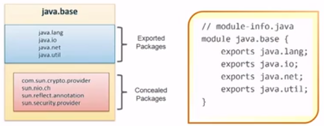

### Finding the right platform module

You can get a list of the packages a platform module contains with the `--describe-module` switch:

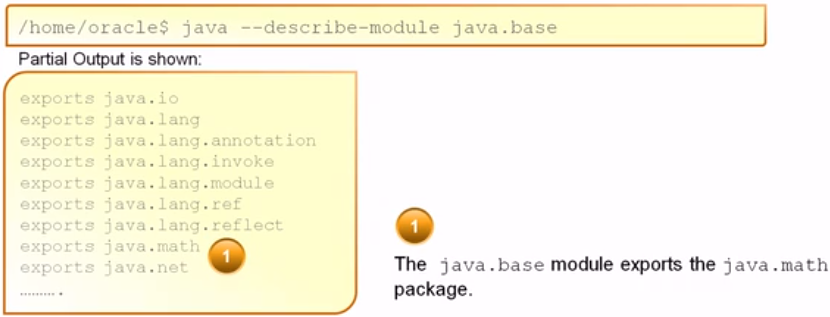

### Location of some tools in JDK 9

| Tool | Module |
| --- | --- |
| `javac` | `jdk.compiler` |
| `java` | `jdk.base` |
| `jshell` | `jdk.shell` |
| `jdeps` | `jdk.jdeps` |
| `jlink` | `jdk.jlink` | 

## Java EE Modules

There are various technologies of Java EE that are shipped with JDK. The list of Java EE modules present in JDK 9:

1. `java.corba`
1. `java.activation`
1. `java.annotations.common`
1. `java.transaction`
1. `java.xml.bind`
1. `java.xml.ws`

These modules are deprecated for removal in JDK 9 release. Because of this, they are disabled by default.

### Resolving Java EE modules in JDK 9

Java EE modules are not resolved by default when you compile or run code on the class path. Code on the class path with references to classes APIs will fail with `NoDefClassFoundError` or `ClassNotFoundException`. The policy of not resolving these modules is the first step towards removing these APIs from Java SE and the JDK in the future.

Use the `--add-modules` command line option to ensure the module with the API is resolved at startup.

For example, if you run an application that uses the JAXB API, it fails with the following error:

````
java com.examle.JAXBCustomer
Exception in thread "main" java.lang.NoClassDefFoundError:
javax/xml/bind/JAXBException
        at java.base/java.lang.Class.getDeclaredMethods...
        at java.base...
````
 
To resolve the `java.xml.bind` module at run time and ensure the module is available at run time, specify the following command line option:

`java --add-modules java.xml.bind com.example.JAXBCustomer`

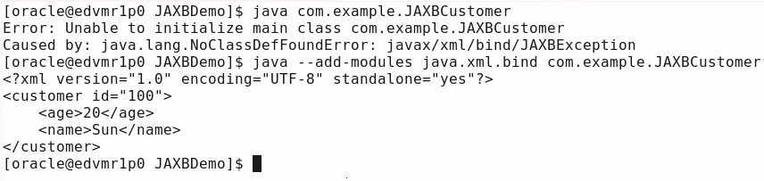

## Using JDK Internal APIs

The JDK consists of public APIs and internal APIs.

The public APIs:
- Used to develop portable Java applications
- Are in `java.*`, `javax.*`, and `org.*` packages
- If it works in JDK version `n`, it will continue to work in JDK version `n`+ 1

Internal APIs:
- Used to implement the JDK itself
- Are in `com.sun.*`, `sun.*`, and `jdk.*` packages
- Not meant to be used by developers

Before modularization in JDK 9, it was possible to use any public API, even if those classes made up 
the JDK internal APIs. JDK internal APIs, such as the following classes for example, have been used 
by developers and in a few widely used libraries:

- `sun.misc.BASE64Encoder`
- `sun.misc.BASE64Dencoder`
- `sun.misc.Unsafe`

JDK 9 encapsulatin policy for JDK internals no longer permits access to `sun.misc.BASE64Encoder` and `sun.misc.BASE64Dencoder`, instead allowing access to `java.util.Base64`.

### Illegal access to JDK internals in JDK 9

Some tools and libraries use reflection to access parts of JDK internal APIs. This illegal reflective access will be disabled in a future release of the JDK. In JDK 9, it is permitted by default and a warning is issued, e.g. a warning issued when starting Jython:

````
java -jar jython-standalone-2.7.0.jar
WARNING: An illegal reflective acccess operation has occurred
WARNING: Illegal reflective access by jnr.posix.JavaLibCHelper (:/jython-
standalone-2.7.0.jar) to method sun.nio.ch.SelChImpl.getFD()
WARNING: Please consider reporting this to the maintainers of
jnr.posix.JavaLibCHelper
WARNING: Use --illegal-access-warn to enable warning of further illegal
reflective access operations
WARNING: All illegal access operations will be denied in a future release
...
````

_Note: warnings can be disabled on a library-by-library basis with the `--add-opens` command line 
flag, e.g.:_

`java --add-opens java.base/sun.nio.ch=ALL-UNNAMED --add-opens java.base/java.io=ALL_UNNAMED -jar jython-standalone-2.7.0.jar`

## Changed JDK and JRE layout

The layout of files in the JDK and JRE has changed in JDK 9:

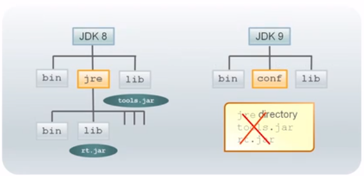

In JDK 9 and above, code that assumes the following abut the JDK layout will fail:

- `lib` directory contains `rt.jar`
- Presence of `rt.jar` and `tools.jar`

Class and resource files previously stored in `lib/rt.jar`, `lib/tools.jar`, `lib/dt.jar`, and various 
other internal JAR files are stored in more efficient format in implementation-specific files in the `lib` directory. The Java Platform Module System (JPMS) has divided the monolithic `rt.jar` and `tools.jar` files into more than 70 distinct modules.

Also eliminated is the distinction between the Java Development Kit (JDK) and the Java Runtime Environment (JRE). In the past, there was a sub-directory in the JDK called jre which only contained things that were required to run a Java application.

## JAR Files and Distribution Issues

Jar files are:
    
- Typically, used for packaging class files for:
    - The application
    - The libraries
- Composed of a set of packages with some additional metadata, e.g. main class to run, class path 
entries, multi-release flags
- Added to the class path in order that their contents (classes) to be made available to the JDK for 
compilation and running - some applications may have hundreds of JAR files in the class path

### Class Path Problems

- JARs in the class path can have duplicate classes and/or packages
- Java runtime tries to load each class as it finds it:
    - It uses the first class it finds in class path, even if another similarly named class exists
    - The first class could be the wrong class if several versions of the library exists in the class path
    - Problems may occur only under specific operational conditions that require a particular class
    
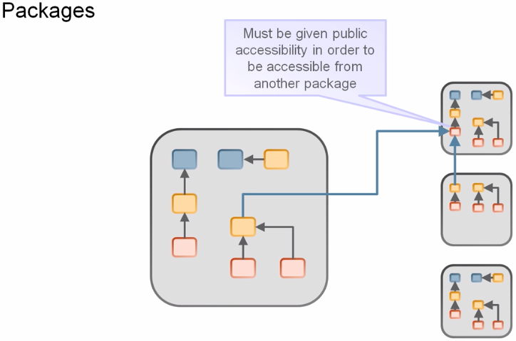

### JAR Dependency Problems

Class path permits many versions of a library, including duplicated files.
- There are no explicit dependencies
- There is no proscription on split packages
- There is no proscription on cyclic dependencies
- All public classes in the JAR file are accessible

## Accessibility

| JDK 1 - JDK 8 | JDK 9 and later |
| --- | --- |
| public<br />protected<br />< package ><br />private | public to everyone<br />public but only to specific modules<br />public only within a module<br />protected<br />< package ><br />private | 

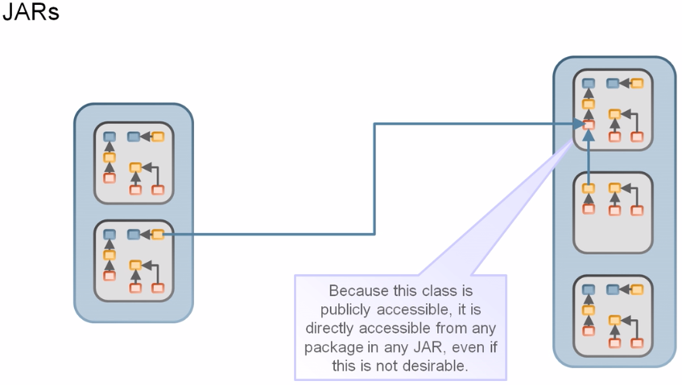

"public" no longer means accessible to everyone.

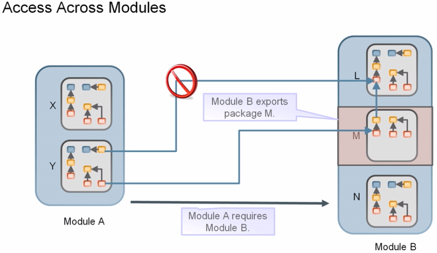

You must edit the `module-info` classes to specify how modules read from each other.

## Module System: Advantages

- Addresses the following issues at the unit of distribution/reuse level:
    - Dependencies
    - Encapsulation
    - Interfaces
- The unit of reuse is the module.
    - It is a fully-fledged Java component
    - It explicitly declares:
        - Dependencies on other modules
        - What packages it makes available to other modules
            - Only the public interfaces in those available packages are visible outside that module
           
Therefore, Java modular applications have the followings traits:
- No missing dependencies
- No cyclic dependencies
- No split packages

## Custom Runtime Images

You can create a special distribution of the java runtime containing only the runtime modules, application modules and only those platform modules required by your application. Rather than including all modules, you need only include the `java.base` module (which all runtimes must include by definition) as well as any other modules the application references. All transitive module dependencies must also be included. You can do this with custom runtime images. A custom runtime image is a self contained image that bundles the application modules with the JVM and everything else it needs to execute your application.

## Link Time

In Java SE 9, an optional link time is introduced between the compilation and runtime phase. A link time requries a linking tool that will assemble and optimize a set of modules and their transitive 
dependencies to create a runtime image.

## Using `jlink` to Create a Custom Runtime Image

`jlink` is a new tool in Java SE 9 that can be used to create a custom platform specific runtime image, assemble a set of modules from their dependencies (using a set of dependencies from `module-info.class`),
and performing optimization.

A basic invocation of `jlink`:

`jlink [options] --module-path modulepath --add-modules mods --output path`

You will have to specify the following three parameters:

1. `modulepath`: The module path where the platform and application modules to be added to the image 
are located. Modules can be modular jar files, jmods or exploded directories
1. `mods`: The list of the modules to be added and their transitive dependencies into your image
1. `path`: The output directory where the generated runtime image will be stored

### Example: Using `jlink` to Create a Runtime Image

We have a modular application:

````
C:\jlink-example
│   module-info.java
└───com
    └───greeting
            App.java
````

module-info.java:

````
module com.greeting {    
}
````

App.java:
````
package com.greeting;

public class App {
    public static void main(String[] args) {
        System.out.println("Hello jlink !");
    }
}
````

Let's compile the code:

`javac -p . module-info.java com/greeting/App.java`

_Note: `--module-path path` or `-p path` specifies where to find application modules. Above we have selected the current directory using `.`_

````
C:\...\jlink-example
│   module-info.class
│   module-info.java
│
└───com
    └───greeting
            App.class
            App.java
````

_Note: specify `-d` to place `.class` files into a separate directory._

Now, create the modular JAR:

`jar cf Hello.jar -C . .`

_Note: The basic format of the command for creating a JAR file is: `jar cf jar-file input-file(s)`. The `c` option indicates that you want to create a JAR file. The `f` option indicates that you want the output to go to a file rather than to stdout. `-C` is used to change directories during execution of the command, e.g. if we have static files to include which reside in a different folder structure. See [Oracle's documentation](https://docs.oracle.com/javase/tutorial/deployment/jar/build.html) for more._

To run this program, we only need `App`, `String`, `System`, and `Object` classes.

With help of `jlink` command line utility we can create our own small JRE that contains only the relevant classes and packages that application needs to use, without wasting memory and disk space.

In order to use `jlink`, we need to know the list of the Java SE modules that the application uses and that we should include in our custom JRE. Let's use the `jdeps` command to list the modules used in the application:

````
jdeps --list-deps Hello.jar
   java.base
````

The following command create a new runtime image:

````
jlink
    --module-path dist/Hello.jar:/usr/java/jdk-9/mods
    --add-modules com.greeting
    --output myimage
````
1. `--module-path`: This constructs a module path where the "Hello jlink" application is present and the `$JAVA_HOME/jmods` (`%JAVA_HOME%\jmods` in Windows) directory contains the platform modules
1. `--add-modules`: This comma separated list tells `jlink` which modules to include in the new JRE; e.g. `com.greeting` which is the module name (stated in `module-info.java`) that needs to be added in the runtime image. From our `jdeps` call we know we need `java.base`, so we can add this here too as an alternative to referring to the `jmods` folder in the module path (`--module-path`).
1. `--output`: This directory is where the runtime image will be generated

_Note: In Windows, the path separator is ; instead of :_

`jlink --module-path Hello.jar --add-modules com.greeting,java.base --output myimage`

The Figure below shows the "Hello jlink" example on Unix (Netbeans compiles jars into a `dist/` folder) with the `jmods` folder included in the module path.
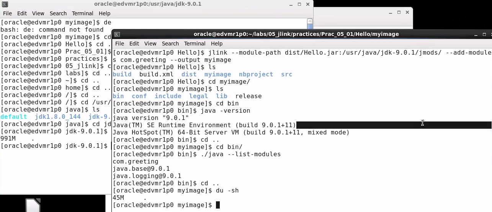

Note the sizes of the JDK 9 compared to the custom runtime image performed with `du -sh` command 
(979M in `jdk-9.0.1/` and 45M in `myimage/`). We can do this in Windows with `dir /s`.

The generated image, `myimage`, has the following directory layout:

````
myimage/
    conf
    include
    legal
    lib
    bin
        java
````

A custom runtime image is fully self contained. It bundles the application modules with the JVM and everything else it needs to execute your application.

You can check the runtime custom image with the `java -version` command.

You can also execute the `java --list-modules` command to list the modules that are in a custom runtime image.

You can use the `java` command, which is in `myimage`, to launch your application:

````
cd myimage/bin/
java --module com.greeting
````

or

`java -m com.greeting`

You do not need to set the module path. The custom runtime image is in its own module path.

The `jlink` command has a `--launcher` option that creates a platform specific executable in the `bin` directory.

````
jlink
    --module-path dist/Hello.jar:/usr/java/jdk-9/mods
    --add-modules com.greeting
    --launcher com.greeting=Hello
    --output myimage
````

You can use this executable to run your application.

### `jlink` resolves transitive dependencies

The `jlink` tool will resolve all dependencies transitively for the modules specified using the `--add-modules` option, and includes all the resolved dependent modules in the runtime image.

## Advantages of a Custom Runtime Image

- Ease of use - Can be shipped to your application users who don't have to download and install JRE separately to run the application
- Reduced footprint - Consists of only those modules that your application uses and is therefore much smaller than a full JDK. It can be used on resource constrained devices and applications on 
the cloud
- Performance - Runs faster because of link time optimization

### JIMAGE format

The runtime image is stored in a special format called JIMAGE, which is optimized for space and speed. It is a much faster way to search and load classes from JAR and JMOD files. JDK 9 ships with 
the `jimage` tool to let you explore the contents of a JIMAGE file.

## Optimizing a custom runtime image

### Using plug-ins with the `jlink` tool

To use a plug-in, you need to use the command line option for it. Run the `jlink` tool with the `--list-plugins` options to print the list of all available plug-ins with their descriptions and 
command line options.

`jlink --list-plugins`

The `compress` plug-in optimizes the custom runtime image by reducing the Java SE 9 runtime image (level 1 is constant string sharing and level 2 is ZIP).

The `strip-debug` plug-in removes all the debugging information from the Java code further reducing the size of the image.

````
jlink
    --module-path dist/Hello.jar:/usr/java/jdk-9/mods
    --add-modules com.greeting
    --output myimage
    -strip-debug --compress=2
````

# 1.2 - Declare modules and enable access between modules

## What is a Module

A Java platform module consists of:

- A collection of packages
- Optionally, resource files and other files such as native libraries
- A list of the accessible packages in the module
- A list of all modules on which this module depends

There are **four** types of modules in the Java Platform Module System (JPMS):

1. System Modules

    These are the modules listed when we run the java --list-modules command. They include the Java SE (`java.`) and JDK (`jdk.`) modules.

1. Application Modules

    These modules are what we usually want to build. They are named and defined in the `module-info.java` file, which compiled into `module-info.class` file and included in JAR file. See [Creating an application module](#creating-an-application-module)

1. Automatic Modules

    The module system automatically creates an automatic module for plain JARs (with no module descriptor).

    If the JAR defines the `Automatic-Module-Name` header in its manifest (`META-INF/MANIFEST.MF`), it defines the module's name, otherwise the JAR file name is used to determine the name.

    Since the JAR contains no information which packages are considered public APIs and which are not, the module system `exports` all packages and also `opens` them for deep reflection.

    Since a plain JAR expresses no `requires` clauses, the module system lets automatic modules read all other modules.

2. Unnamed Module

    When a class or JAR is loaded onto the classpath, but not the module path, it is automatically added to the unnamed module. It is a catch-all module to maintain backward compatibility with previously-written Java code.

    All classes within the unnamed module can read all other module (named or unnamed) without any explicit declaration of any kind.

    The packages exported by unnamed module can only be read by another unnamed module. It is not possible that a named module can read (`requires`) the unnamed module. Because to explicitly use `requires` clause in a `module-info.java` or use a command line option to add the module, we need a module name.

## Creating an application module

A module contains one or more packages and other resources such as images or xml files. It is defined in its module descriptor (`module-info.class`), which is stored in the module's root folder.

The module descriptor must contain the module name (it is expected that module names will follow the "reverse domain name" convention to ensure uniqueness). A module name can be the same as package name, however it can be different too, for example `java.sql` module contains `java.sql` and `javax.sql` packages.

Additionally, the module descriptor can contain details of:
- Required module dependencies (other modules this module depends on)
- Packages that this module exports, making them available to other modules (otherwise all packages 
in the module are implicitly unavailable to other modules)
- Permissions to open content of this module to other modules via the use of reflection
- Services this module offers to other modules
- Services this module consumes

To declare an application module, a module declaration needs to be specified. This is done in a special file called `module-info.java`. As you can see from the file extension, this is a `.java` file that gets compiled into a `.class` file by the Java compiler.

````
module org.ryan.logger {
}
````

There could be additional directives between curly braces, but all of them are optional.

_Note: A module may not have classes from within the unnamed package (i.e. those which belong to "default" package)_

The `module-info.java` file must be at the root of the Java class packages. e.g.:

````
C:\...\create-module
└───mod1
    │   module-info.java
    └───org
        └───ryan
               └───logger
                        MyLogger.java
````

MyLogger.java:
````
package by.boot.java.pkg.logger;

public class MyLogger {
    public static void main(String[] args) {
        System.out.println("MyLogger - main() method called");
    }
}
````

## Module Dependencies with `requires`

A module defines that it needs another module using the `requires` directive. `requires` specifies a normal module dependency (this module needs access to some content provided by another module). 

All standard Java SE modules have implicit and mandatory dependency on `java.base`. You do not need to define dependency on `java.base` explicitly.

It is not allowed to have circular dependencies between modules. If module `A` requires module `B`, then module `B` cannot also require module `A`.

`requires transitive` specifies a module dependency and makes the module depended on available to other modules. The transitive modules that a module depends on are readable by any module that depends upon this module. This is called _implicit readability_.

`requires static` indicates module dependency at compile time, but not at the runtime.

Static dependencies are useful for frameworks and libraries. Suppose that you are building a library to work with different kinds of databases. The library module can use static dependencies to require different kinds of JDBC drivers. At compile time, the library’s code can access types defined in those drivers. At runtime, users of the library can add only the drivers they want to use. If the dependencies are not static, users of the library have to add all supported drivers to pass the module resolution checks.

## Module Package Availability with `exports`

A modules defines what content it makes available for other modules using the `exports` directive. Exporting a package makes all of its public types available to other modules. There are two directives to specify packages to export:

1. The `exports <package_name>` directive specifies a package whose public types are accessible to all other modules
1. The `exports <package_name> to` directive restricts the availability of an exported package to a list of specific modules. It accepts a comma separated list of module names after the `to` keyword

_Note: When you export a package, you only export types in this package but not types in its subpackages._

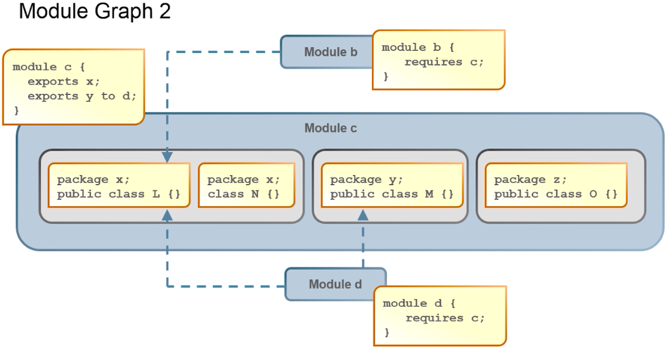

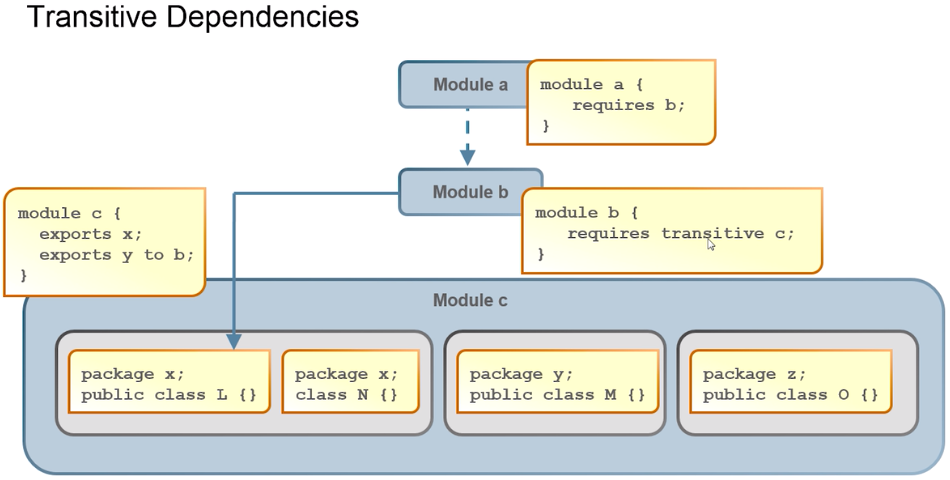

The same Java package can only be exported by a single Java module at runtime. You cannot have two (or more) modules that export the same package in use at the same time. The JVM will complain at startup if you do. A Java package may not split members (classes, interfaces, enums) between multiple modules.

## Access to Types via Reflection with `opens`

A module may set up to allow runtime-only access to a package by using the `opens` directive. The `opens` directive makes a package available to all other modules at run-time but not at compile time. 

The `opens ... to` directive makes a package available to a list of specific modules at run-time but not compile time. Using `opens` for a package is similar to using `exports`, but it also makes all of its non-public types available via reflection. Modules that contain injectable code should use the `opens` directive, because injections work via reflection. All packages in a module can be made available to access via reflection by using the `open` directive before the module directive.

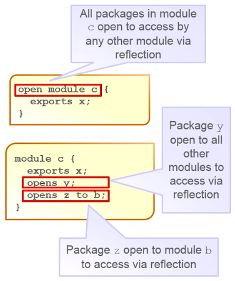

## Example Hello World Modular Application Code

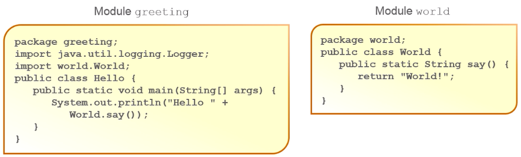

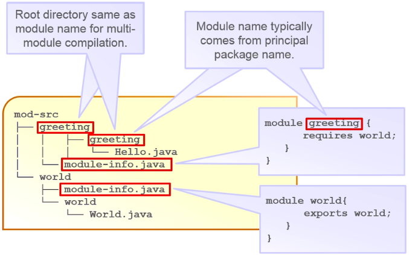

As stated previously, all standard Java SE modules have implicit and mandatory dependency on `java.base`. This does not include the `java.util.logging` package which resides in the `java.logging` module. It must be explicitly requested, or we'll receive `IllegalAccessError` when running. See this [example module](https://github.com/rysharprules/Java-SE11-Upgrade-Exam/blob/master/src/ocp/study/part01/mods/hello/src/module-info.java) which has both a runtime and a compile-time dependency on the `java.logging` module.

## Summary of Keywords

| Keywords and Syntax | Description |
| --- | --- |
| `export <package>` | Declares which package is eligible to be read |
| `export <package> to <module` | Declares which package is eligible to be read by a specific module |
| `requires <module>` | Specifies another module to read from |
| `requires transitive <module>` | Specifies another module to read from. The relationship is transitive in that indirect access is given to modules requiring the current module |

- These are restricted keywords
- Their creation won't break existing code
- They're only available in the context of the `module-info` class

# 1.3 - Describe how a modular project is compiled and run

Single module compilation:

`javac -d <output folder> <list of source code file paths including module-info>`

_Note: If you don't specify any `-d` options, the class files will be put into directories according to the package structure, relative to the current directory. If you give an `-d` option, the class 
files will be put relative to the directory given by the option. Non-existing directories will be created here._

_Note: `module-info.java` is specified first, so the compiler knows this is a modular application and will inform you accordingly if any problems exist with the code._

Multi-module compilation:

````
javac -d <output folder>
    --module-source-path <root directory of the module source> <list of source code file paths>
````

Get description of the compiled module:

````
java --module-path <path to the compiled module> --describe-module <module name>
````

### Creating a Modular JAR

Use the `jar` command to crete a modular JAR:

````
jar --create -f <path and name of JAR file> \
    --main-class <package name>.<main class name> \
    -C <path to compiled module code> .
````

Hello World application example:

````
jar --create -f jars/world.jar -C mods/world .
jar --create -f jars/hello.jar --main-class greeting.Hello -C mods/greeting/ .
````

## Running a Modular Application

To run an unpackaged module application, you specify the module path, which is similar to the class path, but contains modules. You also specify the main class in the format "modulename\mainclassname":

`java --module-path <path to compiled module or modules> --module <module name>\<package name>.<main class name>`

_Note: Use forward slash `/` between module and package name for `--module` on Windows_

Running an application packaged into modular JARs (assuming main class specified when creating JARs):

`java --module-path <path to JARs> --module <module name>`

Running the example:

`java -p ./log.jar -m org.ryan.logger`

_Note: `-p` is shortened term for `--module-path` and `-m` is shortened term for `-module`._

If the main class was not defined, you can provide it explicitly:

````
java -p ./log.jar -m org.ryan.logger/org.ryan.logger.MyLogger
MyLogger - main() method called
````

# Quiz

1. <a name="q1"></a>In Java SE 9, which phase provides an opportunity to perform optimization
    - A. Compile time
    - B. Link time
    - C. Run time
<br />[Jump to answer](#qa1)
2. <a name="q2"></a>Identify the set of tasks `jlink` can perform on a set of modules to create a custom runtime image
    - A. Assemble modules
    - B. Optimize modules
    - C. Both the above
<br />[Jump to answer](#qa2)
3. <a name="q3"></a>What are the advantages of a custom runtime image? (Choose two):
    - A. It consists of only those modules that your application uses
    - B. It runs faster because of link time optimization
    - C. It can be used to run an application in the cloud
    - D. It is heavier than the full JDK
<br />[Jump to answer](#qa3)
4. <a name="q4"></a>Which tool is used to create a runtime image?
    - A. jar
    - B. jshell
    - C. jlink
    - D. javap
<br />[Jump to answer](#qa4)
5. <a name="q5"></a>Which statement is true about custom runtime images?
    - A. Customized runtime images contain only the application's module
    - B. Customized runtime images can be created by using JDK 8
    - C. Customized runtime images are bundled with the application modules and platform modules of the 
    JVM, and everything else it needs to execute the application
    - D. Customized runtime images contain all the modules of JDK 9
<br />[Jump to answer](#qa5)
6. <a name="q6"></a>In what format are runtime images stored?
    - A. jimage
    - B. jlink
    - C. javaimage
    - D. jmod
<br />[Jump to answer](#qa6)
7. <a name="q7"></a>Which option in the `jlink` tool can be used to resolve all dependencies transitively for the 
modules specified, as well as to include all the resolved dependent modules into the runtime image?
    - A. module
    - B. add-modules
    - C. list-modules
    - D. module-path
<br />[Jump to answer](#qa7)
8. <a name="q8"></a>Which three directories are not present in JDK 9?
    - A. `jre`
    - B. `rt.jar`
    - C. `bin`
    - D. `tools.jar`
    - E. `conf`
<br />[Jump to answer](#qa8)
9. <a name="q9"></a>Which are part of the modular graph of `java.base` (Choose two):
    - A. `javax.swing`
    - B. `java.util`
    - C. `java.naming`
    - D. `java.lang`
    - E. `java.rmi`
<br />[Jump to answer](#qa9)
10. <a name="q10"></a>Which is true?
    - A. The installation directory JDK 9 contains the JRE folder
    - B. The installation directory JDK 9 contains the `conf` folder
    - C. Both are true
    - D. Both are false
<br />[Jump to answer](#qa10)
11. <a name="q11"></a>Which are part of the modular graph of the `java.se` module? (Choose three):
    - A. `java.net`
    - B. `java.io`
    - C. `java.naming`
    - D. `java.util`
    - E. `java.sql`
    - F. `java.rmi`
<br />[Jump to answer](#qa11)
12. <a name="q12"></a>Which statements are true about modular JDK? (Choose two):
    - A. It helps the application to be more scalable to small devices
    - B. It is integrated with all the APIs, including logging, swing and instrumentation
    - C. It is available from JDK 8
    - D. It is a well defined functional piece of the JDK
<br />[Jump to answer](#qa12)
13. <a name="q13"></a>Which are part of modular JDK's default modules? (Choose two):
    - A. Oracle-specific modules
    - B. JDK-specific modules
    - C. log4j
    - D. swing
<br />[Jump to answer](#qa13)
14. <a name="q14"></a>Which statement is true about JARs in the classpath?
    - A. All the classes in the JAR file are accessible
    - B. JRE continues to search for the last class within the JARs in the classpath if another 
    similarly named class exists
    - C. JARs in the classpath can have duplicate classes and/or packages
<br />[Jump to answer](#qa14)
15. <a name="q15"></a>A module can contain:
    - A. only resources and a module descriptor
    - B. packages, resources, and a module descriptor
    - C. only packages and resources
<br />[Jump to answer](#qa15)
16. <a name="q16"></a>Which statements are true about the module system (Choose two)
    - A. It supports only small computing devices
    - B. It addresses reliability, maintainability, and security requirements
    - C. It supports reusability
    - D. It addresses the need for enhanced networking support
<br />[Jump to answer](#qa16)
17. <a name="q17"></a>What two things would you change about this code to set up a `requires` 
relationship directly from `main` to `gameapi`?<br />
    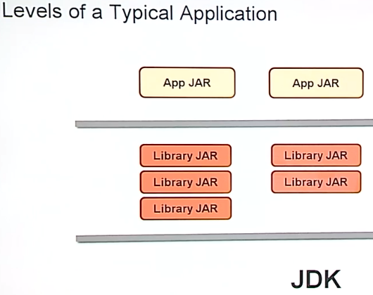
<br />[Jump to answer](#qa17)
1.  <a name="q18"></a>The `main` module contains a class, which instantiates an object defined in 
`competition` module. `competition` exports its packages. `main` requires `competition`. Will this 
code still compile if the `requires` statement is commented out?
    ````
    module main {
        //requires competion
    }
    ````
    - A. Yes
    - B. No
<br />[Jump to answer](#qa18)
19. <a name="q19"></a>You want the `gameapi` module to export the `game` package to both the 
`competition` and `basketball` modules. Which code example shows how this can be done? - 
[Jump to answer](#qa12)
    - A.
    ````
    module gameapi {
        exports game to competition;
        exports game to basketball;
    }
    ````
    - B.
    ````
    module gameapi {
        exports game to competition, basketball;
    }
    ````
    [Jump to answer](#qa19)
20.   <a name="q20"></a>Which statement is true about a module descriptor?
    - A. A module descriptor can contain details of required module dependencies
    - B. A module descriptor file must be named module-descriptor.java
    - C. A module descriptor must be stored in the classpath
    - D. A module descriptor does not contain details of services offered by the module owned by it
<br />[Jump to answer](#qa20)
21.  <a name="q21"></a>Given "order" module contains "Order.java" and "product" module contains 
"`Product.java`", which is valid module descriptor file content?
    <br />Order.java:
        ````
            package p1;
            import p2.Product;
            public class Order {
                Product product;
            }
        ````
        Product.java:
        ````
        package p2;
        public class Product {}
        ````
        - A.
        ````
        module order {
            exports Product;
        }
        module product {
            requires Order;
        }
        ````
        - B.
        ````
        module order {
            requires product;
        }
        module product {
            exports p2;
        }
        ````
        - C.
        ````
        module order {
            requires p2.Product;
        }
        module p2.Product{}
        ````
        [Jump to answer](#qa21)
22. <a name="q22"></a>Which directive makes a package available to all other modules at run time but 
not at compile time?
    - A. `requires`
    - B. `exports`
    - C. `opens ... to`
    - D. `opens`
<br />[Jump to answer](#qa22)

# Quiz Answers

1. <a name="qa1"></a>[Jump to question](#q1) - **B.** `jlink` is Java's new command line tool which 
allows you to link sets of modules (and their transitive dependencies) to create a run-time image. 
Java has always had dynamic linking, but with Java 9 there is now an optional static linking step. 
This is called link time, and it happens between compile time and run time
2. <a name="qa2"></a>[Jump to question](#q2) - **C.** `jlink` is a new tool in Java SE 9 that can be 
used to create a custom platform specific runtime image, **assemble** a set of modules from their 
dependencies (using a set of dependencies from `module-info.class`), and performing **optimization**.
3. <a name="qa3"></a>[Jump to question](#q3) - **A, B.** It is smaller in size due to only consisting
of the modules that your application uses which is beneficial particularly for smaller devices. It can
also run faster due to optimizations made available by `jlink`
4. <a name="qa4"></a>[Jump to question](#q4) - **C.** `jlink` is a tool that generates a custom Java 
runtime image that contains only the platform modules that are required for a given application.
5. <a name="qa5"></a>[Jump to question](#q5) - **C.** Customized runtime images are bundled with the 
application modules and platform modules of the JVM, and everything else it needs to execute the 
application. This became available in Java 9 so B is incorrect.
6. <a name="qa6"></a>[Jump to question](#q6) - **A.** The runtime image is stored in a special format 
called JIMAGE, which is optimized for space and speed.
7. <a name="qa7"></a>[Jump to question](#q7) - **B.** --add-modules: This indicates the modules that 
needs to be added in the runtime image. It can do this transitively.
8. <a name="qa8"></a>[Jump to question](#q8) - **A, B, D.** `rt.jar` and `tools.jar` are no longer 
present in the JRE. The "jre" folder has also been removed.
9. <a name="qa9"></a>[Jump to question](#q9) - **B, D.** `java.util` and `java.lang` are part of the
[java.base modular graph](https://docs.oracle.com/en/java/javase/11/docs/api/java.base/module-summary.html).
`javax.swing` is in the `java.desktop` module.`java.naming` is a module itself containing JNDI. Finally,
the `java.rmi` module sits outside of `java.base`. Note, `java.desktop`, `java.rmi`, and `java.naming`
reside in the `java.se` module.
10. <a name="qa10"></a>[Jump to question](#q10) - **B.** In JDK 9, the "jre" folder has been removed, whilst
the "conf" folder has been added.
11. <a name="qa11"></a>[Jump to question](#q11) - **C, E, F.** `java.naming`, `java.sql`, and `java.rmi`
are part of the [java.se modular graph](https://javadoc.scijava.org/Java9/java.se-summary.html).
`java.net`, `java.io`, and `java.util` packages are available in the `java.base` module. 
12. <a name="qa12"></a>[Jump to question](#q12) - **A, D.** In JDK 9, the monolithic JDK is broken into 
modules - therefore B is incorrect. Every module is a well defined piece of functionality of the JDK,
so D is correct. These modules are split into four major groups: java, javafx, jdk, and Oracle - so B
is incorrect. Finally, A is correct as the modularization of the JDK means smaller JARs which helps
small devices.
13. <a name="qa13"></a>[Jump to question](#q13) - **A, B.** java, javafx, jdk, and Oracle are the four major
parts of the modular JDK so the answer is A and B.
14. <a name="qa14"></a>[Jump to question](#q14) - **C.** JARs in the class path can have duplicate classes 
and/or packages so C is correct. A and B are incorrect as the JRE uses the first class it finds in class 
path, even if another similarly named class exists.
15. <a name="qa15"></a>[Jump to question](#q15) - **B.** A module contains one or more packages and other 
resources such as images or xml files. It is defined in its module descriptor (`module-info.class`), 
which is stored in the module's root folder.
16. <a name="qa16"></a>[Jump to question](#q16) - **B, C** The module system is available to all computing
devices, but has the added benefit of scalability for smaller devices so A is incorrect. B and C are
correct statements. D is incorrect as although `java.net` is part of `java.base`, enhanced networking 
support is not a feature of the module system.
17. <a name="qa17"></a>[Jump to question](#q17) - The solution is to remove the `transative` keyword 
from `requires transative` from `competition` module and add `requires gameapi` to the `main` module.
18. <a name="qa18"></a>[Jump to question](#q18) - **B.** Exporting (with `exports`) packages only 
specify what material could be read from a module. One more step is required to specify that one 
module requires another - `requires`.
19. <a name="qa19"></a>[Jump to question](#q19) - **B.** You can separate the modules you export to 
with comma so B is correct.
20. <a name="qa20"></a>[Jump to question](#q20) - **A.** The module descriptor must contain the module 
name. Additionally, the module descriptor can contain details of: Required module dependencies (other 
modules this module depends on); Packages that this module exports, making them available to other 
modules (otherwise all packages in the module are implicitly unavailable to other modules); Permissions
to open content of this module to other modules via the use of reflection; Services this module offers
to other modules; Services this module consumes. It is defined in `module-info.class`, which is stored
in the module's root folder.
21. <a name="qa21"></a>[Jump to question](#q21) - **B.** The `order` module `requires product` as it
uses the `Product` class from the `p2` package. The `product` module needs to export (via `exports`)
the `p2` package so that it is available to modules that require it.
22. <a name="qa22"></a>[Jump to question](#q22) - **D.** The opens directive makes a package available
to all other modules at run-time but not at compile time. Using `opens` for a package is similar to 
using `exports`, but it also makes all of its non-public types available via reflection. Modules that 
contain injectable code should use the `opens` directive, because injections work via reflection.