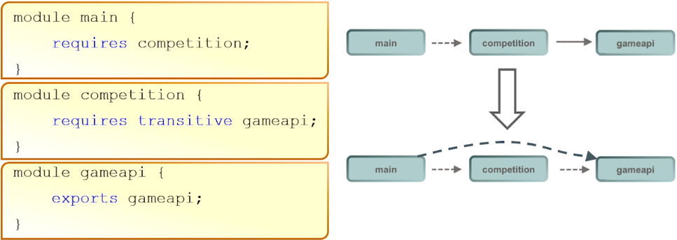

- [1.1 - Describe the Modular JDK](#1-1)
- [1.2 - Declare modules and enable access between modules](#1-2)
- [1.3 - Describe how a modular project is compiled and run](#1-3)
- [Quiz](#q)

## <a name="1-1"></a>1.1 - Describe the Modular JDK

In JDK 9, the monolithic JDK is broken into modules. Every module is a well defined piece of 
functionality of the JDK. All the various frameworks that were part of the prior release of the JDK 
are now broken down into a bunch of modules, e.g. Logging, Swing, Instrumentation.

The modular JDK makes it more scalable to small devices. It improves security and maintainability 
and improves application performance.

### Java SE Modules

The `java.se` module doesn't contain any code but has only dependencies declared in the module descriptor:

````
module java.se {
    requires transitive java.desktop;
    requires transitive java.sql;
    requires transitive java.xml;
    requires transitive java.prefs;
    // ... many more
}
````

In the module descriptor, a `requires transitive` clause is listed for every single module that is 
part of the Java SE specification. When you say requires `java.se` in a module, all these modules 
will be available to you.

These modules are classified into two categories:

1. Standard modules (`java.*` prefix for module names) that are part of the Java SE specification, 
e.g. `java.sql` for database connectivity, `java.xml` for XML processing and `java.logging` for logging.
1. Modules not defined in the Java SE 9 platform (`jdk.*` prefix) are specific to the JDK, e.g. 
`jdk.jshell`, `jdk.policytool`, `jdk.httpserver`

### The Base Module

The base module is `java.base`. Every module depends on `java.base`, but this module doesn't depend 
on any other modules.

The base module exports all the platform's core packages.


#### Finding the right platform module

You can get a list of the packages a platform module contains with the `--describe-module` switch:


#### Location of some tools in JDK 9

| Tool | Module |
| --- | --- |
| `javac` | `jdk.compiler` |
| `java` | `jdk.base` |
| `jshell` | `jdk.shell` |
| `jdeps` | `jdk.jdeps` |
| `jlink` | `jdk.jlink` | 

### Java EE Modules

There are various technologies of Java EE that are shipped with JDK.
The list of Java EE modules present in JDK 9:

1. `java.corba`
1. `java.activation`
1. `java.annotations.common`
1. `java.transaction`
1. `java.xml.bind`
1. `java.xml.ws`

These modules are deprecated for removal in JDK 9 release. Because of this, they are disabled by default.

#### Resolving Java EE modules in JDK 9

Java EE modules are not resolved by default when you compile or run code on the class path.
Code on the class path with references to classes APIs will fail with `NoDefClassFoundError` or 
`ClassNotFoundException`. The policy of not resolving these modules is the first step towards removing 
these APIs from Java SE and the JDK in the future.

Use the `--add-modules` command line option to ensure the module with the API is resolved at startup.

For example, if you run an application that uses the JAXB API, it fails with the following error:

````
java com.examle.JAXBCustomer
Exception in thread "main" java.lang.NoClassDefFoundError:
javax/xml/bind/JAXBException
        at java.base/java.lang.Class.getDeclaredMethods...
        at java.base...
````
 
To resolve the `java.xml.bind` module at run time and ensure the module is available at run time, 
specify the following command line option:

`java --add-modules java.xml.bind com.example.JAXBCustomer`


### Using JDK Internal APIs

The JDK consists of public APIs and internal APIs.

The public APIs:
- Used to develop portable Java applications
- Are in `java.*`, `javax.*`, and `org.*` packages
- If it works in JDK version `n`, it will continue to work in JDK version `n`+ 1

Internal APIs:
- Used to implement the JDK itself
- Are in `com.sun.*`, `sun.*`, and `jdk.*` packages
- Not meant to be used by developers

Before modularization in JDK 9, it was possible to use any public API, even if those classes made up 
the JDK internal APIs. JDK internal APIs, such as the following classes for example, have been used 
by developers and in a few widely used libraries:

- `sun.misc.BASE64Encoder`
- `sun.misc.BASE64Dencoder`
- `sun.misc.Unsafe`

JDK 9 encapsulatin policy for JDK internals no longer permits access to `sun.misc.BASE64Encoder` 
and `sun.misc.BASE64Dencoder`, instead allowing access to `java.util.Base64`.

#### Illegal access to JDK internals in JDK 9

Some tools and libraries use reflection to access parts of JDK internal APIs. This illegal reflective 
access will be disabled in a future release of the JDK. In JDK 9, it is permitted by default and a 
warning is issued, e.g. a warning issued when starting Jython:

````
java -jar jython-standalone-2.7.0.jar
WARNING: An illegal reflective acccess operation has occurred
WARNING: Illegal reflective access by jnr.posix.JavaLibCHelper (:/jython-
standalone-2.7.0.jar) to method sun.nio.ch.SelChImpl.getFD()
WARNING: Please consider reporting this to the maintainers of
jnr.posix.JavaLibCHelper
WARNING: Use --illegal-access-warn to enable warning of further illegal
reflective access operations
WARNING: All illegal access operations will be denied in a future release
...
````

_Note: warnings can be disabled on a library-by-library basis with the `--add-opens` command line 
flag, e.g.:_

`java --add-opens java.base/sun.nio.ch=ALL-UNNAMED --add-opens java.base/java.io=ALL_UNNAMED -jar jython-standalone-2.7.0.jar`

### Changed JDK and JRE layout

The layout of files in the JDK and JRE has changed in JDK 9:


In JDK 9, code that assumes the following abut the JDK layout will fail:
- `lib` directory contains `rt.jar`
- Presence of `rt.jar` and `tools.jar`
Class and resource files previously stored in `lib/rt.jar`, `lib/tools.jar`, `lib/dt.jar`, and various 
other internal JAR files are stored in more efficient format in implementation-specific files in the `lib` directory

### Why Modules?

Modules are a fundamental new kind of Java programming component. The module system:

- Supports programming in the "large"
- Is built into the Java language
- Is usable at all levels:
    - Applications
    - Libraries
    - The JDK itself
- Addresses reliability, maintainability, and security
- Supports creation of applications that can be scaled for small computing devices

### JAR Files and Distribution Issues

Jar files are:
    
- Typically, used for packaging class files for:
    - The application
    - The libraries
- Composed of a set of packages with some additional metadata, e.g. main class to run, class path 
entries, multi-release flags
- Added to the class path in order that their contents (classes) to be made available to the JDK for 
compilation and running - some applications may have hundreds of JAR files in the class path


#### Class Path Problems

- JARs in the class path can have duplicate classes and/or packages
- Java runtime tries to load each class as it finds it:
    - It uses the first class it finds in class path, even if another similarly named class exists
    - The first class could be the wrong class if several versions of the library exists in the class path
    - Problems may occur only under specific operational conditions that require a particular class
    


#### JAR Dependency Problems

Class path permits many versions of a library, including duplicated files.
- There are no explicit dependencies
- There is no proscription on split packages
- There is no proscription on cyclic dependencies
- All public classes in the JAR file are accessible

### Accessibility

| JDK 1 - JDK 8 | JDK 9 and later |
| --- | --- |
| public<br />protected<br />< package ><br />private | public to everyone<br />public but only to specific modules<br />public only within a module<br />protected<br />< package ><br />private | 


"public" no longer means accessible to everyone.


You must edit the `module-info` classes to specify how modules read from each other.

### Module System: Advantages

- Addresses the following issues at the unit of distribution/reuse level:
    - Dependencies
    - Encapsulation
    - Interfaces
- The unit of reuse is the module.
    - It is a fully-fledged Java component
    - It explicitly declares:
        - Dependencies on other modules
        - What packages it makes available to other modules
            - Only the public interfaces in those available packages are visible outside that module
           
Therefore, Java modular applications have the followings traits:
- No missing dependencies
- No cyclic dependencies
- No split packages

## <a name="1-2"></a>1.2 - Declare modules and enable access between modules

### What is a Module

A module contains one or more packages and other resources such as images or xml files. It is 
defined in its module descriptor (`module-info.class`), which is stored in the module's root folder.

The module descriptor must contain the module name. Additionally, the module descriptor can contain details of:
- Required module dependencies (other modules this module depends on)
- Packages that this module exports, making them available to other modules (otherwise all packages 
in the module are implicitly unavailable to other modules)
- Permissions to open content of this module to other modules via the use of reflection
- Services this module offers to other modules
- Services this module consumes

### Module Dependencies with `requires`

A module defines that it needs another module using the `requires` directive. `requires` specifies a normal module dependency
(this module needs access to some content provided by another module). `requires transitive` specifies a module dependency
and makes the module depended on available to other modules. `requires static` indicates module dependency at compile time,
but not at the runtime.

### Module Package Availability with `exports`

A modules defines what content it makes available for other modules using the `exports` directive. 
Exporting a package makes all of its public types available to other modules. There are two directives 
to specify packages to export:
1. The `exports <package_name>` directive specifies a package whose public types are accessible to all other modules
1. The `exports <package_name> to` directive restricts the availability of an exported package to a 
list of specific modules. It accepts a comma separated list of module names after the `to` keyword 


### Access to Types via Reflection

A module may set up to allow runtime-only access to a package by using the `opens` directive. The 
`opens` directive makes a package available to all other modules at run-time but not at compile time. 
The `opens ... to` directive makes a package available to a list of specific modules at run-time but 
not compile time. Using `opens` for a package is similar to using `exports`, but it also makes all of 
its non-public types available via reflection. Modules that contain injectable code should use the
`opens` directive, because injections work via reflection. All packages in a module can be made 
available to access via reflection by using the `open` directive before the module directive.


### Example Hello World Modular Application Code


### Summary of Keywords

| Keywords and Syntax | Description |
| --- | --- |
| `export <package>` | Declares which package is eligible to be read |
| `export <package> to <module` | Declares which package is eligible to be read by a specific module |
| `requires <module>` | Specifies another module to read from |
| `requires transitive <module>` | Specifies another module to read from. The relationship is transitive in that indirect access is given to modules requiring the current module |

- These are restricted keywords
- Their creation won't break existing code
- They're only available in the context of the `module-info` class

## <a name="1-3"></a>1.3 - Describe how a modular project is compiled and run

Single module compilation:

`javac -d <output folder> <list of source code file paths including module-info>`

_Note: If you don't specify any `-d` options, the class files will be put into directories according 
to the package structure, relative to the current directory. If you give an `-d` option, the class 
files will be put relative to the directory given by the option. Non-existing directories will be 
created here._

_Note: `module-info.java` is specified first, so the compiler knows this is a modular application and
will inform you accordingly if any problems exist with the code._

Multi-module compilation:

````
javac -d <output folder>
    --module-source-path <root directory of the module source> \
    <list of source code file paths>
````

Get description of the compiled module:

````
java --module-path <path to the compiled module> \
    --describe-module <module name>
````

#### Creating a Modular JAR

Use the `jar` command to crete a modular JAR:

````
jar --create -f <path and name of JAR file> \
    --main-class <package name>.<main class name> \
    -C <path to compiled module code> .
````

Hello World application example:

````
jar --create -f jars/world.jar -C mods/world .
jar --create -f jars/hello.jar --main-class greeting.Hello -C mods/greeting/ .
````

### Run a Modular Application

Running an unpackaged module application:

````
java --module-path <path to compiled module or modules> \
    --module <module name>\<package name>.<main class name>
````

Running an application packaged into modular JARs (assuming main class specified when creating JARs):

`java --module-path <path to JARs> --module <module name>`

Running Hello World example

`java -p jars -m greeting`

_Note: `-p` is shortened term for `--module-path` and `-m` is shortened term for `-module`._

## <a name="q"></a>Quiz

1. Which three directories are not present in JDK 9?
    - `jre` (A)
    - `rt.jar` (A)
    - `bin`
    - `tools.jar` (A)
    - `conf`
1. Which are part of the modular graph of `java.base` (Choose two):
    - `javax.swing`
    - `java.util` (A)
    - `java.naming`
    - `java.lang` (A)
    - `java.rmi`
1. Which is true?
    - The installation directory JDK 9 contains the JRE folder
    - The installation directory JDK 9 contains the `conf` folder (A)
    - Both are true
    - Both are false
1. Which are part of the modular graph of the `java.se` module? (Choose three):
    - `java.net`
    - `java.io`
    - `java.naming` (A)
    - `java.util`
    - `java.sql` (A)
    - `java.rmi` (A) - See [java.se modular graph here](https://javadoc.scijava.org/Java9/java.se-summary.html).
1. Which statements are true about modular JDK? (Choose two):
    - It helps the application to be more scalable to small devices (A)
    - It is integrated with all the APIs, including logging, swing and instrumentation
    - It is available from JDK 8
    - It is a broken, well defined functional piece of the JDK (A)
1. Which are part of modular JDK's default modules? (Choose two):
    - Oracle-specific modules (A)
    - JDK-specific modules (A)
    - log4j
    - swing
1. Which statement is true about JARs in the classpath?
    - All the classes in the JAR file are accessible
    - JRE continues to search for the last class within the JARs in the classpath if another 
    similarly named class exists
    - JARs in the classpath can have duplicate classes and/or packages (A)
1. A module can contain:
    - only resources and a module descriptor
    - packages, resources, and a module descriptor (A)
    - only packages and resources
1. Which statements are true about the module system (Choose two)
    - It supports only small computing devices
    - It addresses reliability, maintainability, and security requirements (A)
    - It supports reusability (A)
    - It addresses the need for enhanced networking support
1. What two things would you change about this code to set up a `requires` relationship directly 
from `main` to `gameapi`?
    
    (A): Remove transative keyword from `requires transative` from `competition` module and add 
    `requires gameapi` to `main` module.
1. The `main` module contains a class, which instantiates an object defined in `competition` module. 
`competition` exports its packages. `main` requires `competition`. Will this code still compile if the 
`requires` statement is commented out?
    ````
    module main {
        //requires competion
    }
    ````
    - Yes
    - No (A) - exporting (with `exports`) packages only specify what material could be read from a 
    module. One more step is required to specify that one module requires another - `requires`
1. You want the `gameapi` module to export the `game` package to both the `competition` and `basketball` 
modules. Which code example shows how this can be done?
    - A)
        ````
      module gameapi {
            exports game to competition;
            exports game to basketball;
      }
      ````
    - B) (A) - You can separate the modules you export to with comma
        ````
      module gameapi {
            exports game to competition, basketball;
      }
      ````
1. Which statement is true about a module descriptor?
    - A module descriptor can contain details of required module dependencies (A)
    - A module descriptor file must be named module-descriptor.java
    - A module descriptor must be stored in the classpath
    - A module descriptor does not contain details of services offered by the module owned by it
1. Given "order" module contains "Order.java" and "product" module contains "Product.java", which 
is valid module descriptor file content?
    <br />Order.java
    ````
    package p1;
    import p2.Product;
    public class Order {
        Product product;
    }
    ````
    Product.java
    ````
    package p2;
    public class Product {}
    ````
    - A)
        ````
        module order {
            exports Product;
        }
        module product {
            requires Order;
        }
        ````
    - B) (A)
        ````
        module order {
            requires product;
        }
        module product {
            exports p2;
        }
        ````
    - C)
        ````
        module order {
            requires p2.Product;
        }
        module p2.Product{}
        ````
1. Which directive makes a package available to all other modules at run time but not at compile time?
    - requires
    - exports
    - opens ... to
    - opens (A) 

