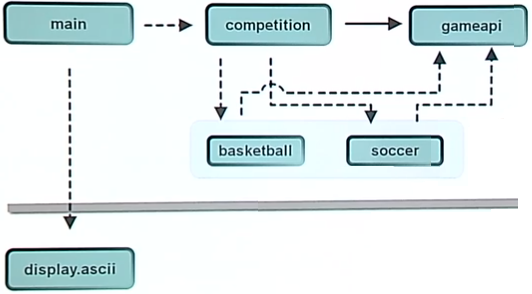
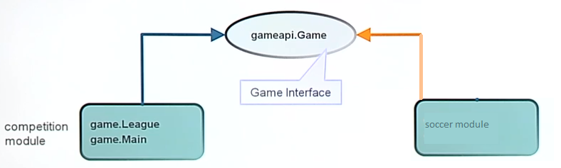
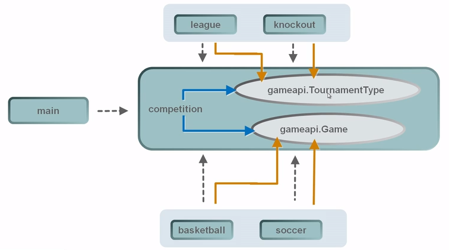

- [2.1 - Describe the components of Services including directives](#21---describe-the-components-of-services-including-directives)
  - [Summary of Terms](#summary-of-terms)
  - [Service Module](#service-module)
  - [Service Provider Module](#service-provider-module)
  - [Service Client Application](#service-client-application)
  - [Greeting_1 UML Model](#greeting_1-uml-model)
- [2.2 - Design a service type, load the services using ServiceLoader, check for dependencies of the services including consumer module and provider module](#22---design-a-service-type-load-the-services-using-serviceloader-check-for-dependencies-of-the-services-including-consumer-module-and-provider-module)
  - [Designing services](#designing-services)
  - [Developing service providers](#developing-service-providers)
  - [Deploying service providers as modules](#deploying-service-providers-as-modules)
    - [The `provider()` method](#the-provider-method)
  - [Greeting_2 UML Model](#greeting_2-uml-model)
  - [Service module dependency](#service-module-dependency)
  - [Provider module dependency](#provider-module-dependency)
  - [Client module dependency](#client-module-dependency)
- [Service Based Design - Game Simulator Example](#service-based-design---game-simulator-example)
  - [Running the game simulator with the `main` module](#running-the-game-simulator-with-the-main-module)
  - [The service API via the `gameapi` module](#the-service-api-via-the-gameapi-module)
  - [Service provider interface and service loading with the `competition` module](#service-provider-interface-and-service-loading-with-the-competition-module)
  - [Service providers](#service-providers)
    - [`soccer` and `basketball` modules](#soccer-and-basketball-modules)
    - [Service provider implementations within the `competition` module](#service-provider-implementations-within-the-competition-module)
  - [Game UML Model](#game-uml-model)
- [Quiz](#quiz)
- [Quiz answers](#quiz-answers)

# 2.1 - Describe the components of Services including directives

Since version 6 Java has supported service-provider loading via the `java.util.ServiceLoader` class facility. Using Service Loader you can have a service provider interface (SPI) - simply called Service, and multiple implementations of the SPI - simply called Service Providers. These Service Providers in Java 8 and earlier are located in the classpath and are loaded at run time.

Since Java 9 you can develop Services and Service Providers as modules. A service module declares one or more interfaces whose implementations will be provided at run time by some provider modules. A provider module declares what implementations of service interfaces it `provides`. The module that discovers and loads service providers must contain a `uses` directive in its declaration.

## Summary of Terms

- **Service**
   -  A well-known set of programming interfaces and classes that provide access to some specific application functionality or feature.

- **Service Provider Interface**

  - An interface or `abstract` class that acts as a proxy or an endpoint to the service.
  - If the service is one interface, then it is the same as a service provider interface.

- **Service Provider**

  - A specific implementation of the SPI. The Service Provider contains one or more concrete classes that implement or extends the service type.

- **ServiceLoader**

  - At the heart of the SPI is the `ServiceLoader` class. This has the role of discovering and loading implementations lazily. It uses the context classpath to locate providers implementations and put them in an internal cache.

## Service Module

We have a [GreeterIntf interface](https://github.com/rysharprules/Java-SE11-Upgrade-Exam/blob/master/src/ocp/study/part02/greeting_1/service/p1/GreeterIntf.java) with one method, `greet()`, which resides in package `p1`. This is exported by `modS` defined in the service [module-info.java](https://github.com/rysharprules/Java-SE11-Upgrade-Exam/blob/master/src/ocp/study/part02/greeting_1/service/module-info.java).

We can compile this with: 

`javac service/module-info.java service/p1/GreeterIntf.java` 

and package as a JAR with: 

`jar --create --file service.jar -C service .`

## Service Provider Module

We have a [GreeterImpl class](https://github.com/rysharprules/Java-SE11-Upgrade-Exam/blob/master/src/ocp/study/part02/greeting_1/provider/p2/GreeterImpl.java) which implements the `GreeterIntf` interface. 

The [module-info.java](https://github.com/rysharprules/Java-SE11-Upgrade-Exam/blob/master/src/ocp/study/part02/greeting_1/provider/module-info.java) class defines `modP` which `requires` `modS` (the service module) so it can use the `GreeterIntf` interface. 

A service provider will use `provides ... with ...` directive to declare what service interface it intends to use (by using `provides` keyword) and what implementation of the interface it wants to expose (by using `with` keyword):

`provides p1.GreeterIntf with p2.GreeterImpl`

 _Note: We don't have to specify the service implementation in a file under the resource directory `META-INF/services` as of Java 9._

We can compile this with: 

`javac -p service.jar provider/module-info.java provider/p2/GreeterImpl.java` 

and package as a provider JAR with: 

`jar --create --file provider.jar -C provider .`

## Service Client Application

In order for a service to be used, its providers need to be discovered and loaded. The `ServiceLoader` class does the work of discovering and loading the service providers. The module that discovers and loads service providers must contain a `uses <service interface name>` directive in its declaration. In our example, [module-info.java](https://github.com/rysharprules/Java-SE11-Upgrade-Exam/blob/master/src/ocp/study/part02/greeting_1/service-client/module-info.java), we see `modC` declares it `uses p1.GreeterIntf`. It also `requires modS` (the service module).

If a module uses the `ServiceLoader<GreeterIntf>` class to load the instances of service providers for a service interface named `p1.GreeterIntf`, the module declaration must contain the `uses p1.GreeterIntf` declaration.

[Client](https://github.com/rysharprules/Java-SE11-Upgrade-Exam/blob/master/src/ocp/study/part02/greeting_1/service-client/app/Client.java) class uses the `ServiceLoader<GreeterIntf>` class to load the instances of service providers for a service interface named `p1.GreeterIntf`, then calls the `greet()` method for the first it finds (we have only one here).

````
ServiceLoader<GreeterIntf> services = ServiceLoader.load(GreeterIntf.class);
services.findFirst().ifPresent(s -> s.greet());
````

We can compile this with: 

`javac -p service.jar service-client/module-info.java service-client/app/Client.java` 

and run the client code: 

````
java -p service.jar;provider.jar;service-client -m modC/app.Client
Greeting from GreeterImpl !
````

##  Greeting_1 UML Model

Figure 2.1 greeting_1:



# 2.2 - Design a service type, load the services using ServiceLoader, check for dependencies of the services including consumer module and provider module

## Designing services

A service is a single type, usually an interface or abstract class. A concrete class can be used, but this is not recommended. The type may have any accessibility. The methods of a service are highly domain-specific, so this API specification cannot give concrete advice about their form or function. However, there are two general guidelines:

1. A service should declare as many methods as needed to allow service providers to communicate their domain-specific properties and other quality-of-implementation factors. An application which obtains a service loader for the service may then invoke these methods on each instance of a service provider, in order to choose the best provider for the application.
1. A service should express whether its service providers are intended to be direct implementations of the service or to be an indirection mechanism such as a "proxy" or a "factory". Service providers tend to be indirection mechanisms when domain-specific objects are relatively expensive to instantiate; in this case, the service should be designed so that service providers are abstractions which create the "real" implementation on demand. For example, the `CodecFactory` service expresses through its name that its service providers are factories for codecs, rather than codecs themselves, because it may be expensive or complicated to produce certain codecs.

## Developing service providers

A service provider is a single type, usually a concrete class. An interface or abstract class is permitted because it may declare a `static` `provider()` method, discussed later. The type must be `public` and must not be an inner class.

A service provider and its supporting code may be developed in a module, which is then deployed on the application module path or in a modular image. Alternatively, a service provider and its supporting code may be packaged as a JAR file and deployed on the application class path. The advantage of developing a service provider in a module is that the provider can be fully encapsulated to hide all details of its implementation.

An application that obtains a service loader for a given service is indifferent to whether providers of the service are deployed in modules or packaged as JAR files. The application instantiates service providers via the service loader's iterator, or via `Provider` objects in the service loader's stream, without knowledge of the service providers' locations.

We can update the `app.Client` class (from previous section) as follows (see [greeting_2/service-client/app/Client.java](https://github.com/rysharprules/Java-SE11-Upgrade-Exam/blob/master/src/ocp/study/part02/greeting_2/service-client/app/Client.java) class for full implementation):

````
ServiceLoader.load(GreeterIntf.class)
        .stream()                
        .filter((Provider p) -> p.type().getSimpleName().startsWith("Greeter"))
        .map(Provider::get)
        .findFirst()
        .ifPresent(s -> s.greet());
````

An instance of the `ServiceLoader.Provider` interface represents a service provider. Its `type()` method returns the `Class` object of the service implementation. The `get()` method instantiates and returns the service provider. When you use the `stream()` method, each element in the stream is of the `ServiceLoader.Provider` type. You can filter the stream based on the class name or type of the provider, which will not instantiate the provider. You can use the `type()` method in your filters. When you find the desired provider, call the `get()` method to instantiate the provider. This way, you instantiate a provider when you know you need it, not when you are iterating through all providers.

## Deploying service providers as modules

A service provider that is developed in a module must be specified in a `provides` directive in the module declaration. The `provides` directive specifies both the service and the service provider; this helps to locate the provider when another module, with a `uses` directive for the service, obtains a service loader for the service. It is strongly recommended that the module does not export the package containing the service provider (see note below). There is no support for a module specifying, in a `provides` directive, a service provider in another module.

 _Note: This a bad example of module definition:_

````
module modP {
    requires modS;
    provides p1.GreeterIntf with p2.GreeterImpl;
    exports p2; // BAD !!! 
}
````

_We should not export implementation of the service._

A service provider that is developed in a module has no control over when it is instantiated, since that occurs at the behest of the application, but it does have control over how it is instantiated:

### The `provider()` method

- If the service provider declares a `provider()` method, then the service loader invokes that method to obtain an instance of the service provider. A provider method is a `public static` method named "provider" with no formal parameters and a return type that is assignable to the service's interface or class.

    In this case, the service provider itself NEED NOT be assignable to the service's interface or class.

- If the service provider does not declare a `provider()` method, then the service provider is instantiated directly, via its provider constructor. A provider constructor is a public constructor with no formal parameters.

    In this case, the service provider MUST be assignable to the service's interface or class.

A service provider that is deployed as an automatic module on the application module path must have a provider constructor. There is no support for a `provider()` method in this case.

Let's create new service provider ([MyProvider.java](https://github.com/rysharprules/Java-SE11-Upgrade-Exam/blob/master/src/ocp/study/part02/greeting_2/provider/p3/MyProvider.java)):

````
package p3;

import p1.GreeterIntf;

public class MyProvider {
    public static GreeterIntf provider() {
        return new GreeterIntf() {
            @Override
            public void greet() {
                System.out.println("Greeting from MyProvider !");
            }
        };
    }
}
````

[module-info.java](https://github.com/rysharprules/Java-SE11-Upgrade-Exam/blob/master/src/ocp/study/part02/greeting_2/provider/module-info.java):

````
module modPP {
    requires modS;
    provides p1.GreeterIntf with p3.MyProvider;
}
````

The output will be:

`Greeting from MyProvider !`

Two points here: 

1. The `provider()` method was used to instantiate service implementation
2. The service provider type (`MyProvider`) is not assignable to service interface (`GreeterIntf`).

##  Greeting_2 UML Model

Figure 2.2 greeting_2:



## Service module dependency

Run the command:

````
jar --describe-module --file=service.jar

modS jar:file:///C:.../service.jar/!module-info.class
exports p1
requires java.base mandated	
````

As you can see is depends on `java.base` module in our case (it is always implicitly added).

## Provider module dependency

Run the command:

````
jar --describe-module --file=provider.jar

modP jar:file:///C:.../provider.jar/!module-info.class
requires java.base mandated
requires modS
provides p1.GreeterIntf with p2.GreeterImpl
contains p2
````

As you can see this depends on the `java.base` and `modS` service module.

## Client module dependency

Run the command:

````
jar --create --file service-client.jar -C service-client .

jar --describe-module --file=service-client.jar

modC jar:file:///C:.../service-client.jar/!module-info.class
requires java.base mandated
requires modS
uses p1.GreeterIntf
contains app
````

As you can see this depends on the `java.base` and `modS` service module. The client module (`modC`) does not depend on provider module (`modP`) and is not aware of it at compile time.

# Service Based Design - Game Simulator Example

We have a modular [game](https://github.com/rysharprules/Java-SE11-Upgrade-Exam/blob/master/src/ocp/study/part02/game/) example application.

## Running the game simulator with the `main` module

The application can be started with the runnable client. The `main` module contains a [`Main`](https://github.com/rysharprules/Java-SE11-Upgrade-Exam/blob/master/src/ocp/study/part02/game/src/main/main/Main.java) class which can be run.

````
public static void main(String[] args) {
    
    String gameType = "soccer"; 
    String competitionType = "knockout";
    ...
```` 

Outputs:

````
--------------------                                                            
| Robins Pelicans  |                                                            
|                  |--------|                                                   
|    3 - 2         |        |                                                   
--------------------        |   ------------------                              
                            |   | Robins Magpies |                              
                            |---|                |--------|                     
                            |   |    3 - 1       |        |                     
--------------------        |   ------------------        |                     
| Sparrows Magpies |        |                             |                     
|                  |--------|                             |                     
|    2 - 3         |                                      |                     
--------------------                                      |   ------------------
                                                          |   | Robins Falcons |
                                                          |---|                |
                                                          |   |    0 - 3       |
--------------------                                      |   ------------------
| Crows Falcons    |                                      |                     
|                  |--------|                             |                     
|    2 - 4         |        |                             |                     
--------------------        |   ------------------        |                     
                            |   | Falcons Geese  |        |                     
                            |---|                |--------|                     
                            |   |    2 - 1       |                              
--------------------        |   ------------------                              
| Geese Terns      |        |                                                   
|                  |--------|                                                   
|    2 - 0         |                                                           
--------------------                                                            
BUILD SUCCESSFUL (total time: 2 seconds)
````

Variables `gameType` and `competitionType` can be changed to modify the output. If we change the `gameType` to "basketball" and the `competitionType` to "league", the output changes accordingly:

````
---------------------------------------------------------------------------------------------------------------------------------
|          | Terns    | Geese    | Magpies | Sparrows | Robins  | Falcons  | Pelicans | Crows   | League Pts | Total Pts Scored |
---------------------------------------------------------------------------------------------------------------------------------
| Terns    |  X       | 81 - 60  | 84 - 84 | 66 - 102 | 66 - 63 | 81 - 66  | 102 - 60 | 90 - 66 | 23         | 1155             |
---------------------------------------------------------------------------------------------------------------------------------
| Geese    | 72 - 66  |  X       | 96 - 84 | 81 - 78  | 63 - 87 | 78 - 63  | 63 - 66  | 69 - 51 | 20         | 1125             |
---------------------------------------------------------------------------------------------------------------------------------
| Magpies  | 63 - 78  | 66 - 93  |  X      | 69 - 69  | 96 - 63 | 69 - 90  | 78 - 66  | 90 - 72 | 16         | 1098             |
---------------------------------------------------------------------------------------------------------------------------------
| Sparrows | 81 - 87  | 75 - 84  | 60 - 69 |  X       | 60 - 78 | 72 - 54  | 78 - 72  | 93 - 60 | 13         | 1059             |
---------------------------------------------------------------------------------------------------------------------------------
| Robins   | 69 - 102 | 87 - 96  | 72 - 90 | 111 - 66 |  X      | 72 - 60  | 45 - 81  | 90 - 51 | 12         | 1056             |
---------------------------------------------------------------------------------------------------------------------------------
| Falcons  | 69 - 81  | 66 - 105 | 93 - 87 | 90 - 93  | 54 - 60 |  X       | 63 - 63  | 81 - 60 | 11         | 1026             |
---------------------------------------------------------------------------------------------------------------------------------
| Pelicans | 60 - 72  | 57 - 81  | 66 - 81 | 69 - 78  | 78 - 75 | 72 - 75  |  X       | 69 - 81 | 9          | 969              |
---------------------------------------------------------------------------------------------------------------------------------
| Crows    | 81 - 99  | 90 - 84  | 69 - 72 | 78 - 54  | 87 - 84 | 81 - 102 | 69 - 90  |  X      | 8          | 996              |
---------------------------------------------------------------------------------------------------------------------------------
BUILD SUCCESSFUL (total time: 5 seconds)
````

The `main` module has the following dependencies:

[`module-info.java`](https://github.com/rysharprules/Java-SE11-Upgrade-Exam/blob/master/src/ocp/study/part02/game/src/main/module-info.java)
````
module main {
    requires java.logging;
    requires competition;
    requires storage;
    requires display.ascii;
}
````

We won't describe how the application works here but we will point out important aspects to note regarding its modularization. 

The teams (`Team[] theTeams`) are populated with the `game.Factory.createTeam(...)` method from the `competition` module (indirectly calling `GameProvider` - more on that in the next section). 

The competition (`TournamentType theCompetition`) is populated with the `game.TournamentFactory.getTournament(...)` method, also from the `competition` module.

## The service API via the `gameapi` module

The `gameapi` module provides a set of interfaces which describe the API. This is the service. Examples we've mentioned already are [`Team`](https://github.com/rysharprules/Java-SE11-Upgrade-Exam/blob/master/src/ocp/study/part02/game/src/gameapi/gameapi/Team.java) and [`TournamentType`](https://github.com/rysharprules/Java-SE11-Upgrade-Exam/blob/master/src/ocp/study/part02/game/src/gameapi/gameapi/TournamentType.java). Another notable class is [`GameProvider`](https://github.com/rysharprules/Java-SE11-Upgrade-Exam/blob/master/src/ocp/study/part02/game/src/gameapi/gameapi/GameProvider.java).

This module does not require any other module. It only exports its own packages:

[`module-info.java`](https://github.com/rysharprules/Java-SE11-Upgrade-Exam/blob/master/src/ocp/study/part02/game/src/gameapi/module-info.java)
````
module gameapi {
    exports gameapi;
}
````

## Service provider interface and service loading with the `competition` module

As described in previous sections, the `competition` module is used by the `main` module to obtain the service objects from the `gameapi` module. 

`main` can access the `gameapi` through `competition` via the `requires transitive` declaration in `competition`'s module descriptor:

[`module-info.java`](https://github.com/rysharprules/Java-SE11-Upgrade-Exam/blob/master/src/ocp/study/part02/game/src/competition/module-info.java)
````
module competition {
    requires transitive gameapi;

    exports game;
    exports utils;
    
    uses gameapi.GameProvider;
    
    uses gameapi.TournamentType;
    provides gameapi.TournamentType with game.League, game.Knockout;
}
````

Note also that `competition` `uses gameapi.GameProvider` and `uses gameapi.TournamentType`. The module that discovers and loads service providers must contain this directive in its declaration. This helps to locate providers and ensure they will execute reliably during run time.

The `ServiceLoader` is invoked in both factories ([`Factory`](https://github.com/rysharprules/Java-SE11-Upgrade-Exam/blob/master/src/ocp/study/part02/game/src/competition/game/Factory.java) used to get the `GameProvider` and [`TournamentFactory`](https://github.com/rysharprules/Java-SE11-Upgrade-Exam/blob/master/src/ocp/study/part02/game/src/competition/game/TournamentFactory.java) used to get the `TournamentType`). 

Let's look at `Factory.getProvider(...)` first. This is called indirectly when `Main` calls `Factory.createTeam(...)`.

````
package game;

import gameapi.Team;
import gameapi.Player;
import gameapi.Game;
import gameapi.GameProvider;
import java.time.LocalDateTime;
import java.util.ServiceLoader;

public class Factory {

    static GameProvider theProvider = null;
    
    public static GameProvider getProvider(String gameType) {
    
        if ((theProvider != null)
                && theProvider.getType().equals(gameType)) {
            return theProvider;
        }
        
        ServiceLoader<GameProvider> loader = ServiceLoader.load(GameProvider.class);
        
        for (GameProvider currProvider: loader){
            if (currProvider.getType().equalsIgnoreCase(gameType)){
                theProvider = currProvider;
                break;
            }
        }
        if (theProvider == null) {
            throw new RuntimeException("No suitable service provider found !");
        }
        return theProvider;
    }
    
    public static Team createTeam(String gameType, String teamName, Player[] thePlayers) {
        theProvider = getProvider(gameType);
        return theProvider.getTeam(teamName.trim(), thePlayers);
    }

    //... more methods: createGame and createPlayer using same pattern as createTeam
````

We can see from the above snippet how the `ServiceLoader`s `load` method is used to create a new service loader for the given service type (`GameProvider`), using the current thread's context class loader. `ServiceLoader` implements `Iterable` so we can loop through each available `GameProvider` and call `getType` on each until we have a match with our `gameType` argument (either "soccer" or "basketball").

The `TournamentFactory` follows the same pattern, using the `getName` method to find a match. The `name` argument is the `competitionType` we passed from `Main`.

````    
public static TournamentType getTournament(String name) {
    TournamentType theTourney = null;
    ServiceLoader<TournamentType> sl = ServiceLoader.load(TournamentType.class);
    
    for ( TournamentType currTournament: sl) {
        if (currTournament.getName().equalsIgnoreCase(name)) {
                theTourney = currTournament;
                break;
        }

    }
    
    if (theTourney == null) {
        throw new RuntimeException("No suitable service provider found!");
    } 

    return theTourney;
}
````

## Service providers

### `soccer` and `basketball` modules

By implementing the `GameProvider` interface (with [`SoccerProvider`](https://github.com/rysharprules/Java-SE11-Upgrade-Exam/blob/master/src/ocp/study/part02/game/src/soccer/soccer/SoccerProvider.java) and [`BasketballProvider`](https://github.com/rysharprules/Java-SE11-Upgrade-Exam/blob/master/src/ocp/study/part02/game/src/basketball/basketball/BasketballProvider.java)), these modules can be used by the `ServiceLoader` as potential service providers.

Finally, the modules need to "provide" the service with the service providers:

[`module-info.java`](https://github.com/rysharprules/Java-SE11-Upgrade-Exam/blob/master/src/ocp/study/part02/game/src/basketball/module-info.java)
````
module basketball {
    requires gameapi;
    requires java.logging;
    exports basketball to competition, gameapi;
    opens basketball to jackson.databind;
    
    provides gameapi.GameProvider with basketball.BasketballProvider;
}
````

[`module-info.java`](https://github.com/rysharprules/Java-SE11-Upgrade-Exam/blob/master/src/ocp/study/part02/game/src/soccer/module-info.java)
````
module soccer {
    requires gameapi;
    requires java.logging;
    exports soccer;
    opens soccer to jackson.databind;
    
    provides gameapi.GameProvider with soccer.SoccerProvider;
}
````

This approach allows us to add further game types, e.g. rugby, hockey, baseball etc. by following the same pattern

### Service provider implementations within the `competition` module

Service providers need not be provided by another module. The implementing classes can be from within the same module as shown with the `TournamentType`. Concrete classes [`League`](https://github.com/rysharprules/Java-SE11-Upgrade-Exam/blob/master/src/ocp/study/part02/game/src/competition/game/League.java) and [`Knockout`](https://github.com/rysharprules/Java-SE11-Upgrade-Exam/blob/master/src/ocp/study/part02/game/src/competition/game/Knockout.java) implement `TournamentType`.

`competition`'s [`module-info.java`](https://github.com/rysharprules/Java-SE11-Upgrade-Exam/blob/master/src/ocp/study/part02/game/src/competition/module-info.java) which declares what implementations of service interfaces it provides - with `provides gameapi.TournamentType with game.League, game.Knockout`. 

Recall that as the service loader, `competition` is also required to state it `uses gameapi.TournamentType` to discover and load the service providers.

##  Game UML Model

Figure 2.3 game:



# Quiz

1. <a name="q1"></a>What needs to be implemented in a provider module?:
    - A. All interfaces in the consumer module
    - B. All interfaces declared with "provides ... with"
    - C. All interfaces declared with "uses" in the `module-info` file of the consumer module
<br />[Jump to answer](#qa1)
2. <a name="q2"></a>Which of the following are true? (Choose two):
    - A. The consumer module does not need to declare a dependency on the provider module(s)
    - B. The consumer module must declare a dependency on the provider module(s)
    - C. The provider module does not need to declare a dependency on the consumer module(s)
    - D. The provider module must declare a dependency on the consumer module(s)
<br />[Jump to answer](#qa2)
3. <a name="q3"></a>Which of the following is true?:
    - A. The consumer module must declare a dependency on the provider module
    - B. The provider module must declare a dependency on the consumer module
    - C. Neither consumer or provider modules need declare a dependency on each other
<br />[Jump to answer](#qa3)
4. <a name="q4"></a>How many service provider implementations can be made to a consumer?
    - A. Zero or any number in any module in the module path
    - B. Zero or one in the module path
    - C. One only in the module path
    - D. Zero or one in any module in the module path
<br />[Jump to answer](#qa4)

# Quiz answers

1. <a name="qa1"></a>[Jump to question](#q1) - **C.** A service provider must provide (via `provides`) an implementation for consumer modules to use. 
2. <a name="qa2"></a>[Jump to question](#q2) - **A, C.** The consumer module does not need to be aware of the provider(s). In the game simulator example, `competition` is unaware of `soccer` and `basketball` (or any other providers we may choose to add) so A is correct. C is also correct. The service providers (e.g. `soccer` and `basketball`) only need to define what service they "provide" via their implementation, e.g. `provides gameapi.GameProvider with soccer.SoccerProvider;`
3. <a name="qa3"></a>[Jump to question](#q3) - **C.** C is correct for the same reasons as described in the previous answer.
4. <a name="qa4"></a>[Jump to question](#q4) - **A.** There can be any number of service providers - from zero to n.