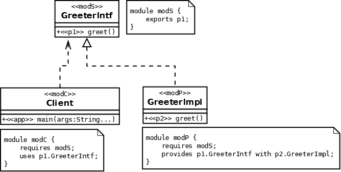
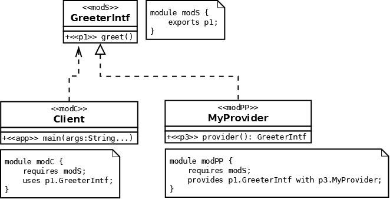

- [2.1 - Describe the components of Services including directives](#2-1)
- [2.2 - Design a service type, load the services using ServiceLoader, check for dependencies of the services including consumer module and provider module](#2-2)
- [Quiz](#q)

## <a name="2-1"></a>2.1 - Describe the components of Services including directives
## <a name="2-2"></a>2.2 - Design a service type, load the services using ServiceLoader, check for dependencies of the services including consumer module and provider module

## Service Based Design

### Module Dependencies



If we wanted to add another game on top of `basketball` and `soccer`, e.g. softball, baseball etc, 
that new module would depend on the `gameapi` and the `competition` module would depend on it.

### Service Relationships

Game can be an interface (e.g. basketball, soccer etc). The competition module then can use the game. 
Then the soccer class can implement the game interface.



### Expressing Service Relationships

Consumer module:
````
module competition {
    uses gameapi.Game
}
````

Provider module:
````
module soccer {
    provides gameapi.Game
}
````

### Service Loader

We can now make use of the [ServiceLoader](https://docs.oracle.com/javase/9/docs/api/java/util/ServiceLoader.html) 
class in the `competition` module.

````
ServiceLoader<Game> game = ServiceLoader.load(Game.class);
ArrayList<Game> providers = new ArrayList<>();
for (Game currGame : game) {
    providers.add(currGame);
}
return providers;
````

The `load` method above: Creates a new service loader for the given service type, using the current 
thread's context class loader.

### Choosing the provider class

We have multiple potential providers; soccer, basketball etc. We could add a type so that the consumer
gets the correct service:

````
ServiceLoader<Game> game = ServiceLoader.load(Game.class);
ArrayList<Game> providers = new ArrayList<>();
for (Game currGame : game) {
    if(currGame.getType().equals("soccer")) return currGame;
}
throw new RuntimeException("No suitable service provider");
````

We can move the Game interface into the competition module. This removes any chance of cyclic dependency.


### Designing a Service Type

gameapi module:
````
public interface Game {
    String getType();
    Team getHomeTeam();
    Team getAwayTeam();
    void playGame();
    ...
}
````
````
public interface GameProvider {
    Game getGame (Team homeTeam, Team awayTeam, LocalDateTime dateTime);
    Team getTeam (String teamName, Player[] players);
    Player getPlayer(String playerName);
    String getType();
}
````

We can now have a class `SoccerProvider` which implements `GameProvider` in the soccer module. We can then
do the same for other game types, e.g. `BasketBallProvider` which implements `GameProvider`.


## <a name="q"></a>Quiz

1. What needs to be implemented in a provider module?:
    - All interfaces in the consumer module
    - All interfaces declared with "provides ... with"
    - All interfaces declared with "uses" in the `module-info` file of the consumer module (A)
1. Which of the following are true? (Choose two):
    - The consumer module does not need to declare a dependency on the provider module(s) (A)
    - The consumer module must declare a dependency on the provider module(s)
    - The provider module does not need to declare a dependency on the consumer module(s) (A)
    - The provider module must declare a dependency on the consumer module(s)
1. Which of the following is true?:
    - The consumer module must declare a dependency on the provider module
    - The provider module must declare a dependency on the consumer module
    - Neither consumer or provider modules need declare a dependency on each other (A)
1. How many service provider implementations can be made to a consumer?
    - Zero or any number in any module in the module path (A)
    - Zero or one in the module path
    - One only in the module path
    - Zero or one in any module in the module path