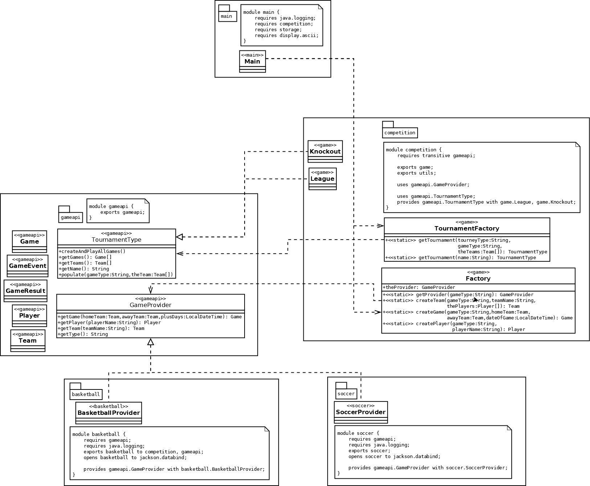

- [2.1 - Describe the components of Services including directives](#21---describe-the-components-of-services-including-directives)
  - [Service Module](#service-module)
  - [Service Provider Module](#service-provider-module)
  - [Service Client Application](#service-client-application)
- [2.2 - Design a service type, load the services using ServiceLoader, check for dependencies of the services including consumer module and provider module](#22---design-a-service-type-load-the-services-using-serviceloader-check-for-dependencies-of-the-services-including-consumer-module-and-provider-module)
  - [Service Based Design](#service-based-design)
    - [Module Dependencies](#module-dependencies)
    - [Service Relationships](#service-relationships)
    - [Expressing Service Relationships](#expressing-service-relationships)
    - [Service Loader](#service-loader)
    - [Choosing the provider class](#choosing-the-provider-class)
    - [Designing a Service Type](#designing-a-service-type)
  - [<a name="q"></a>Quiz](#quiz)
  - [<a name="qa"></a>Quiz Answers](#quiz-answers)

# 2.1 - Describe the components of Services including directives

Java since version 6 supported service-provider loading facility via the `java.util.ServiceLoader` class. Using Service Loader you can have a service provider interface (SPI) simply called Service, and multiple implementations of the SPI simply called Service Providers. These Service Providers in Java 8 and earlier are located in the classpath and loaded at run time.

Since Java 9 you can develop Services and Service Providers as modules. A service module declares one or more interfaces whose implementations will be provided at run time by some provider modules. A provider module declares what implementations of service interfaces it `provides`.The module that discovers and loads service providers must contain a `uses` directive in its declaration.

## Service Module

We have a [GreeterIntf interface](https://github.com/rysharprules/Java-SE11-Upgrade-Exam/blob/master/src/ocp/study/part02/greeting/service/p1/GreeterIntf.java) with one method, `greet()`, which resides in package `p1`. This is exported by `modS` defined in the service [module-info.java](https://github.com/rysharprules/Java-SE11-Upgrade-Exam/blob/master/src/ocp/study/part02/greeting/service/module-info.java).

We can compile this with: `javac service/module-info.java service/p1/GreeterIntf.java` and package as a JAR with: `jar --create --file service.jar -C service .`

## Service Provider Module

We have a [GreeterImpl class](https://github.com/rysharprules/Java-SE11-Upgrade-Exam/blob/master/src/ocp/study/part02/greeting/provider/p2/GreeterImpl.java) which implements the `GreeterIntf` interface. 

The [module-info.java](https://github.com/rysharprules/Java-SE11-Upgrade-Exam/blob/master/src/ocp/study/part02/greeting/provider/module-info.java) class defines `modP` which `requires` `modS` (the service module) so it can use the `GreeterIntf` interface. 

A service provider will use `provides ... with ...` directive to declare what service interface it intends to use (by using `provides` keyword) and what implementation of the interface it wants to expose (by using `with` keyword):

`provides p1.GreeterIntf with p2.GreeterImpl`

 _Note: We don't have to specify the service implementation in a file under the resource directory `META-INF/services` as of Java 9._

We can compile this with: `javac -p service.jar provider/module-info.java provider/p2/GreeterImpl.java` and package as a provider JAR with: `jar --create --file provider.jar -C provider .`

## Service Client Application

In order for a service to be used, its providers need to be discovered and loaded. The `ServiceLoader` class does the work of discovering and loading the service providers. The module that discovers and loads service providers must contain a `uses <service interface name>` directive in its declaration. In our example, [module-info.java](https://github.com/rysharprules/Java-SE11-Upgrade-Exam/blob/master/src/ocp/study/part02/greeting/service-client/module-info.java) we see `modC` declares it `uses p1.GreeterIntf`.

If a module uses the `ServiceLoader<GreeterIntf>` class to load the instances of service providers for a service interface named `p1.GreeterIntf`, the module declaration must contain the `uses p1.GreeterIntf` declaration.

[Client](https://github.com/rysharprules/Java-SE11-Upgrade-Exam/blob/master/src/ocp/study/part02/greeting/service-client/app/Client.java) class uses the `ServiceLoader<GreeterIntf>` class to load the instances of service providers for a service interface named `p1.GreeterIntf`, then calls the `greet()` method for the first it finds (we have only one here).

````
ServiceLoader<GreeterIntf> services = ServiceLoader.load(GreeterIntf.class);
services.findFirst().ifPresent(s -> s.greet());
````

We can compile this with: `javac -p service.jar service-client/module-info.java service-client/app/Client.java` and run the client code: 

````
java -p service.jar;provider.jar;service-client -m modC/app.Client
Greeting from GreeterImpl !
````

# 2.2 - Design a service type, load the services using ServiceLoader, check for dependencies of the services including consumer module and provider module

## Service Based Design

### Module Dependencies


If we wanted to add another game on top of `basketball` and `soccer`, e.g. softball, baseball etc, 
that new module would depend on the `gameapi` and the `competition` module would depend on it.

### Service Relationships

Game can be an interface (e.g. basketball, soccer etc). The competition module then can use the game. 
Then the soccer class can implement the game interface.


### Expressing Service Relationships

Consumer module:
````
module competition {
    uses gameapi.Game
}
````

Provider module:
````
module soccer {
    provides gameapi.Game
}
````

### Service Loader

We can now make use of the [ServiceLoader](https://docs.oracle.com/javase/9/docs/api/java/util/ServiceLoader.html) 
class in the `competition` module.

````
ServiceLoader<Game> game = ServiceLoader.load(Game.class);
ArrayList<Game> providers = new ArrayList<>();
for (Game currGame : game) {
    providers.add(currGame);
}
return providers;
````

The `load` method above: Creates a new service loader for the given service type, using the current 
thread's context class loader.

### Choosing the provider class

We have multiple potential providers; soccer, basketball etc. We could add a type so that the consumer
gets the correct service:

````
ServiceLoader<Game> game = ServiceLoader.load(Game.class);
ArrayList<Game> providers = new ArrayList<>();
for (Game currGame : game) {
    if(currGame.getType().equals("soccer")) return currGame;
}
throw new RuntimeException("No suitable service provider");
````

We can move the Game interface into the competition module. This removes any chance of cyclic dependency.



### Designing a Service Type

gameapi module:
````
public interface Game {
    String getType();
    Team getHomeTeam();
    Team getAwayTeam();
    void playGame();
    ...
}
````
````
public interface GameProvider {
    Game getGame (Team homeTeam, Team awayTeam, LocalDateTime dateTime);
    Team getTeam (String teamName, Player[] players);
    Player getPlayer(String playerName);
    String getType();
}
````

We can now have a class `SoccerProvider` which implements `GameProvider` in the soccer module. We can then
do the same for other game types, e.g. `BasketBallProvider` which implements `GameProvider`.


## <a name="q"></a>Quiz

1. <a name="q1"></a>What needs to be implemented in a provider module?:
    - A. All interfaces in the consumer module
    - B. All interfaces declared with "provides ... with"
    - C. All interfaces declared with "uses" in the `module-info` file of the consumer module
<br />[Jump to answer](#qa1)
2. <a name="q2"></a>Which of the following are true? (Choose two):
    - A. The consumer module does not need to declare a dependency on the provider module(s)
    - B. The consumer module must declare a dependency on the provider module(s)
    - C. The provider module does not need to declare a dependency on the consumer module(s)
    - D. The provider module must declare a dependency on the consumer module(s)
<br />[Jump to answer](#qa2)
3. <a name="q3"></a>Which of the following is true?:
    - A. The consumer module must declare a dependency on the provider module
    - B. The provider module must declare a dependency on the consumer module
    - C. Neither consumer or provider modules need declare a dependency on each other
<br />[Jump to answer](#qa3)
4. <a name="q4"></a>How many service provider implementations can be made to a consumer?
    - A. Zero or any number in any module in the module path
    - B. Zero or one in the module path
    - C. One only in the module path
    - D. Zero or one in any module in the module path
<br />[Jump to answer](#qa4)

## <a name="qa"></a>Quiz Answers

1. <a name="qa1"></a>[Jump to question](#q1) - **C.** A service provider must provide (via `provides`) 
an implementation for consumer modules to use (via `uses`). 
2. <a name="qa2"></a>[Jump to question](#q2) - **A, C.** 
3. <a name="qa3"></a>[Jump to question](#q3) - **C.**
4. <a name="qa4"></a>[Jump to question](#q4) - **A.**