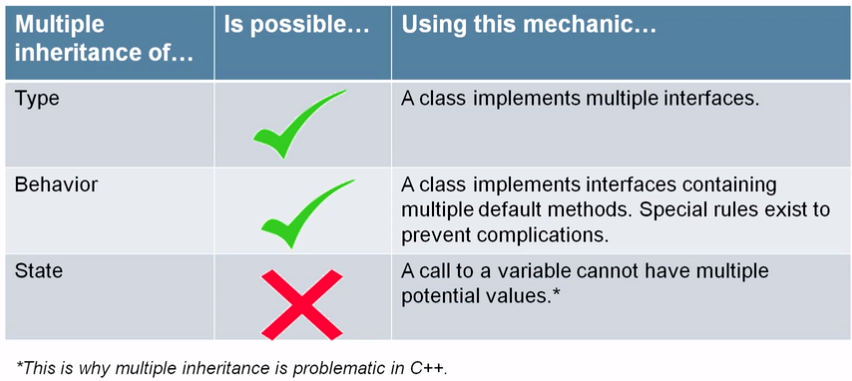
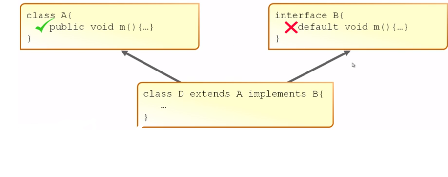
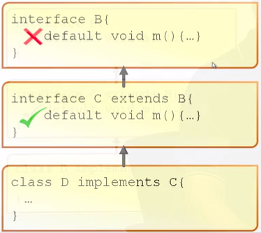

- [3.1 - Create and use methods in interfaces](#3-1)
- [3.2 - Define and write functional interfaces](#3-2)
- [Quiz](#q)
- [Quiz Answers](#qa)

## <a name="3-1"></a>3.1 Create and use methods in interfaces

An interface is an abstract data type, similar to a class that defines a
list of public abstract methods that any class implementing the interface must provide. An
interface may also include constant public static final variables, default methods, and
static methods. The following is an example of an interface and a class that implements it:

````
public interface Fly {
    public int getWingSpan() throws Exception;
    public static final int MAX_SPEED = 100;
    public default void land() {
        System.out.println("Animal is landing");
    }
}
public static double calculateSpeed(float distance, double time) {
    return distance/time;
}

public class Eagle implements Fly {
    public int getWingSpan() {
        return 15;
    }
    public void land() {
        System.out.println("Eagle is diving fast");
    }
}
````

In this example, the first method of the interface, `getWingSpan()`, declares an exception
in the interface. Due to the rules of method overriding, this does not require the exception
to be declared in the overridden method in the `Eagle` class. The second declaration,
`MAX_SPEED`, is a constant static variable available anywhere within our application.
The next method, `land()`, is a default method that has been optionally overridden in
the `Eagle` class. Finally, the method `calculateSpeed()` is a static member and, like
`MAX_SPEED`, it is available without an instance of the interface.

An interface may extend another interface, and in doing so it inherits all of the abstract
methods. The following is an example of an interface that extends another interface:

````
public interface Walk {
    boolean isQuadruped();
    abstract double getMaxSpeed();
}
public interface Run extends Walk {
    public abstract boolean canHuntWhileRunning();
    abstract double getMaxSpeed();
}
public class Lion implements Run {
    public boolean isQuadruped() {
        return true;
    }
    public boolean canHuntWhileRunning() {
        return true;
    }
    public double getMaxSpeed() {
        return 100;
    }
}
````

In this example, the interface `Run` extends `Walk` and inherits all of the abstract methods
of the parent interface. Notice that modifiers used in the methods `isQuadruped()`,
`getMaxSpeed()`, and `canHuntWhileRunning()` are different between the class and
interface definitions, such as public and abstract. The compiler automatically adds
public to all interface methods and abstract to all non‐static and non‐default
methods, if the developer does not provide them. By contrast, the class implementing the
interface must provide the proper modifiers. For example, the code would not compile if
`getMaxSpeed()` was not marked public in the `Lion` class.

Since the `Lion` class implements `Run`, and `Run` extends `Walk`, the `Lion` class must provide
concrete implementations of all inherited abstract methods. As shown in this example
with `getMaxSpeed()`, interface method definitions may be duplicated in a child interface
without issue.

Remember that an interface cannot extend a class, nor can a class extend an interface.
For these reasons, none of the following definitions using our previous Walk interface and
`Lion` class will compile:

````
public interface Sleep extends Lion {} // DOES NOT COMPILE
public class Tiger extends Walk {} // DOES NOT COMPILE
````

In the first definition, the interface `Sleep` cannot extend `Lion`, since `Lion` is a class.
Likewise, the class `Tiger` cannot extend the interface Walk.

Interfaces also serve to provide limited support for multiple inheritance within the
Java language, as a class may implement multiple interfaces, such as in the following
example:

````
public interface Swim {
}
public interface Hop {
}
public class Frog implements Swim, Hop {
}
````

In this example, the `Frog` class implements both the `Swim` and `Hop` interfaces.
An instance of `Frog` may be passed to any method that accepts `Swim`, `Hop`, `Frog`, or
`java.lang.Object` as an input parameter. As shown in this example, you can also
construct interfaces that have neither methods nor class members, traditionally referred
to as marker interfaces. The `java.io.Serializable`
interface, which contains no methods, is an example of a marker interface.

There are numerous rules associated with implementing interfaces that you should know
quite well at this point. For example, interfaces cannot extend classes, nor can classes
extend interfaces. Interfaces may also not be marked final or instantiated directly. There
are additional rules for default methods, such as Java failing to compile if a class or
interface inherits two default methods with the same signature and doesn’t provide its
own implementation.

### Private methods in interfaces

Java SE 9 introduces the ability to implement `private` methods in interfaces:

````
public interface ExampleInterface {
    private void exampleMethod(int x) {
        System.out.println(x);
    }
}
````

This is the latest step in the evolution of Java interfaces. To fully understand why this is beneficial,
we'll need to re-examine the original purpose of interfaces and how they were written in Java SE 7 and earlier.

#### Java SE 7 Interfaces

Interfaces are Java's solution to safely facilitate multiple inheritance. Interfaces originally only 
contained `static` variables and `abstract` methods. An example is the `Accessible` interface below. 
This interface is meant to be implemented in classes for financial products where people access money 
through deposits and withdrawls.

````
public interface Accessible {
    public static final double OVERDRAFT_FEE = 25;

    public abstract double verifyDeposit(double amount, int pin);
    public abstract double verifyWithdraw(double amount, int pin);
}
````

`abstract` methods must be implemented later. If one class implements an interface, you'll write your 
implementation logic inside that class. If many classes implement the same interface, you'll write 
your implementation logic many times.

What if most classes implement the exact same logic? Must you duplicate the same code in many places? 
Isn't code duplication bad?

#### Example: Implementing `abstract` methods

Notice the logic found in these methods:

````
public class BasicChecking implements Accessible {
    ...
    public double verifyDeposit(double amount, int pin) {
        // Verify the PIN
        // Verify amount is greater than 0
    }
    public double verifyWithdraw(double amount, int pin) {
        // Verify the PIN
        // Verify amount is greater than 0
        // Verify account balance won't go negative
    }
}
````

#### Example: Duplicated logic

The same logic is largely duplicated by other classes that implement `Accessible`.

````
public class RestrictedChecking implements Accessible {
    ...
    public double verifyDeposit(double amount, int pin) {
        // Verify the PIN
        // Verify amount is greater than 0
    }
    public double verifyWithdraw(double amount, int pin) {
        // Verify the PIN
        // Verify amount is greater than 0
        // Verify account balance won't go negative
        // Verify the withdrawl is under 20
    }
}
````

#### Java SE 8 Interfaces

In Java SE 8, you're allowed to implement special types of methods within interfaces: `static` 
methods and `default` methods.

`default` methods help minimize code duplication. They provide a single location to write and edit. 
They can be overridden later if necessary. They're overridden with per-class precision.

Previously duplicated logic can be written once in `Accessible`:

````
public interface Accessible {
    ...
    public default double verifyDeposit(double amount, int pin) {
        // Verify the PIN
        // Verify amount is greater than 0
    }
    public default double verifyWithdraw(double amount, int pin) {
        // Verify the PIN
        // Verify amount is greater than 0
        // Verify account balance won't go negative
    }
}
````

You can override a `default` method and call the interface's implementation with `super`:

````
public class RestrictedChecking implements Accessible {
    ...
    public double verifyWithdraw(double amount, int pin) {
        // Call the interface's implementation
        Accessible.super.verifyWithdraw(amount, pin);

        // Verify the withdrawl is under 20
    }
}
````

#### What about problems in multiple inheritance?



#### Inheritance rules of `default` methods

1. A superclass method takes priority over an interface `default` method<br />
<br />
    - The superclass method may be concrete or abstract
    - Only consider the interface `default` if no method exists from the superclass
1. A subtype interface's `default` method takes priority over a super-type interface `default` 
method<br />
<br />
1. If there is a conflict, treat the `default` method as abstract
    - The concrete class must provide its own implementation. This may include a call to a specific 
    interface's implementation

#### Interfaces don't replace abstract classes

- An interface doesn't let you store the state of an instance
- An `abstract` class may contain instance fields
- To avoid complications caused by multiple inheritance of state, a class cannot extend multiple 
`abstract` classes

#### What if `default` methods duplicate logic?

See `Verify the PIN` and `Verify amount is greater than 0` below.

````
public interface Accessible {
    ...
    public default double verifyDeposit(double amount, int pin) {
        // Verify the PIN
        // Verify amount is greater than 0
    }
    public default double verifyWithdraw(double amount, int pin) {
        // Verify the PIN
        // Verify amount is greater than 0
        // Verify account balance won't go negative
    }
}
````

One strategy is to put duplicated logic within its own default method:

````
public interface Accessible {
    ...
    public default double verifyDeposit(double amount, int pin) {
        verifyTransaction(amount, pin);
    }
    public default double verifyWithdraw(double amount, int pin) {
        verifyTransaction(amount, pin);
        // Verify account balance won't go negative
    }
    public default boolean verifyTransaction(double amount, int pin) {
        // Verify the PIN
        // Verify amount is greater than 0
    }
}
````

The problem with this approach is `default` methods must be `public`. They can be called from 
almost anywhere. The returned values may not mean anything outside the context of the methods. 
It's dangerous if the method returns information you don't want exposed. 

They can also be overridden at any time. The result of the calling method may not be predictable.

#### Introducing `private` methods in interface

- A better strategy is to make the method `private`
- `private` interface methods are more secure
    - They can't be called from elsewhere
    - They limit the risk of exposing sensitive information
- `private` interface methods lead to more predictable programs
    - They can't be overridden
    - They can't be called from a class which implements the interface
- `private` interface methods lead to more maintainable code
    - Common logic can be stored and edited in one place
- `private` interface methods don't lead to complications

````
public interface Accessible {
    ...
    public default double verifyDeposit(double amount, int pin) {
        verifyTransaction(amount, pin);
    }
    public default double verifyWithdraw(double amount, int pin) {
        verifyTransaction(amount, pin);
        // Verify account balance won't go negative
    }
    private boolean verifyTransaction(double amount, int pin) {
        // Verify the PIN
        // Verify amount is greater than 0
    }
}
````

#### Types of methods in interfaces

| Access modifier and method type | Supported? |
| --- | --- |
| `public abstract` | Yes |
| `private abstract` | Compiler error |
| `public default` | Yes |
| `private default` | Compiler error |
| `public static` | Yes |
| `private static` | Yes |
| `private` | Yes |

## <a name="3-2"></a>3.2 Define and write functional interfaces

Let’s take a look at an example of a functional interface and a class that implements it:

```
@FunctionalInterface
public interface Sprint {
    public void sprint(Animal animal);
}
public class Tiger implements Sprint {
    public void sprint(Animal animal) {
        System.out.println("Animal is sprinting fast! "+animal.toString());
    }
}
```

In this example, the Sprint class is a functional interface, because it contains exactly
one abstract method, and the Tiger class is a valid class that implements the interface.

Consider the following three interfaces. Assuming Sprint is our previously defined
functional interface, which ones would also be functional interfaces?

```
public interface Run extends Sprint {}
public interface SprintFaster extends Sprint {
    public void sprint(Animal animal);
}
public interface Skip extends Sprint {
    public default int getHopCount(Kangaroo kangaroo) {return 10;}
    public static void skip(int speed) {}
}
```

The answer? All three are valid functional interfaces! The first interface, `Run`, defines no
new methods, but since it extends `Sprint`, which defines a single abstract method, it is also
a functional interface. The second interface, `SprintFaster`, extends `Sprint` and defines
an abstract method, but this is an override of the parent `sprint()` method; therefore, the
resulting interface has only one abstract method, and it is considered a functional interface.
The third interface, `Skip`, extends `Sprint` and defines a static method and a default
method, each with an implementation. Since neither of these methods is abstract, the resulting
interface has only one abstract method and is a functional interface.

Now that you’ve seen some variations of valid functional interfaces, let’s look at some
invalid ones using our previous `Sprint` functional interface definition:

```
public interface Walk {}
public interface Dance extends Sprint {
    public void dance(Animal animal);
}
public interface Crawl {
    public void crawl();
    public int getCount();
}
```
           
Although all three of these interfaces will compile, none of them are considered functional interfaces. 
The Walk interface neither extends any functional interface classes nor defines any methods, so it 
is not a functional interface. The `dance` method extends `Sprint`, which already includes a single 
abstract method, bringing the total to two abstract methods; therefore, `dance` is not a functional 
interface. Finally, the `crawl` method defines two abstract methods; therefore it cannot be a 
functional interface.
 
In these examples, applying the `@FunctionalInterface` annotation to any of these interfaces would 
result in a compiler error, as would attempting to use them implicitly as functional interfaces in a lambda expression.

### Applying the `@FunctionalInterface` Annotation

While it is a good practice to mark a functional interface with the `@FunctionalInterface`
annotation for clarity, it is not required with functional programming. The Java compiler
implicitly assumes that any interface that contains exactly one abstract method is
a functional interface. Conversely, if a class marked with the `@FunctionalInterface`
annotation contains more than one abstract method, or no abstract methods at all, then
the compiler will detect this error and not compile.

One problem with not always marking your functional interfaces with this annotation is
that another developer may treat any interface you create that has only one method as
a functional interface. If you later modify the interface to have other abstract methods,
suddenly their code will break since it will no longer be a functional interface.

Therefore, it is recommend that you explicitly mark the interface with the
`@FunctionalInterface` annotation so that other developers know which interfaces they
can safely apply lambdas to without the possibility that they may stop being functional
interfaces down the road.

The exam writers aren’t likely to use this annotation, as they expect you to be able to
determine whether an interface is a functional interface on your own.

## <a name="q"></a>Quiz

1. <a name="q1"></a>What is true about code duplication?
    - A. Duplication makes your code longer. This is good because it makes colleagues believe you're 
    really smart and capable of handling complex code
    - B. Duplication is good because it builds redundancy into the system
    - C. If you need to make an edit, you''ll have to search for all the occasions where the code is 
    duplicated. This is tedious and inefficient
    - D. Duplication is an elegant substitute for version control
<br />[Jump to answer](#qa1)
2. <a name="q2"></a>If a `private` method is written in an interface, where can that method be called from?
    - A. From any other method within the interface
    - B. From any class which implements the interface
    - C. From any class which shares the same package
    - D. From the main method in a separate test class
<br />[Jump to answer](#qa2)
3. <a name="q3"></a>Given the code fragment:
    ````
    public interface i1 {
        private default void m1(){
            System.out.println("i");
        }
        abstract void m2();
        public default void m3(){}
        static default void m4(){}
        private static void m5(){}
    }
    ````
   What are the valid methods in the interface i1? (Choose three):
   - A. m3
   - B. m4
   - C. m1
   - D. m2
   - E. m5
<br />[Jump to answer](#qa3)
4. <a name="q4"></a>The private methods in interfaces feature helps you:
   A) Improve the readability of the code
   B) Improve the security of the business logic implemented
   C) Avoid inheritance complications
   Select the correct answer:
   - A. only option B
   - B. all the listed features
   - C. only options A and C
   - D. only option C
<br />[Jump to answer](#qa4)
5. <a name="q5"></a>Given the following, what is the result?
    ````
    class C1 {
        public void m() { System.out.println
    ("C"); }
   }
   interface I1 {
        default void m(){ System.out.println
   ("I");}
   }
   public class App extends C1
   implements I1{
        public static void main(String[] args){
            I1 obj = new App();
            obj.m();
        }
   }
   ````
   - A. `I`
   - B. an error at `I1.java`
   - C. an error at `App.java`
   - D. `C`
<br />[Jump to answer](#qa5)
6. <a name="q6"></a>What is the result of the following code?
   ````
   1: public interface CanClimb {
   2: public abstract void climb();
   3: }
   4: public interface CanClimbTrees extends CanClimb {}
   5: public abstract class Chipmunk implements CanClimbTrees {
   6: public abstract void chew();
   7: }
   8: public class EasternChipmunk extends Chipmunk {
   9: public void chew() { System.out.println("Eastern Chipmunk is Chewing"); }
   10: }
   ````
   - A. It compiles and runs without issue.
   - B. The code will not compile because of line 2.
   - C. The code will not compile because of line 4.
   - D. The code will not compile because of line 5.
   - E. The code will not compile because of line 8.
   - F. It compiles but throws an exception at runtime.
<br />[Jump to answer](#qa6)
7. <a name="q7"></a>Which of the following are valid functional interfaces? (Choose all that apply.)
    ````
   public interface Climb {
   public int climb();
   }
   public abstract class Swim {
   public abstract Object swim(double speed, int duration);
   }
   public interface ArcticMountainClimb extends MountainClimb {
   public default int getSpeed();
   }
   public interface MountainClimb extends Climb {}
   ````
   - A. Climb
   - B. Swim
   - C. ArcticMountainClimb
   - D. MountainClimb
   - E. None of these are valid functional interfaces.
<br />[Jump to answer](#qa7)
8. <a name="q8"></a>Which of the following are true of interfaces? (Choose all that apply.)
   - A. They can extend other classes.
   - B. They cannot be extended.
   - C. They enable classes to have multiple inheritance.
   - D. They can only contain `abstract` methods.
   - E. They can be declared `final`.
   - F. All members of an interface are public unless marked `private`.
<br />[Jump to answer](#qa8)
9. <a name="q9"></a>What is the result of the following code?
   ````
   1: public interface CanWalk {
   2: default void walk() { System.out.println("Walking"); }
   3: }
   4: public interface CanRun {
   5: public default void walk() { System.out.println("Walking"); }
   6: public abstract void run();
   7: }
   8: public interface CanSprint extends CanWalk, CanRun {
   9: void sprint();
   10: }
   ````
   - A. The code compiles without issue.
   - B. The code will not compile because of line 5.
   - C. The code will not compile because of line 6.
   - D. The code will not compile because of line 8.
   - E. The code will not compile because of line 9.
<br />[Jump to answer](#qa9)
10. <a name="q10"></a>What is the result of the following code?
       ````
       public interface Climb {
       boolean isTooHigh(int height, int limit);
       }
       public class Climber {
       public static void main(String[] args) {
            check((h, l) -> h.toString(), 5); // x1
       }
       private static void check(Climb climb, int height) {
            if (climb.isTooHigh(height, 10)) // x2
                System.out.println("too high");
            else System.out.println("ok");
       } }
       ````
    - A. `ok`
    - B. `too high`
    - C. Compiler error on line `x1`.
    - D. Compiler error on line `x2`.
    - E. Compiler error on a different line.
    - F. A runtime exception is thrown.
<br />[Jump to answer](#qa10)
11. <a name="q11"></a>Choose the correct statement about the following code:
       ````
       1: public interface Herbivore {
       2: int amount = 10;
       3: public static void eatGrass();
       4: public int chew() {
       5:   return 13;
       6: }
       7: }
       ````
       - A. It compiles and runs without issue.
       - B. The code will not compile because of line 2.
       - C. The code will not compile because of line 3.
       - D. The code will not compile because of line 4.
       - E. The code will not compile because of lines 2 and 3.
       - F. The code will not compile because of lines 3 and 4.
<br />[Jump to answer](#qa11)
12. <a name="q12"></a>Choose the correct statement about the following code:
       ````
       1: public interface CanFly {
       2: void fly();
       3: }
       4: interface HasWings {
       5: public abstract Object getWingSpan();
       6: }
       7: abstract class Falcon implements CanFly, HasWings {
       8: }
       ````
       - A. It compiles without issue.
       - B. The code will not compile because of line 2.
       - C. The code will not compile because of line 4.
       - D. The code will not compile because of line 5.
       - E. The code will not compile because of lines 2 and 5.
       - F. The code will not compile because the class `Falcon` doesn’t implement the interface
       methods.
<br />[Jump to answer](#qa12)  
    
## <a name="qa"></a>Quiz Answers

1. <a name="qa1"></a>[Jump to question](#q1) - **C.** Duplicate code makes your program lengthy and bulky, 
and decreases your code quality
2. <a name="qa2"></a>[Jump to question](#q2) - **A.** Using private methods in interfaces have four rules:
    1. Private interface methods cannot be abstract.
    1. Private methods can be used only inside the interface.
    1. Private `static` methods can be used inside other `static` and non-`static` interface methods.
    1. Private non-static methods cannot be used inside private `static` methods.
3. <a name="qa3"></a>[Jump to question](#q3) - **A, D, E.** A is correct as `default` methods have an 
implementation and are implicitly public. B is incorrect as `static` methods cannot be overridden. C is
incorrect as `default` methods cannot be private as they can be overridden. D & E are valid methods.
4. <a name="qa4"></a>[Jump to question](#q4) - **B** Private interface methods improve the readability 
of the code by providing a mechanism to place reused logic, improves the security of the business logic 
implemented and avoids inheritance complications with encapsulation
5. <a name="qa5"></a>[Jump to question](#q5) - **D.** A superclass method takes priority over an interface 
`default` method
6. <a name="qa6"></a>[Jump to question](#q6) - **E.** The code does not compile because `EasternChipmunk` 
inherits the abstract method `climb()` but does not implement it, therefore the correct answer is E. B, C, and D are
incorrect as they compile for various reasons. Line 2 compiles, as non-`static` and non-`default`
interface methods are assumed to have the abstract modifier. Line 4 compiles
without issue as an interface can extend another interface. Line 5 compiles without issue as
an abstract class can implement an interface without implementing any of the abstract
methods. F is incorrect, as Line 8 does not compile.
7. <a name="qa7"></a>[Jump to question](#q7) - **A, D.** A is correct as `Climb` defines an interface with 
exactly one abstract method. B is incorrect, as abstract classes are not functional interfaces despite 
having a single abstract method. While functional interfaces may have any number of default methods, 
`ArcticMountainClimb` will not compile due to the `default` method `getSpeed()` missing an
implementation body, so C is incorrect. D is correct, as the interface `MountainClimb` has
exactly one abstract method defined in `Climb`. Finally, E is incorrect because A and D are correct.
8. <a name="qa8"></a>[Jump to question](#q8) - **C, F.** A and B are both incorrect as interfaces can extend 
other interfaces, although not classes. C is correct since a class may implement multiple interfaces. 
D is incorrect as interfaces have `static` and default methods, as well as `static` `final` variables. E 
is incorrect as interfaces are assumed to be abstract, and abstract and final can never be used
together. F is correct as interface methods and variables are each assumed public unless explicitly set to
private.
9. <a name="qa9"></a>[Jump to question](#q9) - **D.** While Java supports multiple inheritance through 
interfaces, it does not support method overriding in interfaces, since it’s not clear which parent 
method should be used. In this example, `CanWalk` and `CanRun` both implement a default `walk()` 
method. The definition of `CanSprint` extends these two interfaces and therefore won’t compile as 
two `default` methods with the same signature from parent classes are detected, therefore the answer is D. 
None of the other lines of code cause problems, so the rest of the answers are not correct.
10. <a name="qa10"></a>[Jump to question](#q10) - **C.** The functional interface takes two `int` parameters. 
The code on line `x1` attempts to use them as if one is an `Object`, resulting in a compiler error making 
C the correct answer. It also tries to return `String` even though the data type for the functional 
interface method is `boolean`. It is tricky to use types in a lambda when they are implicitly specified. 
Remember to check the interface for the real type.
11. <a name="qa11"></a>[Jump to question](#q11) - **F.** The interface variable amount is correctly declared,
with `public`, `static`, and `final` being assumed and automatically inserted by the compiler, so B is 
incorrect. The method declaration for `eatGrass()` on line 3 is incorrect because the method has been 
marked as `static` but no method body has been provided. The method declaration for `chew()` on
line 4 is also incorrect, since an interface method that provides a body must be marked as
`default` or `static` explicitly. Therefore, F is the correct answer since this code contains
two compile-time errors.
12. <a name="qa12"></a>[Jump to question](#q12) - **A.** Although the definition of methods on lines 2 
and 5 vary, both will be converted to `public abstract` by the compiler. Line 4 is fine, because an 
interface can have `public` or default access. Finally, the class `Falcon` doesn’t need to implement the 
interface methods because it is marked as `abstract`. Therefore, the code will compile without issue.