- [4.1 - Extract stream data using map, peek and flatMap methods](#4-1)
- [4.2 - Search stream data using search findFirst, findAny, anyMatch, allMatch and noneMatch methods](#4-2)
- [4.3 - Use the Optional class](#4-3)
- [4.4 - Perform calculations using count, max, min, average and sum stream operations](#4-4)
- [4.5 - Sort a collection using lambda expressions](#4-5)
- [4.6 - Use Collectors with streams, including the groupingBy and partitioningBy operation](#4-6)

### Using Streams

A stream in Java is a sequence of data. A stream pipeline is the operations that run on a
stream to produce a result. Think of a stream pipeline as an assembly line in a factory.
Suppose that we were running an assembly line to make signs for the animal exhibits at
the zoo. We have a number of jobs. It is one person’s job to take signs out of a box. It is a
second person’s job to paint the sign. It is a third person’s job to stencil the name of the animal
on the sign. It is a fourth person’s job to put the completed sign in a box to be carried
to the proper exhibit.

Notice that the second person can’t do anything until one sign has been taken out of the
box by the first person. Similarly, the third person can’t do anything until one sign has been
painted, and the fourth person can’t do anything until it is stenciled.

The assembly line for making signs is finite. Once we process the contents of our box of
signs, we are finished. Finite streams have a limit. Other assembly lines essentially run forever,
like one for food production. Of course, they do stop at some point when the factory
closes down, but pretend that doesn’t happen. Or think of a sunrise/sunset cycle as infinite,
since it doesn’t end for an inordinately large period of time.

Another important feature of an assembly line is that each person touches each element
to do their operation and then that piece of data is gone. It doesn’t come back. The next
person deals with it at that point. This is different than the lists and queues that you saw in
the last chapter. With a list, you can access any element at any time. With a queue, you are
limited in which elements you can access, but all of the elements are there. With streams,
the data isn’t generated up front—it is created when needed.

Many things can happen in the assembly line stations along the way. In programming,
these are called stream operations. Just like with the assembly line, operations occur in a
pipeline. Someone has to start and end the work, and there can be any number of stations
in between. After all, a job with one person isn’t an assembly line! There are three parts to
a stream pipeline, as shown in Figure 4.2:

- Source: Where the stream comes from.
- Intermediate operations: Transforms the stream into another one. There can be as few
or as many intermediate operations as you’d like. Since streams use lazy evaluation, the
intermediate operations do not run until the terminal operation runs.
- Terminal operation: Actually produces a result. Since streams can be used only once,
the stream is no longer valid after a terminal operation completes.

FIGURE 4.2 Stream pipeline

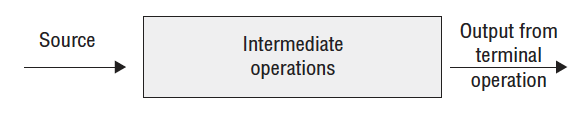

Notice that the intermediate operations are a black box. When viewing the assembly
line from the outside, you care only about what comes in and goes out. What happens in
between is an implementation detail.

You will need to know the differences between intermediate and terminal operations
well. Make sure that you can fill in Table 4.3.

TABLE 4.3 Intermediate vs. terminal operations

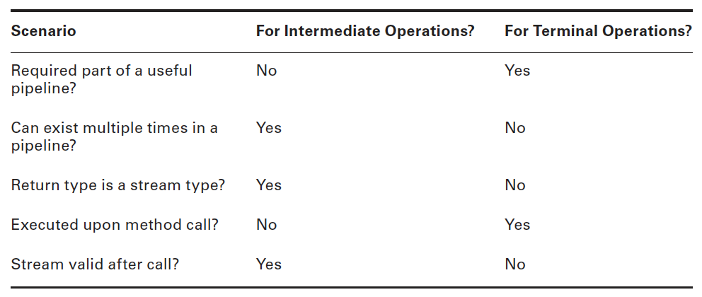

A factory typically has a foreman who oversees the work. Java serves as the foreman
when working with stream pipelines. This is a really important role, especially when
dealing with lazy evaluation and infinite streams. Think of declaring the stream as giving
instructions to the foreman. As the foreman finds out what needs to be done, he sets up the
stations and tells the workers what their duties will be. However, the workers do not start
until the foreman tells them to begin. The foreman waits until he sees the terminal operation
to actually kick off the work. He also watches the work and stops the line as soon as
work is complete.

Let’s look at a few examples of this. We aren’t using code in these examples because it
is really important to understand this stream pipeline concept before starting to write the
code. Figure 4.3 shows a stream pipeline with one intermediate operation. Let’s take a look
at what happens from the point of the view of the foreman. First, he sees that the source is
taking signs out of the box. The foreman sets up a worker at the table to unpack the box
and says to await a signal to start. Then the foreman sees the intermediate operation to
paint the sign. He sets up a worker with paint and says to await a signal to start. Finally,
the foreman sees the terminal operation to put the signs into a pile. He sets up a worker to
do this and yells out that all three workers should start.

FIGURE 4.3 Steps in running a stream pipeline

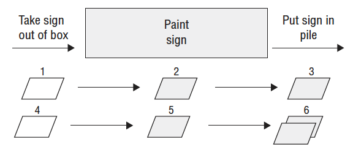

Suppose that there are two signs in the box. Step 1 is the first worker taking one sign out
of the box and handing it to the second worker. Step 2 is the second worker painting it and
handing it to the third worker. Step 3 is the third worker putting it in the pile. Steps 4–6
are this same process for the other sign. Then the foreman sees that there are no more signs
left and shuts down the entire enterprise.

The foreman is smart. He can make decisions about how to best do the work based on
what is needed. As an example, let’s explore the stream pipeline in Figure 4.4.

FIGURE 4.4 A stream pipeline with a limit

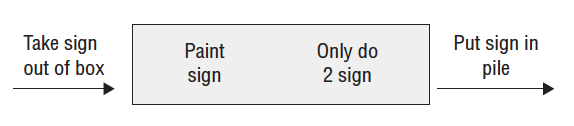

The foreman still sees a source of taking signs out of the box and assigns a worker to do
that on command. He still sees an intermediate operation to paint and sets up another worker
with instructions to wait and then paint. Then he sees an intermediate step that we need only
two signs. He sets up a worker to count the signs that go by and notify him when the worker
has seen two. Finally, he sets up a worker for the terminal operation to put the signs in a pile.

This time, suppose that there are 10 signs in the box. We start out like last time. The first
sign makes its way down the pipeline. The second sign also makes its way down the pipeline.
When the worker in charge of counting sees the second sign, she tells the foreman. The
foreman lets the terminal operation worker finish her task and then yells out “stop the line.”
It doesn’t matter that that there are eight more signs in the box. We don’t need them, so it
would be unnecessary work to paint them. And we all want to avoid unnecessary work!

Similarly, the foreman would have stopped the line after the first sign if the terminal
operation was to find the first sign that gets created.

In the following sections, we will cover the three parts of the pipeline. We will also discuss
special types of streams for primitives and how to print a stream.

### Creating Stream Sources

In Java, the Stream interface is in the java.util.stream package. There are a few ways to
create a finite stream:

````
1: Stream<String> empty = Stream.empty(); // count = 0
2: Stream<Integer> singleElement = Stream.of(1); // count = 1
3: Stream<Integer> fromArray = Stream.of(1, 2, 3); // count = 2
````

Line 1 shows how to create an empty stream. Line 2 shows how to create a stream with
a single element. Line 3 shows how to create a stream from an array. You’ve undoubtedly
noticed that there isn’t an array on line 3. The method signature uses varargs, which let you
specify an array or individual elements. Since streams are new in Java 8, most code that’s
already written uses lists. Java provides a convenient way to convert from a list to a stream:

````
4: List<String> list = Arrays.asList("a", "b", "c");
5: Stream<String> fromList = list.stream();
6: Stream<String> fromListParallel = list.parallelStream();
````

Line 5 shows that it is a simple method call to create a stream from a list. Line 6 does
the same, except that it creates a stream that is allowed to process elements in parallel. This
is a great feature because you can write code that uses parallelism before even learning
what a thread is. Using parallel streams is like setting up multiple tables of workers who
are able to do the same task. Painting would be a lot faster if we could have fi ve painters
painting different signs at once. Just keep in mind that it isn’t worth working in parallel for
small streams. There is an overhead cost in coordinating the work among all of the workers
operating in parallel. For small amounts of work, it is faster just to do it sequentially.

So far, this isn’t particularly impressive. We could do all this with lists. We can’t create
an infinite list, though, which makes streams more powerful:

````
7: Stream<Double> randoms = Stream.generate(Math::random);
8: Stream<Integer> oddNumbers = Stream.iterate(1, n -> n + 2);
````

Line 7 generates a stream of random numbers. How many random numbers? However
many you need. If you call randoms.forEach(System.out::println), the program will
print random numbers until you kill it. Later in the chapter, you’ll learn about operations
like limit() to turn the infinite stream into a finite stream.

Line 8 gives you more control. iterate() takes a seed or starting value as the first
parameter. This is the fi rst element that will be part of the stream. The other parameter is a
lambda expression that gets passed the previous value and generates the next value. As with
the random numbers example, it will keep on producing odd numbers as long as you need
them.

Note: If you try to call System.out.println(stream), you’ll get something like
`java.util.stream.ReferencePipeline$3@4517d9a3`. This is different than
a Collection where you see the contents. You don’t need to know this for
the exam. We mention it so that you aren’t caught by surprise when writing
code for practice.

### Using Common Terminal Operations

You can perform a terminal operation without any intermediate operations but not the
other way around. This is why we will talk about terminal operations first. Reductions are
a special type of terminal operation where all of the contents of the stream are combined
into a single primitive or Object. For example, you might have an int or a Collection.

Table 4.4 summarizes this section. Feel free to use it as a guide to remember the most
important points as we go through each one individually. We explain them from easiest to
hardest rather than alphabetically.

TABLE 4.4 Terminal stream operations

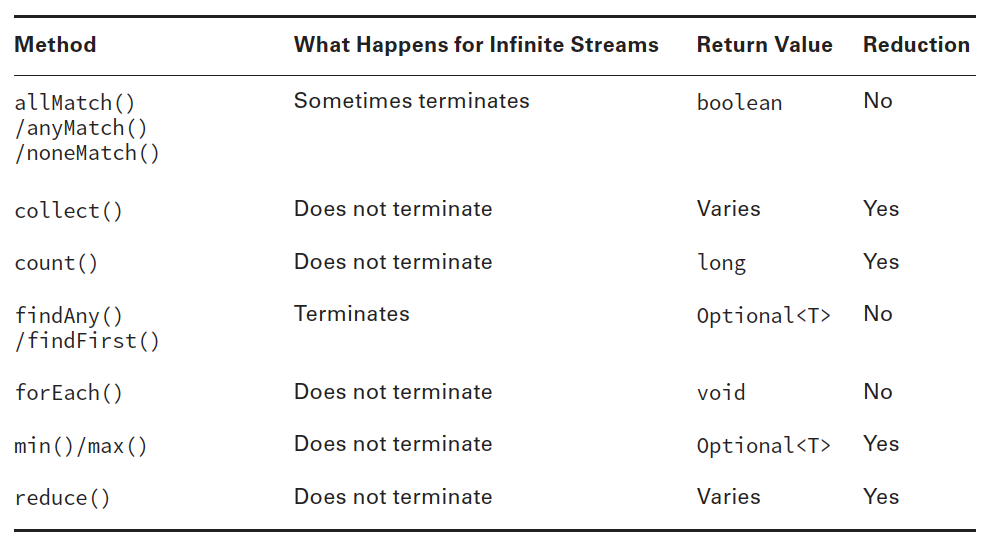

#### forEach()

A looping construct is available. As expected, calling forEach() on an infinite stream does
not terminate. Since there is no return value, it is not a reduction.

Before you use it, consider if another approach would be better. Developers who learned
to write loops fi rst tend to use them for everything. For example, a loop with an if statement
should be a filter instead.
The method signature is the following:

`void forEach(Consumer<? super T> action)`

Notice that this is the only terminal operation with a return type of void . If you
want something to happen, you have to make it happen in the loop. Here’s one way
to print the elements in the stream. There are other ways, which we cover later in the
chapter.

````
Stream<String> s = Stream.of("Monkey", "Gorilla", "Bonobo");
s.forEach(System.out::print); // MonkeyGorillaBonobo
````

Note: Remember that you can call forEach() directly on a Collection or on a
Stream. Don’t get confused on the exam when you see both approaches.

Notice that you can’t use a traditional for loop on a stream:

````
Stream s = Stream.of(1);
for (Integer i: s) {} // DOES NOT COMPILE
````

While forEach() sounds like a loop, it is really a terminal operator for streams. Streams
cannot use a traditional for loop to run because they don’t implement the Iterable interface.

#### reduce()

The reduce() method combines a stream into a single object. As you can tell from the
name, it is a reduction. The method signatures are these:

````
T reduce(T identity, BinaryOperator<T> accumulator)
Optional<T> reduce(BinaryOperator<T> accumulator)
<U> U reduce(U identity, BiFunction<U,? super T,U> accumulator,
    BinaryOperator<U> combiner)
````

Let’s take them one at a time. The most common way of doing a reduction is to start
with an initial value and keep merging it with the next value. Think about how you would
concatenate an array of String s into a single String without functional programming. It
might look something like this:

````
String[] array = new String[] { "w", "o", "l", "f" };
String result = "";
for (String s: array) result = result + s;
System.out.println(result);
````

The initial value of an empty String is the identity. The accumulator combines the current
result with the current String . With lambdas, we can do the same thing with a stream
and reduction:

````
Stream<String> stream = Stream.of("w", "o", "l", "f");
String word = stream.reduce("", (s, c) -> s + c);
System.out.println(word); // wolf
````

Notice how we still have the empty String as the identity. We also still concatenate the
String s to get the next value. We can even rewrite this with a method reference:

````
Stream<String> stream = Stream.of("w", "o", "l", "f");
String word = stream.reduce("", String::concat);
System.out.println(word); // wolf
````

Let’s try another one. Can you write a reduction to multiply all of the Integer objects in
a stream? Try it. Our solution is shown here:

````
Stream<Integer> stream = Stream.of(3, 5, 6);
System.out.println(stream.reduce(1, (a, b) -> a*b));
````

We set the identity to 1 and the accumulator to multiplication. In many cases, the identity
isn’t really necessary, so Java lets us omit it. When you don’t specify an identity, an
Optional is returned because there might not be any data. There are three choices for what
is in the Optional:

- If the stream is empty, an empty Optional is returned.
- If the stream has one element, it is returned.
- If the stream has multiple elements, the accumulator is applied to combine them.

The following illustrates each of these scenarios:

````
BinaryOperator<Integer> op = (a, b) -> a * b;
Stream<Integer> empty = Stream.empty();
Stream<Integer> oneElement = Stream.of(3);
Stream<Integer> threeElements = Stream.of(3, 5, 6);
empty.reduce(op).ifPresent(System.out::print); // no output
oneElement.reduce(op).ifPresent(System.out::print); // 3
threeElements.reduce(op).ifPresent(System.out::print); // 90
````

Why are there two similar methods? Why not just always require the identity? Java
could have done that. However, sometimes it is nice to differentiate the case where the
stream is empty rather than the case where there is a value that happens to match the identity
being returned from calculation. The signature returning an Optional lets us differentiate
these cases. For example, we might return Optional.empty() when the stream is empty
and Optional.of(3) when there is a value.

The third method signature is used when we are processing collections in parallel. It
allows Java to create intermediate reductions and then combine them at the end. In our
example, it looks similar. While we aren’t actually using a parallel stream here, Java
assumes that a stream might be parallel. This is helpful because it lets us switch to a parallel
stream easily in the future:

````
BinaryOperator<Integer> op = (a, b) -> a * b;
Stream<Integer> stream = Stream.of(3, 5, 6);
System.out.println(stream.reduce(1, op, op)); // 90
````

#### collect()

The collect() method is a special type of reduction called a mutable reduction. It is
more efficient than a regular reduction because we use the same mutable object while
accumulating. Common mutable objects include StringBuilder and ArrayList. This is a
really useful method, because it lets us get data out of streams and into another form. The
method signatures are as follows:

````
<R> R collect(Supplier<R> supplier, BiConsumer<R, ? super T> accumulator,
BiConsumer<R, R> combiner)
<R,A> R collect(Collector<? super T, A,R> collector)
````

Let’s start with the first signature, which is used when we want to code specifically how
collecting should work. Our wolf example from reduce can be converted to use collect():

````
Stream<String> stream = Stream.of("w", "o", "l", "f");
StringBuilder word = stream.collect(StringBuilder::new,
StringBuilder::append, StringBuilder:append)
````

The first parameter is a Supplier that creates the object that will store the results as we
collect data. Remember that a Supplier doesn’t take any parameters and returns a value.
In this case, it constructs a new StringBuilder.

The second parameter is a BiConsumer, which takes two parameters and doesn’t return
anything. It is responsible for adding one more element to the data collection. In this example,
it appends the next String to the StringBuilder.

The final parameter is another BiConsumer. It is responsible for taking two data collections
and merging them. This is useful when we are processing in parallel. Two smaller
collections are formed and then merged into one. This would work with StringBuilder
only if we didn’t care about the order of the letters. In this case, the accumulator and combiner
have similar logic.

Now let’s look at an example where the logic is different in the accumulator and
combiner:

````
Stream<String> stream = Stream.of("w", "o", "l", "f");
TreeSet<String> set = stream.collect(TreeSet::new, TreeSet::add,
TreeSet::addAll);
System.out.println(set); // [f, l, o, w]
````

The collector has three parts as before. The supplier creates an empty TreeSet. The
accumulator adds a single String from the Stream to the TreeSet. The combiner adds all
of the elements of one TreeSet to another in case the operations were done in parallel and
need to be merged.

We started with the long signature because that’s how you implement your own
collector. It is important to know how to do this for the exam and to understand how
collectors work. In practice, there are many common collectors that come up over and
over. Rather than making developers keep reimplementing the same ones, Java provides
an interface with common collectors. This approach also makes the code easier to read
because it is more expressive. For example, we could rewrite the previous example as
follows:

````
Stream<String> stream = Stream.of("w", "o", "l", "f");
TreeSet<String> set = stream.collect(Collectors.toCollection(TreeSet::new));
System.out.println(set); // [f, l, o, w]
````

If we didn’t need the set to be sorted, we could make the code even shorter:

````
Stream<String> stream = Stream.of("w", "o", "l", "f");
Set<String> set = stream.collect(Collectors.toSet());
System.out.println(set); // [f, w, l, o]
````

You might get different output for this last one since toSet() makes no guarantees as
to which implementation of Set you’ll get. It is likely to be a HashSet , but you shouldn’t
expect or rely on that.

Note: The exam expects you to know about common predefined collectors in
addition to being able to write your own by passing a supplier, accumulator,
and combiner.

### Using Common Intermediate Operations

Unlike a terminal operation, intermediate operations deal with infinite streams simply by
returning an infinite stream. Since elements are produced only as needed, this works fine.
The assembly line worker doesn’t need to worry about how many more elements are coming
through and instead can focus on the current element.

#### filter()

The filter() method returns a Stream with elements that match a given expression. Here
is the method signature:

`Stream<T> filter(Predicate<? super T> predicate)`

This operation is easy to remember and very powerful because we can pass any
Predicate to it. For example, this fi lters all elements that begin with the letter m :

````
Stream<String> s = Stream.of("monkey", "gorilla", "bonobo");
s.filter(x -> x.startsWith("m")).forEach(System.out::print); // monkey
````

#### distinct()

The distinct() method returns a stream with duplicate values removed. The duplicates do
not need to be adjacent to be removed. As you might imagine, Java calls equals() to determine
whether the objects are the same. The method signature is as follows:

`Stream<T> distinct()`

Here’s an example:

````
Stream<String> s = Stream.of("duck", "duck", "duck", "goose");
s.distinct().forEach(System.out::print); // duckgoose
````

#### limit() and skip()

The limit() and skip() methods make a Stream smaller. They could make a fi nite stream
smaller, or they could make a fi nite stream out of an infi nite stream. The method signatures
are shown here:

````
Stream<T> limit(int maxSize)
Stream<T> skip(int n)
````

The following code creates an infinite stream of numbers counting from 1. The skip()
operation returns an infinite stream starting with the numbers counting from 6, since it
skips the fi rst fi ve elements. The limit() call takes the fi rst two of those. Now we have a
finite stream with two elements:

````
Stream<Integer> s = Stream.iterate(1, n -> n + 1);
s.skip(5).limit(2).forEach(System.out::print); // 67
````

### Putting Together the Pipeline

Streams allow you to use chaining and express what you want to accomplish rather than
how to do so. Let’s say that we wanted to get the first two names alphabetically that are
four characters long. In Java 7, we’d have to write something like the following:

````
List<String> list = Arrays.asList("Toby", "Anna", "Leroy", "Alex");
List<String> filtered = new ArrayList<>();
for (String name: list) {
    if (name.length() == 4) filtered.add(name);
}
Collections.sort(filtered);
Iterator<String> iter = filtered.iterator();
if (iter.hasNext()) System.out.println(iter.next());
if (iter.hasNext()) System.out.println(iter.next());
````

This works. It takes some reading and thinking to figure out what is going on. The problem
we are trying to solve gets lost in the implementation. It is also very focused on the how
rather than on the what. In Java 8, the equivalent code is as follows:

````
List<String> list = Arrays.asList("Toby", "Anna", "Leroy", "Alex");
list.stream().filter(n -> n.length() == 4).sorted()
    .limit(2).forEach(System.out::println);
````

Before you say that it is harder to read, we can format it:

````
stream.filter(n -> n.length() == 4)
    .sorted()
    .limit(2)
    .forEach(System.out::println);
````

The difference is that we express what is going on. We care about String objects of
length 4. Then we then want them sorted. Then we want to first two. Then we want to
print them out. It maps better to the problem that we are trying to solve, and it is simpler
because we don’t have to deal with counters and such.

Once you start using streams in your code, you may find yourself using them in many
places. Having shorter, briefer, and clearer code is definitely a good thing!

In this example, you see all three parts of the pipeline. Figure 4.5 shows how each intermediate
operation in the pipeline feeds into the next.

FIGURE 4.5 Stream pipeline with multiple intermediate operations

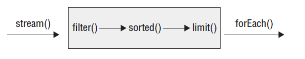

Remember that the assembly line foreman is figuring out how to best implement the
stream pipeline. He sets up all of the tables with instructions to wait before starting. He
tells the limit() worker to inform him when two elements go by. He tells the sorted()
worker that she should just collect all of the elements as they come in and sort them all at
once. After sorting, she should start passing them to the limit() worker one at a time. The
data flow looks like this:

1. stream() sends Toby to filter(). filter() sees that the length is good and sends Toby
to sorted(). sorted() can’t sort yet because it needs all of the data, so it holds Toby.
1. stream() sends Anna to filter(). filter() sees that the length is good and sends Anna
to sorted(). sorted() can’t sort yet because it needs all of the data, so it holds Anna.
1. stream() sends Leroy to filter(). filter() sees that the length is not a match, and it
takes Leroy out of the assembly line processing.
1. stream() sends Alex to filter(). filter() sees that the length is good and sends Alex
to sorted(). sorted() can’t sort yet because it needs all of the data, so it holds Alex. It
turns out sorted() does have all of the required data, but it doesn’t know it yet.
1. The foreman lets sorted() know that it is time to sort and the sort occurs.
1. sorted() sends Alex to limit(). limit() remembers that it has seen one element and
sends Alex to forEach(), printing Alex.
1. sorted() sends Anna to limit(). limit() remembers that it has seen two elements
and sends Anna to forEach(), printing Anna.
1. limit() has now seen all of the elements that are needed and tells the foreman. The
foreman stops the line, and no more processing occurs in the pipeline.

Make sense? Let’s try two more examples to make sure that you understand this well.
What do you think the following does?

````
Stream.generate(() -> "Elsa")
    .filter(n -> n.length() == 4)
    .sorted()
    .limit(2)
    .forEach(System.out::println);
````

It actually hangs until you kill the program or it throws an exception after running out
of memory. The foreman has instructed sorted() to wait until everything to sort is present.
That never happens because there is an infinite stream. What about this example?

````
Stream.generate(() -> "Elsa")
    .filter(n -> n.length() == 4)
    .limit(2)
    .sorted()
    .forEach(System.out::println);
````

This one prints Elsa twice. The filter lets elements through and limit() stops the earlier
operations after two elements. Now sorted() can sort because we have a finite list. Finally,
what do you think this does?

````
Stream.generate(() -> "Olaf Lazisson")
    .filter(n -> n.length() == 4)
    .limit(2)
    .sorted()
    .forEach(System.out::println);
````

This one hangs as well until we kill the program. The filter doesn’t allow anything
through, so limit() never sees two elements. This means that we have to keep waiting and
hope that they show up.

## <a name="4-1"></a>4.1 - Extract stream data using map, peek and flatMap methods

### map()

The map() method creates a one-to-one mapping from the elements in the stream to the elements
of the next step in the stream. The method signature is as follows:

`<R> Stream<R> map(Function<? super T, ? extends R> mapper)`

This one looks more complicated than the others you have seen. It uses the lambda
expression to figure out the type passed to that function and the one returned. The return
type is the stream that gets returned.

Note: The map() method on streams is for transforming data. Don’t confuse it
with the Map interface, which maps keys to values.

As an example, this code converts a list of String objects to a list of Integer s representing
their lengths:

````
Stream<String> s = Stream.of("monkey", "gorilla", "bonobo");
s.map(String::length).forEach(System.out::print); // 676
````

Remember that String::length is shorthand for the lambda x -> x.length(), which
clearly shows it is a function that turns a String into an Integer.

### flatMap()

The flatMap() method takes each element in the stream and makes any elements it contains
top-level elements in a single stream. This is helpful when you want to remove empty
elements from a stream or you want to combine a stream of lists. We are showing you the
method signature for consistency with the other methods, just so you don’t think we are
hiding anything. You aren’t expected to be able to read this:

`<R> Stream<R> flatMap(Function<? super T, ? extends Stream<? extends R>> mapper)`

This gibberish basically says that it returns a Stream of the type that the function contains
at a lower level. Don’t worry about the signature. It’s a headache.

What you should understand is the example. This gets all of the animals into the same
level along with getting rid of the empty list:

````
List<String> zero = Arrays.asList();
List<String> one = Arrays.asList("Bonobo");
List<String> two = Arrays.asList("Mama Gorilla", "Baby Gorilla");
Stream<List<String>> animals = Stream.of(zero, one, two);

animals.flatMap(l -> l.stream()).forEach(System.out::println);
````

Here’s the output:

````
Bonobo
Mama Gorilla
Baby Gorilla
````

As you can see, it removed the empty list completely and changed all elements of each
list to be at the top level of the stream.

### peek()

The peek() method is our fi nal intermediate operation. It is useful for debugging because it
allows us to perform a stream operation without actually changing the stream. The method
signature is as follows:

`Stream<T> peek(Consumer<? super T> action)`

The most common use for peek() is to output the contents of the stream as it goes by.
Suppose that we made a typo and counted bears beginning with the letter g instead of b .
We are puzzled why the count is 1 instead of 2. We can add a peek() to fi nd out why:

````
Stream<String> stream = Stream.of("black bear", "brown bear", "grizzly");
long count = stream.filter(s -> s.startsWith("g"))
    .peek(System.out::println).count(); // grizzly
System.out.println(count); // 1
````

Note: When working with a Queue , peek() looks only at the first element. In a
stream, peek() looks at each element that goes through that part of the
stream pipeline. It’s like having a worker take notes on how a particular
step of the process is doing.

## <a name="4-2"></a>4.2 - Search stream data using search findFirst, findAny, anyMatch, allMatch and noneMatch methods

### findAny() and findFirst()

The findAny() and findFirst() methods return an element of the stream unless the stream
is empty. If the stream is empty, they return an empty Optional. This is the first method
you’ve seen that works with an infinite stream. Since Java generates only the amount of
stream you need, the infinite stream needs to generate only one element. findAny() is useful
when you are working with a parallel stream. It gives Java the flexibility to return to you
the first element it comes by rather than the one that needs to be first in the stream based
on the intermediate operations.

These methods are terminal operations but not reductions. The reason is that they sometimes
return without processing all of the elements. This means that they return a value
based on the stream but do not reduce the entire stream into one value.
The method signatures are these:

````
Optional<T> findAny()
Optional<T> findFirst()
````

This example finds an animal:

````
Stream<String> s = Stream.of("monkey", "gorilla", "bonobo");
Stream<String> infinite = Stream.generate(() -> "chimp");
s.findAny().ifPresent(System.out::println); // monkey
infinite.findAny().ifPresent(System.out::println); // chimp
````

Finding any one match is more useful than it sounds. Sometimes we just want to sample the
results and get a representative element, but we don’t need to waste the processing generating
them all. After all, if we plan to work with only one element, why bother looking at more?

### allMatch() , anyMatch() and noneMatch()

The allMatch(), anyMatch() and noneMatch() methods search a stream and return information
about how the stream pertains to the predicate. These may or may not terminate
for infinite streams. It depends on the data. Like the fi nd methods, they are not reductions
because they do not necessarily look at all of the elements.
The method signatures are as follows:

````
boolean anyMatch(Predicate <? super T> predicate)
boolean allMatch(Predicate <? super T> predicate)
boolean noneMatch(Predicate <? super T> predicate)
````

This example checks whether animal names begin with letters:

````
List<String> list = Arrays.asList("monkey", "2", "chimp");
Stream<String> infinite = Stream.generate(() -> "chimp");
Predicate<String> pred = x -> Character.isLetter(x.charAt(0));
System.out.println(list.stream().anyMatch(pred)); // true
System.out.println(list.stream().allMatch(pred)); // false
System.out.println(list.stream().noneMatch(pred)); // false
System.out.println(infinite.anyMatch(pred)); // true
````

This shows that we can reuse the same predicate, but we need a different stream each time.
anyMatch() returns true because two of the three elements match. allMatch() returns false
because one doesn’t match. noneMatch() also returns false because one matches. On the infinite list, one match is found, so the call terminates. If we called noneMatch() or allMatch() ,
they would run until we killed the program.

Note: Remember that allMatch(), anyMatch(), and noneMatch() return a boolean. 
By contrast, the find methods return an Optional because they return an element of the stream.

## <a name="4-3"></a>4.3 - Use the Optional class

Suppose that you are taking an introductory Java class and receive scores of 90 and 100
on the first two exams. Now, we ask you what your average is. An average is calculated by
adding the scores and dividing by the number of scores, so you have (90+100)/2. This gives
190/2, so you answer with 95. Great!

Now suppose that you are taking your second class on Java, and it is the first day of
class. We ask you what your average is in this class that just started. You haven’t taken any
exams yet, so you don’t have anything to average. It wouldn’t be accurate to say that your
average is zero. That sounds bad, and it isn’t true. There simply isn’t any data, so you don’t
have an average yet.

How do we express this “we don’t know” or “not applicable” answer in Java? Starting
with Java 8, we use the Optional type. An Optional is created using a factory. You can
either request an empty Optional or pass a value for the Optional to wrap. Think of an
Optional as a box that might have something in it or might instead be empty. Figure 4.1
shows both options.

FIGURE 4.1 Optional

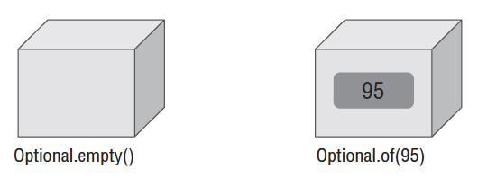

Here’s how to code our average method:

````
10: public static Optional<Double> average(int… scores) {
11:     if (scores.length == 0) return Optional.empty();
12:     int sum = 0;
13:     for (int score: scores) sum += score;
14:     return Optional.of((double) sum / scores.length);
15: }
````

Line 11 returns an empty Optional when we can’t calculate an average. Lines 12 and
13 add up the scores. There is a functional programming way of doing this math, but we
will get to that later in the chapter. In fact, the entire method could be written in one line,
but that wouldn’t teach you how Optional works! Line 14 creates an Optional to wrap the
average.

Calling the method shows what is in our two boxes:

````
System.out.println(average(90, 100)); // Optional[95.0]
System.out.println(average()); // Optional.empty
````

You can see that one Optional contains a value and the other is empty. Normally, we
want to check if a value is there and/or get it out of the box. Here’s one way to do that:

````
20: Optional<Double> opt = average(90, 100);
21: if (opt.isPresent())
22:     System.out.println(opt.get()); // 95.0
````

Line 21 checks whether the Optional actually contains a value. Line 22 prints it out.
What if we didn’t do the check and the Optional was empty?

````
26: Optional<Double> opt = average();
27: System.out.println(opt.get()); // bad
````

We’d get an exception since there is no value inside the Optional:

`java.util.NoSuchElementException: No value present`

When creating an Optional, it is common to want to use empty when the value is null.
You can do this with an if statement or ternary operator. We use the ternary operator to
make sure that you remember how it works from the OCA:

`Optional o = (value== null) ? Optional.empty(): Optional.of(value);`

If value is null, o is assigned the empty Optional. Otherwise, we wrap the value. Since
this is such a common pattern, Java provides a factory method to do the same thing:

`Optional o = Optional.ofNullable(value);`

That covers the static methods you need to know about Optional. Table 4.2 summarizes
most of the instance methods on Optional that you need to know for the
exam. There are a few others that involve chaining. We will cover those later in the
chapter.

TABLE 4.2 Optional instance methods

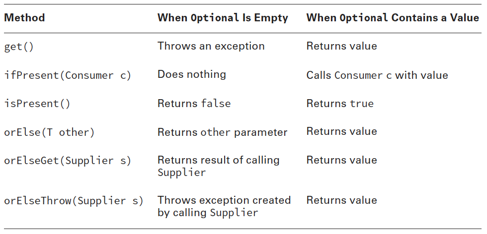

You’ve already seen get() and isPresent(). The other methods allow you to write
code that uses an Optional in one line without having to use the ternary operator.
This makes the code easier to read. Instead of using an if statement, which we used
when checking the average earlier, we can specify a Consumer to be run when there is
a value inside the Optional. When there isn’t, the method simply skips running the
Consumer:

````
Optional<Double> opt = average(90, 100);
opt.ifPresent(System.out::println);
````

Using ifPresent() better expresses our intent. We want something done if a value is
present. The other methods allow you to specify what to do if a value isn’t present. There
are three choices:

````
30: Optional<Double> opt = average();
31: System.out.println(opt.orElse(Double.NaN));
32: System.out.println(opt.orElseGet(() -> Math.random()));
33: System.out.println(opt.orElseThrow(() -> new IllegalStateException()));
````

This prints something like the following:

````
NaN
0.49775932295380165
Exception in thread "main" java.lang.IllegalStateException
at optional.Average.lambda$3(Average.java:56)
at optional.Average$$Lambda$5/455659002.get(Unknown Source)
at java.util.Optional.orElseThrow(Optional.java:290)
````

Line 31 shows that you can return a specific value or variable. In our case, we print the
“not a number” value. Line 32 shows using a Supplier to generate a value at runtime to
return instead. I’m glad our professors didn’t give us a random average though! Line 33
shows using a different Supplier to create an exception that should be thrown. Remember
that the stack trace looks weird because the lambdas are generated rather than named
classes.

Notice that the two methods that take a Supplier have different names. Do you see why
this code does not compile?

````
System.out.println(opt.orElseGet(
    () -> new IllegalStateException())); // DOES NOT COMPILE
````

opt is an Optional<Double>. This means the Supplier must return a Double. Since this
supplier returns an exception, the type does not match.
The last example with Optional is really easy. What do you think this does?

````
Optional<Double> opt = average(90, 100);
System.out.println(opt.orElse(Double.NaN));
System.out.println(opt.orElseGet(() -> Math.random()));
System.out.println(opt.orElseThrow(() -> new IllegalStateException()));
````

It prints out 95 three times. Since the value does exist, there is no need to use the “or
else” logic.

## <a name="4-4"></a>4.4 - Perform calculations using count, max, min, average and sum stream operations

Note: For `average` and `sum` see section 8.4 as these are performed on `IntStream`.

### count()

The count() method determines the number of elements in a finite stream. For an infinite
stream, it hangs. Why? Count from 1 to infinity and let us know when you are finished. Or
rather don’t do that because we’d rather you study for the exam than spend the rest of your
life counting. count() is a reduction because it looks at each element in the stream and
returns a single value. The method signature is this:

`long count()`

This example shows calling count() on a finite stream:

````
Stream<String> s = Stream.of("monkey", "gorilla", "bonobo");
System.out.println(s.count()); // 3
````

### min() and max()

The min() and max() methods allow you to pass a custom comparator and find the smallest
or largest value in a finite stream according to that sort order. Like count(), min() and
max() hang on an infinite stream because they cannot be sure that a smaller or larger value
isn’t coming later in the stream. Both methods are reductions because they return a single
value after looking at the entire stream. The method signatures are as follows:

````
Optional<T> min(<? super T> comparator)
Optional<T> max(<? super T> comparator)
````

This example finds the animal with the fewest letters in its name:

````
Stream<String> s = Stream.of("monkey", "ape", "bonobo");
Optional<String> min = s.min((s1, s2) -> s1.length()—s2.length());
min.ifPresent(System.out::println); // ape
````

Notice that the code returns an Optional rather than the value. This allows the method
to specify that no minimum or maximum was found. We use the Optional method and a
method reference to print out the minimum only if one is found. As an example of where
there isn’t a minimum, let’s look at an empty stream:

````
Optional<?> minEmpty = Stream.empty().min((s1, s2) -> 0);
System.out.println(minEmpty.isPresent()); // false
````

Since the stream is empty, the comparator is never called and no value is present in the
Optional.

## <a name="4-5"></a>4.5 - Sort a collection using lambda expressions

### Comparator vs. Comparable

We discussed “order” for the TreeSet and TreeMap classes. For numbers, order is
obvious—it is numerical order. For String objects, order is defi ned according to the
Unicode character mapping. As far as the exam is concerned, that means numbers sort
before letters and uppercase letters sort before lowercase letters.

Note: Remember that numbers sort before letters and uppercase letters sort
before lowercase letters.

You can also sort objects that you create. Java provides an interface called Comparable .
If your class implements Comparable , it can be used in these data structures that require
comparison. There is also a class called Comparator , which is used to specify that you want
to use a different order than the object itself provides.

Comparable and Comparator are similar enough to be tricky. The exam likes to see if
it can trick you into mixing up the two. Don’t be confused! In this section, we will discuss
Comparable fi rst. Then, as we go through Comparator , we will point out all of the
differences.

#### Comparable

The Comparable interface has only one method. In fact, this is the entire interface:

````
public interface Comparable<T> {
    public int compareTo(T o);
}
````

See the use of generics in there? This lets you avoid the cast when implementing compareTo(). 
Any object can be Comparable. For example, we have a bunch of ducks and want to
sort them by name:

````
import java.util.*;
public class Duck implements Comparable<Duck> {
    private String name;
    public Duck(String name) {
        this.name = name;
    }
    public String toString() { // use readable output
        return name;
    }
    public int compareTo(Duck d) {
        return name.compareTo(d.name); // call String's compareTo
    }
    public static void main(String[] args) {
        List<Duck> ducks = new ArrayList<>();
        ducks.add(new Duck("Quack"));
        ducks.add(new Duck("Puddles"));
        Collections.sort(ducks); // sort by name
        System.out.println(ducks); // [Puddles, Quack]
} }
````

The Duck class implements the Comparable interface. Without implementing that interface,
all we have is a method named compareTo(), but it wouldn’t be a Comparable object.

The Duck class overrides the toString() method from Object, so we can see useful output
when printing out ducks. Without this override, the output would be something like
`[Duck@70dea4e, Duck@5c647e05]`—hardly useful in seeing which duck’s name comes first.

Finally, the Duck class implements compareTo(). Since Duck is comparing objects of type
String and the String class already has a compareTo() method, it can just delegate.
We still need to know what the compareTo() method returns so that we can write our
own. There are three rules to know:

- The number zero is returned when the current object is equal to the argument to compareTo().
- A number less than zero is returned when the current object is smaller than the argument
to compareTo().
- A number greater than zero is returned when the current object is larger than the argument
to compareTo().

Let’s look at an implementation of compareTo() that compares numbers instead of
String objects:

````
1: public class Animal implements java.util.Comparable<Animal> {
2:      private int id;
3:      public int compareTo(Animal a) {
4:          return id – a.id;
5:      }
6:      public static void main(String[] args) {
7:          Animal a1 = new Animal();
8:          Animal a2 = new Animal();
9:          a1.id = 5;
10:         a2.id = 7;
11:         System.out.println(a1.compareTo(a2)); // -2
12:         System.out.println(a1.compareTo(a1)); // 0
13:         System.out.println(a2.compareTo(a1)); // 2
14: } }
````

Lines 7 and 8 create two Animal objects. Lines 9 and 10 set their id values. This is not a
good way to set instance variables. It would be better to use a constructor or setter method.
Since the exam shows nontraditional code to make sure that you understand the rules, we
throw in some as well.

Lines 3 through 5 implement the compareTo() method. Since an int is a primitive, we
can’t call a method on it. We could create the Integer wrapper class and call compareTo()
on that. It’s not necessary, though, since it is so easy to implement compareTo() correctly
on our own.

Lines 11 through 13 confi rm that we’ve implemented compareTo() correctly. Line 11
compares a smaller id to a larger one, and therefore it prints a negative number. Line 12
compares animals with the same id , and therefore it prints 0. Line 13 compares a larger id
to a smaller one, and therefore it returns a positive number.

Note: Remember that id – a.id sorts in ascending order and a.id – id sorts in
descending order.

When dealing with legacy code, the compareTo() method requires a cast since it is
passed an Object:

````
public class LegacyDuck implements java.util.Comparable {
    private String name;
    public int compareTo(Object obj) {
        LegacyDuck d = (LegacyDuck) obj; // cast because no generics
        return name.compareTo(d.name);
    }
}
````

Since we don’t specify a generic type for Comparable , Java assumes that we want an
Object , which means that we have to cast to LegacyDuck before accessing instance variables
on it.

You might have noticed by now that we have been writing java.util.Comparable .
That’s because it is in the java.util package. Most of the time, you won’t see the package
name on the exam. You can tell that the imports have been omitted because the code will
have line numbers that do not begin with line 1.

#### Comparator

Sometimes you want to sort an object that did not implement Comparable, or you want to
sort objects in different ways at different times.
Suppose that we add weight to our Duck class. We now have the following:

````
public class Duck implements Comparable<Duck> {
    private String name;
    private int weight;
    public Duck(String name, int weight) {
        this.name = name;
        this.weight = weight;
    }
    public String getName() { return name; }
    public int getWeight() { return weight; }
    public String toString() { return name; }
    public int compareTo(Duck d) {
        return name.compareTo(d.name);
    }
}
````

The Duck class itself can define compareTo() in only one way. In this case, name was
chosen. If we want to sort by something else, we have to define that sort order outside the
compareTo() method:

````
public static void main(String[] args) {
    Comparator<Duck> byWeight = new Comparator<Duck>() {
        public int compare(Duck d1, Duck d2) {
            return d1.getWeight()—d2.getWeight();
        }
    };
    List<Duck> ducks = new ArrayList<>();
    ducks.add(new Duck("Quack", 7));
    ducks.add(new Duck("Puddles", 10));
    Collections.sort(ducks);
    System.out.println(ducks); // [Puddles, Quack]
    Collections.sort(ducks, byWeight);
    System.out.println(ducks); // [Quack, Puddles]
}
````

First, we defined an inner class with the comparator. Then we sorted without the comparator
and with the comparator to see the difference in output.

Comparator is a functional interface since there is only one abstract method to implement.
This means that we can rewrite the comparator in the previous example as any of the
following:

````
Comparator<Duck> byWeight = (d1, d2) -> d1.getWeight()—d2.getWeight();
Comparator<Duck> byWeight = (Duck d1, Duck d2) -> d1.getWeight()—d2.getWeight();
Comparator<Duck> byWeight = (d1, d2) -> { return d1.getWeight()—d2.getWeight(); };
Comparator<Duck> byWeight = (Duck d1, Duck d2) -> {return d1.getWeight()—
    d2.getWeight(); };
````

All of these examples show taking two parameters and returning an int—just as
Comparator specifies. Remember that the type is optional. Java will infer it by what is
needed in that spot in the code. This is cool. You can rewrite five lines of code using a
funky syntax into one line in a different funky syntax! It is really cool because you get used
to the lambda syntax, whereas the anonymous inner class always feels kludgy. We will use
a mix of lambdas and anonymous inner classes in this book since you should expect to see
both approaches on the exam.

There are a good number of differences between Comparable and Comparator. We’ve
listed them for you in Table 3.10.

TABLE 3.10 Comparison of Comparable and Comparator

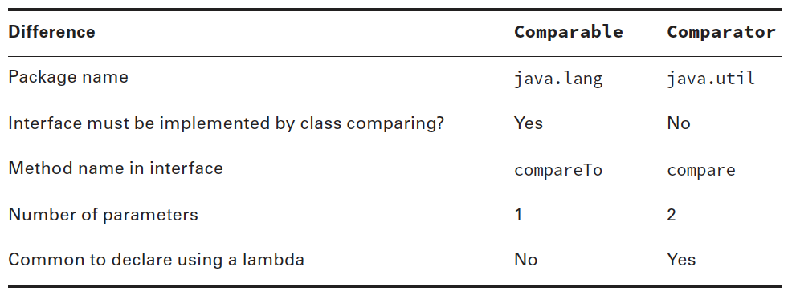

Memorize this table—really. The exam will try to trick you by mixing up the two and
seeing if you can catch it. Do you see why this one doesn’t compile?

````
Comparator<Duck> byWeight = new Comparator<Duck>() { //DOES NOT COMPILE
    public int compareTo(Duck d1, Duck d2) {
        return d1.getWeight()—d2.getWeight();
    }
};
````

The method name is wrong. A Comparator must implement a method named compare().
Pay special attention to method names and the number of parameters when you see
Comparator and Comparable in questions.

You’ve probably noticed by now that we have ignored nulls in checking equality and
comparing objects. This works fine for the exam. In the real world, though, things aren’t
so neat. You will have to decide how to handle nulls or prevent them from being in your
object. It is common to decide that nulls sort before any other values.

### Searching and Sorting

You already know the basics of searching and sorting. You now know a little more about
Comparable and Comparator.

The sort method uses the compareTo() method to sort. It expects the objects to be sorted
to be Comparable.

````
1: import java.util.*;
2: public class SortRabbits {
3:      static class Rabbit{ int id; }
4:      public static void main(String[] args) {
5:          List<Rabbit> rabbits = new ArrayList<>();
6:          rabbits.add(new Rabbit());
7:          Collections.sort(rabbits); // DOES NOT COMPILE
8: } }
````

Java knows that the Rabbit class is not Comparable. It knows sorting will fail, so it
doesn’t even let the code compile. You can fix this by passing a Comparator to sort().
Remember that a Comparator is useful when you want to specify sort order without using a
compareTo() method:

````
import java.util.*;
public class SortRabbits {
    static class Rabbit{ int id; }
    public static void main(String[] args) {
        List<Rabbit> rabbits = new ArrayList<>();
        rabbits.add(new Rabbit());
        Comparator<Rabbit> c = (r1, r2) -> r1.id - r2.id;
        Collections.sort(rabbits, c);
} }
````

sort() and binarySearch() allow you to pass in a Comparator object when you don’t want
to use the natural order. There is a trick in this space. What do you think the following outputs?

````
3: List<String> names = Arrays.asList("Fluffy", "Hoppy");
4: Comparator<String> c = Comparator.reverseOrder();
5: int index = Collections.binarySearch(names, "Hoppy", c);
6: System.out.println(index);
````

The correct answer is -1. Before you panic, you don’t need to know that the answer
is -1. You do need to know that the answer is not defined. Line 3 creates a list, `[Fluffy,
Hoppy]`. This list happens to be sorted in ascending order. Line 4 creates a Comparator that
reverses the natural order. Line 5 requests a binary search in descending order. Since the list
is in ascending order, we don’t meet the precondition for doing a search.

Earlier in the chapter, we talked about collections that require classes to implement
Comparable. Unlike sorting, they don’t check that you have actually implemented
Comparable at compile time.

Going back to our Rabbit that does not implement Comparable, we try to add it to a
TreeSet:

````
2: public class UseTreeSet {
3:      static class Rabbit{ int id; }
4:      public static void main(String[] args) {
5:          Set<Duck> ducks = new TreeSet<>();
6:          ducks.add(new Duck("Puddles"));
7:          Set<Rabbit> rabbit = new TreeSet<>();
8:          rabbit.add(new Rabbit()); // throws an exception
9: } }
````

Line 6 is fine. Duck does implement Comparable. TreeSet is able to sort it into the proper
position in the set. Line 8 is a problem. When TreeSet tries to sort it, Java discovers the
fact that Rabbit does not implement Comparable. Java throws an exception that looks like
this:

````
Exception in thread "main" java.lang.ClassCastException: comparing.Rabbit cannot
be cast to java.lang.Comparable
````

It seems weird for this exception to be thrown when the first object is added to the set.
After all, there is nothing to compare yet. Java works this way for consistency.

Just like searching and sorting, you can tell collections that require sorting that you wish
to use a specific Comparator, for example:

````
Set<Rabbit> rabbit = new TreeSet<>(new Comparator<Rabbit>() {
    public int compare(Rabbit r1, Rabbit r2) {
        return r1.id = r2.id;
    }
});
rabbit.add(new Rabbit());
````

Now Java knows that you want to sort by id and all is well. Comparators are helpful
objects. They let you separate sort order from the object to be sorted.

### Sorting lists

Prior to Java 8, it was necessary to implement the `java.util.Comparator` interface with an anonymous (or named) class when sorting a list1:

````
List<Person> people = ...
Collections.sort(
    people,
    new Comparator<Person>() {
        public int compare(Person p1, Person p2){
            return p1.getFirstName().compareTo(p2.getFirstName());
        }
    }
);
````

Starting with Java 8, the anonymous class can be replaced with a lambda expression. Note that the types for the parameters p1 and p2 can be left out, as the compiler will infer them automatically:

````
Collections.sort(
    people, 
    (p1, p2) -> p1.getFirstName().compareTo(p2.getFirstName())
);
````

The example can be simplified by using Comparator.comparing and method references expressed using the :: (double colon) symbol.

````
Collections.sort(
    people,
    Comparator.comparing(Person::getFirstName)
);
````

A static import allows us to express this more concisely, but it is debatable whether this improves overall readability:

````
import static java.util.Collections.sort;
import static java.util.Comparator.comparing;
//...
sort(people, comparing(Person::getFirstName));
````

Comparators built this way can also be chained together. For example, after comparing people by their first name, if there are people with the same first name, the `thenComparing` method with also compare by last name:

`sort(people, comparing(Person::getFirstName).thenComparing(Person::getLastName));`

Note: `Collections.sort(...)` only works on collections that are subtypes of List. The Set and Collection APIs do not imply any ordering of the elements.

### Sorting maps

You can sort the entries of a `HashMap` by value in a similar fashion. (Note that a LinkedHashMap must be used as the target. The keys in an ordinary `HashMap` are unordered.)

````
Map<String, Integer> map = new HashMap();  // ... or any other Map class
// populate the map
map = map.entrySet()
    .stream()
    .sorted(Map.Entry.<String, Integer>comparingByValue())
    .collect(Collectors.toMap(k -> k.getKey(), v -> v.getValue(),
                              (k, v) -> k, LinkedHashMap::new));
````

### sorted()

The Stream intermediate operation, sorted() method, returns a stream with the elements sorted. Just like sorting arrays,
Java uses natural ordering unless we specify a comparator. The method signatures are
these:

````
Stream<T> sorted()
Stream<T> sorted(Comparator<? super T> comparator)
````

Calling the first signature uses the default sort order:

````
Stream<String> s = Stream.of("brown-", "bear-");
s.sorted().forEach(System.out::print); // bear-brown
````

Remember that we can pass a lambda expression as the comparator. For example, we
can pass a Comparator implementation:

````
Stream<String> s = Stream.of("brown bear-", "grizzly-");
s.sorted(Comparator.reverseOrder())
    .forEach(System.out::print); // grizzly-brown bear-
````

Here we passed a Comparator to specify that we want to sort in the reverse of natural
sort order. Ready for a tricky one? Do you see why this doesn’t compile?

`s.sorted(Comparator::reverseOrder); // DOES NOT COMPILE`

Take a look at the method signatures again. Comparator is a functional interface.
This means that we can use method references or lambdas to implement it. The
Comparator interface implements one method that takes two String parameters and
returns an int . However, Comparator::reverseOrder doesn’t do that. It is a reference
to a function that takes zero parameters and returns a Comparator . This is not compatible
with the interface. This means that we have to use a method and not a method
reference. We bring this up to remind you that you really do need to know method references
well.

## <a name="4-6"></a>4.6 - Use Collectors with streams, including the groupingBy and partitioningBy operation

#### Collecting Results

Early in the chapter, you saw the collect() terminal operation.
There are many predefined collectors, including those shown in Table 4.11. We will look at
the different types of collectors in the following sections.

TABLE 4.11 Examples of grouping/partitioning collectors

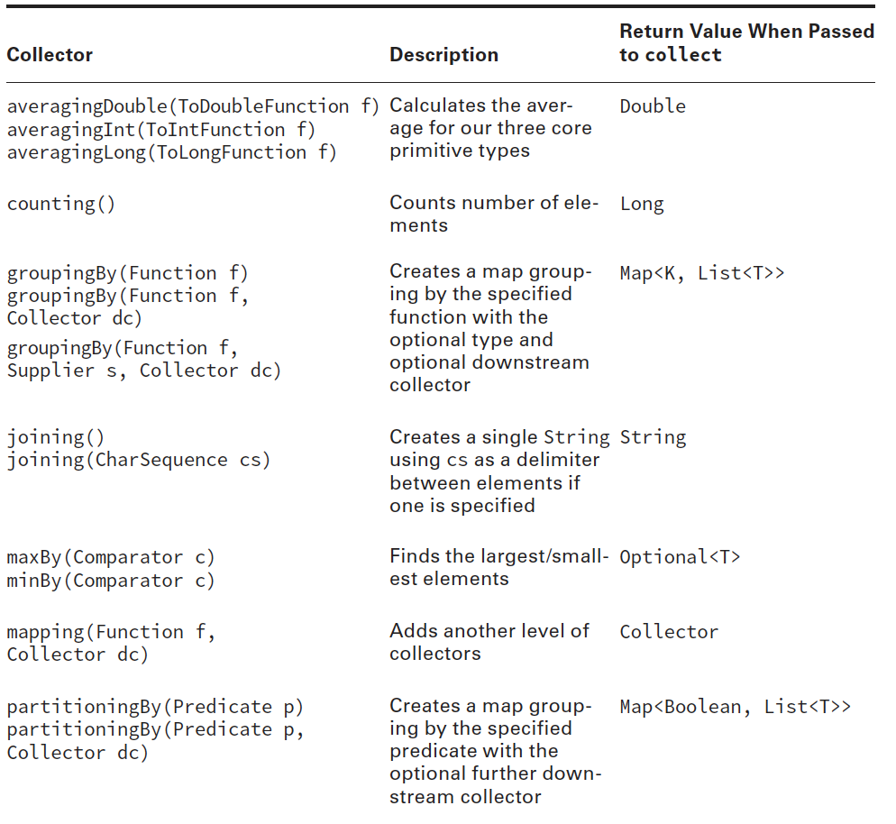
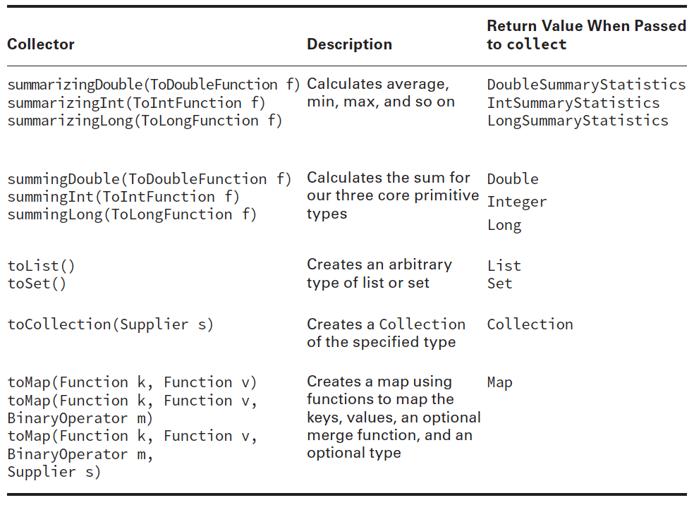

#### Collecting Using Basic Collectors

Luckily, many of these collectors work in the same way. Let’s look at an example:

````
Stream<String> ohMy = Stream.of("lions", "tigers", "bears");
String result = ohMy.collect(Collectors.joining(", "));
System.out.println(result); // lions, tigers, bears
````

Notice how the predefined collectors are in the Collectors class rather than the Collector
class. This is a common theme, which you saw with Collection vs. Collections. We pass the
predefined joining() collector to the collect() method. All elements of the stream are then
merged into a String with the specified delimiter between each element.

It is very important to pass the Collector to the collect method. It exists to help collect
elements. A Collector doesn’t do anything on its own.

Let’s try another one. What is the average length of the three animal names?

````
Stream<String> ohMy = Stream.of("lions", "tigers", "bears");
Double result = ohMy.collect(Collectors.averagingInt(String::length));
System.out.println(result); // 5.333333333333333
````

The pattern is the same. We pass a collector to collect() and it performs the average
for us. This time, we needed to pass a function to tell the collector what to average. We
used a method reference, which returns an int upon execution. With primitive streams,
the result of an average was always a double, regardless of what type is being averaged. For
collectors, it is a Double since those need an Object.

Often, you’ll find yourself interacting with code that was written prior to Java 8. This
means that it will expect a Collection type rather than a Stream type. No problem. You
can still express yourself using a Stream and then convert to a Collection at the end, for
example:

````
Stream<String> ohMy = Stream.of("lions", "tigers", "bears");
TreeSet<String> result = ohMy.filter(s -> s.startsWith("t")
    .collect(Collectors.toCollection(TreeSet::new));
System.out.println(result); // [tigers]
````

This time we have all three parts of the stream pipeline. Stream.of() is the source for
the stream. The intermediate operation is filter(). Finally, the terminal operation is collect(),
which creates a TreeSet. If we didn’t care which implement of Set we got, we
could have written Collectors.toSet() instead.

At this point, you should be able to use all of the Collectors in Table 4.11 except
groupingBy(), mapping(), partitioningBy(), and toMap().

#### Collecting into Maps

Collector code involving maps can get long. We will build it up slowly. Make sure that you
understand each example before going on to the next one. Let’s start out with a straightforward
example to create a map from a stream:

````
Stream<String> ohMy = Stream.of("lions", "tigers", "bears");
Map<String, Integer> map = ohMy.collect(
Collectors.toMap(s -> s, String::length));
System.out.println(map); // {lions=5, bears=5, tigers=6}
````

When creating a map, you need to specify two functions. The first function tells the
collector how to create the key. In our example, we use the provided String as the key.
The second function tells the collector how to create the value. In our example, we use the
length of the String as the value.

Returning the same value passed into a lambda is a common operation, so Java provides
a method for it. You can rewrite s -> s as Function.identity(). It is not shorter and may
or may not be clearer, so use your judgment on whether to use it.

Now we want to do the reverse and map the length of the animal name to the name
itself. Our first incorrect attempt is shown here:

````
Stream<String> ohMy = Stream.of("lions", "tigers", "bears");
Map<Integer, String> map = ohMy.collect(Collectors.toMap(String::length, k ->
k)); // BAD
````

Running this gives an exception similar to the following:

````
Exception in thread "main" java.lang.IllegalStateException: Duplicate key lions
at java.util.stream.Collectors.lambda$throwingMerger$114(Collectors.java:133)
at java.util.stream.Collectors$$Lambda$3/1044036744.apply(Unknown Source)
````

What’s wrong? Two of the animal names are the same length. We didn’t tell Java what to do.
Should the collector choose the first one it encounters? The last one it encounters? Concatenate
the two? Since the collector has no idea what to do, it “solves” the problem by throwing an
exception and making it our problem. How thoughtful. Let’s suppose that our requirement is to
create a comma-separated String with the animal names. We could write this:

````
Stream<String> ohMy = Stream.of("lions", "tigers", "bears");
Map<Integer, String> map = ohMy.collect(Collectors.toMap(
String::length, k -> k, (s1, s2) -> s1 + "," + s2));
System.out.println(map); // {5=lions,bears, 6=tigers}
System.out.println(map.getClass()); // class. java.util.HashMap
````

It so happens that the Map returned is a HashMap. This behavior is not guaranteed.
Suppose that we want to mandate that the code return a TreeMap instead. No problem. We
would just add a constructor reference as a parameter:

````
Stream<String> ohMy = Stream.of("lions", "tigers", "bears");
TreeMap<Integer, String> map = ohMy.collect(Collectors.toMap(
String::length, k -> k, (s1, s2) -> s1 + "," + s2, TreeMap::new));
System.out.println(map); // // {5=lions,bears, 6=tigers}
System.out.println(map.getClass()); // class. java.util.TreeMap
````

This time we got the type that we specified. With us so far? This code is long but not
particularly complicated. We did promise you that the code would be long!

#### Collecting Using Grouping, Partitioning, and Mapping

Now suppose that we want to get groups of names by their length. We can do that by saying
that we want to group by length:

````
Stream<String> ohMy = Stream.of("lions", "tigers", "bears");
Map<Integer, List<String>> map = ohMy.collect(
    Collectors.groupingBy(String::length));
System.out.println(map); // {5=[lions, bears], 6=[tigers]}
````

The groupingBy() collector tells collect() that it should group all of the elements of
the stream into lists, organizing them by the function provided. This makes the keys in the
map the function value and the values the function results.

Suppose that we don’t want a List as the value in the map and prefer a Set instead. No
problem. There’s another method signature that lets us pass a downstream collector. This is
a second collector that does something special with the values:

````
Stream<String> ohMy = Stream.of("lions", "tigers", "bears");
Map<Integer, Set<String>> map = ohMy.collect(
    Collectors.groupingBy(String::length, Collectors.toSet()));
System.out.println(map); // {5=[lions, bears], 6=[tigers]}
````

We can even change the type of Map returned through yet another parameter:

````
Stream<String> ohMy = Stream.of("lions", "tigers", "bears");
TreeMap<Integer, Set<String>> map = ohMy.collect(
    Collectors.groupingBy(String::length, TreeMap::new, Collectors.toSet()));
System.out.println(map); // {5=[lions, bears], 6=[tigers]}
````

This is very flexible. What if we want to change the type of Map returned but leave the
type of values alone as a List? There isn’t a method for this specifically because it is easy
enough to write with the existing ones:

````
Stream<String> ohMy = Stream.of("lions", "tigers", "bears");
TreeMap<Integer, List<String>> map = ohMy.collect(
    Collectors.groupingBy(String::length, TreeMap::new, Collectors.toList()));
System.out.println(map);
````

Partitioning is a special case of grouping. With partitioning, there are only two possible
groups—true and false. Partitioning is like splitting a list into two parts.

Suppose that we are making a sign to put outside each animal’s exhibit. We have two
sizes of signs. One can accommodate names with five or fewer characters. The other is
needed for longer names. We can partition the list according to which sign we need:

````
Stream<String> ohMy = Stream.of("lions", "tigers", "bears");
Map<Boolean, List<String>> map = ohMy.collect(
    Collectors.partitioningBy(s -> s.length() <= 5));
System.out.println(map); // {false=[tigers], true=[lions, bears]}
````

Here we passed a Predicate with the logic for which group each animal name belongs
in. Now suppose that we’ve figured out how to use a different font, and seven characters
can now fit on the smaller sign. No worries. We just change the Predicate:

````
Stream<String> ohMy = Stream.of("lions", "tigers", "bears");
Map<Boolean, List<String>> map = ohMy.collect(
    Collectors.partitioningBy(s -> s.length() <= 7));
System.out.println(map); // {false=[], true=[lions, tigers, bears]}
````

Notice that there are still two keys in the map—one for each boolean value. It so happens
that one of the values is an empty list, but it is still there. As with groupingBy(), we
can change the type of List to something else:

````
Stream<String> ohMy = Stream.of("lions", "tigers", "bears");
Map<Boolean, Set<String>> map = ohMy.collect(
    Collectors.partitioningBy(s -> s.length() <= 7, Collectors.toSet()));
System.out.println(map);// {false=[], true=[lions, tigers, bears]}
````

Unlike groupingBy(), we cannot change the type of Map that gets returned. However,
there are only two keys in the map, so does it really matter which Map type we use?

Instead of using the downstream collector to specify the type, we can use any of the
collectors that we’ve already shown. For example, we can group by the length of the animal
name to see how many of each length we have:

````
Stream<String> ohMy = Stream.of("lions", "tigers", "bears");
Map<Integer, Long> map = ohMy.collect(Collectors.groupingBy(
String::length, Collectors.counting()));
System.out.println(map); // {5=2, 6=1}
````

Finally, there is a mapping() collector that lets us go down a level and add another
collector. Suppose that we wanted to get the first letter of the first animal alphabetically of
each length. Why? Perhaps for random sampling. The examples on this part of the exam
are fairly contrived as well. We’d write the following:

````
Stream<String> ohMy = Stream.of("lions", "tigers", "bears");
Map<Integer, Optional<Character>> map = ohMy.collect(
Collectors.groupingBy(
    String::length,
    Collectors.mapping(s -> s.charAt(0),
        Collectors.minBy(Comparator.naturalOrder()))));
System.out.println(map); // {5=Optional[b], 6=Optional[t]}
````

We aren’t going to tell you that this code is easy to read. We will tell you that it is the
most complicated thing you should expect to see on the exam. Comparing it to the previous
example, you can see that we replaced counting() with mapping(). It so happens that mapping()
takes two parameters: the function for the value and how to group it further.
You might see collectors used with a static import to make the code shorter. This means
that you might see something like this:

````
Stream<String> ohMy = Stream.of("lions", "tigers", "bears");
Map<Integer, Optional<Character>> map = ohMy.collect(
    groupingBy(
        String::length,
        mapping(s -> s.charAt(0),
            minBy(Comparator.naturalOrder()))));
System.out.println(map); // {5=Optional[b], 6=Optional[t]}
````

The code does the same thing as in the previous example. This means that it is important
to recognize the collector names because you might not have the Collectors class
name to call your attention to it.