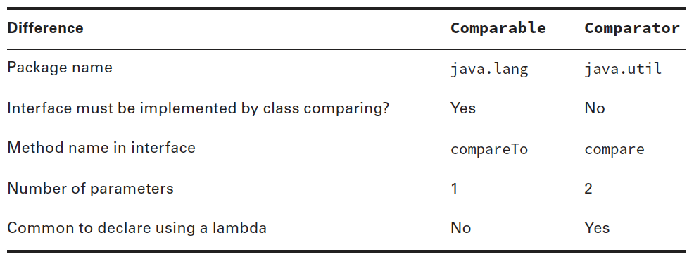
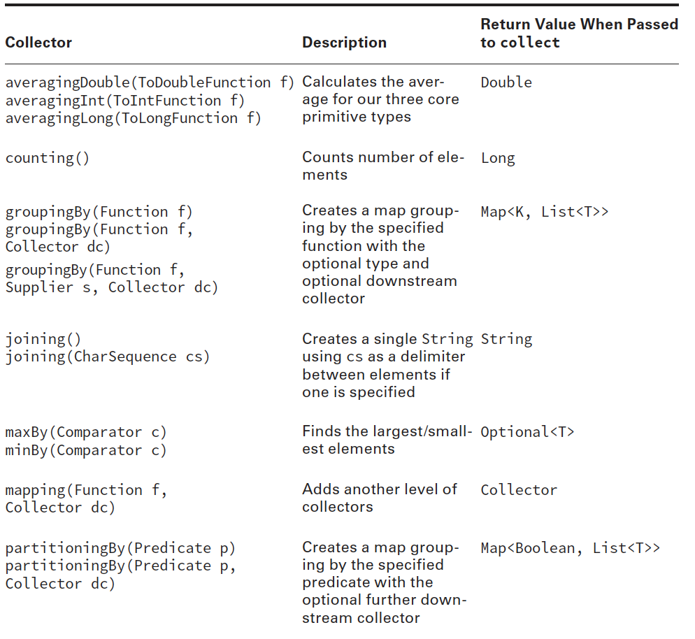
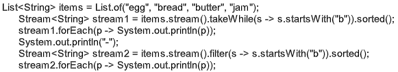
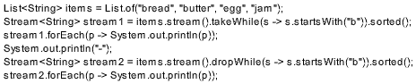

- [Using Streams](#using-streams)
  - [Creating Stream Sources](#creating-stream-sources)
  - [Using Common Terminal Operations](#using-common-terminal-operations)
    - [`forEach()`](#foreach)
    - [`reduce()`](#reduce)
    - [`collect()`](#collect)
  - [Using Common Intermediate Operations](#using-common-intermediate-operations)
    - [`filter()`](#filter)
    - [`distinct()`](#distinct)
    - [`limit()` and `skip()`](#limit-and-skip)
  - [Putting Together the Pipeline](#putting-together-the-pipeline)
- [4.1 - Extract stream data using map, peek and flatMap methods](#41---extract-stream-data-using-map-peek-and-flatmap-methods)
  - [`map()`](#map)
  - [`flatMap()`](#flatmap)
  - [`peek()`](#peek)
- [4.2 - Search stream data using search findFirst, findAny, anyMatch, allMatch and noneMatch methods](#42---search-stream-data-using-search-findfirst-findany-anymatch-allmatch-and-nonematch-methods)
  - [Java stream order of processing](#java-stream-order-of-processing)
  - [`findAny()` and `findFirst()`](#findany-and-findfirst)
  - [`anyMatch()`, `allMatch()` and `noneMatch()`](#anymatch-allmatch-and-nonematch)
- [4.3 - Use the Optional class](#43---use-the-optional-class)
    - [Summary of `Optional` unwrapping methods](#summary-of-optional-unwrapping-methods)
  - [Converting an `Optional` into a Stream](#converting-an-optional-into-a-stream)
    - [The `map()` and `flatMap()` in `Optional`](#the-map-and-flatmap-in-optional)
    - [The `or` method](#the-or-method)
- [4.4 - Perform calculations using count, max, min, average and sum stream operations](#44---perform-calculations-using-count-max-min-average-and-sum-stream-operations)
  - [`count()`](#count)
  - [`min()` and `max()`](#min-and-max)
- [4.5 - Sort a collection using lambda expressions](#45---sort-a-collection-using-lambda-expressions)
  - [`Comparator` vs. `Comparable`](#comparator-vs-comparable)
    - [`Comparable`](#comparable)
    - [`Comparator`](#comparator)
  - [Searching and Sorting](#searching-and-sorting)
  - [Sorting lists](#sorting-lists)
  - [Sorting maps](#sorting-maps)
  - [`sorted()`](#sorted)
- [4.6 - Use Collectors with streams, including the groupingBy and partitioningBy operation](#46---use-collectors-with-streams-including-the-groupingby-and-partitioningby-operation)
    - [Collecting Results](#collecting-results)
    - [Collecting Using Basic Collectors](#collecting-using-basic-collectors)
    - [Collecting into Maps](#collecting-into-maps)
    - [Collecting Using Grouping, Partitioning, and Mapping](#collecting-using-grouping-partitioning-and-mapping)
- [Quiz](#quiz)
- [Quiz Answers](#quiz-answers)

# Using Streams

A stream in Java is a sequence of data/elements from a source supporting sequential and parallel aggregate operations. A stream pipeline is the operations that run on a
stream to produce a result. Think of a stream pipeline as an assembly line in a factory.
Suppose that we were running an assembly line to make signs for the animal exhibits at
the zoo. We have a number of jobs. It is one person’s job to take signs out of a box. It is a second person’s job to paint the sign. It is a third person’s job to stencil the name of the animal on the sign. It is a fourth person’s job to put the completed sign in a box to be carried to the proper exhibit.

Notice that the second person can’t do anything until one sign has been taken out of the
box by the first person. Similarly, the third person can’t do anything until one sign has been painted, and the fourth person can’t do anything until it is stenciled.

The assembly line for making signs is finite. Once we process the contents of our box of
signs, we are finished. Finite streams have a limit. Other assembly lines essentially run forever, like one for food production. Of course, they do stop at some point when the factory closes down, but pretend that doesn’t happen. Or think of a sunrise/sunset cycle as infinite, since it doesn’t end for an inordinately large period of time.

Another important feature of an assembly line is that each person touches each element
to do their operation and then that piece of data is gone. It doesn’t come back. The next
person deals with it at that point. This is different to lists and queues. With a list, you can access any element at any time. With a queue, you are limited in which elements you can access, but all of the elements are there. With streams, the data isn’t generated up front—it is created when needed.

Many things can happen in the assembly line stations along the way. In programming,
these are called stream operations. Just like with the assembly line, operations occur in a
pipeline. Someone has to start and end the work, and there can be any number of stations
in between. After all, a job with one person isn’t an assembly line! There are three parts to a stream pipeline, as shown in Figure 4.2:

- Source: Where the stream comes from. The source typically refers to a Collection (e.g. `java.util.List`, `java.util.Set`) or an array which provides data to a Stream. The Stream keeps the order of the data as it is in the source.
- Zero or more intermediate operations: Transforms the stream into another one. There can be as few or as many intermediate operations as you’d like. Since streams use lazy evaluation, the intermediate operations do not run until the terminal operation runs.
- Terminal operation: Actually produces a result or side-effect. Since streams can be used only once, the stream is no longer valid after a terminal operation completes.

FIGURE 4.2 Stream pipeline


Notice that the intermediate operations are a black box. When viewing the assembly
line from the outside, you care only about what comes in and goes out. What happens in
between is an implementation detail.

TABLE 4.3 Intermediate vs. terminal operations


A factory typically has a foreman who oversees the work. Java serves as the foreman
when working with stream pipelines. This is a really important role, especially when
dealing with lazy evaluation and infinite streams. Think of declaring the stream as giving
instructions to the foreman. As the foreman finds out what needs to be done, he sets up the
stations and tells the workers what their duties will be. However, the workers do not start
until the foreman tells them to begin. The foreman waits until he sees the terminal operation
to actually kick off the work. He also watches the work and stops the line as soon as
work is complete.

Let’s look at a few examples of this. We aren’t using code in these examples because it
is really important to understand this stream pipeline concept before starting to write the
code. Figure 4.3 shows a stream pipeline with one intermediate operation. Let’s take a look
at what happens from the point of the view of the foreman. First, he sees that the source is
taking signs out of the box. The foreman sets up a worker at the table to unpack the box
and says to await a signal to start. Then the foreman sees the intermediate operation to
paint the sign. He sets up a worker with paint and says to await a signal to start. Finally,
the foreman sees the terminal operation to put the signs into a pile. He sets up a worker to
do this and yells out that all three workers should start.

FIGURE 4.3 Steps in running a stream pipeline


Suppose that there are two signs in the box. Step 1 is the first worker taking one sign out
of the box and handing it to the second worker. Step 2 is the second worker painting it and
handing it to the third worker. Step 3 is the third worker putting it in the pile. Steps 4–6
are this same process for the other sign. Then the foreman sees that there are no more signs
left and shuts down the entire enterprise.

The foreman is smart. He can make decisions about how to best do the work based on
what is needed. As an example, let’s explore the stream pipeline in Figure 4.4.

FIGURE 4.4 A stream pipeline with a limit


The foreman still sees a source of taking signs out of the box and assigns a worker to do
that on command. He still sees an intermediate operation to paint and sets up another worker
with instructions to wait and then paint. Then he sees an intermediate step that we need only two signs. He sets up a worker to count the signs that go by and notify him when the worker has seen two. Finally, he sets up a worker for the terminal operation to put the signs in a pile.

This time, suppose that there are 10 signs in the box. We start out like last time. The first sign makes its way down the pipeline. The second sign also makes its way down the pipeline. When the worker in charge of counting sees the second sign, she tells the foreman. The foreman lets the terminal operation worker finish her task and then yells out “stop the line.” It doesn’t matter that that there are eight more signs in the box. We don’t need them, so it would be unnecessary work to paint them. And we all want to avoid unnecessary work!

Similarly, the foreman would have stopped the line after the first sign if the terminal
operation was to find the first sign that gets created.

In the following sections, we will cover the three parts of the pipeline. We will also discuss special types of streams for primitives and how to print a stream.

## Creating Stream Sources

In Java, the Stream interface is in the java.util.stream package. There are a few ways to
create a finite stream:

````
1: Stream<String> empty = Stream.empty(); // count = 0
2: Stream<Integer> singleElement = Stream.of(1); // count = 1
3: Stream<Integer> fromArray = Stream.of(1, 2, 3); // count = 2
````

Line 1 shows how to create an empty stream. Line 2 shows how to create a stream with
a single element. Line 3 shows how to create a stream from an array. You’ve undoubtedly
noticed that there isn’t an array on line 3. The method signature uses varargs, which let you specify an array or individual elements. Since streams are new in Java 8, most code that’s already written uses lists. Java provides a convenient way to convert from a list to a stream:

````
4: List<String> list = Arrays.asList("a", "b", "c");
5: Stream<String> fromList = list.stream();
6: Stream<String> fromListParallel = list.parallelStream();
````

Line 5 shows that it is a simple method call to create a stream from a list. Line 6 does
the same, except that it creates a stream that is allowed to process elements in parallel. This is a great feature because you can write code that uses parallelism before even learning what a thread is. Using parallel streams is like setting up multiple tables of workers who are able to do the same task. Painting would be a lot faster if we could have five painters painting different signs at once. Just keep in mind that it isn’t worth working in parallel for small streams. There is an overhead cost in coordinating the work among all of the workers operating in parallel. For small amounts of work, it is faster just to do it sequentially.

So far, this isn’t particularly impressive. We could do all this with lists. We can’t create
an infinite list, though, which makes streams more powerful:

````
7: Stream<Double> randoms = Stream.generate(Math::random);
8: Stream<Integer> oddNumbers = Stream.iterate(1, n -> n + 2);
````

Line 7 generates a stream of random numbers. How many random numbers? However many you need. If you call `randoms.forEach(System.out::println)`, the program will print random numbers until you kill it. Later in the chapter, you’ll learn about operations like `limit()` to turn the infinite stream into a finite stream.

Line 8 gives you more control. `iterate()` takes a seed or starting value as the first
parameter. This is the first element that will be part of the stream. The other parameter is a lambda expression that gets passed the previous value and generates the next value. As with
the random numbers example, it will keep on producing odd numbers as long as you need
them.

 _Note: If you try to call `System.out.println(stream)`, you’ll get something like `java.util.stream.ReferencePipeline$3@4517d9a3`. This is different than a Collection where you see the contents. You don’t need to know this for the exam. We mention it so that you aren’t caught by surprise when writingcode for practice._

## Using Common Terminal Operations

You can perform a terminal operation without any intermediate operations but not the
other way around. This is why we will talk about terminal operations first. Terminal operations are Stream API operations that returns a result or produce a side effect. Once the terminal method is called on a stream, it consumes the stream and after that we can not use stream. Terminal operations are eager in nature i.e. they process all the elements (unless it's a short-circuiting terminal operation) in the stream before returning the result. You can identify terminal methods from the return type, **they will never return a `Stream`**.

Reductions are
a special type of terminal operation where all of the contents of the stream are combined
into a single primitive or `Object`. For example, you might have an `int` or a Collection.

TABLE 4.4 Terminal stream operations


### `forEach()`

A looping construct is available. As expected, calling `forEach()` on an infinite stream does
not terminate. Since there is no return value, it is not a reduction.

Before you use it, consider if another approach would be better. Developers who learned
to write loops first tend to use them for everything. For example, a loop with an `if` statement
should be a filter instead.

The method signature is the following:

`void forEach(Consumer<? super T> action)`

Notice that this is the only terminal operation with a return type of void. If you
want something to happen, you have to make it happen in the loop. Here’s one way
to print the elements in the stream. There are other ways, which we cover later in the
chapter.

````
Stream<String> s = Stream.of("Monkey", "Gorilla", "Bonobo");
s.forEach(System.out::print); // MonkeyGorillaBonobo
````

 _Note: Remember that you can call `forEach()` directly on a `Collection` or on a `Stream`. Don’t get confused on the exam when you see both approaches._

Notice that you can’t use a traditional for loop on a stream:

````
Stream s = Stream.of(1);
for (Integer i: s) {} // DOES NOT COMPILE
````

While `forEach()` sounds like a loop, it is really a terminal operator for streams. Streams
cannot use a traditional for loop to run because they don’t implement the `Iterable` interface.

### `reduce()`

The `reduce()` method combines a stream into a single object. As you can tell from the
name, it is a reduction. The method signatures are these:

````
T reduce(T identity, BinaryOperator<T> accumulator)
Optional<T> reduce(BinaryOperator<T> accumulator)
<U> U reduce(U identity, BiFunction<U,? super T,U> accumulator,
    BinaryOperator<U> combiner)
````

Let’s take them one at a time. The most common way of doing a reduction is to start
with an initial value and keep merging it with the next value. Think about how you would
concatenate an array of String s into a single String without functional programming. It
might look something like this:

````
String[] array = new String[] { "w", "o", "l", "f" };
String result = "";
for (String s: array) result = result + s;
System.out.println(result);
````

The initial value of an empty `String` is the identity. The accumulator combines the current
result with the current `String`. With lambdas, we can do the same thing with a stream
and reduction:

````
Stream<String> stream = Stream.of("w", "o", "l", "f");
String word = stream.reduce("", (s, c) -> s + c);
System.out.println(word); // wolf
````

Notice how we still have the empty String as the identity. We also still concatenate the
String `s` to get the next value. We can even rewrite this with a method reference:

````
Stream<String> stream = Stream.of("w", "o", "l", "f");
String word = stream.reduce("", String::concat);
System.out.println(word); // wolf
````

Let’s try another one. Can you write a reduction to multiply all of the Integer objects in
a stream? Try it. Our solution is shown here:

````
Stream<Integer> stream = Stream.of(3, 5, 6);
System.out.println(stream.reduce(1, (a, b) -> a*b));
````

We set the identity to 1 and the accumulator to multiplication. In many cases, the identity
isn’t really necessary, so Java lets us omit it. When you don’t specify an identity, an
`Optional` is returned because there might not be any data. There are three choices for what
is in the `Optional`:

- If the stream is empty, an empty `Optional` is returned.
- If the stream has one element, it is returned.
- If the stream has multiple elements, the accumulator is applied to combine them.

The following illustrates each of these scenarios:

````
BinaryOperator<Integer> op = (a, b) -> a * b;
Stream<Integer> empty = Stream.empty();
Stream<Integer> oneElement = Stream.of(3);
Stream<Integer> threeElements = Stream.of(3, 5, 6);
empty.reduce(op).ifPresent(System.out::print); // no output
oneElement.reduce(op).ifPresent(System.out::print); // 3
threeElements.reduce(op).ifPresent(System.out::print); // 90
````

Why are there two similar methods? Why not just always require the identity? Java
could have done that. However, sometimes it is nice to differentiate the case where the
stream is empty rather than the case where there is a value that happens to match the identity being returned from calculation. The signature returning an `Optional` lets us differentiate
these cases. For example, we might return `Optional.empty()` when the stream is empty
and `Optional.of(3)` when there is a value.

The third method signature is used when we are processing collections in parallel. It
allows Java to create intermediate reductions and then combine them at the end. In our
example, it looks similar. While we aren’t actually using a parallel stream here, Java
assumes that a stream might be parallel. This is helpful because it lets us switch to a parallel stream easily in the future:

````
BinaryOperator<Integer> op = (a, b) -> a * b;
Stream<Integer> stream = Stream.of(3, 5, 6);
System.out.println(stream.reduce(1, op, op)); // 90
````

### `collect()`

The `collect()` method is a terminal operation and a special type of reduction called a _mutable reduction_. It is more efficient than a regular reduction because we use the same mutable object while accumulating. Common mutable objects include `StringBuilder` and `ArrayList`. This is a really useful method, because it lets us get data out of streams and into another form. The method signatures are as follows:

````
<R> R collect(Supplier<R> supplier, BiConsumer<R, ? super T> accumulator, BiConsumer<R, R> combiner);
<R,A> R collect(Collector<? super T, A,R> collector);
````

Let’s start with the first signature, which is used when we want to code specifically how
collecting should work. Our wolf example from reduce can be converted to use `collect()`:

````
Stream<String> stream = Stream.of("w", "o", "l", "f");
StringBuilder word = stream.collect(StringBuilder::new, StringBuilder::append, StringBuilder:append)
````

The first parameter is a `Supplier` that creates the object that will store the results as we collect data. Remember that a `Supplier` doesn’t take any parameters and returns a value.
In this case, it constructs a new `StringBuilder`.

The second parameter is a `BiConsumer`, which takes two parameters and doesn’t return
anything. It is responsible for adding one more element to the data collection. In this example, it appends the next String to the `StringBuilder`.

The final parameter is another `BiConsumer`. It is responsible for taking two data collections and merging them. This is useful when we are processing in parallel. Two smaller
collections are formed and then merged into one. This would work with `StringBuilder`
only if we didn’t care about the order of the letters. In this case, the accumulator and combiner have similar logic.

Now let’s look at an example where the logic is different in the accumulator and
combiner:

````
Stream<String> stream = Stream.of("w", "o", "l", "f");
TreeSet<String> set = stream.collect(TreeSet::new, TreeSet::add, TreeSet::addAll);
System.out.println(set); // [f, l, o, w]
````

The collector has three parts as before. The supplier creates an empty `TreeSet`. The
accumulator adds a single `String` from the Stream to the `TreeSet`. The combiner adds all
of the elements of one `TreeSet` to another in case the operations were done in parallel and
need to be merged.

We started with the long signature because that’s how you implement your own
collector. It is important to know how to do this for the exam and to understand how
collectors work. 

The second signature, `<R,A> R collect(Collector<? super T, A,R> collector)` accepts a `Collector` interface which consists of several operations including: `supplier()`, `accumulator()`, a `combiner()`, and `finisher()`:

````
public interface Collector<T, A, R> {
    Supplier<A> supplier();

    BiConsumer<A, T> accumulator();

    BinaryOperator<A> combiner();

    Function<A, R> finisher();

    ...

}
````

Java 11 supports various built-in collectors via the `java.util.stream.Collectors` `final` class. So for the most common operations you do not have to implement a `Collector` yourself. Rather than making developers keep reimplementing the same ones, Java provides
an interface with common collectors. This approach also makes the code easier to read
because it is more expressive. For example, we could rewrite the previous example as
follows:

````
Stream<String> stream = Stream.of("w", "o", "l", "f");
TreeSet<String> set = stream.collect(Collectors.toCollection(TreeSet::new));
System.out.println(set); // [f, l, o, w]
````

If we didn’t need the set to be sorted, we could make the code even shorter:

````
Stream<String> stream = Stream.of("w", "o", "l", "f");
Set<String> set = stream.collect(Collectors.toSet());
System.out.println(set); // [f, w, l, o]
````

You might get different output for this last one since `toSet()` makes no guarantees as
to which implementation of `Set` you’ll get. It is likely to be a `HashSet`, but you shouldn’t expect or rely on that.

 _Note: The exam expects you to know about common predefined collectors in
addition to being able to write your own by passing a supplier, accumulator,
and combiner._

## Using Common Intermediate Operations

Stream API operations that returns a new `java.util.stream.Stream` are called intermediate operations. Most of the times, these operations are lazy in nature, computation on the source data is only performed when the terminal operation is initiated, and source elements are consumed only as needed. Intermediate operations are never the final result producing operations.

Unlike a terminal operation, intermediate operations deal with infinite streams simply by
returning an infinite stream. Since elements are produced only as needed, this works fine.
The assembly line worker doesn’t need to worry about how many more elements are coming
through and instead can focus on the current element.

### `filter()`

The `filter()` method returns a Stream with elements that match a given expression. Here
is the method signature:

`Stream<T> filter(Predicate<? super T> predicate)`

This operation is easy to remember and very powerful because we can pass any
`Predicate` to it. The `Predicate` interface takes a single parameter and returns a `boolean` primitive. For example, this filters all elements that begin with the letter `m`:

````
Stream<String> s = Stream.of("monkey", "gorilla", "bonobo");
s.filter(x -> x.startsWith("m")).forEach(System.out::print); // monkey
````

When you call the `filter()` method on a Stream, the filter passed as parameter to the `filter()` method is stored internally. No filtering takes place yet (lazy processing).

The parameter passed to the `filter()` function determines what items in the stream should be processed, and which that should be excluded from the processing, i.e. if the `Predicate.test(T t)` method of the parameter passed to `filter()` returns `true` for an item, that means it should be processed. If `false` is returned, the item is not processed.

### `distinct()`

The `distinct()` method returns a stream with duplicate values removed. The duplicates do
not need to be adjacent to be removed. As you might imagine, Java calls the `equals()` method of the `Object` class to determine whether the objects are the same. The method signature is as follows:

`Stream<T> distinct()`

Here’s some examples:

````
Stream<String> s = Stream.of("duck", "duck", "duck", "goose");
s.distinct().forEach(System.out::print); // duckgoose
````

````
List<String> list = Arrays.asList("aA","AA","Aa", "Aa", "AA");
long l = list.stream().distinct().count();
System.out.println("Number of distinct elements : " + l); // Number of distinct elements : 3
````

### `limit()` and `skip()`

The `limit()` and `skip()` methods make a Stream smaller. They could make a finite stream
smaller, or they could make a finite stream out of an infinite stream. The method signatures
are shown here:

````
Stream<T> limit(int maxSize)
Stream<T> skip(int n)
````

The following code creates an infinite stream of numbers counting from 1. The `skip()`
operation returns an infinite stream starting with the numbers counting from 6, since it
skips the first five elements. The `limit()` call takes the first two of those. Now we have a
finite stream with two elements:

````
Stream<Integer> s = Stream.iterate(1, n -> n + 1);
s.skip(5).limit(2).forEach(System.out::print); // 67
````

## Putting Together the Pipeline

Streams allow you to use chaining and express what you want to accomplish rather than
how to do so. Let’s say that we wanted to get the first two names alphabetically that are
four characters long. In Java 7, we’d have to write something like the following:

````
List<String> list = Arrays.asList("Toby", "Anna", "Leroy", "Alex");
List<String> filtered = new ArrayList<>();
for (String name: list) {
    if (name.length() == 4) filtered.add(name);
}
Collections.sort(filtered);
Iterator<String> iter = filtered.iterator();
if (iter.hasNext()) System.out.println(iter.next());
if (iter.hasNext()) System.out.println(iter.next());
````

This works. It takes some reading and thinking to figure out what is going on. The problem
we are trying to solve gets lost in the implementation. It is also very focused on the how
rather than on the what. In Java 8, the equivalent code is as follows:

````
List<String> list = Arrays.asList("Toby", "Anna", "Leroy", "Alex");
list.stream().filter(n -> n.length() == 4).sorted()
    .limit(2).forEach(System.out::println);
````

Before you say that it is harder to read, we can format it:

````
stream.filter(n -> n.length() == 4)
    .sorted()
    .limit(2)
    .forEach(System.out::println);
````

The difference is that we express what is going on. We care about `String` objects of
length `4`. Then we then want them sorted. Then we want to first two. Then we want to
print them out. It maps better to the problem that we are trying to solve, and it is simpler
because we don’t have to deal with counters and such.

Once you start using streams in your code, you may find yourself using them in many
places. Having shorter, briefer, and clearer code is definitely a good thing!

In this example, you see all three parts of the pipeline. Figure 4.5 shows how each intermediate operation in the pipeline feeds into the next.

FIGURE 4.5 Stream pipeline with multiple intermediate operations


Remember that the assembly line foreman is figuring out how to best implement the
stream pipeline. He sets up all of the tables with instructions to wait before starting. He
tells the `limit()` worker to inform him when two elements go by. He tells the `sorted()`
worker that she should just collect all of the elements as they come in and sort them all at
once. After sorting, she should start passing them to the `limit()` worker one at a time. The
data flow looks like this:

1. `stream()` sends Toby to `filter()`. `filter()` sees that the length is good and sends Toby
to `sorted()`. `sorted()` can’t sort yet because it needs all of the data, so it holds Toby.
1. `stream()` sends Anna to `filter()`. `filter()` sees that the length is good and sends Anna
to `sorted()`. `sorted()` can’t sort yet because it needs all of the data, so it holds Anna.
1. `stream()` sends Leroy to `filter()`. `filter()` sees that the length is not a match, and it
takes Leroy out of the assembly line processing.
1. `stream()` sends Alex to `filter()`. `filter()` sees that the length is good and sends Alex
to `sorted()`. `sorted()` can’t sort yet because it needs all of the data, so it holds Alex. It
turns out `sorted()` does have all of the required data, but it doesn’t know it yet.
1. The foreman lets `sorted()` know that it is time to sort and the sort occurs.
1. `sorted()` sends Alex to `limit()`. `limit()` remembers that it has seen one element and
sends Alex to `forEach()`, printing Alex.
1. `sorted()` sends Anna to `limit()`. `limit()` remembers that it has seen two elements
and sends Anna to `forEach()`, printing Anna.
1. `limit()` has now seen all of the elements that are needed and tells the foreman. The
foreman stops the line, and no more processing occurs in the pipeline.

Make sense? Let’s try two more examples to make sure that you understand this well.
What do you think the following does?

````
Stream.generate(() -> "Elsa")
    .filter(n -> n.length() == 4)
    .sorted()
    .limit(2)
    .forEach(System.out::println);
````

It actually hangs until you kill the program or it throws an exception after running out
of memory. The foreman has instructed `sorted()` to wait until everything to sort is present.
That never happens because there is an infinite stream. What about this example?

````
Stream.generate(() -> "Elsa")
    .filter(n -> n.length() == 4)
    .limit(2)
    .sorted()
    .forEach(System.out::println);
````

This one prints Elsa twice. The filter lets elements through and `limit()` stops the earlier
operations after two elements. Now `sorted()` can sort because we have a finite list. Finally,
what do you think this does?

````
Stream.generate(() -> "Olaf Lazisson")
    .filter(n -> n.length() == 4)
    .limit(2)
    .sorted()
    .forEach(System.out::println);
````

This one hangs as well until we kill the program. The filter doesn’t allow anything
through, so `limit()` never sees two elements. This means that we have to keep waiting and
hope that they show up.

# 4.1 - Extract stream data using map, peek and flatMap methods

## `map()`

The `map()` method creates a one-to-one mapping from the elements in the stream to the elements of the next step in the stream. The method signature is as follows:

`<R> Stream<R> map(Function<? super T, ? extends R> mapper)`

This one looks more complicated than the others you have seen. It uses the lambda
expression to figure out the type passed to that function and the one returned. The return
type is the stream that gets returned. In other words, for each item in the collection you create a new object based on that item. 

 _Note: `map()` on its own does not actually perform the mapping (all intermediate operations are lazy). It only configures the stream for mapping. Once one of the stream processing methods are invoked, the mapping will be performed.

As an example, this code converts a list of `String` objects to a list of `Integer`s representing their lengths:

````
Stream<String> s = Stream.of("monkey", "gorilla", "bonobo");
s.map(String::length).forEach(System.out::print); // 676
````

Remember that `String::length` is shorthand for the lambda `x -> x.length()`, which
clearly shows it is a function that turns a `String` into an `Integer`.

## `flatMap()`

The `flatMap()` method takes each element in the stream and makes any elements it contains top-level elements in a single stream. This is helpful when you want to remove empty elements from a stream or you want to combine a stream of lists. 

`<R> Stream<R> flatMap(Function<? super T, ? extends Stream<? extends R>> mapper)`

The `Stream.flatMap()` method returns a stream consisting of the results of replacing each element of this stream with the contents of a mapped stream produced by applying the provided mapping function to each element. The function produces a stream for each input element and the output streams are flattened. Basically, it returns a `Stream` of the type that the function contains at a lower level.

This example gets all of the animals into the same level along with getting rid of the empty list:

````
List<String> zero = Arrays.asList();
List<String> one = Arrays.asList("Bonobo");
List<String> two = Arrays.asList("Mama Gorilla", "Baby Gorilla");
Stream<List<String>> animals = Stream.of(zero, one, two);

animals.flatMap(l -> l.stream()).forEach(System.out::println);
````

Here’s the output:

````
Bonobo
Mama Gorilla
Baby Gorilla
````

It removed the empty list completely and changed all elements of each list to be at the top-level of the stream.

The `flatMap()` operation works as follows:

- It takes an input stream and produces an output stream using a mapping function.
- The mapping function takes an element from the input stream and maps the element to a stream. The type of input element and the elements in the mapped stream may be different. This step produces a stream of streams. Suppose the input stream is a `Stream<T>` and the mapped stream is `Stream<Stream<R>>` where `T` and `R` may be the same or different.
- Finally, it flattens the output stream (that is, a stream of streams) to produce a stream. That is, the `Stream<Stream<R>>` is flattened to `Stream<R>`.

So, in the example we replaced the `List<String>` with a `Stream<String>` using the `stream()` method, and `flatMap` does the rest. The `flatMap`'s associated functional interface is the same as `map`'s — the `Function` — but its return type is restricted to streams and not any value.

The `flatMap()` transforms each element of a stream into another form (just like `map()`), and generates sub-streams of the newly formed elements. Finally, it flattens all of the sub-streams into a single stream of elements. As the `flatMap()` is a map type of function, it also takes a function and applies (maps) that function to each of the element in the stream.

The difference between `map()` and `flatMap()` is:

- The `map()` accepts a function that returns a mapped element and then the `map()` function returns a stream of such elements (1 to 1).
- The `flatMap` accepts a function that returns streams of the mapped elements and then the `flatMap` finally returns a collective stream of all of the sub-streams that are created by the each execution of the passed function (1 to 0...n).

## `peek()`

The `peek()` method is an intermediate operation. It is useful for debugging because it
allows us to perform a stream operation without actually changing the stream. `Stream.peek()` returns the Stream itself after applying the action passed as a `Consumer` object. The method signature is as follows:

`Stream<T> peek(Consumer<? super T> action)`

The most common use for `peek()` is to output the contents of the stream as it goes by.
Suppose that we made a typo and counted bears beginning with the letter `g` instead of `b`.
We are puzzled why the count is `1` instead of `2`. We can add a `peek()` to find out why:

````
Stream<String> stream = Stream.of("black bear", "brown bear", "grizzly");
long count = stream.filter(s -> s.startsWith("g"))
    .peek(System.out::println).count(); // grizzly
System.out.println(count); // 1
````

 _Note: When working with a `Queue`, `peek()` looks only at the first element. In a stream, `peek()` looks at each element that goes through that part of the stream pipeline. It’s like having a worker take notes on how a particular step of the process is doing._

Here is a second example:

````
Stream<String> words = Stream.of("lower", "case", "text");
List<String> list = words
    .peek(s -> System.out.println(s))
    .map(s -> s.toUpperCase())
    .collect(Collectors.toList());
System.out.println(list);
````

This outputs:

````
lower
case
text
[LOWER, CASE, TEXT]
````

# 4.2 - Search stream data using search findFirst, findAny, anyMatch, allMatch and noneMatch methods

## Java stream order of processing

Streams may or may not have a defined encounter order. Whether or not a stream has an encounter order depends on the source and the intermediate operations. Certain stream sources (such as `java.util.List` or arrays) are intrinsically ordered, whereas others (such as `java.util.HashSet`) are not. Some intermediate operations, such as `sorted()`, may impose an encounter order on an otherwise unordered stream, and others may render an ordered stream unordered, such as `BaseStream.unordered()`. Further, some terminal operations may ignore encounter order, such as `forEach()`.

If a stream is ordered, most operations are constrained to operate on the elements in their encounter order; if the source of a stream is a `List` containing `[1, 2, 3]`, then the result of executing `map(x -> x*2)` must be `[2, 4, 6]`.

````
List<Integer> ints = List.of(1, 2, 3);
Stream<Integer> str = ints.stream();
Spliterator<Integer> spl = str.spliterator();
System.out.print(spl.hasCharacteristics(Spliterator.ORDERED)); // true
````

However, if the source has no defined encounter order, then any permutation of the values `[2, 4, 6]` would be a valid result.

````
HashSet<Integer> ints = new HashSet<>();
ints.add(1); ints.add(2); ints.add(3);
Stream<Integer> str = ints.stream();
Spliterator<Integer> spl = str.spliterator();
System.out.print(spl.hasCharacteristics(Spliterator.ORDERED)); // false
````

For sequential streams, the presence or absence of an encounter order does not affect performance, only determinism. If a stream is ordered, repeated execution of identical stream pipelines on an identical source will produce an identical result; if it is not ordered, repeated execution might produce different results.

For parallel streams, relaxing the ordering constraint can sometimes enable more efficient execution.

## `findAny()` and `findFirst()`

The `findAny()` and `findFirst()` methods return an element of the stream unless the stream is empty. If the stream is empty, they return an empty `Optional`. 

````
Optional<T> findAny();
Optional<T> findFirst();
````

These methods work with an infinite stream. Since Java generates only the amount of stream you need, the infinite stream needs to generate only one element. This means it is a **short circuit terminal operation**. A short circuit terminal operation potentially allows processing of a stream to stop early without examining all the elements.

The stream pipeline will be optimized behind the scenes to perform a single pass and finish as soon as a result is found by using short-circuiting.

The method `findFirst()` provides the first element from the stream. It will return first element from stream and then will not process any further elements.

For example, given a list of integers, finds the first number that is divisible by 7:

````
List<Integer> ints = List.of(1, 6, 22, 21, 35, 36);
Optional<Integer> result = ints.stream().filter(i -> i % 7 == 0).findFirst();
result.ifPresentOrElse(System.out::print, () -> System.out.print("No results found"));
````

`findAny()` is useful when you are working with a parallel stream. It gives Java the flexibility to return to you the first element it comes by rather than the one that needs to be first in the stream based on the intermediate operations.

This example finds an animal:

````
Stream<String> s = Stream.of("monkey", "gorilla", "bonobo");
Stream<String> infinite = Stream.generate(() -> "chimp");
s.findAny().ifPresent(System.out::println); // monkey
infinite.findAny().ifPresent(System.out::println); // chimp
````

**No effort will be made to randomize the element returned**, it just does not give the same guarantees as `findFirst()`, and might therefore be faster.

The behavior of `findAny()` operation is explicitly nondeterministic; it is free to select any element in the stream. This is to allow for maximal performance in parallel operations; the cost is that multiple invocations on the same source may not return the same result. If a stable result is desired, use `findFirst()` instead.

These methods are terminal operations but not reductions. The reason is that they sometimes return without processing all of the elements. This means that they return a value based on the stream but do not reduce the entire stream into one value.

## `anyMatch()`, `allMatch()` and `noneMatch()`

The `anyMatch()`, `allMatch()` and `noneMatch()` methods search a stream and return information about how the stream pertains to the predicate. These may or may not terminate for infinite streams. It depends on the data. Like the find methods, they are not reductions
because they do not necessarily look at all of the elements. The method signatures are as follows:

````
boolean anyMatch(Predicate <? super T> predicate)
boolean allMatch(Predicate <? super T> predicate)
boolean noneMatch(Predicate <? super T> predicate)
````

This example checks whether animal names begin with letters:

````
List<String> list = Arrays.asList("monkey", "2", "chimp");
Stream<String> infinite = Stream.generate(() -> "chimp");
Predicate<String> pred = x -> Character.isLetter(x.charAt(0));
System.out.println(list.stream().anyMatch(pred)); // true
System.out.println(list.stream().allMatch(pred)); // false
System.out.println(list.stream().noneMatch(pred)); // false
System.out.println(infinite.anyMatch(pred)); // true
````

This shows that we can reuse the same predicate, but we need a different stream each time. `anyMatch()` returns true because two of the three elements match. `allMatch()` returns false because one doesn’t match. `noneMatch()` also returns false because one matches. On the infinite list, one match is found, so the call terminates. If we called `noneMatch()` or `allMatch()`, they would run until we killed the program.

 _Note: Remember that `anyMatch()`, `allMatch()`, and `noneMatch()` return a boolean. 
By contrast, the find methods return an `Optional` because they return an element of the stream._

Remember:

- All `findXxx()` methods have no arguments and return `Optional`.
- All `xxxMatch(...)` methods accept a `Predicate` and return a `boolean` primitive.

	
Some operations do not need to process the whole stream to produce a result. For example, you need to evaluate a large `boolean` expression chained with "`&&`" operators. You need only find out that one expression is `false` to deduce that the whole expression will return `false`, no matter how long the expression is; there is no need to evaluate the entire expression. This is what short-circuiting refers to.

In relation to streams, operations `anyMatch(...)`, `allMatch(...)`, `noneMatch(...)`, `findFirst()`, and `findAny()` do not need to process the whole stream to produce a result. As soon as an element is found, a result can be produced. These are **short-circuiting terminal operations**.

# 4.3 - Use the Optional class

A `java.util.Optional<T>` object is either a wrapper for an `Object` of type `T` or a wrapper for no object. It is intended as a safer alternative than a reference of type `T` that refers to an `Object` or null.

Following is the declaration for `java.util.Optional<T>` class:

````
public final class Optional<T> extends Object {
    ...
}
````

Suppose that you are taking an introductory Java class and receive scores of `90` and `100` on the first two exams. Now, we ask you what your average is. An average is calculated by adding the scores and dividing by the number of scores, so you have `(90+100)/2`. This gives
`190/2`, so you answer with `95`. Great!

Now suppose that you are taking your second class on Java, and it is the first day of class. We ask you what your average is in this class that just started. You haven’t taken any exams yet, so you don’t have anything to average. It wouldn’t be accurate to say that your
average is zero. That sounds bad, and it isn’t true. There simply isn’t any data, so you don’t have an average yet.

How do we express this “we don’t know” or “not applicable” answer in Java? Starting with Java 8, we use the `Optional` type. An `Optional` is created using a factory. You can either request an empty `Optional` or pass a value for the `Optional` to wrap. Think of an
`Optional` as a box that might have something in it or might instead be empty. The figure below shows both options.


Here’s how to code our average method:

````
10: public static Optional<Double> average(int… scores) {
11:     if (scores.length == 0) return Optional.empty();
12:     int sum = 0;
13:     for (int score: scores) sum += score;
14:     return Optional.of((double) sum / scores.length);
15: }
````

Line 11 returns an **Empty `Optional`** (using the `static` factory method `Optional.empty()`) when we can’t calculate an average. Lines 12 and 13 add up the scores. There is a functional programming way of doing this math, but we will get to that later. In fact, the entire method could be written in one line, but that wouldn’t teach you how `Optional` works! Line 14 creates an `Optional` to wrap the average from a **non-null value** with the `static` factory method `Optional.of(...)`.

Calling the method shows what is in our two boxes:

````
System.out.println(average(90, 100)); // Optional[95.0]
System.out.println(average()); // Optional.empty
````

You can see that one `Optional` contains a value and the other is empty. Normally, we want to check if a value is there and/or get it out of the box. Here’s one way to do that:

````
20: Optional<Double> opt = average(90, 100);
21: if (opt.isPresent())
22:     System.out.println(opt.get()); // 95.0
````

Line 21 checks whether the `Optional` actually contains a value. Line 22 prints it out. What if we didn’t do the check and the `Optional` was empty?

````
26: Optional<Double> opt = average();
27: System.out.println(opt.get()); // bad
````

We’d get an exception since there is no value inside the `Optional`:

`java.util.NoSuchElementException: No value present`

When creating an `Optional`, it is common to want to use empty when the value is `null`. You can do this with an `if` statement or ternary operator.

`Optional o = (value== null) ? Optional.empty(): Optional.of(value);`

If value is `null`, `o` is assigned the empty `Optional`. Otherwise, we wrap the value. Since this is such a common pattern, Java provides the `static` factory method `Optional.ofNullable(...)`, with which you can create an `Optional` object that may hold a **`null`able value**:

`Optional o = Optional.ofNullable(value);`

That covers the `static` methods you need to know about `Optional`. The table below summarizes most of the instance methods on `Optional` that you need to know for the exam. There are a few others that involve chaining. We will cover those later in the chapter.


You’ve already seen `get()` and `isPresent()`. The other methods allow you to write code that uses an `Optional` in one line without having to use the ternary operator. This makes the code easier to read. Instead of using an `if` statement, which we used when checking the average earlier, we can specify a `Consumer` to be run when there is a value inside the `Optional`. When there isn’t, the method simply skips running the `Consumer`:

````
Optional<Double> opt = average(90, 100);
opt.ifPresent(System.out::println);
````

Using `ifPresent()` better expresses our intent. We want something done if a value is present. The other methods allow you to specify what to do if a value isn’t present. There are three choices:

````
30: Optional<Double> opt = average();
31: System.out.println(opt.orElse(Double.NaN));
32: System.out.println(opt.orElseGet(() -> Math.random()));
33: System.out.println(opt.orElseThrow(() -> new IllegalStateException()));
````

This prints something like the following:

````
NaN
0.49775932295380165
Exception in thread "main" java.lang.IllegalStateException
at optional.Average.lambda$3(Average.java:56)
at optional.Average$$Lambda$5/455659002.get(Unknown Source)
at java.util.Optional.orElseThrow(Optional.java:290)
````

Line 31 shows that you can return a specific value or variable. In our case, we print the “not a number” value. Line 32 shows using a `Supplier` to generate a value at runtime to return instead. I’m glad our professors didn’t give us a random average though! Line 33
shows using a different `Supplier` to create an exception that should be thrown. Remember that the stack trace looks weird because the lambdas are generated rather than named classes.

Notice that the two methods that take a `Supplier` have different names. Do you see why this code does not compile?

````
System.out.println(opt.orElseGet(
    () -> new IllegalStateException())); // DOES NOT COMPILE
````

`opt` is an `Optional<Double>`. This means the `Supplier` must return a `Double`. Since this supplier returns an exception, the type does not match. The last example with `Optional` is really easy. What do you think this does?

````
Optional<Double> opt = average(90, 100);
System.out.println(opt.orElse(Double.NaN));
System.out.println(opt.orElseGet(() -> Math.random()));
System.out.println(opt.orElseThrow(() -> new IllegalStateException()));
````

It prints out `95` three times. Since the value does exist, there is no need to use the “or else” logic.

### Summary of `Optional` unwrapping methods

- `Optional.get()` - is the simplest but also the least safe of these methods. It returns the wrapped value if present but throws a `NoSuchElementException` otherwise. For this reason, using this method is almost always a bad idea unless you are really sure the optional contains a value.
- `Optional.orElse(T other)` it allows you to provide a default value for when the optional does not contain a value. Note, the other value may be `null`.
- `Optional.orElseGet(Supplier<? extends T> other)` is the lazy counterpart of the `orElse` method, because the supplier is invoked only if the optional contains no value. You should use this method either when the default value is time-consuming to create or you want to be sure this is done only if the optional is empty.
- `<X extends Throwable> Optional.orElseThrow(Supplier<? extends X> exceptionSupplier)` is similar to the `get()` method in that it throws an exception when the optional is empty, but in this case it allows you to choose the type of exception that you want to throw.
- `Optional.ifPresent(Consumer<? super T> consumer)` lets you execute the action given as argument if a value is present; otherwise no action is taken.
- `Optional.isPresent()` returns true if the `Optional` contains a value, `false` otherwise.
- `Optional.isEmpty()` returns true if the `Optional` is empty, false otherwise.

## Converting an `Optional` into a Stream

In Java 9, the [stream()](https://docs.oracle.com/en/java/javase/11/docs/api/java.base/java/util/Optional.html#stream()) 
method was introduced to `Optional`:

````
accountList.stream()
    .filter(a -> a.getBalance() > 600)
    .findAny()
    .stream()
    .forEach(a -> System.out.println(a.getBalance()));
````

If the `Optional` contains a value, it will return a `Stream` containing only that value, otherwise, it will return an empty `Stream`:

````
Optional<Integer> in = Optional.of(1);
in.stream()
    .filter(i -> i > 0)
    .forEach(System.out::println); // 1
````

The `Optional.stream()` method can be helpful when you are dealing with a stream of `Optional` elements. It will help to filter out empty optionals and keep the ones with values.

Assume we have a list of optionals received from a method, and some of the optionals are empty:

````
Stream<Optional<String>> stream = Stream.of(
    Optional.of("Java"),
    Optional.empty(), 
    Optional.of("is"),
    Optional.empty(), 
    Optional.of("good"));
````

In Java 8 you could remove empty optionals as follows:

````
List<String> list = stream
    .flatMap(o -> o.isPresent() ? Stream.of(o.get()) : Stream.empty())
    .collect(Collectors.toList());
````

In Java 9 and later you can remove empty optionals with shorter code using `flatMap()`:

````
List<String> list = stream 
    .flatMap(Optional::stream)
    .collect(Collectors.toList());
````

### The `map()` and `flatMap()` in `Optional`

	
Both `Optional.map()` and `Optional.flatMap()` return an `Optional`. Use `Optional.map()` if the function returns the object you need; or` Optional.flatMap()` if the function returns an `Optional`.

If the function returns the exact type we need:

````
Optional<String> s = Optional.of("Java");
s = s.map(String::toUpperCase); // function returns String
s.ifPresent(System.out::print);
````
					 
If we have a function that returns an `Optional` then using `map()` would lead to a nested structure of optionals, as the `map()` does an additional wrapping. Use `flatMap()` to keep a flat structure:

````
Optional<String> s = Optional.of("Java");
s = s.flatMap(val -> Optional.of(val.toUpperCase())); // function returns Optional<String>
s.ifPresent(System.out::print);
````

### The `or` method

The `or()` method of `Optional` class in Java is used to get this `Optional` instance if any value is present. If there is no value present in this `Optional` instance, then this method returns an `Optional` instance with the value generated from the specified supplier.

Syntax: `public Optional<T> or(Supplier<T> supplier)`

This method accepts a `Supplier` as a parameter of type `T` to generate an `Optional` instance with the value generated from the specified `Supplier`. This method returns this `Optional` instance, if any value is present. If there is no value present in this `Optional` instance, then this method returns an `Optional` instance with the value generated from the specified `Supplier`.

````
// create a Optional 
Optional<Integer> op = Optional.of(9455); 

// print supplier 
System.out.println("Optional: " + op); 

// or supplier 
System.out.println("Optional by or(() -> Optional.of(100)) method: "
    + op.or(() -> Optional.of(100)));

// empty Optional 
op = Optional.empty();

// print supplier 
System.out.println("Optional: " + op); 

// or supplier 
System.out.println("Optional by or(() -> Optional.of(100)) method: "
    + op.or(() -> Optional.of(100)));

````

Outputs: 

````
Optional: Optional[9455]
Optional by or(() -> Optional.of(100)) method: Optional[9455]
Optional: Optional.empty
Optional by or(() -> Optional.of(100)) method: Optional[100]
````

 _Note: You can chain `or` statements together._

# 4.4 - Perform calculations using count, max, min, average and sum stream operations

Java 8 introduced three **primitive specialized stream interfaces** that support specialized methods (like `max()`, `sum()`, `average()`) to work with streams of numbers: `IntStream`, `DoubleStream`, and `LongStream`, that respectively specialize the elements of a stream to be `int` primitives, `double` primitives, and `long` primitives -- without using wrappers and thereby avoiding hidden boxing costs. If you want to store `short`, `char`, `byte`, and `boolean`, use an `IntStream`, and for `float`, use a `DoubleStream`.

 _Note: See section 8.4 for further details for mapping to and from primitive streams_

When you have a stream of objects, you can transform it to a primitive type stream with the `mapToInt`, `mapToLong`, or `mapToDouble` methods:

````
Stream<String> words = ...;
IntStream lengths = words.mapToInt(String::length);
````
					
There are methods `sum()`, `average()`, `max()`, and `min()` that return the sum, average, maximum, and minimum. These methods are defined for `XxxStream` and not defined for `Stream`:

````
IntStream stream = IntStream.of(2, 4, 6);
int max = stream.max().getAsInt(); // max() returns OptionalInt

stream = IntStream.of(2, 4, 6);
int min = stream.min().getAsInt(); // min() returns OptionalInt

stream = IntStream.of(2, 4, 6);
double average = stream.average().getAsDouble(); // average() returns OptionalDouble

stream = IntStream.of(2, 4, 6);
int sum = stream.sum(); // sum() returns int

System.out.println("max : " + max);
System.out.println("min : " + min);
System.out.println("average : " + average);
System.out.println("sum : " + sum);
````

Outputs:

````			
max : 6
min : 2
average : 4.0
sum : 12
````

## `count()`

The `count()` method determines the number of elements in a finite stream. For an infinite stream, it hangs. Why? Count from `1` to infinity and let us know when you are finished...  `count()` is a reduction because it looks at each element in the stream and returns a single value. The method signature is this:

`long count()`

The `count()` method returns a long which is the count of elements in the stream. This example shows calling `count()` on a finite stream:

````
Stream<String> s = Stream.of("monkey", "gorilla", "bonobo");
System.out.println(s.count()); // 3
````

## `min(...)` and `max(...)`

The `min(...)` and `max(...)` terminal methods allow you to pass a custom `Comparator` and find the smallest or largest value in a finite stream according to that sort order. Like `count()`, `min(...)` and `max(...)` hang on an infinite stream because they cannot be sure that a smaller or larger value isn’t coming later in the stream. Both methods are reductions because they return a single value after looking at the entire stream. The method signatures are as follows:

````
Optional<T> min(<? super T> comparator)
Optional<T> max(<? super T> comparator)
````

The `Stream.min(...)` and `Stream.max(...)` methods take a `java.util.Comparator` as parameter. This example finds the animal with the fewest letters in its name:

````
Stream<String> s = Stream.of("monkey", "ape", "bonobo");
Optional<String> min = s.min((s1, s2) -> s1.length()—s2.length());
min.ifPresent(System.out::println); // ape
````

Notice that the code returns an `Optional` rather than the value. This allows the method to specify that no minimum or maximum was found. We use the `Optional` method and a method reference to print out the minimum only if one is found. As an example of where there isn’t a minimum, let’s look at an empty stream:

````
Optional<?> minEmpty = Stream.empty().min((s1, s2) -> 0);
System.out.println(minEmpty.isPresent()); // false
````

Since the stream is empty, the `Comparator` is never called and no value is present in the `Optional`. In this case because the `Optional` has no value a call to the `get()` method will throw `NoSuchElementException`.

The `Comparator.comparing()` method creates a `Comparator` based on the lambda expression passed to it. In fact, the `comparing()` method takes a `Function` which is a functional interface suited for lambda expressions. It takes one parameter and returns a value:

`Comparator<Person> byLastName = Comparator.comparing(Person::getLastName);`

 _Note: The `java.util.stream.Stream` interface has `max()` and `min()` methods, but they are not with empty parameter list as in `IntStream`, `DoubleStream`, `LongStream` and require a `Comparator` interface passed in as a parameter_

__The `java.util.stream.Stream` interface does not have `average()` and `sum()` methods._

# 4.5 - Sort a collection using lambda expressions

## `Comparator` vs. `Comparable`

We discussed “order” for the `TreeSet` and `TreeMap` classes. For numbers, order is
obvious—it is numerical order. For `String` objects, order is defined according to the
Unicode character mapping. As far as the exam is concerned, that means numbers sort
before letters and uppercase letters sort before lowercase letters.

 _Note: Remember that numbers sort before letters and uppercase letters sort before lowercase letters._

You can also sort objects that you create. Java provides an interface called `Comparable` .
If your class implements `Comparable`, it can be used in these data structures that require
comparison. There is also a class called `Comparator`, which is used to specify that you want
to use a different order than the object itself provides.

`Comparable` and `Comparator` are similar enough to be tricky. The exam likes to see if
it can trick you into mixing up the two. Don’t be confused! In this section, we will discuss
`Comparable` first. Then, as we go through `Comparator`, we will point out all of the
differences.

### `Comparable`

The `Comparable` interface has only one method. In fact, this is the entire interface:

````
public interface Comparable<T> {
    public int compareTo(T o);
}
````

See the use of generics in there? This lets you avoid the cast when implementing `compareTo()`. 
Any object can be `Comparable`. For example, we have a bunch of ducks and want to
sort them by name:

````
import java.util.*;
public class Duck implements Comparable<Duck> {
    private String name;
    public Duck(String name) {
        this.name = name;
    }
    public String toString() { // use readable output
        return name;
    }
    public int compareTo(Duck d) {
        return name.compareTo(d.name); // call String's compareTo
    }
    public static void main(String[] args) {
        List<Duck> ducks = new ArrayList<>();
        ducks.add(new Duck("Quack"));
        ducks.add(new Duck("Puddles"));
        Collections.sort(ducks); // sort by name
        System.out.println(ducks); // [Puddles, Quack]
} }
````

The `Duck` class implements the `Comparable` interface. Without implementing that interface,
all we have is a method named `compareTo()`, but it wouldn’t be a `Comparable` object.

The `Duck` class overrides the `toString()` method from `Object`, so we can see useful output
when printing out ducks. Without this override, the output would be something like
`[Duck@70dea4e, Duck@5c647e05]`—hardly useful in seeing which duck’s name comes first.

Finally, the `Duck` class implements `compareTo()`. Since `Duck` is comparing objects of type
`String` and the `String` class already has a `compareTo()` method, it can just delegate.
We still need to know what the `compareTo()` method returns so that we can write our
own. There are three rules to know:

- The number zero is returned when the current object is equal to the argument to `compareTo()`.
- A number less than zero is returned when the current object is smaller than the argument
to `compareTo()`.
- A number greater than zero is returned when the current object is larger than the argument
to `compareTo()`.

Let’s look at an implementation of `compareTo()` that compares numbers instead of
`String` objects:

````
1: public class Animal implements java.util.Comparable<Animal> {
2:      private int id;
3:      public int compareTo(Animal a) {
4:          return id – a.id;
5:      }
6:      public static void main(String[] args) {
7:          Animal a1 = new Animal();
8:          Animal a2 = new Animal();
9:          a1.id = 5;
10:         a2.id = 7;
11:         System.out.println(a1.compareTo(a2)); // -2
12:         System.out.println(a1.compareTo(a1)); // 0
13:         System.out.println(a2.compareTo(a1)); // 2
14: } }
````

Lines 7 and 8 create two `Animal` objects. Lines 9 and 10 set their id values. This is not a
good way to set instance variables. It would be better to use a constructor or setter method.
Since the exam shows nontraditional code to make sure that you understand the rules, we
throw in some as well.

Lines 3 through 5 implement the `compareTo()` method. Since an int is a primitive, we
can’t call a method on it. We could create the Integer wrapper class and call `compareTo()`
on that. It’s not necessary, though, since it is so easy to implement `compareTo()` correctly
on our own.

Lines 11 through 13 confi rm that we’ve implemented `compareTo()` correctly. Line 11
compares a smaller id to a larger one, and therefore it prints a negative number. Line 12
compares animals with the same id, and therefore it prints 0. Line 13 compares a larger id
to a smaller one, and therefore it returns a positive number.

 _Note: Remember that id – `a.id` sorts in ascending order and `a.id` – id sorts in
descending order._

When dealing with legacy code, the `compareTo()` method requires a cast since it is
passed an `Object`:

````
public class LegacyDuck implements java.util.Comparable {
    private String name;
    public int compareTo(Object obj) {
        LegacyDuck d = (LegacyDuck) obj; // cast because no generics
        return name.compareTo(d.name);
    }
}
````

Since we don’t specify a generic type for `Comparable`, Java assumes that we want an
`Object`, which means that we have to cast to `LegacyDuck` before accessing instance variables
on it.

You might have noticed by now that we have been writing `java.util.Comparable`.
That’s because it is in the `java.util` package. Most of the time, you won’t see the package
name on the exam. You can tell that the imports have been omitted because the code will
have line numbers that do not begin with line 1.

### `Comparator`

Sometimes you want to sort an object that did not implement `Comparable`, or you want to
sort objects in different ways at different times.
Suppose that we add weight to our `Duck` class. We now have the following:

````
public class Duck implements Comparable<Duck> {
    private String name;
    private int weight;
    public Duck(String name, int weight) {
        this.name = name;
        this.weight = weight;
    }
    public String getName() { return name; }
    public int getWeight() { return weight; }
    public String toString() { return name; }
    public int compareTo(Duck d) {
        return name.compareTo(d.name);
    }
}
````

The `Duck` class itself can define `compareTo()` in only one way. In this case, name was
chosen. If we want to sort by something else, we have to define that sort order outside the
`compareTo()` method:

````
public static void main(String[] args) {
    Comparator<Duck> byWeight = new Comparator<Duck>() {
        public int compare(Duck d1, Duck d2) {
            return d1.getWeight()—d2.getWeight();
        }
    };
    List<Duck> ducks = new ArrayList<>();
    ducks.add(new Duck("Quack", 7));
    ducks.add(new Duck("Puddles", 10));
    Collections.sort(ducks);
    System.out.println(ducks); // [Puddles, Quack]
    Collections.sort(ducks, byWeight);
    System.out.println(ducks); // [Quack, Puddles]
}
````

First, we defined an inner class with the `Comparator`. Then we sorted without the `Comparator`
and with the `Comparator` to see the difference in output.

`Comparator` is a functional interface since there is only one abstract method to implement.
This means that we can rewrite the `Comparator` in the previous example as any of the
following:

````
Comparator<Duck> byWeight = (d1, d2) -> d1.getWeight()—d2.getWeight();
Comparator<Duck> byWeight = (Duck d1, Duck d2) -> d1.getWeight()—d2.getWeight();
Comparator<Duck> byWeight = (d1, d2) -> { return d1.getWeight()—d2.getWeight(); };
Comparator<Duck> byWeight = (Duck d1, Duck d2) -> {return d1.getWeight()—
    d2.getWeight(); };
````

All of these examples show taking two parameters and returning an `int`—just as
`Comparator` specifies. Remember that the type is optional. Java will infer it by what is
needed in that spot in the code. This is cool. You can rewrite five lines of code using a
funky syntax into one line in a different funky syntax! It is really cool because you get used
to the lambda syntax, whereas the anonymous inner class always feels kludgy. We will use
a mix of lambdas and anonymous inner classes in this guide since you should expect to see
both approaches on the exam.

There are a good number of differences between `Comparable` and `Comparator`. We’ve
listed them for you in Table 4.1.

TABLE 4.1 Comparison of `Comparable` and `Comparator`



Memorize this table—really. The exam will try to trick you by mixing up the two and
seeing if you can catch it. Do you see why this one doesn’t compile?

````
Comparator<Duck> byWeight = new Comparator<Duck>() { //DOES NOT COMPILE
    public int compareTo(Duck d1, Duck d2) {
        return d1.getWeight()—d2.getWeight();
    }
};
````

The method name is wrong. A `Comparator` must implement a method named `compare()`.
Pay special attention to method names and the number of parameters when you see
`Comparator` and `Comparable` in questions.

You’ve probably noticed by now that we have ignored nulls in checking equality and
comparing objects. This works fine for the exam. In the real world, though, things aren’t
so neat. You will have to decide how to handle nulls or prevent them from being in your
object. It is common to decide that nulls sort before any other values.

## Searching and Sorting

You already know the basics of searching and sorting. You now know a little more about `Comparable` and `Comparator`.

The sort method uses the `compareTo()` method to sort. It expects the objects to be sorted to be `Comparable`.

````
1: import java.util.*;
2: public class SortRabbits {
3:      static class Rabbit{ int id; }
4:      public static void main(String[] args) {
5:          List<Rabbit> rabbits = new ArrayList<>();
6:          rabbits.add(new Rabbit());
7:          Collections.sort(rabbits); // DOES NOT COMPILE
8: } }
````

Java knows that the `Rabbit` class is not `Comparable`. It knows sorting will fail, so it
doesn’t even let the code compile. You can fix this by passing a `Comparator` to `sort()`.
Remember that a `Comparator` is useful when you want to specify sort order without using a
`compareTo()` method:

````
import java.util.*;
public class SortRabbits {
    static class Rabbit{ int id; }
    public static void main(String[] args) {
        List<Rabbit> rabbits = new ArrayList<>();
        rabbits.add(new Rabbit());
        Comparator<Rabbit> c = (r1, r2) -> r1.id - r2.id;
        Collections.sort(rabbits, c);
} }
````

`sort()` and `binarySearch()` allow you to pass in a `Comparator` object when you don’t want
to use the natural order. There is a trick in this space. What do you think the following outputs?

````
3: List<String> names = Arrays.asList("Fluffy", "Hoppy");
4: Comparator<String> c = Comparator.reverseOrder();
5: int index = Collections.binarySearch(names, "Hoppy", c);
6: System.out.println(index);
````

The correct answer is -1. Before you panic, you don’t need to know that the answer
is -1. You do need to know that the answer is not defined. Line 3 creates a list, `[Fluffy,
Hoppy]`. This list happens to be sorted in ascending order. Line 4 creates a `Comparator` that
reverses the natural order. Line 5 requests a binary search in descending order. Since the list
is in ascending order, we don’t meet the precondition for doing a search.

Earlier in the chapter, we talked about collections that require classes to implement
`Comparable`. Unlike sorting, they don’t check that you have actually implemented
`Comparable` at compile time.

Going back to our `Rabbit` that does not implement `Comparable`, we try to add it to a
`TreeSet`:

````
2: public class UseTreeSet {
3:      static class Rabbit{ int id; }
4:      public static void main(String[] args) {
5:          Set<Duck> ducks = new TreeSet<>();
6:          ducks.add(new Duck("Puddles"));
7:          Set<Rabbit> rabbit = new TreeSet<>();
8:          rabbit.add(new Rabbit()); // throws an exception
9: } }
````

Line 6 is fine. `Duck` does implement `Comparable`. TreeSet is able to sort it into the proper
position in the set. Line 8 is a problem. When TreeSet tries to sort it, Java discovers the
fact that Rabbit does not implement `Comparable`. Java throws an exception that looks like
this:

````
Exception in thread "main" java.lang.ClassCastException: comparing.Rabbit cannot
be cast to java.lang.Comparable
````

It seems weird for this exception to be thrown when the first object is added to the set.
After all, there is nothing to compare yet. Java works this way for consistency.

Just like searching and sorting, you can tell collections that require sorting that you wish
to use a specific `Comparator`, for example:

````
Set<Rabbit> rabbit = new TreeSet<>(new Comparator<Rabbit>() {
    public int compare(Rabbit r1, Rabbit r2) {
        return r1.id = r2.id;
    }
});
rabbit.add(new Rabbit());
````

Now Java knows that you want to sort by id and all is well. `Comparator`s are helpful
objects. They let you separate sort order from the object to be sorted.

## Sorting lists

Prior to Java 8, it was necessary to implement the `java.util.Comparator` interface with an anonymous 
(or named) class when sorting a list:

````
List<Person> people = ...
Collections.sort(
    people,
    new Comparator<Person>() {
        public int compare(Person p1, Person p2){
            return p1.getFirstName().compareTo(p2.getFirstName());
        }
    }
);
````

Starting with Java 8, the anonymous class can be replaced with a lambda expression. Note that the 
types for the parameters p1 and p2 can be left out, as the compiler will infer them automatically:

````
Collections.sort(
    people, 
    (p1, p2) -> p1.getFirstName().compareTo(p2.getFirstName())
);
````

The example can be simplified by using `Comparator.comparing` and method references expressed using 
the `::` (double colon) symbol.

````
Collections.sort(
    people,
    Comparator.comparing(Person::getFirstName)
);
````

A static import allows us to express this more concisely, but it is debatable whether this improves 
overall readability:

````
import static java.util.Collections.sort;
import static java.util.Comparator.comparing;
//...
sort(people, comparing(Person::getFirstName));
````

`Comparator`s built this way can also be chained together. For example, after comparing people by 
their first name, if there are people with the same first name, the `thenComparing` method with also 
compare by last name:

`sort(people, comparing(Person::getFirstName).thenComparing(Person::getLastName));`

 _Note: `Collections.sort(...)` only works on collections that are subtypes of `List`. The `Set` 
and Collection APIs do not imply any ordering of the elements._

## Sorting maps

You can sort the entries of a `HashMap` by value in a similar fashion. (Note that a `LinkedHashMap` 
must be used as the target. The keys in an ordinary `HashMap` are unordered)

````
Map<String, Integer> map = new HashMap();  // ... or any other Map class
// populate the map
map = map.entrySet()
    .stream()
    .sorted(Map.Entry.<String, Integer>comparingByValue())
    .collect(Collectors.toMap(k -> k.getKey(), v -> v.getValue(),
                              (k, v) -> k, LinkedHashMap::new));
````

## `sorted()`

The Stream intermediate operation, `sorted()` method, returns a stream with the elements sorted. 
Just like sorting arrays, Java uses natural ordering unless we specify a `Comparator`. The method 
signatures are
these:

````
Stream<T> sorted()
Stream<T> sorted(Comparator<? super T> comparator)
````

Calling the first signature uses the default sort order:

````
Stream<String> s = Stream.of("brown-", "bear-");
s.sorted().forEach(System.out::print); // bear-brown
````

Remember that we can pass a lambda expression as the `Comparator`. For example, we
can pass a `Comparator` implementation:

````
Stream<String> s = Stream.of("brown bear-", "grizzly-");
s.sorted(Comparator.reverseOrder())
    .forEach(System.out::print); // grizzly-brown bear-
````

Here we passed a `Comparator` to specify that we want to sort in the reverse of natural
sort order. Ready for a tricky one? Do you see why this doesn’t compile?

`s.sorted(Comparator::reverseOrder); // DOES NOT COMPILE`

Take a look at the method signatures again. `Comparator` is a functional interface.
This means that we can use method references or lambdas to implement it. The
`Comparator` interface implements one method that takes two `String` parameters and
returns an `int`. However, `Comparator::reverseOrder` doesn’t do that. It is a reference
to a function that takes zero parameters and returns a `Comparator`. This is not compatible
with the interface. This means that we have to use a method and not a method
reference. We bring this up to remind you that you really do need to know method references
well.

# 4.6 - Use Collectors with streams, including the groupingBy and partitioningBy operation

### Collecting Results

Early in the chapter, you saw the `collect()` terminal operation.
There are many predefined collectors, including those shown in Table 4.5. We will look at
the different types of collectors in the following sections.

TABLE 4.5 Examples of grouping/partitioning collectors




### Collecting Using Basic Collectors

Luckily, many of these collectors work in the same way. Let’s look at an example:

````
Stream<String> ohMy = Stream.of("lions", "tigers", "bears");
String result = ohMy.collect(Collectors.joining(", "));
System.out.println(result); // lions, tigers, bears
````

Notice how the predefined collectors are in the `Collectors` class rather than the `Collector`
class. This is a common theme, which you saw with `Collection` vs. `Collections`. We pass the
predefined `joining()` collector to the `collect()` method. All elements of the stream are then
merged into a `String` with the specified delimiter between each element.

It is very important to pass the `Collector` to the collect method. It exists to help collect
elements. A `Collector` doesn’t do anything on its own.

Let’s try another one. What is the average length of the three animal names?

````
Stream<String> ohMy = Stream.of("lions", "tigers", "bears");
Double result = ohMy.collect(Collectors.averagingInt(String::length));
System.out.println(result); // 5.333333333333333
````

The pattern is the same. We pass a collector to `collect()` and it performs the average
for us. This time, we needed to pass a function to tell the collector what to average. We
used a method reference, which returns an `int` upon execution. With primitive streams,
the result of an average was always a `double`, regardless of what type is being averaged. For
collectors, it is a `Double` since those need an `Object`.

Often, you’ll find yourself interacting with code that was written prior to Java 8. This
means that it will expect a Collection type rather than a Stream type. No problem. You
can still express yourself using a Stream and then convert to a Collection at the end, for
example:

````
Stream<String> ohMy = Stream.of("lions", "tigers", "bears");
TreeSet<String> result = ohMy.filter(s -> s.startsWith("t")
    .collect(Collectors.toCollection(TreeSet::new));
System.out.println(result); // [tigers]
````

This time we have all three parts of the stream pipeline. `Stream.of()` is the source for
the stream. The intermediate operation is `filter()`. Finally, the terminal operation is `collect()`,
which creates a `TreeSet`. If we didn’t care which implement of `Set` we got, we
could have written `Collectors.toSet()` instead.

### Collecting into Maps

Collector code involving maps can get long. We will build it up slowly. Make sure that you
understand each example before going on to the next one. Let’s start out with a straightforward
example to create a map from a stream:

````
Stream<String> ohMy = Stream.of("lions", "tigers", "bears");
Map<String, Integer> map = ohMy.collect(
Collectors.toMap(s -> s, String::length));
System.out.println(map); // {lions=5, bears=5, tigers=6}
````

When creating a map, you need to specify two functions. The first function tells the
collector how to create the key. In our example, we use the provided String as the key.
The second function tells the collector how to create the value. In our example, we use the
length of the `String` as the value.

Returning the same value passed into a lambda is a common operation, so Java provides
a method for it. You can rewrite `s -> s` as `Function.identity()`. It is not shorter and may
or may not be clearer, so use your judgment on whether to use it.

Now we want to do the reverse and map the length of the animal name to the name
itself. Our first incorrect attempt is shown here:

````
Stream<String> ohMy = Stream.of("lions", "tigers", "bears");
Map<Integer, String> map = ohMy.collect(Collectors.toMap(String::length, k -> k)); // BAD
````

Running this gives an exception similar to the following:

````
Exception in thread "main" java.lang.IllegalStateException: Duplicate key lions
at java.util.stream.Collectors.lambda$throwingMerger$114(Collectors.java:133)
at java.util.stream.Collectors$$Lambda$3/1044036744.apply(Unknown Source)
````

What’s wrong? Two of the animal names are the same length. We didn’t tell Java what to do.
Should the collector choose the first one it encounters? The last one it encounters? Concatenate
the two? Since the collector has no idea what to do, it “solves” the problem by throwing an
exception and making it our problem. How thoughtful. Let’s suppose that our requirement is to
create a comma-separated `String` with the animal names. We could write this:

````
Stream<String> ohMy = Stream.of("lions", "tigers", "bears");
Map<Integer, String> map = ohMy.collect(Collectors.toMap(
    String::length, k -> k, (s1, s2) -> s1 + "," + s2));
System.out.println(map); // {5=lions,bears, 6=tigers}
System.out.println(map.getClass()); // class. java.util.HashMap
````

It so happens that the `Map` returned is a `HashMap`. This behavior is not guaranteed.
Suppose that we want to mandate that the code return a `TreeMap` instead. No problem. We
would just add a constructor reference as a parameter:

````
Stream<String> ohMy = Stream.of("lions", "tigers", "bears");
TreeMap<Integer, String> map = ohMy.collect(Collectors.toMap(
String::length, k -> k, (s1, s2) -> s1 + "," + s2, TreeMap::new));
System.out.println(map); // // {5=lions,bears, 6=tigers}
System.out.println(map.getClass()); // class. java.util.TreeMap
````

This time we got the type that we specified. With us so far? This code is long but not
particularly complicated. We did promise you that the code would be long!

### Collecting Using Grouping, Partitioning, and Mapping

Now suppose that we want to get groups of names by their length. We can do that by saying
that we want to group by length:

````
Stream<String> ohMy = Stream.of("lions", "tigers", "bears");
Map<Integer, List<String>> map = ohMy.collect(
    Collectors.groupingBy(String::length));
System.out.println(map); // {5=[lions, bears], 6=[tigers]}
````

The `groupingBy()` collector tells `collect()` that it should group all of the elements of
the stream into lists, organizing them by the function provided. This makes the keys in the
map the function value and the values the function results.

Suppose that we don’t want a `List` as the value in the map and prefer a `Set` instead. No
problem. There’s another method signature that lets us pass a downstream collector. This is
a second collector that does something special with the values:

````
Stream<String> ohMy = Stream.of("lions", "tigers", "bears");
Map<Integer, Set<String>> map = ohMy.collect(
    Collectors.groupingBy(String::length, Collectors.toSet()));
System.out.println(map); // {5=[lions, bears], 6=[tigers]}
````

We can even change the type of `Map` returned through yet another parameter:

````
Stream<String> ohMy = Stream.of("lions", "tigers", "bears");
TreeMap<Integer, Set<String>> map = ohMy.collect(
    Collectors.groupingBy(String::length, TreeMap::new, Collectors.toSet()));
System.out.println(map); // {5=[lions, bears], 6=[tigers]}
````

This is very flexible. What if we want to change the type of `Map` returned but leave the
type of values alone as a `List`? There isn’t a method for this specifically because it is easy
enough to write with the existing ones:

````
Stream<String> ohMy = Stream.of("lions", "tigers", "bears");
TreeMap<Integer, List<String>> map = ohMy.collect(
    Collectors.groupingBy(String::length, TreeMap::new, Collectors.toList()));
System.out.println(map);
````

Partitioning is a special case of grouping. With partitioning, there are only two possible
groups—true and false. Partitioning is like splitting a list into two parts.

Suppose that we are making a sign to put outside each animal’s exhibit. We have two
sizes of signs. One can accommodate names with five or fewer characters. The other is
needed for longer names. We can partition the list according to which sign we need:

````
Stream<String> ohMy = Stream.of("lions", "tigers", "bears");
Map<Boolean, List<String>> map = ohMy.collect(
    Collectors.partitioningBy(s -> s.length() <= 5));
System.out.println(map); // {false=[tigers], true=[lions, bears]}
````

Here we passed a `Predicate` with the logic for which group each animal name belongs
in. Now suppose that we’ve figured out how to use a different font, and seven characters
can now fit on the smaller sign. No worries. We just change the `Predicate`:

````
Stream<String> ohMy = Stream.of("lions", "tigers", "bears");
Map<Boolean, List<String>> map = ohMy.collect(
    Collectors.partitioningBy(s -> s.length() <= 7));
System.out.println(map); // {false=[], true=[lions, tigers, bears]}
````

Notice that there are still two keys in the map—one for each boolean value. It so happens
that one of the values is an empty list, but it is still there. As with `groupingBy()`, we
can change the type of `List` to something else:

````
Stream<String> ohMy = Stream.of("lions", "tigers", "bears");
Map<Boolean, Set<String>> map = ohMy.collect(
    Collectors.partitioningBy(s -> s.length() <= 7, Collectors.toSet()));
System.out.println(map);// {false=[], true=[lions, tigers, bears]}
````

Unlike `groupingBy()`, we cannot change the type of `Map` that gets returned. However,
there are only two keys in the map, so does it really matter which `Map` type we use?

Instead of using the downstream collector to specify the type, we can use any of the
collectors that we’ve already shown. For example, we can group by the length of the animal
name to see how many of each length we have:

````
Stream<String> ohMy = Stream.of("lions", "tigers", "bears");
Map<Integer, Long> map = ohMy.collect(Collectors.groupingBy(
String::length, Collectors.counting()));
System.out.println(map); // {5=2, 6=1}
````

Finally, there is a `mapping()` collector that lets us go down a level and add another
collector. Suppose that we wanted to get the first letter of the first animal alphabetically of each length. Why? Perhaps for random sampling. The examples on this part of the exam
are fairly contrived as well. We’d write the following:

````
Stream<String> ohMy = Stream.of("lions", "tigers", "bears");
Map<Integer, Optional<Character>> map = ohMy.collect(
Collectors.groupingBy(
    String::length,
    Collectors.mapping(s -> s.charAt(0),
        Collectors.minBy(Comparator.naturalOrder()))));
System.out.println(map); // {5=Optional[b], 6=Optional[t]}
````

We aren’t going to tell you that this code is easy to read. We will tell you that it is the
most complicated thing you should expect to see on the exam. Comparing it to the previous
example, you can see that we replaced `counting()` with `mapping()`. It so happens that `mapping()`
takes two parameters: the function for the value and how to group it further.
You might see collectors used with a static import to make the code shorter. This means
that you might see something like this:

````
Stream<String> ohMy = Stream.of("lions", "tigers", "bears");
Map<Integer, Optional<Character>> map = ohMy.collect(
    groupingBy(
        String::length,
        mapping(s -> s.charAt(0),
            minBy(Comparator.naturalOrder()))));
System.out.println(map); // {5=Optional[b], 6=Optional[t]}
````

The code does the same thing as in the previous example. This means that it is important
to recognize the collector names because you might not have the Collectors class
name to call your attention to it.

# Quiz

1. <a name="q1"></a>What does the `or` method of the `Optional` class return?
    - A. The same object type that the collection/stream is based on
    - B. An `Optional<T>`
    - C. `null`
    - D. The method is void and doesn't return anything
<br />[Jump to answer](#qa1)
2. <a name="q2"></a>Given the code fragment below, what is the result?
    ````
   List<Integer> items = List.of(10, 25, 30);
    Stream<Integer> stream1 = items
        .stream()
        .takeWhile(s -> s % 2 == 0).sorted();
    stream1.forEach(x -> System.out.println(x));
   ````
   - A. 30 10
   - B. 10 25 30
   - C. 10
   - D. 10 30
<br />[Jump to answer](#qa2)
3. <a name="q3"></a>Given the code fragment below, what is the result?
   ````
   Stream<Integer> nums = Stream.iterate(1, i -> i + 10).limit(3);
   nums.forEach(n -> System.out.println(n + ""));
   ````
   - A. 11 21 31
   - B. 1 10 20
   - C. 11 21 31
   - D. 1 11 21
<br />[Jump to answer](#qa3)
4. <a name="q4"></a>Given the code fragment below, what is the result?<br />
    
    A. - Compilation error
    B. - bread butter \-
    C. - bread butter \- bread butter
    D. - \- bread butter
<br />[Jump to answer](#qa4)
5. <a name="q5"></a>Given the code fragment below, what is the result?<br />
    
    - A. bread butter \- bread butter egg jam
    - B. bread butter \- egg jam
    - C. \- egg jam
    - D. bread butter \-
<br />[Jump to answer](#qa5)
6. <a name="q6"></a>What is the result of the following program?
    ````
   import java.util.*;
   public class MyComparator implements Comparator<String> {
   public int compare(String a, String b) {
        return b.toLowerCase().compareTo(a.toLowerCase());
   }
   public static void main(String[] args) {
        String[] values = { "123", "Abb", "aab" };
        Arrays.sort(values, new MyComparator());
        for (String s: values)
            System.out.print(s + " ");
        }
   }
   ````
   - A. Abb aab 123
   - B. aab Abb 123
   - C. 123 Abb aab
   - D. 123 aab Abb
   - E. The code does not compile.
   - F. A runtime exception is thrown.
<br />[Jump to answer](#qa6)
7. <a name="q7"></a>What is the result of the following program?
    ````
   import java.util.*;
   public class Sorted implements Comparable<Sorted>, Comparator<Sorted> {
       private int num;
       private String text;
       Sorted(int n, String t) {
           this.num = n;
           this.text = t;
       }
       public String toString() { return "" + num; }
       public int compareTo(Sorted s) { return text.compareTo(s.text); }
       public int compare(Sorted s1, Sorted s2) { return s1.num – s2.num; }
       public static void main(String[] args) {
           Sorted s1 = new Sorted(88, "a");
           Sorted s2 = new Sorted(55, "b");
           TreeSet<Sorted> t1 = new TreeSet<>();
           t1.add(s1); t1.add(s2);
           TreeSet<Sorted> t2 = new TreeSet<>(s1);
           t2.add(s1); t2.add(s2);
           System.out.println(t1 + " " + t2);
   } }
   ````
   - A. `[55. 88] [55, 88]`
   - B. `[55. 88] [88, 55]`
   - C. `[88. 55] [55, 88]`
   - D. `[88. 55] [88, 55]`
   - E. The code does not compile.
   - F. A runtime exception is thrown.
<br />[Jump to answer](#qa7)
8. <a name="q8"></a>What is the result of the following code?
    ````
   Comparator<Integer> c = (o1, o2) -> o2—o1;
   List<Integer> list = Arrays.asList(5, 4, 7, 1);
   Collections.sort(list, c);
   System.out.println(Collections.binarySearch(list, 1));
   ````
   - A. 0
   - B. 1
   - C. 2
   - D. The result is undefined.
   - E. The code does not compile.
   - F. A runtime exception is thrown.
<br />[Jump to answer](#qa8)
9. <a name="q9"></a>Which of the following statements are true? (Choose all that apply.)
    - A. `Comparable` is in the `java.util` package.
    - B. `Comparator` is in the `java.util` package.
    - C. `compare()` is in the `Comparable` interface.
    - D. `compare()` is in the `Comparator` interface.
    - E. `compare()` takes one method parameter.
    - F. `compare()` takes two method parameters.
<br />[Jump to answer](#qa9)
10. <a name="q10"></a>Which of the answer choices make sense to implement with a lambda? (Choose all that apply.)
    - A. `Comparable` interface
    - B. `Comparator` interface
    - C. `remove` method on a Collection
    - D. `removeAll` method on a Collection
    - E. `removeIf` method on a Collection
<br />[Jump to answer](#qa10)
11. <a name="q11"></a>What is the output of the following?
    ````
    Stream<String> stream = Stream.iterate("", (s) -> s + "1");
    System.out.println(stream.limit(2).map(x -> x + "2"));
    ````
    - A. 12112
    - B. 212
    - C. 212112
    - D. `java.util.stream.ReferencePipeline$3@4517d9a3`
    - E. The code does not compile.
    - F. An exception is thrown.
    - G. The code hangs.
<br />[Jump to answer](#qa11)
12. <a name="q12"></a>What is the output of the following?
       ````
       Predicate<? super String> predicate = s -> s.startsWith("g");
       Stream<String> stream1 = Stream.generate(() -> "growl! ");
       Stream<String> stream2 = Stream.generate(() -> "growl! ");
       boolean b1 = stream1.anyMatch(predicate);
       boolean b2 = stream2.allMatch(predicate);
       System.out.println(b1 + " " + b2);
       ````
       - A. true false
       - B. true true
       - C. `java.util.stream.ReferencePipeline$3@4517d9a3`
       - D. The code does not compile.
       - E. An exception is thrown.
       - F. The code hangs.
<br />[Jump to answer](#qa12)
13. <a name="q13"></a>What is the output of the following?
    ````
    Predicate<? super String> predicate = s -> s.length() > 3;
    Stream<String> stream = Stream.iterate("-", (s) -> s + s);
    boolean b1 = stream.noneMatch(predicate);
    boolean b2 = stream.anyMatch(predicate);
    System.out.println(b1 + " " + b2);
    ````
    - A. false true
    - B. false false
    - C. `java.util.stream.ReferencePipeline$3@4517d9a3`
    - D. The code does not compile.
    - E. An exception is thrown.
    - F. The code hangs.
<br />[Jump to answer](#qa13)
14. <a name="q14"></a>Which are true statements about terminal operations in a stream? (Choose all that apply.)
    - A. At most one terminal operation can exist in a stream pipeline.
    - B. Terminal operations are a required part of the stream pipeline in order to get a result.
    - C. Terminal operations have Stream as the return type.
    - D. The referenced Stream may be used after the calling a terminal operation.
    - E. The `peek()` method is an example of a terminal operation.
<br />[Jump to answer](#qa14)
15. <a name="q15"></a>Which terminal operations on the Stream class are reductions? (Choose all that apply.)
    - A. `collect()`
    - B. `count()`
    - C. `findFirst()`
    - D. `map()`
    - E. `peek()`
    - F. `sum()`
<br />[Jump to answer](#qa15)
16. <a name="q16"></a>Which of the following can fill in the blank so that the code prints out false? (Choose all that apply.)
    ````
    Stream<String> s = Stream.generate(() -> "meow");
    boolean match = s.________________(String::isEmpty);
    System.out.println(match);
    ````
    - A. `allMatch`
    - B. `anyMatch`
    - C. `findAny`
    - D. `findFirst`
    - E. `noneMatch`
    - F. None of the above
<br />[Jump to answer](#qa16)
17. <a name="q17"></a>We have a method that returns a sorted list without changing the original. Which of the
following can replace the method implementation to do the same with streams?
    ````
    private static List<String> sort(List<String> list) {
        List<String> copy = new ArrayList<>(list);
        Collections.sort(copy, (a, b) -> b.compareTo(a));
        return copy;
    }
    ````
    - A. 
        ````
        return list.stream()
            .compare((a, b) -> b.compareTo(a))
            .collect(Collectors.toList());
        ````
    - B.
        ````
        return list.stream()
            .compare((a, b) -> b.compareTo(a))
            .sort();
        ````
    - C.
        ````
        return list.stream()
            .compareTo((a, b) -> b.compareTo(a))
            .collect(Collectors.toList());
        ````
    - D.
        ````
        return list.stream()
            .compareTo((a, b) -> b.compareTo(a))
            .sort();
        ````
    - E. 
        ````
        return list.stream()
            .sorted((a, b) -> b.compareTo(a))
            .collect();
        ````
    - F.
        ````
        return list.stream()
            .sorted((a, b) -> b.compareTo(a))
            .collect(Collectors.toList());
        ````  
    [Jump to answer](#qa17)
18. <a name="q18"></a>What changes need to be made for this code to print the string 12345? (Choose 
all that apply.)
    `Stream.iterate(1, x -> x++).limit(5).map(x -> x).collect(Collectors.joining());`
    - A. Change `Collectors.joining()` to `Collectors.joining("")`.
    - B. Change `map(x -> x)` to `map(x -> "" + x)`.
    - C. Change `x -> x++` to `x -> ++x`.
    - D. Add `forEach(System.out::print)` after the call to `collect()`.
    - E. Wrap the entire line in a `System.out.print` statement.
    - F. None of the above. The code already prints 12345.
<br />[Jump to answer](#qa18)
19. <a name="q19"></a>Which of the following is true?
    ````
    List<Integer> l1 = Arrays.asList(1, 2, 3);
    List<Integer> l2 = Arrays.asList(4, 5, 6);
    List<Integer> l3 = Arrays.asList();
    Stream.of(l1, l2, l3).map(x -> x + 1)
        .flatMap(x -> x.stream()).forEach(System.out::print);
    ````
    - A. The code compiles and prints 123456.
    - B. The code compiles and prints 234567.
    - C. The code compiles but does not print anything.
    - D. The code compiles but prints stream references.
    - E. The code runs infinitely.
    - F. The code does not compile.
    - G. The code throws an exception
<br />[Jump to answer](#qa19)
20. <a name="q20"></a>The `partitioningBy()` collector creates a `Map<Boolean, List<String>>` when passed 
to `collect()` by default. When specific parameters are passed to `partitioningBy()`, which return types 
can be created? (Choose all that apply.)
    - A. `Map<boolean, List<String>>`
    - B. `Map<Boolean, Map<String>>`
    - C. `Map<Long, TreeSet<String>>`
    - D. `Map<Boolean, List<String>>`
    - E. `Map<Boolean, Set<String>>`
    - F. None of the above
<br />[Jump to answer](#qa20)
21. <a name="q21"></a>What is the output of the following?
    ````
    Stream<String> s = Stream.empty();
    Stream<String> s2 = Stream.empty();
    Map<Boolean, List<String>> p = s.collect(
        Collectors.partitioningBy(b -> b.startsWith("c")));
    Map<Boolean, List<String>> g = s2.collect(
        Collectors.groupingBy(b -> b.startsWith("c")));
    System.out.println(p + " " + g);
    ````
    - A. `{} {}`
    - B. `{} {false=[], true=[]}`
    - C. `{false=[], true=[]} {}`
    - D. `{false=[], true=[]} {false=[], true=[]}`
    - E. The code does not compile.
    - F. An exception is thrown.
<br />[Jump to answer](#qa21)

# Quiz Answers

1. <a name="qa1"></a>[Jump to question](#q1) - **B.** The `or` function from the [JavaDocs](https://docs.oracle.com/en/java/javase/11/docs/api/java.base/java/util/Optional.html#or):
If a value is present, returns an `Optional` describing the value, otherwise returns an `Optional` 
produced by the supplying function.
2. <a name="qa2"></a>[Jump to question](#q2) - **C.** Due to the modulas (`%`) condition in the `Predicate`,
we’re taking even numbers from the initial stream until the first odd number is encountered here. The 
stream returned by `takeWhile` therefore contains just `10`.
3. <a name="qa3"></a>[Jump to question](#q3) - **D.** `Stream.iterate` starts with a _seed_ of 1, which
for each iteration is incremented by 10. `limit(3)`, limits the result to 3 numbers: `1`, `11`, and `21`.
4. <a name="qa4"></a>[Jump to question](#q4) - **D.** We have a `List` of `String` `items`: `egg`, `bread`, `butter`,
and `jam`. `stream1` uses `takeWhile` with the `String` method `startsWith` to take any items beginning
with `b`, stopping when an item not starting with `b` is found. Since the first item is `egg`, the intermediate
operation is exited with the stream empty. `stream2` uses `filter` which checks every item in the list
and returns all those starting with `b` (`bread` and `butter`) before transferring control to `sorted`
which as they're already ordered correctly alphabetically, has no effect, resulting in `- bread butter`. 
5. <a name="qa5"></a>[Jump to question](#q5) - **B.** We have a `List` of `String` `items`: `bread`, `butter`,
`egg` and `jam`. `stream1` uses `takeWhile` with the `String` method `startsWith` to take any items beginning
with `b`, stopping when an item not starting with `b` is found. It takes `bread` and `butter` but terminates
at `egg` as it does not pass the while condition. `bread butter` is printed. `dropWhile` essentially
does the opposite to `takeWhile`, by dropping `bread` and `butter` as they start with `b`, resulting with
`egg` and `jam` which are then `sorted` and printed.
6. <a name="qa6"></a>[Jump to question](#q6) - **A.** The array is sorted using `MyComparator`, which 
sorts the elements in reverse alphabetical order in a case-insensitive fashion. Normally, numbers 
sort before letters. This code reverses that by calling the `compareTo()` method on `b` instead of `a`.
7. <a name="qa7"></a>[Jump to question](#q7) - **C.** This question is hard because it defines both 
`Comparable` and `Comparator` on the same object. `t1` doesn’t specify a `Comparator` so it uses the 
`Comparable` object’s `compareTo()` method. This sorts by the text instance variable. `t2` did specify
a `Comparator` when calling the constructor, so it uses the `compare()` method, which sorts by the `int`.
8. <a name="qa8"></a>[Jump to question](#q8) - **D.** The list is sorted in descending order. However, 
it is searched using the default order, which is sorted in ascending order. `binarySearch()` requires 
both to use the same sort order. Therefore, the precondition for `binarySearch()` is not met and the 
result is undefined.
9. <a name="qa9"></a>[Jump to question](#q9) - **B, D, F.** The `java.lang.Comparable` interface is 
implemented on the object to compare. It specifies the `compareTo()` method, which takes one parameter. 
The `java.util.Comparator` interface specifies the `compare()` method, which takes two parameters.
10. <a name="qa10"></a>[Jump to question](#q10) - **B, E.** Both `Comparator` and `Comparable` are 
functional interfaces. However, `Comparable` is intended to be used on the object being compared, 
making choice B correct. `removeIf` was added in Java 8 to allow specifying the lambda to check when 
removing elements, making choice E correct.
11. <a name="qa11"></a>[Jump to question](#q11) - **D.** No terminal operation is called, so the stream 
never executes. The methods chain to create a stream that would contain “2” and “12.” The first line 
creates an infinite stream. The second line would get the first two elements from that infinite stream 
and map each element to add an extra character.
12. <a name="qa12"></a>[Jump to question](#q12) - **F.** b1 is set to true since `anyMatch()` terminates. 
Even though the stream is infinite, Java finds a match on the first element and stops looking. However, 
when `allMatch()` runs, it needs to keep going until the end of the stream since it keeps finding matches.
Since all elements continue to match, the program hangs.
13. <a name="qa13"></a>[Jump to question](#q13) - **E.** An infinite stream is generated where each 
element is twice as long as the previous one. `b1` is set to false because Java finds an element that 
doesn’t match when it gets to the element of length 4. However, the next line tries to operate on 
the same stream. Since streams can be used only once, this throws an exception that the “stream has 
already been operated upon or closed.” If two different streams were used, the result would be option A.
14. <a name="qa14"></a>[Jump to question](#q14) - **A, B.** Terminal operations are the final step in
a stream pipeline. Exactly one is required, because it triggers the execution of the entire stream 
pipeline. Therefore, options A and B are correct. Options C and F are true of intermediate operations
rather than terminal operations. Option E is never true. Once a stream pipeline is run, the Stream 
is marked invalid.
15. <a name="qa15"></a>[Jump to question](#q15) - **A, B.** Options D and E are incorrect because 
they are intermediate operations and not terminal operations. While option F is a reduction, it is 
incorrect because it is available only on primitive streams such as IntStream. Option C is incorrect
because it is not a reduction — it does not look at each element in the stream.
16. <a name="qa16"></a>[Jump to question](#q16) - **A.** Options C and D are incorrect because these
methods do not take a `Predicate` parameter and do not return a `boolean`. Options B and E are incorrect
because they cause the code to run infinitely. The stream has no way to know that a match won’t show 
up later. Option A is correct because it is safe to return false as soon as one element passes
through the stream that doesn’t match.
17. <a name="qa17"></a>[Jump to question](#q17) - **F.** The `sorted()` method is used in a stream 
pipeline to return a sorted Stream. A collector is needed to turn the stream back into a `List`. The 
`collect()` method takes the desired collector.
18. <a name="qa18"></a>[Jump to question](#q18) - **B, C, E.** As written, the code doesn’t compile 
because the collector expects to get a `String` immediately before it in the chain. Option B fixes this,
at which point nothing is output because the collector creates a `String`. Option E fixes this and causes
the output to be 11111. Since the post-increment operator is used, the stream contains an infinite 
number of 1s. Option C fixes this and causes the stream to contain increasing numbers.
19. <a name="qa19"></a>[Jump to question](#q19) - **F.** If the `map()` and `flatMap()` calls were reversed,
choice B would be correct. In this case, the Stream created from the source is of type 
`Stream<List<Integer>>`. The `Function` in `map` expects an `Integer` rather than a `List<Integer>`, so the 
code does not compile.
20. <a name="qa20"></a>[Jump to question](#q20) - **D, E.** Choices A and B do not compile, because 
they are invalid generic declarations. Primitives are not allowed as generics, and `Map` must have two 
generic types. Choice C is incorrect because partitioning only gives a `Boolean` key. Choices D and E 
are correct because the result Collection can be customized.
21. <a name="qa21"></a>[Jump to question](#q21) - **C.** The `partitioningBy()` operation always returns 
a map with two `Boolean` keys, even if there are no corresponding values. By contrast, `groupingBy()` 
returns only keys that are actually needed.