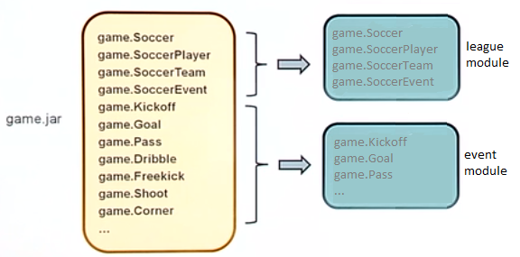
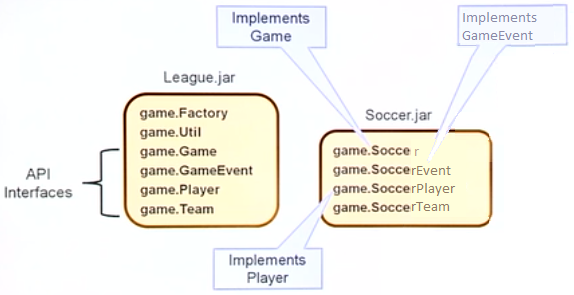
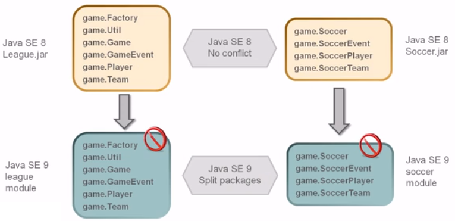
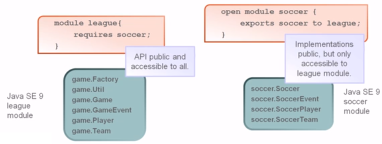

- [6.1 - Migrate the application developed using a Java version prior to SE 9 to SE 11 including top-down and bottom-up migration, splitting a Java SE 8 application into modules for migration](#6-1)
- [6.2 - Use jdeps to determine dependencies and identify way to address the cyclic dependencies](#6-2)
- [Quiz](#q)

## <a name="6-1"></a>6.1 - Migrate the application developed using a Java version prior to SE 9 to SE 11 including top-down and bottom-up migration, splitting a Java SE 8 application into modules for migration
## <a name="6-2"></a>6.2 - Use jdeps to determine dependencies and identify way to address the cyclic dependencies

### The Unnamed Module

All types must be associated with a module in Java SE 9. A type is considered a member of the unnamed 
module if it is in a package not associated with any module and is loaded by the application.

Unnamed modules:
- Read all other modules
- Export all their packages
- Cannot have any dependencies declared on them
- Cannot be accessed by a named module (i.e. a module with a `module-info.class`)

### Top-Down Migration

Migrate application JARs first (i.e. add `module-info.java` files). Consider each application module -
what does it require and what does it export?


Run `jdeps` to check dependencies, e.g.:

````
jdeps -s lib/display-ascii-0.1b.jar lib/Soccer.jar dist/League.jar
    League.jar -> lib/Soccer.jar
    League.jar -> lib/display-ascii-0.1b.jar
    League.jar -> java.base
    League.jar -> java.logging
    Soccer.jar -> java.base
    Soccer.jar -> java.logging
    display-ascii-0.1b.jar -> java.base
````

The Soccer `module-info.java`:

````
module soccer {
    requires java.base;     // not necessary to explicitly list as requirement
    requires java.logging;
    exports soccer to league;
}
````

The League `module-info.java`:

````
module league {
    requires java.base;     // not necessary to explicitly list as requirement
    requires java.logging;
    requires soccer;
    requires display-ascii-0.1b.jar ???
}
````

JAR files cannot be accessed on the classpath because **modules cannot access classes on the classpath**. 
We need a way to make this a module.

#### Library JAR to Module

How can unmodularized library JARs be used in the application?

- Write the `module-info.java` file for the library?
- Convert automatically (by putting the library JAR file on the module path)? Automatic modules do 
not have `module-info.java`

The League `module-info.java` will now look like this:
    
````
module league {
    requires java.base;     // not necessary to explicitly list as requirement
    requires java.logging;
    requires soccer;        // named module
    requires display.ascii; // automatic module
}
````


#### Automatic Module

- Is a JAR file that does not have a module declaration and is placed on the module path
- Is a "real" module
- Requires no changes to someone else's JAR file
- Is given a name derived from the JAR file (either from its name or from metadata)
- Requires all other modules
- Can be required by other modules
- Exports all of its packages

### Bottom-up Migration


We can use `jdeps` to generate the module-info for us:

````
jdeps --generate-module-info \
module-info-files /lib/display-ascii-0.1b.jar

writing to module-info-files/display.ascii/module-info.java
````

We'll end with:

````
module League {
    exports display;
    //exports util; // not necessary 
}
````

`League` and `Soccer` will expose all their packages. We'll need to use `add-modules` as the `League.jar` 
is running as an unnamed module and the Java runtime cannot determine which modules to resolve. 
So we can add this manually:

````
java -cp dist/League.jar:lib/Soccer.jar -p lib/display.ascii
main.Main
java -cp dist/League.jar:lib/Soccer.jar -p mods/display.ascii
    --add-modules display.ascii main.Main
````

In this instance, `league` and `soccer` are automatic modules and therefore export all their packages 
and require all other modules.

### Fully Modularized Application

Finally, this can be run with:

````
java -p dist/League.jar: \
        lib/Soccer.jar: \
        lib/display.ascii.jar \
    -m League.jar/main.Main
````

### Module Resolution

Use `-show-module-resolution` with `limit-modules` to limit the output:

````
java --limit-modules java.base,display.ascii,Soccer \
--show-module-resolution -p mods:lib -m league/main.Main
````

## Splitting Packages for Migration

- Splitting Java 8 application into modules
- Converting a Java 8 application that was organized for access control





The API Interfaces provide public API, whilst the implementations use package protected and are not 
publicly available.

With the packages divided, they can be modularized.



Encapsulation is achieved at the modular JAR level in Java SE 9 through the use of qualified export.

 

### Cyclic Dependencies

A cyclic dependency is when two modules depend on each other.

One possible approach to address this is to remove the dependency and instead create a new module 
that both modules can depend on.

## <a name="q"></a>Quiz

1. An unnamed module... (Choose two):
    - Is run on the module path
    - Does have a `module-info.class` file
    - Does not have a `module-info.class` file (A)
    - Is run on the class path (A)
1. Which is true? In order to function as a module, a set of class files must:
    - Be packaged in a JAR file
    - Be packaged in a modular JAR file
    - Have a `module-info.class` file (A)
1. Which of the following are true? Assume that modularized means with a `module-info.class` file 
and un-modularized means without a `module-info.class` file. (Choose three):
    - An un-modularized application run on the class path can access a modularized library run on the module path (A)
    - A modularized application run on the module path can access a library run on the class path (A)
    - A modularized application run on the module path can access an un-modularized library run on the class path
    - An un-modularized application run on the module path can access an un-modularized library run on the class path (A)
1. An un-modularized application consisting of two JARs can be run on (Choose three):
    - The class path (A)
    - A combination of the class path and the module path (A)
    - The application path
    - The module path (A)
1. A Java application consisting of two modules can be run on (Choose three):
    - The module path (A)
    - The class path (A)
    - A combination of the class path and the module path (A)
    - The application path