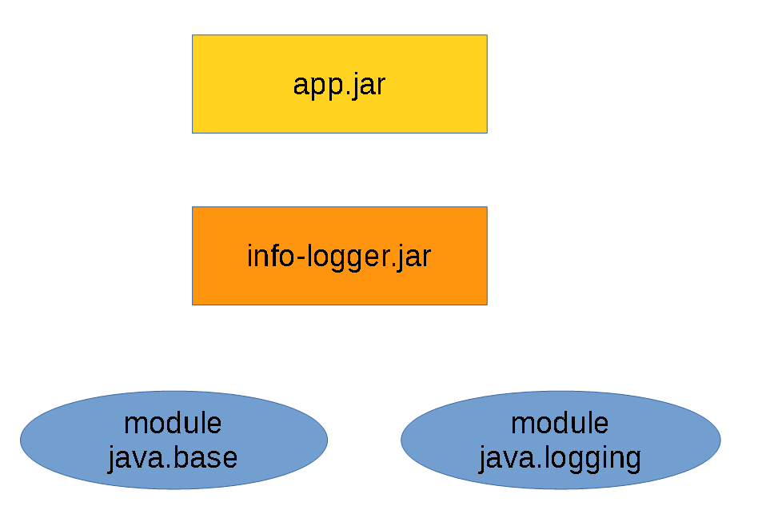
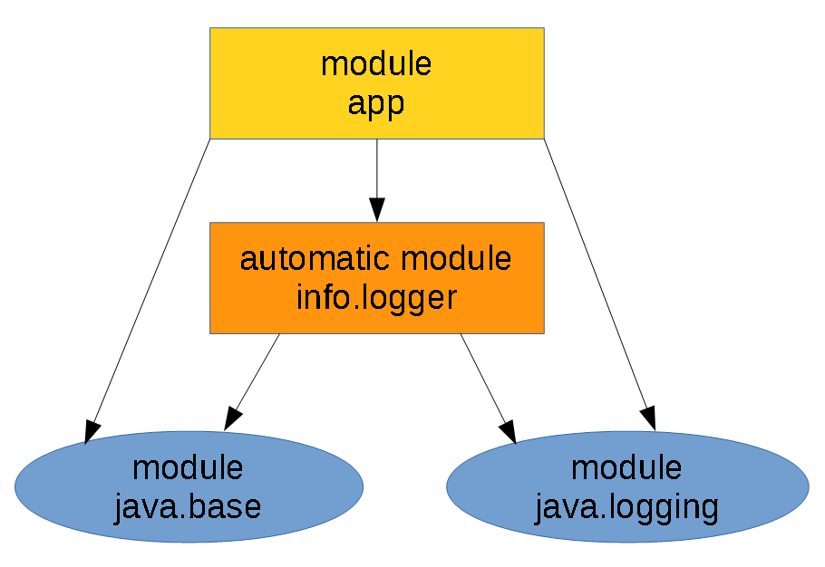
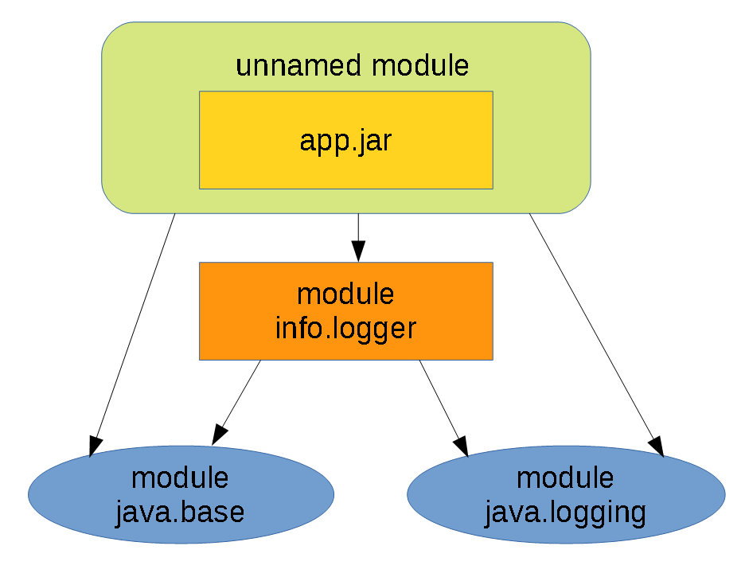
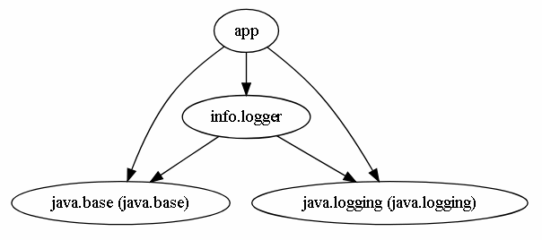
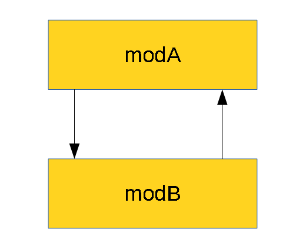
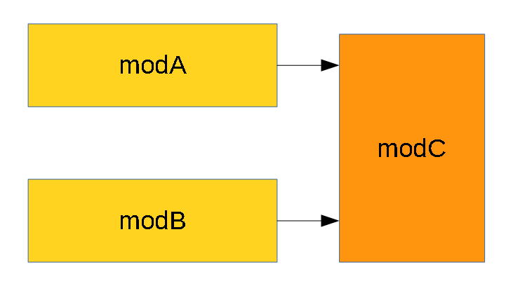
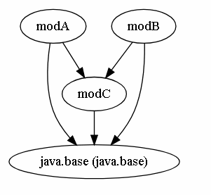
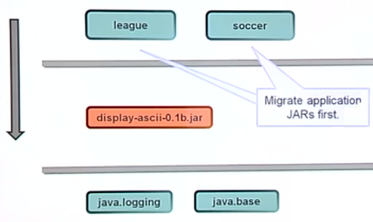
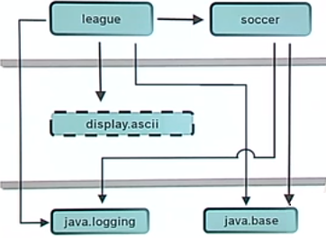
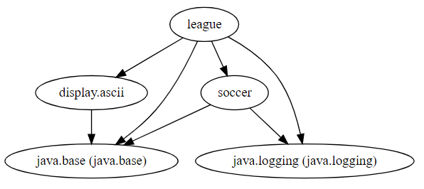

- [6.1 - Migrate the application developed using a Java version prior to SE 9 to SE 11 including top-down and bottom-up migration, splitting a Java SE 8 application into modules for migration](#61---migrate-the-application-developed-using-a-java-version-prior-to-se-9-to-se-11-including-top-down-and-bottom-up-migration-splitting-a-java-se-8-application-into-modules-for-migration)
  - [Migrating top-down](#migrating-top-down)
  - [Migrating bottom-up](#migrating-bottom-up)
- [6.2 - Use jdeps to determine dependencies and identify way to address the cyclic dependencies](#62---use-jdeps-to-determine-dependencies-and-identify-way-to-address-the-cyclic-dependencies)
  - [`jdeps` options](#jdeps-options)
  - [`jdeps` usage](#jdeps-usage)
  - [Cyclic dependencies](#cyclic-dependencies)
- [Migration - Game Simulator Example](#migration---game-simulator-example)
  - [Top-down migration](#top-down-migration)
    - [Utility JAR to module](#utility-jar-to-module)
  - [Bottom-up migration](#bottom-up-migration)
- [Quiz](#quiz)
- [Quiz Answers](#quiz-answers)

# 6.1 - Migrate the application developed using a Java version prior to SE 9 to SE 11 including top-down and bottom-up migration, splitting a Java SE 8 application into modules for migration

Assume we have a utility library packaged as separate `info-logger.jar` JAR (Java 8, non-modular):

````
INFO-LOGGER
└───by
    └───iba
        └───logging                
                InfoLogger.java
````

````				
package by.iba.logging;

import java.util.logging.Logger;

public class InfoLogger {
    
    private static final Logger LOG = Logger.getLogger(InfoLogger.class.getName());
    
    public static void log(String msg) {
        LOG.info(msg);
    }

    public static Logger getLog() {
        return LOG;
    }
}					
````

`info-logger>javac by\iba\logging\InfoLogger.java`

````
info-logger>jar cvf info-logger.jar .
added manifest
adding: by/(in = 0) (out= 0)(stored 0%)
adding: by/iba/(in = 0) (out= 0)(stored 0%)
adding: by/iba/logging/(in = 0) (out= 0)(stored 0%)
adding: by/iba/logging/InfoLogger.class(in = 667) (out= 370)(deflated 44%)
adding: by/iba/logging/InfoLogger.java(in = 328) (out= 181)(deflated 44%)
````

And application (Java 8, non-modular) JAR:

````
APP
└───by
    └───iba
        └───app
                App.java
````

````
package by.iba.app;

import by.iba.logging.InfoLogger;
import java.util.logging.Logger;

public class App {

    public static void main(String... args) {
        InfoLogger.log("Application started ...");
        Logger logger = InfoLogger.getLog();
        logger.info("Application finished.");
    }    
}
````

Application depends on `info-logger.jar` utility JAR:

`javac -cp ../info-logger/info-logger.jar by\iba\app\App.java`

````
jar --verbose --create --file app.jar .
added manifest
adding: by/(in = 0) (out= 0)(stored 0%)
adding: by/iba/(in = 0) (out= 0)(stored 0%)
adding: by/iba/app/(in = 0) (out= 0)(stored 0%)
adding: by/iba/app/App.class(in = 513) (out= 348)(deflated 32%)
adding: by/iba/app/App.java(in = 320) (out= 176)(deflated 45%)					
````

We should get similar hierarchy:

````
├───app
│   │   app.jar
│   │
│   └───by
│       └───iba
│           └───app
│                   App.class
│                   App.java
│
└───info-logger
    │   info-logger.jar
    │
    └───by
        └───iba
            └───logging
                    InfoLogger.class
                    InfoLogger.java
````

Now you can run the application in Java 8 style:

````
java -classpath ./info-logger/info-logger.jar;./app/app.jar by.iba.app.App
Apr 20, 2019 11:56:21 PM by.iba.logging.InfoLogger log
INFO: Application started ...
Apr 20, 2019 11:56:21 PM by.iba.app.App main
INFO: Application finished.
````

Java application before migration:



## Migrating top-down

We put all JARs (application and utility) to module path rather than class path and make application JAR modular.

Check dependencies for application to create proper module descriptor:

````
jdeps --module-path info-logger/info-logger.jar -s app/app.jar
app.jar -> info.logger
app.jar -> java.base
app.jar -> java.logging
info.logger -> java.base
info.logger -> java.logging
````

Application depends on 3 modules: `info.logger` (automatic module name for `info-logger.jar`), `java.base` (implicitly required by any module), and `java.logging`.

Assume we have no source for `info-logger.jar` and use it as an automatic module.

An automatic module:

- Is a JAR file that does not have a module declaration and is placed on the module path
- "Real" module, but without module descriptor
- We do not change someone else's JAR file
- Module name derived from JAR file (either from its name or from metadata)
- Exports all its packages
- Requires all other modules
- Can be required by other modules

Based on this we create a module definition for app application module:

````
module app {
    requires info.logger;
    requires java.logging;
}
````

````
│   module-info.java
│
└───by
    └───iba
        └───app
                App.java
````

Recompile the application code:

`javac -p ../info-logger/info-logger.jar module-info.java by\iba\app\App.java`
					
`-p` is synonym for `--module-path`

Recreate the application modular JAR file:

````
jar --verbose --create --file app.jar .
added manifest
added module-info: module-info.class
adding: by/(in = 0) (out= 0)(stored 0%)
adding: by/iba/(in = 0) (out= 0)(stored 0%)
adding: by/iba/app/(in = 0) (out= 0)(stored 0%)
adding: by/iba/app/App.class(in = 513) (out= 348)(deflated 32%)
adding: by/iba/app/App.java(in = 320) (out= 176)(deflated 45%)
adding: module-info.java(in = 70) (out= 53)(deflated 24%)
````

Run the application:

````
java --module-path ./info-logger/info-logger.jar;./app/app.jar -m app/by.iba.app.App
Apr 21, 2019 12:33:03 AM by.iba.logging.InfoLogger log
INFO: Application started ...
Apr 21, 2019 12:33:03 AM by.iba.app.App main
INFO: Application finished.
````

`-m` is synonym for `--module`

Java application after top-down migration:



## Migrating bottom-up

We make all library JARs modular and put on the module path, keep application JAR non-modular and put on the class path (it will become part of the unnamed module).

Revert `app.jar` back to non-modular (it will be part of unnamed module):

````
jar -tvf app.jar
     0 Sun Apr 21 10:46:24 AST 2019 META-INF/
    94 Sun Apr 21 10:46:24 AST 2019 META-INF/MANIFEST.MF
     0 Fri Apr 19 22:29:28 AST 2019 by/
     0 Fri Apr 19 22:29:34 AST 2019 by/iba/
     0 Sat Apr 20 23:40:42 AST 2019 by/iba/app/
   513 Sun Apr 21 00:28:22 AST 2019 by/iba/app/App.class
   320 Sat Apr 20 23:40:32 AST 2019 by/iba/app/App.java
````

The unnamed module:

- Reads all other modules
- Exports all its packages
- Cannot have any dependencies declared on it
- Cannot be accessed by a named module (a module with a `module-info.class`)

Check dependencies for library utility JAR to create a module definition (`module-info.java`):

````
jdeps -s info-logger/info-logger.jar
info-logger.jar -> java.base
info-logger.jar -> java.logging
````				

Since `java.base` always implicitly required by any module, we may think that we require only `java.logging` module and come up with this definition:

````
// WRONG
module info.logger {  
    requires java.logging;
}
````
					
But this module definition is wrong, because the library must export packages to be used by application (or by unnamed) module. We need to use `jdeps` to generate accurate `module-info.java` for us:

````
jdeps --generate-module-info . info-logger.jar
writing to .\info.logger\module-info.java
````

The generated `module-info.java` is writen into `info.logger\module-info.java`, move it 1 level higher. The correct definition will look as follows (`requires transitive` was also recognized and added by `jdeps`):

````
// CORRECT
module info.logger {
    requires transitive java.logging;
    exports by.iba.logging;
}
````

The module name may not contain dash character, it will get replaced with period character automatically by the `jdeps` utility.

Re-compile the utility modular JAR sources:

`info-logger>javac module-info.java by\iba\logging\InfoLogger.java`

````				
INFO-LOGGER
│   module-info.class
│   module-info.java
│
└───by
    └───iba
        └───logging
                InfoLogger.class
                InfoLogger.java
````

Re-create the modular JAR:

````
info-logger>jar --verbose --create --file info-logger.jar .
added manifest
added module-info: module-info.class
adding: by/(in = 0) (out= 0)(stored 0%)
adding: by/iba/(in = 0) (out= 0)(stored 0%)
adding: by/iba/logging/(in = 0) (out= 0)(stored 0%)
adding: by/iba/logging/InfoLogger.class(in = 667) (out= 370)(deflated 44%)
adding: by/iba/logging/InfoLogger.java(in = 328) (out= 181)(deflated 44%)
adding: module-info.java(in = 97) (out= 78)(deflated 19%)
````

Now we can run the modularized application:

````
java --add-modules info.logger --module-path info-logger/info-logger.jar --class-path app/app.jar  by.iba.app.App
Apr 21, 2019 11:45:06 AM by.iba.logging.InfoLogger log
INFO: Application started ...
Apr 21, 2019 11:45:06 AM by.iba.app.App main
INFO: Application finished.
````

When the compiler compiles code in the unnamed module, or the Java launcher is invoked and the main class of the application is loaded from the class path into the unnamed module of the application class loader, then the default set of root modules for the unnamed module is computed as follows:

- The `java.se` module is a root, if it exists. If it does not exist then every `java.*` module on the upgrade module path or among the system modules that exports at least one package, without qualification, is a root.
- Every `non-java.*` module on the upgrade module path or among the system modules that exports at least one package, without qualification, is also a root.

Otherwise, the default set of root modules depends upon the phase:

- At compile time it is usually the set of modules being compiled;
- At link time it is empty;
- At run time it is the application's main module, as specified via the `--module` (or `-m` for short) launcher option.

It is occasionally necessary to add modules to the default root set in order to ensure that specific platform, library, or service-provider modules will be present in the module graph. In any phase the option `--add-modules <module>(,<module*>)*` where `<module>` is a module name, adds the named modules to the default set of root modules.

So, we had to use `--add-modules info.logger` option to tell the Java runtime to include the module by name to the default root set. There are also predefined constants: `ALL-MODULE-PATH`, `ALL-DEFAULT`, and `ALL-SYSTEM`.

The `--module-path` option tells the Java runtime the location of our modules.

Java application after bottom-up migration:



# 6.2 - Use jdeps to determine dependencies and identify way to address the cyclic dependencies

`jdeps [options] path ...`
					
The `jdeps` command shows the package-level or class-level dependencies of Java class files. The input class can be a path name to a `.class` file, a directory, a JAR file, or it can be a fully qualified class name to analyze all class files. The options determine the output. By default, the `jdeps` command writes the dependencies to the system output. The command can generate the dependencies in [DOT](https://graphviz.org/doc/info/lang.html) language (the `-dotoutput` option).

## `jdeps` options

`-dotoutput dir_name (or --dot-output dir_name)`
- Specifies the destination directory for DOT file output. If this option is specified, then the `jdeps` command generates one `.dot` file for each analyzed archive named `archive-file-name.dot` that lists the dependencies, and also a summary file named `summary.dot` that lists the dependencies among the archive files.

`-s` (or `-summary`)
- Prints a dependency summary only.

`-jdkinternals (or --jdk-internals)`
- Finds class-level dependencies in the JDK internal APIs. By default, this option analyzes all classes specified in the `--class-path` option and input files unless you specified the `-include` option. You can’t use this option with the `-p`, `-e`, and `-s` options. _Warning: The JDK internal APIs are inaccessible._

`-cp path (or -classpath path, or --class-path path)`
- Specifies where to find class files.

`--module-path module_path`
- Specifies the module path.

`–m module_name (or --module module_name)`
- Specifies the root module for analysis.

`--generate-module-info dir`
- Generates `module-info.java` under the specified directory. The specified JAR files will be analyzed. This option cannot be used with `--dot-output` or `--class-path` options. Use the `--generate-open-module` option for open modules.

`--generate-open-module dir`
- Generates `module-info.java` for the specified JAR files under the specified directory as open modules. This option cannot be used with the `--dot-output` or `--class-path` options.

## `jdeps` usage

Assume we have the application and utility projects used in the previous section as non-modular Java 8 JARs:

````
javac info.logger\by\iba\logging\InfoLogger.java
jar --create --file info-logger.jar -C info.logger .

javac -cp info-logger.jar app\by\iba\app\App.java
jar --create --file app.jar -C app .
````

Now we can check class path dependencies:

````
jdeps -cp info-logger.jar -s app.jar

app.jar -> info-logger.jar
app.jar -> java.base
app.jar -> java.logging
````

````
jdeps -s info-logger.jar

info-logger.jar -> java.base
info-logger.jar -> java.logging
````

We can automatically generate module definitions for the 2 JARs:

````
jdeps --generate-module-info . *.jar

writing to .\app\module-info.java
writing to .\info.logger\module-info.java
````

The content of generated `module-info.java` files are as follows:

````
module app {
    requires info.logger;
    requires java.logging;
    exports by.iba.app;
}
````

````				
module info.logger {
    requires transitive java.logging;
    exports by.iba.logging;
}
````

Then re-create JARs as modular ones:

````
javac info.logger\module-info.java info.logger\by\iba\logging\InfoLogger.java
jar --create --verbose --file info-logger.jar -C info.logger .

javac -p info-logger.jar app\module-info.java app\by\iba\app\App.java
jar --create --verbose --file app.jar -C app .
````

Now we can check the **module dependencies**:

````
jdeps --module-path app.jar;info-logger.jar -summary --module app
app -> info.logger
app -> java.base
app -> java.logging
````

````
jdeps --module-path app.jar;info-logger.jar -summary --module info.logger
info.logger -> java.base
info.logger -> java.logging
````

Also, you can visualize the dependencies for all JARs:

`jdeps --module-path app.jar;info-logger.jar --dot-output . *.jar`
					
The results are several `.dot` files in the current directory, we check the `summary.dot`:

````
digraph "summary" {
  "app"                                              -> "info.logger";
  "app"                                              -> "java.base (java.base)";
  "app"                                              -> "java.logging (java.logging)";
  "info.logger"                                      -> "java.base (java.base)";
  "info.logger"                                      -> "java.logging (java.logging)";
}
````

You can visualize module dependency graph (e.g. at [www.webgraphviz.com](http://www.webgraphviz.com/)):

Java application module dependency graph:



## Cyclic dependencies

Cyclic dependencies between modules can be recognized by java compiler:

````
├───modA
│       module-info.java
│
└───modB
        module-info.java
````

````				
module modA {
    requires modB;
}
````

````				
module modB {
    requires modA;
}
````

````					
javac --module-source-path . modA\module-info.java -d modA
.\modB\module-info.java:2: error: cyclic dependence involving modA
    requires modA;
             ^
error: cannot access module-info
  cannot resolve modules
modA\module-info.java:1: error: module not found: modB
module modA {
^
3 errors
````
					
Imagine we have the following application:

````
├───modA
│   │   module-info.java
│   │
│   └───pkgA
│           ClassA.java
│
└───modB
    │   module-info.java
    │
    └───pkgB
            ClassB.java
````

````
module modA {
    requires modB;
    exports pkgA;
}
````

````				
package pkgA;

import pkgB.ClassB;

public class ClassA {
    public void methodA1() {    
        new ClassB().methodB2();        
    }
    
    public void methodA2() {
        
    }
}
````

````					
module modB {
    requires modA;
    exports pkgB;
}
````

````
package pkgB;

import pkgA.ClassA;

public class ClassB {
    public void methodB1() {
        new ClassA().methodA2();
    }
    
    public void methodB2() {
    }    
}
````

Java application cyclic dependency graph:




The solutions can be:

- Merge `pkgA.ClassA` and `pkgB.ClassB` into a single module
- Break cycle by using interfaces.

Let's try the second solution:

Add third `modC` module and refactor all interfaces from class methods which create dependencies:

````
modC
│   module-info.java
│
└───pkgC
        InterfaceA.java
        InterfaceB.java
````

````				
module modC {
    exports pkgC;
}
````

````
package pkgC;

public interface InterfaceA {
    public void methodA1();
    public void methodA2();
}
````

````				
package pkgC;

public interface InterfaceB {
    public void methodB1();
    public void methodB2();    
}
````

Now, refactor `modA` and `modB`, to depend not on each other, but both depend on `modC`.

````
module modA {
    requires modC;
    exports pkgA;
}
````

````
package pkgA;

import pkgC.InterfaceA;
import pkgC.InterfaceB;

public class ClassA implements InterfaceA {
    
    InterfaceB bIntf; 
    
    public ClassA(InterfaceB bIntf) {
        this.bIntf = bIntf;
    }
    
    @Override
    public void methodA1() {    
        bIntf.methodB2();
    }
    
    @Override
    public void methodA2() {        
    }
}
````

````
module modB {
    requires modC;
    exports pkgB;
}
````				

````
package pkgB;

import pkgC.InterfaceA;
import pkgC.InterfaceB;

public class ClassB implements InterfaceB {
    
    InterfaceA aIntf;
    
    public ClassB(InterfaceA aIntf) {
        this.aIntf = aIntf;
    }
    
    @Override
    public void methodB1() {
        aIntf.methodA2();
    }
    
    @Override
    public void methodB2() {
    }
}
````

Now you can compile all three modules:

````
javac --module-source-path . modC\module-info.java modC\pkgC\InterfaceA.java modC\pkgC\InterfaceB.java -d .
javac --module-source-path . modA\module-info.java modA\pkgA\ClassA.java -d .
javac --module-source-path . modB\module-info.java modB\pkgB\ClassB.java -d .
````

Java application without cyclic dependency:



Create modular JARs:

````
jar cvf modA.jar -C modA .
jar cvf modB.jar -C modB .
jar cvf modC.jar -C modC .
````

Inspect dependency graph visually:

`jdeps --module-path modA.jar;modB.jar;modC.jar --dot-output . *.jar`
					
Java application without cyclic dependency:



# Migration - Game Simulator Example

Refer back to the "Game Simulator Example" from part 02.

## Top-down migration

Migrate application JARs first (i.e. add `module-info.java` files). Consider each application module - what does it require and what does it export?



Run `jdeps` to check dependencies:

````
jdeps -s lib/display-ascii-0.1b.jar lib/Soccer.jar dist/League.jar
    League.jar -> lib/Soccer.jar
    League.jar -> lib/display-ascii-0.1b.jar
    League.jar -> java.base
    League.jar -> java.logging
    Soccer.jar -> java.base
    Soccer.jar -> java.logging
    display-ascii-0.1b.jar -> java.base
````

Therefore the `Soccer` `module-info.java` should be:

````
module soccer {
    requires java.base;     // not necessary to explicitly list as requirement
    requires java.logging;
    exports soccer to league;
}
````

And the `League` `module-info.java` should be:

````
module league {
    requires java.base;     // not necessary to explicitly list as requirement
    requires java.logging;
    requires soccer;
    requires display-ascii-0.1b.jar ???
}
````

JAR files cannot be accessed on the classpath because **modules cannot access classes on the classpath**. We need a way to make this a module...

### Utility JAR to module

How can unmodularized utility JARs be used in the application?

- Write the `module-info.java` file for the library
- Convert automatically (by putting the library JAR file on the module path)? Remember, automatic modules do not have a `module-info.java`

The `League` `module-info.java` will now look like this:
    
````
module league {
    requires java.base;     // not necessary to explicitly list as requirement
    requires java.logging;
    requires soccer;        // named module
    requires display.ascii; // automatic module
}
````



Refer to our simple example earlier: Here, the `League` is the "application" and `display.ascii` is the "utility".



## Bottom-up migration

With the bottom-up approach we'll migrate the `display-ascii` utility to a module, and the `league` and the `soccer` stay as JAR files.


We can use `jdeps` to generate the `module-info` file for us:

````
jdeps --generate-module-info module-info-files /lib/display-ascii-0.1b.jar

writing to module-info-files/display.ascii/module-info.java
````

When running, we'll have to use the `--add-modules display.ascii` option to tell the Java runtime to include the module by name to the default root set. As unnamed modules, `league` and `soccer` JARs need to be included in the `--class-path`.

# Quiz

1. An unnamed module... (Choose two):
    - A. Is run on the module path
    - B. Does have a `module-info.class` file
    - C. Does not have a `module-info.class` file
    - D. Is run on the class path
<br />[Jump to answer](#qa1)
2. Which is true? In order to function as a module, a set of class files must:
    - A. Be packaged in a JAR file
    - B. Be packaged in a modular JAR file
    - C. Have a `module-info.class` file
<br />[Jump to answer](#qa2)
3. Which of the following are true? Assume that modularized means with a `module-info.class` file and un-modularized means without a `module-info.class` file. (Choose three):
    - A. An un-modularized application run on the class path can access a modularized library run on the module path
    - B. A modularized application run on the module path can access a library run on the class path
    - C. A modularized application run on the module path can access an un-modularized library run on the class path
    - D. An un-modularized application run on the module path can access an un-modularized library run on the class path
<br />[Jump to answer](#qa3)
4. An un-modularized application consisting of two JARs can be run on (Choose three):
    - A. The class path
    - B. A combination of the class path and the module path
    - C. The application path
    - D. The module path
<br />[Jump to answer](#qa4)
5. A Java application consisting of two modules can be run on (Choose three):
    - A. The module path
    - B. The class path
    - C. A combination of the class path and the module path
    - D. The application path
<br />[Jump to answer](#qa5)
    
# Quiz Answers

1. <a name="qa1"></a>[Jump to question](#q1) - **C.** A class which is not a member of a 'named module' is considered to be a member of a special module known as the unnamed module. The unnamed module concept is similar to the unnamed package (the default package). The unnamed module is not a real module. It can be considered as the default module which does not have a name. **All classes found on the classpath will be included in what Java calls the unnamed module**. The unnamed module exports all its packages.
2. <a name="qa2"></a>[Jump to question](#q2) - **C.** To declare an explicit module, a module declaration needs to be specified. This is done in a file called `module-info.java` which is compiled as `module-info.class`.
3. <a name="qa3"></a>[Jump to question](#q3) - **A, B, D.** Un-modularized applications are placed into the unnamed module. These are only readable by other classes in the unnamed module. No named module can 
read the classes of the unnamed module so C is incorrect.
4. <a name="qa4"></a>[Jump to question](#q4) - **A, B, D.** Mixing classpath and module path is absolutely legal. However, modular jars cannot reference non-modular jars on the classpath. Automatic modules (non-modular jars on the modulepath) act as a bridge: modular jars can reference them, and automatic modules can read the classpath.
5. <a name="qa5"></a>[Jump to question](#q5) - **A, B, C.** See answer [above](#qa4).