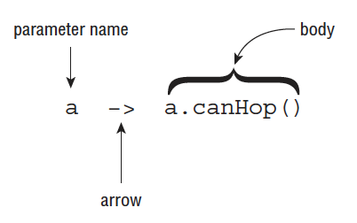
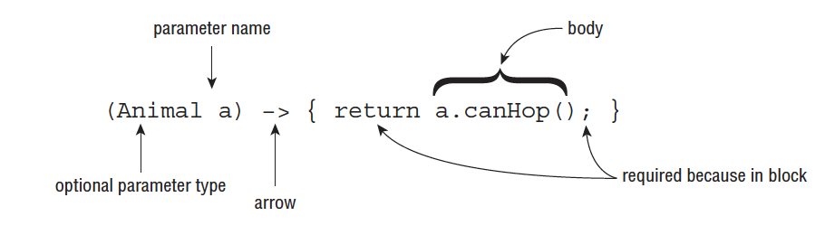
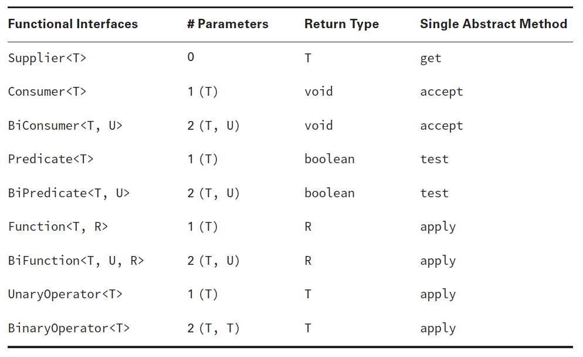
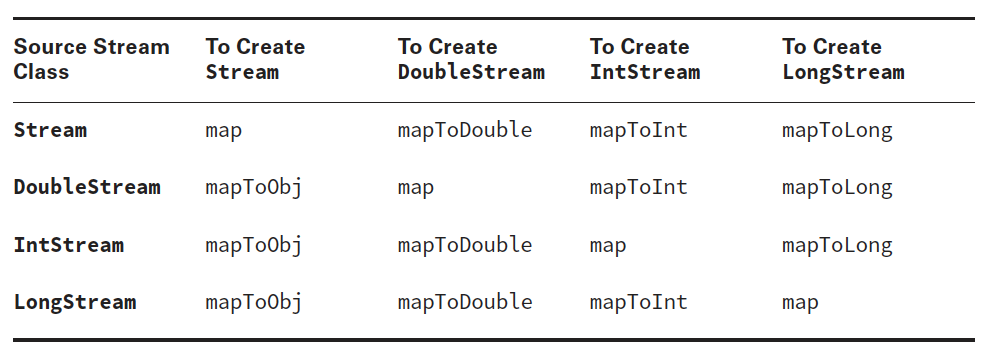
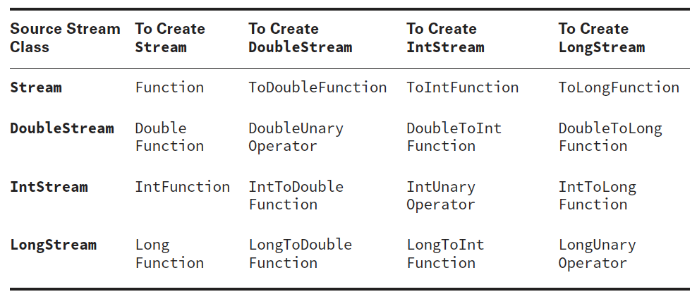
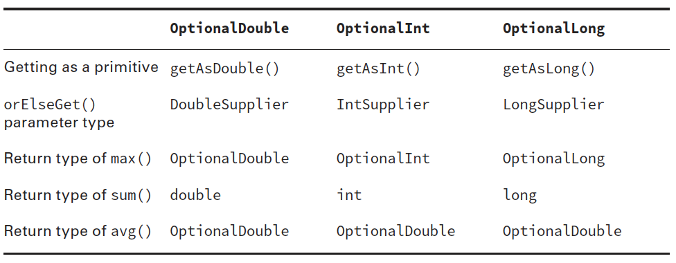
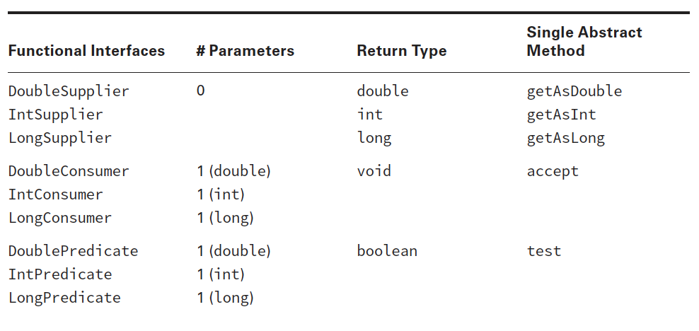
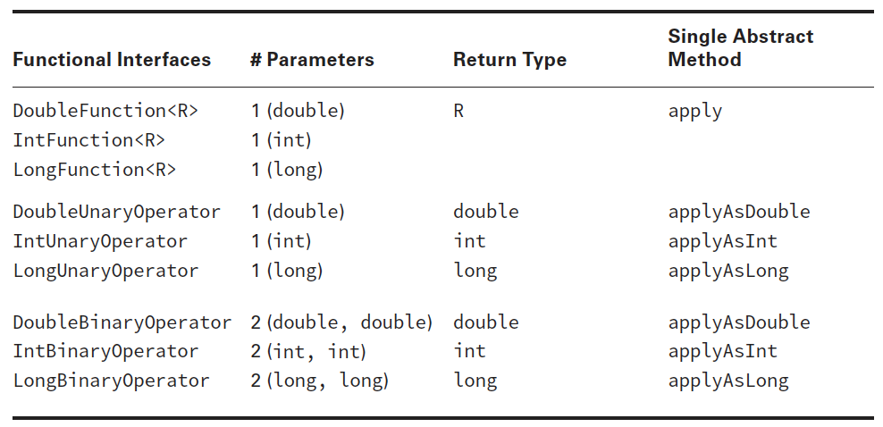
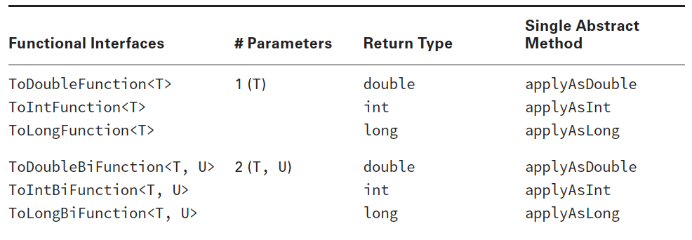
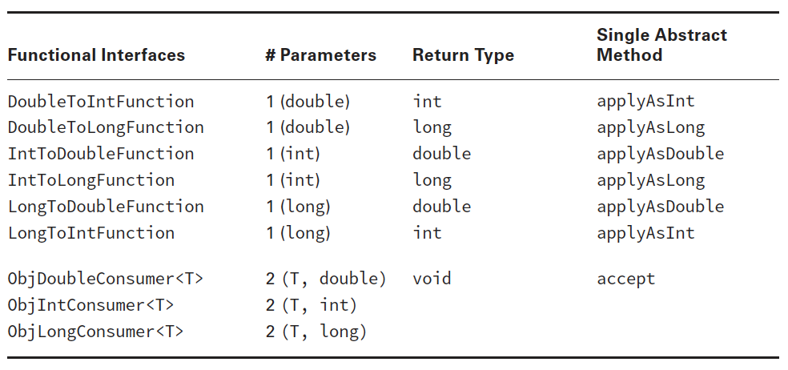

- [8.1 - Create and use lambda expressions](#8-1)
- [8.2 - Use lambda expressions and method references](#8-2)
- [8.3 - Use built-in functional interfaces including Predicate, Consumer, Function, and Supplier](#8-3)
- [8.4 - Use primitive and binary variations of base interfaces of java.util.function package](#8-4)

## <a name="8-1"></a>8.1 - Create and use lambda expressions

### Implementing Functional Interfaces with Lambdas

Now that we have defined a functional interface, we’ll show you how to implement them
using lambda expressions. As we said earlier, a lambda expression is a block of code that
gets passed around, like an anonymous method. Let’s start with a simple CheckTrait
functional interface, which has a single method test(), which takes as input an instance of
an Animal class. The definitions of the class and functional interface are as follows:

````
public class Animal {
    private String species;
    private boolean canHop;
    private boolean canSwim;
    
    public Animal(String speciesName, boolean hopper, boolean swimmer) {
        species = speciesName;
        canHop = hopper;
        canSwim = swimmer;
    }
    
    public boolean canHop() { return canHop; }
    public boolean canSwim() { return canSwim; }
    public String toString() { return species; }
}

public interface CheckTrait {
    public boolean test(Animal a);
}
````

Now that we’ve defined a structure, let’s do something with it. The following simple program
uses a lambda expression to determine if some sample animals match the specified criteria:

````
public class FindMatchingAnimals {
    private static void print(Animal animal, CheckTrait trait) {
        if(trait.test(animal))
            System.out.println(animal);
        }
    public static void main(String[] args) {
        print(new Animal("fish", false, true), a -> a.canHop());
        print(new Animal("kangaroo", true, false), a -> a.canHop());
    }
}
````

For illustrative purposes, the lambda expression chosen for this program is quite simple:

`a -> a.canHop();`

This expression means that Java should call a method with an `Animal` parameter that
returns a boolean value that’s the result of `a.canHop()`. We know all this because we
wrote the code. But how does Java know?

Java relies on context when figuring out what lambda expressions mean. We are
passing this lambda as the second parameter of the `print()` method. That method
expects a `CheckTrait` as the second parameter. Since we are passing a lambda instead,
Java treats `CheckTrait` as a functional interface and tries to map it to the single
abstract method:

`boolean test(Animal a);`

Since this interface’s method takes an Animal, it means the lambda parameter has to be
an Animal. And since that interface’s method returns a boolean, we know that the lambda
returns a boolean.

### Understanding Lambda Syntax

The syntax of lambda expressions is tricky because many parts are optional. These two
lines are equivalent and do the exact same thing:

````
a -> a.canHop()
(Animal a) -> { return a.canHop(); }
````

Let’s look at what is going on here. The left side of the arrow operator -> indicates
the input parameters for the lambda expression. It can be consumed by a functional
interface whose abstract method has the same number of parameters and compatible
data types. The right side is referred to as the body of the lambda expression. It can be
consumed by a functional interface whose abstract method returns a compatible data
type.

Since the syntax of these two expressions is a bit different, let’s look at them more
closely. The fi rst example, shown in Figure 2.1 , has three parts:
- We specify a single parameter with the name a .
- The arrow operator → separates the parameter from the body.
- The body calls a single method and returns the result of that method.

FIGURE 2.1 Lambda syntax omitting optional parts



The second example also has three parts, as shown in Figure 2.2; it’s just more verbose:
- We specify a single parameter with the name a and state that the type is Animal,
wrapping the input parameters in parentheses ().
- The arrow operator −> separates the parameter from the body.
- The body has one or more lines of code, including braces {}, a semicolon ;, and a
return statement.

FIGURE 2.2 Lambda syntax, including optional parts



Let’s review some of the differences between these two figures. The first difference
that you may notice is that Figure 2.2 uses parentheses (), while Figure 2.1 does not.
The parentheses () can be omitted in a lambda expression if there is exactly one input
parameter and the type is not explicitly stated in the expression. This means that
expressions that have zero or more than one input parameter will still require parentheses.
For example, the following are all valid lambda expressions, assuming that there are valid
functional interfaces that can consume them:

````
() -> new Duck()
d -> {return d.quack();}
(Duck d) -> d.quack()
(Animal a, Duck d) -> d.quack()
````

The first lambda expression could be used by a functional interface containing a
method that takes no arguments and returns a Duck object. The second and third lambda
expressions can both be used by a functional interface that takes a Duck as input and
returns whatever the return type of quack() is. The last lambda expression can be used by
a functional interface that takes as input Animal and Duck objects and returns whatever the
return type of quack() is.

#### Spotting Invalid Lambdas

Can you figure out why each of the following lambda expressions is invalid and will not
compile when used as an argument to a method?

````
Duck d -> d.quack() // DOES NOT COMPILE
a,d -> d.quack() // DOES NOT COMPILE
Animal a, Duck d -> d.quack() // DOES NOT COMPILE
````

They each require parentheses ()! As we said, parentheses can be omitted only if there is
exactly one parameter and the data type is not specified.

Next, you see that Figure 2.2 has a pair of statement braces {} around the body of
the lambda expression. This allows you to write multiple lines of code in the body of the
lambda expression, as you might do when working with an if statement or while loop.
What’s tricky here is that when you add braces {}, you must explicitly terminate each
statement in the body with a semicolon;.

In Figure 2.1, we were able to omit the braces {}, semi‐colon;, and return statement,
because this is a special shortcut that Java allows for single‐line lambda bodies. This special
shortcut doesn’t work when you have two or more statements. At least this is consistent
with using {} to create blocks of code elsewhere in Java. When using {} in the body of the
lambda expression, you must use the return statement if the functional interface method
that lambda implements returns a value. Alternatively, a return statement is optional when
the return type of the method is void.
Let’s look at some more examples:

````
() -> true // 0 parameters
a -> {return a.startsWith("test");} // 1 parameter
(String a) -> a.startsWith("test") // 1 parameter
(int x) -> {} // 1 parameter
(int y) -> {return;} // 1 parameter
````

The first example takes no arguments and always returns true. The second and third
examples both take a single String value, using different syntax to accomplish the same
thing. Notice that in the first two examples we mixed and matched syntax between Figure
2.1 and Figure 2.2 by having the first example use parentheses () but no braces {} and
reversing this in the second example. The last two examples are equivalent because they
take an integer value and do not return anything.

Now let’s look at some lambda expressions that take more than one parameter:

````
(a, b) -> a.startsWith("test") // 2 parameters
(String a, String b) -> a.startsWith("test") // 2 parameters
````

These examples both take two parameters and ignore one of them, since there is no rule
that says the lambda expression must use all of the input parameters.

Let’s review some additional lambda expressions to see how your grasp of lambda
syntax is progressing. Do you see what’s wrong with each of these lambda expressions?

````
a, b -> a.startsWith("test") // DOES NOT COMPILE
c -> return 10; // DOES NOT COMPILE
a -> { return a.startsWith("test") } // DOES NOT COMPILE
````

The first lambda needs parentheses () around the parameter list. Remember that the
parentheses are optional only when there is one parameter and it doesn’t have a type
declared. The second line uses the return keyword without using braces {}. The last line is
missing the semicolon after the return statement. The following rewritten lambda expressions
are each valid:

````
(a, b) -> a.startsWith("test")
c -> { return 10; }
a -> { return a.startsWith("test"); }
````

As mentioned, the data types for the input parameters of a lambda expression are
optional. When one parameter has a data type listed, though, all parameters must provide
a data type. The following lambda expressions are each invalid for this reason:

````
(int y, z) -> {int x=1; return y+10; } // DOES NOT COMPILE
(String s, z) -> { return s.length()+z; } // DOES NOT COMPILE
(a, Animal b, c) -> a.getName() // DOES NOT COMPILE
````

If we add or remove all of the data types, then these lambda expressions do compile. For
example, the following rewritten lambda expressions are each valid:

````
(y, z) -> {int x=1; return y+10; }
(String s, int z) -> { return s.length()+z; }
(a, b, c) -> a.getName()
````

There is one more issue you might see with lambdas. We’ve been defining an argument
list in our lambda expressions. Since Java doesn’t allow us to re‐declare a local variable, the
following is an issue:

`(a, b) -> { int a = 0; return 5;} // DOES NOT COMPILE`

We tried to re‐declare a, which is not allowed. By contrast, the following line is
permitted because it uses a different variable name:

`(a, b) -> { int c = 0; return 5;}`

### Using Variables in Lambdas

Lambda expressions can access static variables, instance variables, effectively final
method parameters, and effectively final local variables. How many of those can you find in
this example?

````
1: interface Gorilla { String move(); }
2: class GorillaFamily {
3:      String walk = "walk";
4:      void everyonePlay(boolean baby) {
5:          String approach = "amble";
6:          //approach = "run";
7:
8:          play(() -> walk);
9:          play(() -> baby ? "hitch a ride": "run");
10:         play(() -> approach);
11:     }
12:     void play(Gorilla g) {
13:         System.out.println(g.move());
14:     }
15: }
````

Line 8 uses an instance variable in the lambda. Line 9 uses a method parameter. We
know it is effectively final since there are no reassignments to that variable. Line 10 uses
an effectively final local variable. If we uncomment line 6, there will be a reassignment and
the variable will no longer be effectively final. This would cause a compiler error on line 10
when it tries to access a non–effectively final variable.

The normal rules for access control still apply. For example, a lambda can’t access
private variables in another class. Remember that lambdas can access a subset of variables
that are accessible, but never more than that.

## <a name="8-2"></a>8.2 - Use lambda expressions and method references

### Using Method References

Method references are a way to make the code shorter by reducing some of the code that
can be inferred and simply mentioning the name of the method. Like lambdas, it takes time
to get used to the new syntax.

Suppose that we have a Duck class with name and weight attributes along with this
helper class:

````
public class DuckHelper {
    public static int compareByWeight(Duck d1, Duck d2) {
        return d1.getWeight()—d2.getWeight();
    }
    public static int compareByName(Duck d1, Duck d2) {
        return d1.getName().compareTo(d2.getName());
    }
}
````

Now think about how we would write a Comparator for it if we wanted to sort by
weight. Using lambdas, we’d have the following:

`Comparator<Duck> byWeight = (d1, d2) -> DuckHelper.compareByWeight(d1, d2);`

Not bad. There’s a bit of redundancy, though. The lambda takes two parameters and
does nothing but pass those parameters to another method. Java 8 lets us remove that
redundancy and simply write this:

`Comparator<Duck> byWeight = DuckHelper::compareByWeight;`

The :: operator tells Java to pass the parameters automatically into compareByWeight .

Note: DuckHelper::compareByWeight returns a functional interface and not an
int. Remember that :: is like lambdas, and it is typically used for deferred
execution.

There are four formats for method references:
1. Static methods
1. Instance methods on a particular instance
1. Instance methods on an instance to be determined at runtime
1. Constructors

In this chapter, we will be using three functional interfaces in our examples. We will use
more in the next chapter. Remember from Chapter 2 that Predicate is a functional interface
that takes a single parameter of any type and returns a boolean . Another functional
interface is Consumer , which takes a single parameter of any type and has a void return
type. Finally, Supplier doesn’t take any parameters and returns any type.

Let’s look at some examples from the Java API. In each set, we show the lambda equivalent.
Remember that none of these method references are actually called in the code that
follows. They are simply available to be called in the future. Let’s start with a static method:

````
14: Consumer<List<Integer>> methodRef1 = Collections::sort;
15: Consumer<List<Integer>> lambda1 = l -> Collections.sort(l);
````

On line 14, we call a method with one parameter, and Java knows that it should create a
lambda with one parameter and pass it to the method.
Wait a minute. We know that the sort method is overloaded. How does Java know that we
want to call the version that omits the comparator? With both lambdas and method references,
Java is inferring information from the context. In this case, we said that we were declaring a
Consumer , which takes only one parameter. Java looks for a method that matches that description.

Next up is calling an instance method on a specifi c instance:

````
16: String str = "abc";
17: Predicate<String> methodRef2 = str::startsWith;
18: Predicate<String> lambda2 = s -> str.startsWith(s);
````

Line 17 shows that we want to call string.startsWith() and pass a single parameter to
be supplied at runtime. This would be a nice way of filtering the data in a list. Next, we call
an instance method without knowing the instance in advance:

````
19: Predicate<String> methodRef3 = String::isEmpty;
20: Predicate<String> lambda3 = s -> s.isEmpty();
````

Line 19 says the method that we want to call is declared in String. It looks like a static
method, but it isn’t. Instead, Java knows that isEmpty is an instance method that does not
take any parameters. Java uses the parameter supplied at runtime as the instance on which
the method is called. Finally, we have a constructor reference:

````
21: Supplier<ArrayList> methodRef4 = ArrayList::new;
22: Supplier<ArrayList> lambda4 = () -> new ArrayList();
````

A constructor reference is a special type of method reference that uses new instead of a
method, and it creates a new object.

## <a name="8-3"></a>8.3 - Use built-in functional interfaces including Predicate, Consumer, Function, and Supplier

### Working with Built-In Functional Interfaces

As you remember, a functional interface has exactly one abstract method. All of the
functional interfaces in Table 4.1 were introduced in Java 8 and are provided in the
java.util.function package. The convention here is to use the generic type T for type
parameter. If a second type parameter is needed, the next letter, U, is used. If a distinct
return type is needed, R for return is used for the generic type.

TABLE 4.1 Common functional interfaces



Many other functional interfaces are defi ned in the java.util.function package. They
are for working with primitives, which you’ll see later in the chapter.

You do need to memorize this table. We will give you lots of practice in this section to
help make this memorable. Before you ask, most of the time we don’t actually assign the
implementation of the interface to a variable. The interface name is implied, and it gets
passed directly to the method that needs it. We are introducing the names so that you can
better understand and remember what is going on. Once we get to the streams part of the
chapter, we will assume that you have this down and stop creating the intermediate variable.

You can name a functional interface anything you want. The
only requirements are that it must be a valid interface name and contain a single abstract
method. Table 4.1 is significant because these interfaces are often used in streams and other
classes that come with Java, which is why you need to memorize them for the exam.

Note: There’s an interface called Runnable used
for concurrency the majority of the time. However, it may show up on the
exam when you are asked to recognize which functional interface to use.
All you need to know is that Runnable doesn’t take any parameters, return
any data, or use generics.

### Applying the Predicate Interface

In our earlier example from 8.1, we created a simple functional interface to test an Animal trait:

````
public interface CheckTrait {
public boolean test(Animal a);
}
````

You can imagine that we’d have to create lots of interfaces like this to use lambdas. We
want to test animals, plants, String values, and just about anything else that we come
across.

Luckily, Java recognizes that this is a common problem and provides such an interface
for us. It’s in the package java.util.function, and the gist of it is as follows:

````
public interface Predicate<T> {
public boolean test(T t);
}
````

That looks a lot like our method. The only difference is that it uses type T instead of
Animal. As you may remember from your OCA studies, this is the syntax for an interface
that uses a generic type. If you’re a bit out of practice with generics, don’t worry. We’ll be
reviewing generics in more detail in Chapter 3.

The result of using Predicate is that we no longer need our own functional interface.
The following is a rewrite of our program to use the Predicate class:

````
import java.util.function.Predicate;
public class FindMatchingAnimals {
    private static void print(Animal animal, Predicate<Animal> trait) {
        if(trait.test(animal))
            System.out.println(animal);
    }
    public static void main(String[] args) {
        print(new Animal("fish", false, true), a -> a.canHop());
        print(new Animal("kangaroo", true, false), a -> a.canHop());
    }
}
````

This is very similar to our original program, except that we wrote it with one less
interface.

#### Implementing Predicate and BiPredicate

Predicate is often used when filtering or matching. Both are
very common operations. A BiPredicate is just like a Predicate except that it takes two
parameters instead of one. Omitting any default or static methods, the interfaces are
defined as follows:

````
@FunctionalInterface public class Predicate<T> {
    boolean test(T t);
}
@FunctionalInterface public class BiPredicate<T, U> {
    boolean test(T t, U u);
}
````

It should be old news by now that you can use a Predicate to test a condition:

````
Predicate<String> p1 = String::isEmpty;
Predicate<String> p2 = x -> x.isEmpty();
System.out.println(p1.test(""));
System.out.println(p2.test(""));
````

This prints true twice. More interesting is a BiPredicate. This example also prints true
twice:

````
BiPredicate<String, String> b1 = String::startsWith;
BiPredicate<String, String> b2 = (string, prefix) -> string.startsWith(prefix);
System.out.println(b1.test("chicken", "chick"));
System.out.println(b2.test("chicken", "chick"));
````

The method reference combines two techniques that you’ve already seen. startsWith()
is an instance method. This means that the first parameter in the lambda is used
as the instance on which to call the method. The second parameter is passed to the
startsWith() method itself. This is another example of how method references save a
good bit of typing. The downside is that they are less explicit, and you really have to
understand what is going on!

#### Real World Scenario - Default Methods on Functional Interfaces

By definition, all functional interfaces have a single abstract method. This doesn’t mean
that they have only one method, though. Several of the common functional interfaces
provide a number of helpful default methods. You don’t need to know these for the
exam, but they are helpful when you start building your own implementations out in the
real world.
Suppose that we have these two Predicates:

````
Predicate<String> egg = s -> s.contains("egg");
Predicate<String> brown = s -> s.contains("brown");
````

Now we want a Predicate for brown eggs and another for all other colors of eggs. We
could write this by hand:

````
Predicate<String> brownEggs = s -> s.contains("egg") && s.contains("brown");
Predicate<String> otherEggs = s -> s.contains("egg") && ! s.contains("brown");
````

This works, but it’s not great. It’s a bit long to read, and it contains duplication. What if
we decide the letter e should be capitalized in eggs? We’d have to change it in three variables:
egg, brownEggs, and otherEggs.

A better way to deal with this situation is to use two of the default methods on
Predicate:

````
Predicate<String> brownEggs = egg.and(brown);
Predicate<String> otherEggs = egg.and(brown.negate());
````

Neat! Now we are reusing the logic in the original Predicates to build two new ones. It’s
shorter and clearer what the relationship is between the Predicates. We can also change
the spelling of egg in one place, and the other two objects will have new logic because
they reference it.

### Implementing Supplier

A Supplier is used when you want to generate or supply values without taking any input.
The Supplier interface is defined as

````
@FunctionalInterface public class Supplier<T> {
public T get();
}
````

On the OCA, you learned that you could create a date using a factory. If you’ve forgotten
how, don’t worry. We will be covering it again in Chapter 5 , “Dates, Strings, and
Localization,” in this book. You can use a Supplier to call this factory:

````
Supplier<LocalDate> s1 = LocalDate::now;
Supplier<LocalDate> s2 = () -> LocalDate.now();
LocalDate d1 = s1.get();
LocalDate d2 = s2.get();
System.out.println(d1);
System.out.println(d2);
````

This example prints a date such as 2015–06–20 twice. It’s also a good opportunity to
review static method references. The LocalDate::now method reference is used to create
a Supplier to assign to an intermediate variable s1. A Supplier is often used when constructing
new objects. For example, we can print two empty StringBuilders:

````
Supplier<StringBuilder> s1 = StringBuilder::new;
Supplier<StringBuilder> s2 = () -> new StringBuilder();

System.out.println(s1.get());
System.out.println(s2.get());
````

This time, we use a constructor reference to create the object. We’ve been using generics
to declare what type of Supplier we are using. This can get a little long to read. Can you
figure out what the following does? Just take it one step at a time.

````
Supplier<ArrayList<String>> s1 = ArrayList<String>::new;
ArrayList<String> a1 = s1.get();
System.out.println(a1);
````

We have a Supplier of a certain type. That type happens to be ArrayList<String>.
Then calling get() creates a new instance of ArrayList<String>, which is the generic type
of the Supplier—in other words, a generic that contains another generic. It’s not hard to
understand, so just look at the code carefully when this type of thing comes up.

Notice how we called get() on the functional interface. What would happen if we tried
to print out s1 itself?

`System.out.println(s1);` prints something like this:

`functionalinterface.BuiltIns$$Lambda$1/791452441@1fb3ebeb`

That’s the result of calling toString() on a lambda. Yuck. This actually does mean
something. Our test class is named BuiltIns, and it is in a package that we created named
functionalinterface. Then comes $$, which means that the class doesn’t exist in a class
file on the file system. It exists only in memory. You don’t need to worry about the rest.

### Implementing Consumer and BiConsumer

You use a Consumer when you want to do something with a parameter but not return anything.
BiConsumer does the same thing except that it takes two parameters. Omitting the
default methods, the interfaces are defined as follows:

````
@FunctionalInterface public class Consumer<T> {
    void accept(T t);
}
@FunctionalInterface public class BiConsumer<T, U> {
    void accept(T t, U u);
}
````

You used a Consumer in Chapter 3 with forEach . Here’s that example actually being
assigned to the Consumer interface:

````
Consumer<String> c1 = System.out::println;
Consumer<String> c2 = x -> System.out.println(x);
c1.accept("Annie");
c2.accept("Annie");
````

This example prints Annie twice. You might notice that the Consumer examples used the
method reference System.out::println . That’s OK. Java uses the context of the lambda to
determine which overloaded println() method it should call.

BiConsumer is called with two parameters. They don’t have to be the same type. For
example, we can put a key and a value in a map using this interface:

````
Map<String, Integer> map = new HashMap<>();
BiConsumer<String, Integer> b1 = map::put;
BiConsumer<String, Integer> b2 = (k, v) -> map.put(k, v);
b1.accept("chicken", 7);
b2.accept("chick", 1);
System.out.println(map);
````

The output is `{chicken=7, chick=1}`, which shows that both BiConsumer implementations
did get called. This time we used an instance method reference since we want to call a
method on the local variable map. It’s also the fi rst time that we passed two parameters to a
method reference. The code to instantiate b1 is a good bit shorter than the code for b2. This
is probably why the exam is so fond of method references.

As another example, we use the same type for both generic parameters:

````
Map<String, String> map = new HashMap<>();
BiConsumer<String, String> b1 = map::put;
BiConsumer<String, String> b2 = (k, v) -> map.put(k, v);
b1.accept("chicken", "Cluck");
b2.accept("chick", "Tweep");
System.out.println(map);
````

The output is `{chicken=Cluck, chick=Tweep}`, which shows that a BiConsumer can use
the same type for both the T and U generic parameters.

### Implementing Function and BiFunction

A Function is responsible for turning one parameter into a value of a potentially different
type and returning it. Similarly, a BiFunction is responsible for turning two parameters
into a value and returning it. Omitting any default or static methods, the interfaces are
defined as the following:

````
@FunctionalInterface public class Function<T, R> {
    R apply(T t);
}
@FunctionalInterface public class BiFunction<T, U, R> {
    R apply(T t, U u);
}
````

For example, this function converts a String to the length of the String:

````
Function<String, Integer> f1 = String::length;
Function<String, Integer> f2 = x -> x.length();
System.out.println(f1.apply("cluck")); // 5
System.out.println(f2.apply("cluck")); // 5
````

This function turns a String into an Integer. Well, technically it turns the String into
an int, which is autoboxed into an Integer. The types don’t have to be different. The following
combines two String objects and produces another String:

````
BiFunction<String, String, String> b1 = String::concat;
BiFunction<String, String, String> b2 = (string, toAdd) -> string.concat(toAdd);
System.out.println(b1.apply("baby ", "chick")); // baby chick
System.out.println(b2.apply("baby ", "chick")); // baby chick
````

The first two types in the BiFunction are the input types. The third is the result type.
For the method reference, the first parameter is the instance that concat() is called on and
the second is passed to concat().

### Implementing UnaryOperator and BinaryOperator

UnaryOperator and BinaryOperator are a special case of a function. They require all type
parameters to be the same type. A UnaryOperator transforms its value into one of the
same type. For example, incrementing by one is a unary operation. In fact, UnaryOperator
extends Function. A BinaryOperator merges two values into one of the same type. Adding
two numbers is a binary operation. Similarly, BinaryOperator extends BiFunction.
Omitting any default or static methods, the interfaces are defined as follows:

````
@FunctionalInterface public class UnaryOperator<T>
    extends Function<T, T> { }
@FunctionalInterface public class BinaryOperator<T>
    extends BiFunction<T, T, T> { }
````

This means that method signatures look like this:

````
T apply(T t);
T apply(T t1, T t2);
````

If you look at the Javadoc, you’ll notice that these methods are actually declared on the
Function/BiFunction superclass. The generic declarations on the subclass are what force
the type to be the same. For the unary example, notice how the return type is the same type
as the parameter:

````
UnaryOperator<String> u1 = String::toUpperCase;
UnaryOperator<String> u2 = x -> x.toUpperCase();
System.out.println(u1.apply("chirp"));
System.out.println(u2.apply("chirp"));
````

This prints CHIRP twice. We don’t need to specify the return type in the generics because
UnaryOperator requires it to be the same as the parameter. And now for the binary example:

````
BinaryOperator<String> b1 = String::concat;
BinaryOperator<String> b2 = (string, toAdd) -> string.concat(toAdd);
System.out.println(b1.apply("baby ", "chick")); // baby chick
System.out.println(b2.apply("baby ", "chick")); // baby chick
````

Notice that this does the same thing as the BiFunction example. The code is more succinct,
which shows the importance of using the correct functional interface. It’s nice to have
one generic type specified instead of three.

### Checking Functional Interfaces

It’s really important to know the number of parameters, types, return value, and method
name for each of the functional interfaces. Now would be a good time to memorize
Table 4.1 if you haven’t done so already. Let’s do some examples to practice.
What functional interface would you use in these three situations?

- Returns a String without taking any parameters
- Returns a Boolean and takes a String
- Returns an Integer and takes two Integers

Ready? Think about your answer is before continuing. Really. You have to know
this cold. OK. The first one is a Supplier because it generates an object and takes zero
parameters. The second one is a Function because it takes one parameter and returns
another type. It’s a little tricky. You might think it is a Predicate. Note that a Predicate
returns a boolean primitive and not a Boolean object. Finally, the third one is either a
BinaryOperator or BiFunction. Since BinaryOperator is a special case of BiFunction,
either is a correct answer. BinaryOperator is the better answer of the two since it is more
specific.

Let’s try this exercise again but with code. It’s harder with code. With code, the first
thing you do is look at how many parameters the lambda takes and whether there is a
return value. What functional interface would you use to fill in the blank for these?

````
6: _____<List> ex1 = x -> "".equals(x.get(0));
7: _____<Long> ex2 = (Long l) -> System.out.println(l);
8: _____ <String, String> ex3 = (s1, s2) -> false;
````

Again, think about the answers before continuing. Ready? Line 6 passes one
String parameter to the lambda and returns a boolean. This tells us that it is a
Predicate or Function. Since the generic declaration has only one parameter, it is a
Predicate.

Line 7 passes one Long parameter to the lambda and doesn’t return anything. This tells
us that it is a Consumer. Line 8 takes two parameters and returns a boolean. When you see
a boolean returned, think Predicate unless the generics specify a Boolean return type. In
this case, there are two parameters, so it is a BiPredicate.

Are you finding these easy? If not, review Table 4.1 again. We aren’t kidding. You need
to know the table really well. Now that you are fresh from studying the table, we are going
to play “identify the error.” These are meant to be tricky:

````
6: Function<List<String>> ex1 = x -> x.get(0); // DOES NOT COMPILE
7: UnaryOperator<Long> ex2 = (Long l) -> 3.14; // DOES NOT COMIPLE
8: Predicate ex4 = String::isEmpty; // DOES NOT COMPILE
````

Line 6 claims to be a Function. A Function needs to specify two generics—the input
parameter type and the return value type. The return value type is missing from line 6,
causing the code not to compile. Line 7 is a UnaryOperator, which returns the same type
as it is passed in. The example returns a double rather than a Long, causing the code not to
compile.

Line 8 is missing the generic for Predicate. This makes the parameter that was passed
an Object rather than a String. The lambda expects a String because it calls a method
that exists on String rather than Object. Therefore, it doesn’t compile.

## <a name="8-4"></a>8.4 - Use primitive and binary variations of base interfaces of java.util.function package

Up until now, we have been using wrapper classes when we needed primitives to go into
streams. We did this with the Collections API so it would feel natural. With streams,
there are also equivalents that work with the int, double, and long primitives. Let’s take a
look at why this is needed. Suppose that we want to calculate the sum of numbers in a finite
stream:

````
Stream<Integer> stream = Stream.of(1, 2, 3);
System.out.println(stream.reduce(0, (s, n) -> s + n));
````

Not bad. It wasn’t hard to write a reduction. We started the accumulator with zero. We
then added each number to that running total as it came up in the stream. There is another
way of doing that:

````
Stream<Integer> stream = Stream.of(1, 2, 3);
System.out.println(stream.mapToInt(x -> x).sum());
````

This time, we converted our Stream<Integer> to an IntStream and asked the IntStream
to calculate the sum for us. The primitive streams know how to perform certain common
operations automatically.

So far, this seems like a nice convenience but not terribly important. Now think about
how you would compute an average. You need to divide the sum by the number of elements.
The problem is that streams allow only one pass. Java recognizes that calculating an
average is a common thing to do, and it provides a method to calculate the average on the
stream classes for primitives:

````
IntStream intStream = IntStream.of(1, 2, 3);
OptionalDouble avg = intStream.average();
System.out.println(avg.getAsDouble());
````

Not only is it possible to calculate the average, but it is also easy to do so. Clearly primitive
streams are important. We will look at creating and using such streams, including
optionals and functional interfaces.

#### Creating Primitive Streams

Here are three types of primitive streams:

1. IntStream: Used for the primitive types int, short, byte, and char
1. LongStream: Used for the primitive type long
1. DoubleStream: Used for the primitive types double and float

Why doesn’t each primitive type have its own primitive stream? These three are the most
common, so the API designers went with them.

Some of the methods for creating a primitive stream are equivalent to how we created
the source for a regular Stream . You can create an empty stream with this:

`DoubleStream empty = DoubleStream. empty ();`

Another way is to use the of() factory method from a single value or by using the varargs
overload:

````
DoubleStream oneValue = DoubleStream. of (3.14);
DoubleStream varargs = DoubleStream. of (1.0, 1.1, 1.2);
oneValue.forEach(System.out::println);
System.out.println();
varargs.forEach(System.out::println);
````

This code outputs the following:

````
3.14

1.0
1.1
1.2
````

It works the same way for each type of primitive stream. You can also use the two methods
for creating infinite streams, just like we did with Stream:

````
DoubleStream random = DoubleStream. generate (Math::random);
DoubleStream fractions = DoubleStream. iterate (.5, d -> d / 2);
random.limit(3).forEach(System.out::println);
System.out.println();
fractions.limit(3).forEach(System.out::println);
````

Since the streams are infinite, we added a limit intermediate operation so that the output
doesn’t print values forever. The first stream calls a static method on Math to get a random
double. Since the numbers are random, your output will obviously be different. The second
stream keeps creating smaller numbers, dividing the previous value by two each time. The
output from when we ran this code was as follows:

````
0.07890654781186413
0.28564363465842346
0.6311403511266134
0.5
0.25
0.125
````

You don’t need to know this for the exam, but the Random class provides a method to get
primitives streams of random numbers directly. Fun fact! For example, ints() generates an
infinite stream of int primitives.

When dealing with int or long primitives, it is common to count. Suppose that we
wanted a stream with the numbers from 1 through 5. We could write this using what we’ve
explained so far:

````
IntStream count = IntStream.iterate(1, n -> n+1).limit(5);
count.forEach(System.out::println);
````

This code does print out the numbers 1–5, one per line. However, it is a lot of code to do
something so simple. Java provides a method that can generate a range of numbers:

````
IntStream range = IntStream.range(1, 6);
range.forEach(System.out::println);
````

This is better. The range() method indicates that we want the numbers 1–6, not including
the number 6. However, it still could be clearer. We want the numbers 1–5. We should
be able to type the number 5, and we can do so as follows:

````
IntStream rangeClosed = IntStream.rangeClosed(1, 5);
rangeClosed.forEach(System.out::println);
````

Even better. This time we expressed that we want a closed range, or an inclusive
range. This method better matches how we express a range of numbers in plain
English.

The final way to create a primitive stream is by mapping from another stream type.
Table 4.6 shows that there is a method for mapping between any stream types.;

TABLE 4.6 Mapping methods between types of streams



Obviously, they have to be compatible types for this to work. Java requires a mapping
function to be provided as a parameter, for example:

````
Stream<String> objStream = Stream.of("penguin", "fish");
IntStream intStream = objStream.mapToInt(s -> s.length())
````

This function that takes an Object, which is a String in this case. The function returns
an int. The function mappings are intuitive here. They take the source type and return the
target type. In this example, the actual function type is ToIntFunction. Table 4.7 shows
the mapping function names. As you can see, they do what you might expect.

TABLE 4.7 Function parameters when mapping between types of streams



You do have to memorize Table 4.6 and Table 4.7 . It’s not as hard as it might seem. There
are patterns in the names if you remember a few rules. For Table 4.6 , mapping to the same
type you started with is just called map() . When returning an object stream, the method is
mapToObj() . Beyond that, it’s the name of the primitive type in the map method name.

For Table 4.7 , you can start by thinking about the source and target types. When the target
type is an object, you drop the To from the name. When the mapping is to the same type
you started with, you use a unary operator instead of a function for the primitive streams.

Note: You can also create a primitive stream from a Stream using flatMapToInt(),
flatMapToDouble(), or flatMapToLong(). For example, IntStream ints =
list.stream().flatMapToInt(x -> IntStream.of(x));

#### Using Optional with Primitive Streams

Earlier in the chapter, we wrote a method to calculate the average of an int[] and promised
a better way later. Now that you know about primitive streams, you can calculate the
average in one line:

````
IntStream stream = IntStream.rangeClosed(1,10);
OptionalDouble optional = stream.average();
````

The return type is not the Optional you have become accustomed to using. It is a new
type called OptionalDouble. Why do we have a separate type, you might wonder? Why not
just use Optional<Double>? The difference is that OptionalDouble is for a primitive and
Optional<Double> is for the Double wrapper class. Working with the primitive optional
class looks similar to working with the Optional class itself:

````
optional.ifPresent(System.out::println);
System.out.println(optional.getAsDouble());
System.out.println(optional.orElseGet(() -> Double.NaN));
````

The only noticeable difference is that we called getAsDouble() rather than get().
This makes it clear that we are working with a primitive. Also, orElseGet() takes a
DoubleSupplier instead of a Supplier.

As with the primitive streams, there are three type-specific classes for primitives.
Table 4.8 shows the minor differences among the three. You probably won’t be surprised
that you have to memorize it as well. This is really easy to remember since the only thing
that changes is the primitive name. As you should remember from the terminal operations
section, a number of stream methods return an optional such as min() or findAny(). These
each return the corresponding optional type. The primitive stream implementations also add
two new methods that you need to know. The sum() method does not return an optional. If
you try to add up an empty stream, you simply get zero. The avg() method always returns
an OptionalDouble, since an average can potentially have fractional data for any type.

TABLE 4.8 Optional types for primitives



Let’s try an example to make sure that you understand this:

````
5: LongStream longs = LongStream.of(5, 10);
6: long sum = longs.sum();
7: System.out.println(sum); // 15
8: DoubleStream doubles = DoubleStream.generate(() -> Math.PI);
9: OptionalDouble min = doubles.min(); // runs infinitely
````

Line 5 creates a stream of long primitives with two elements. Line 6 shows that we don’t
use an optional to calculate a sum. Line 8 creates an infinite stream of double primitives.
Line 9 is there to remind you that a question about code that runs infinitely can appear
with primitive streams as well.

#### Summarizing Statistics

You’ve learned enough to be able to get the maximum value from a stream of int primitives.
If the stream is empty, we want to throw an exception:

````
private static int max(IntStream ints) {
    OptionalInt optional = ints.max();
    return optional.orElseThrow(RuntimeException::new);
}
````

This should be old hat by now. We got an OptionalInt because we have an
IntStream. If the optional contains a value, we return it. Otherwise, we throw a new
RuntimeException.

Now we want to change the method to take an IntStream and return a range. The range
is the minimum value subtracted from the maximum value. Uh-oh. Both min() and max()
are terminal operations, which means that they use up the stream when they are run. We
can’t run two terminal operations against the same stream. Luckily, this is a common problem
and the primitive streams solve it for us with summary statistics. Statistic is just a big
word for a number that was calculated from data.

````
private static int range(IntStream ints) {
    IntSummaryStatistics stats = ints.summaryStatistics();
    if (stats.getCount() == 0) throw new RuntimeException();
    return stats.getMax()—stats.getMin();
}
````

Here we asked Java to perform many calculations about the stream. This includes the
minimum, maximum, average, size, and the number of values in the stream. If the stream
were empty, we’d have a count of zero. Otherwise, we can get the minimum and maximum
out of the summary.

#### Learning the Functional Interfaces for Primitives

Remember when we told you to memorize Table 4.1, with the common functional interfaces,
at the beginning of the chapter? Did you? If you didn’t, go do it now. We are about to
make it more involved. Just as there are special streams and optional classes for primitives,
there are also special functional interfaces.

Luckily, most of them are for the double, int, and long types that you saw for streams
and optionals. There is one exception, which is BooleanSupplier. We will cover that before
introducing the ones for double, int, and long.

#### Functional Interfaces for boolean

BooleanSupplier is a separate type. It has one method to implement:

`boolean getAsBoolean()`

It works just as you’ve come to expect from functional interfaces, for example:

````
12: BooleanSupplier b1 = () -> true;
13: BooleanSupplier b2 = () -> Math.random() > .5;
14: System.out.println(b1.getAsBoolean());
15: System.out.println(b2.getAsBoolean());
````

Lines 12 and 13 each create a BooleanSupplier, which is the only functional interface
for boolean. Line 14 prints true, since it is the result of b1. Line 15 prints out true or
false, depending on the random value generated.

#### Functional Interfaces for double, int, and long

Most of the functional interfaces are for double, int, and long to match the streams and
optionals that we’ve been using for primitives. Table 4.9 shows the equivalent of Table 4.1
for these primitives. You probably won’t be surprised that you have to memorize it. Luckily,
you’ve memorized Table 4.1 by now and can apply what you’ve learned to Table 4.9.

TABLE 4.9 Common functional interfaces for primitives




There are a few things to notice that are different between Table 4.1 and Table 4.9:

- Generics are gone from some of the interfaces, since the type name tells us what primitive
type is involved. In other cases, such as IntFunction, only the return type generic is needed.
- The single abstract method is often, but not always, renamed to reflect the primitive
type involved.
- BiConsumer, BiPredicate, and BiFunction are not in Table 4.9. The API designers
stuck to the most common operations. For primitives, the functions with two different
type parameters just aren’t used often.

In addition to Table 4.1 equivalents, some interfaces are specific to primitives. Table 4.10
lists these.

TABLE 4.10 Primitive-specific functional interfaces




We’ve been using functional interfaces all chapter long, so you should have a good grasp
of how to read the table by now. Let’s do one example just to be sure. Which functional
interface would you use to fill in the blank to make the following code compile?

````
double d = 1.0;
_________ f1 = x -> 1;
f1.applyAsInt(d);
````

When you see a question like this, look for clues. You can see that the functional interface
in question takes a double parameter and returns an int. You can also see that it has a
single abstract method named applyAsInt. The only functional interface meeting all three
of those criteria is DoubleToIntFunction.

### Working with Advanced Stream Pipeline Concepts

You’ve almost reached the end of learning about streams. We have only a few more topics
left. You’ll see the relationship between streams and the underlying data, chaining
Optional and grouping collectors.

#### Linking Streams to the Underlying Data

What do you think this outputs?

````
25: List<String> cats = new ArrayList<>();
26: cats.add("Annie");
27: cats.add("Ripley");
28: Stream<String> stream = cats.stream();
29: cats.add("KC");
30: System.out.println(stream.count());
````

The correct answer is 3. Lines 25–27 create a List with two elements. Line 28 requests
that a stream be created from that List. Remember that streams are lazily evaluated. This
means that the stream isn’t actually created on line 28. An object is created that knows
where to look for the data when it is needed. On line 29, the List gets a new element. On
line 30, the stream pipeline actually runs. The stream pipeline runs first, looking at the
source and seeing three elements.

#### Chaining Optionals

By now, you are familiar with the benefits of chaining operations in a stream pipeline. A
few of the intermediate operations for streams are available for Optional.

Suppose that you are given an Optional<Integer> and asked to print the value, but
only if it is a three-digit number. Without functional programming, you could write the
following:

````
private static void threeDigit(Optional<Integer> optional) {
    if (optional.isPresent()) { // outer if
        Integer num = optional.get();
        String string = "" + num;
        if (string.length() == 3) // inner if
            System.out.println(string);
} }
````

It works, but it contains nested if statements. That’s extra complexity. Let’s try this
again with functional programming:

````
private static void threeDigit(Optional<Integer> optional) {
    optional.map(n -> "" + n) // part 1
        .filter(s -> s.length() == 3) // part 2
        .ifPresent(System.out::println); // part 3
}
````

This is much shorter and more expressive. With lambdas, the exam is fond of carving up
a single statement and identifying the pieces with a comment. We’ve done that here to show
what happens with both the functional programming and non–functional programming
approaches.

Suppose that we are given an empty Optional. The first approach returns false for the
outer if. The second approach sees an empty Optional and has both map() and filter()
pass it through. Then ifPresent() sees an empty Optional and doesn’t call the Consumer
parameter.

The next case is where we are given an Optional.of(4). The first approach returns
false for the inner if. The second approach maps the number 4 to the String "4". The filter
then returns an empty Optional since the filter doesn’t match, and ifPresent() doesn’t
call the Consumer parameter.

The final case is where we are given an Optional.of(123). The first approach returns
true for both if statements. The second approach maps the number 123 to the String
"123". The filter than returns the same Optional, and ifPresent() now does call the
Consumer parameter.

Now suppose that we wanted to get an Optional<Integer> representing the length of
the String contained in another Optional. Easy enough:

`Optional<Integer> result = optional.map(String::length);`

What if we had a helper method that did the logic of calculating something for us and it
had the signature static Optional<Integer> calculator(String s)? Using map doesn’t
work:

`Optional<Integer> result = optional.map(ChainingOptionals::calculator); // DOES
NOT COMPILE`

The problem is that calculator returns Optional<Integer>. The map() method adds
another Optional, giving us Optional<Optional<Integer>>. Well, that’s no good. The
solution is to call flatMap() instead:

`Optional<Integer> result = optional.flatMap(ChainingOptionals::calculator);`

This one works because flatMap removes the unnecessary layer. In other words, it flattens
the result. Chaining calls to flatMap() is useful when you want to transform one
Optional type to another.