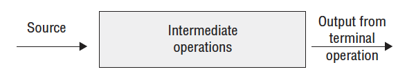
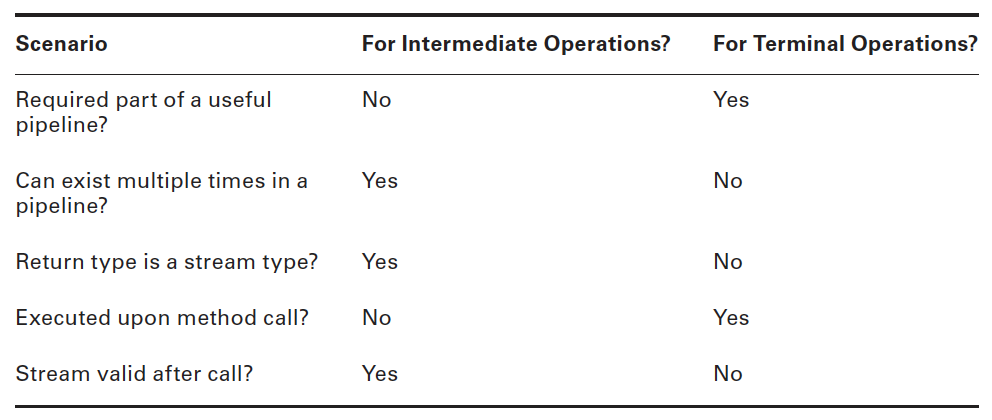
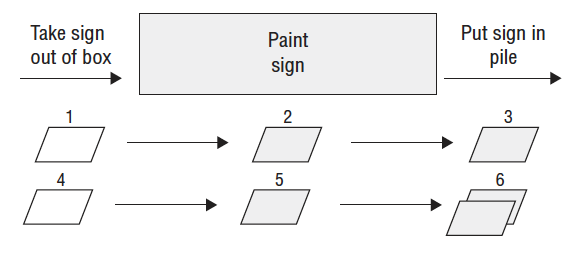
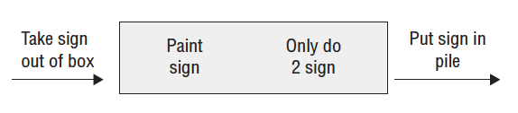
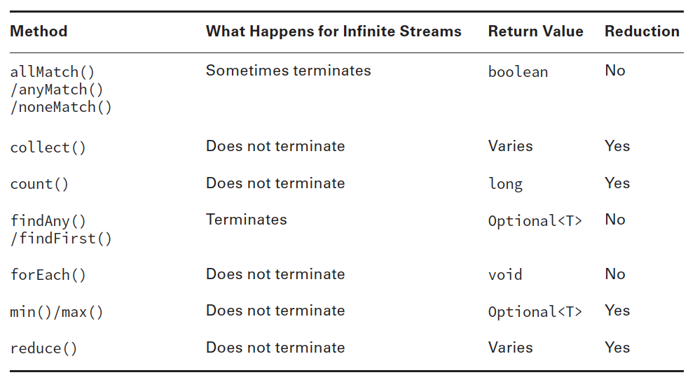
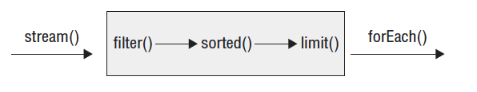
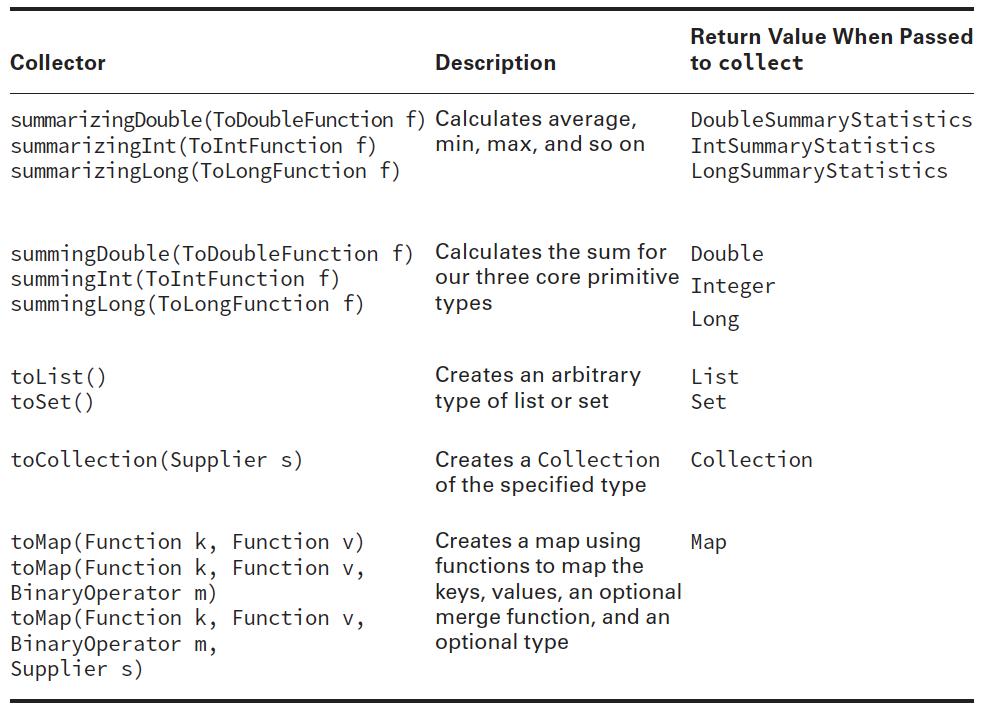

- [8.1 - Create and use lambda expressions](#8-1)
- [8.2 - Use lambda expressions and method references](#8-2)
- [8.3 - Use built-in functional interfaces including Predicate, Consumer, Function, and Supplier](#8-3)
- [8.4 - Use primitive and binary variations of base interfaces of java.util.function package](#8-4)

## <a name="8-1"></a>8.1 - Create and use lambda expressions

### Implementing Functional Interfaces with Lambdas

Now that we have defined a functional interface, we’ll show you how to implement them
using lambda expressions. As we said earlier, a lambda expression is a block of code that
gets passed around, like an anonymous method. Let’s start with a simple CheckTrait
functional interface, which has a single method test(), which takes as input an instance of
an Animal class. The definitions of the class and functional interface are as follows:

````
public class Animal {
    private String species;
    private boolean canHop;
    private boolean canSwim;
    
    public Animal(String speciesName, boolean hopper, boolean swimmer) {
        species = speciesName;
        canHop = hopper;
        canSwim = swimmer;
    }
    
    public boolean canHop() { return canHop; }
    public boolean canSwim() { return canSwim; }
    public String toString() { return species; }
}

public interface CheckTrait {
    public boolean test(Animal a);
}
````

Now that we’ve defined a structure, let’s do something with it. The following simple program
uses a lambda expression to determine if some sample animals match the specified criteria:

````
public class FindMatchingAnimals {
    private static void print(Animal animal, CheckTrait trait) {
        if(trait.test(animal))
            System.out.println(animal);
        }
    public static void main(String[] args) {
        print(new Animal("fish", false, true), a -> a.canHop());
        print(new Animal("kangaroo", true, false), a -> a.canHop());
    }
}
````

For illustrative purposes, the lambda expression chosen for this program is quite simple:

`a -> a.canHop();`

This expression means that Java should call a method with an `Animal` parameter that
returns a boolean value that’s the result of `a.canHop()`. We know all this because we
wrote the code. But how does Java know?

Java relies on context when figuring out what lambda expressions mean. We are
passing this lambda as the second parameter of the `print()` method. That method
expects a `CheckTrait` as the second parameter. Since we are passing a lambda instead,
Java treats `CheckTrait` as a functional interface and tries to map it to the single
abstract method:

`boolean test(Animal a);`

Since this interface’s method takes an Animal, it means the lambda parameter has to be
an Animal. And since that interface’s method returns a boolean, we know that the lambda
returns a boolean.

### Understanding Lambda Syntax

The syntax of lambda expressions is tricky because many parts are optional. These two
lines are equivalent and do the exact same thing:

````
a -> a.canHop()
(Animal a) -> { return a.canHop(); }
````

Let’s look at what is going on here. The left side of the arrow operator -> indicates
the input parameters for the lambda expression. It can be consumed by a functional
interface whose abstract method has the same number of parameters and compatible
data types. The right side is referred to as the body of the lambda expression. It can be
consumed by a functional interface whose abstract method returns a compatible data
type.

Since the syntax of these two expressions is a bit different, let’s look at them more
closely. The fi rst example, shown in Figure 2.1 , has three parts:
- We specify a single parameter with the name a .
- The arrow operator → separates the parameter from the body.
- The body calls a single method and returns the result of that method.

FIGURE 2.1 Lambda syntax omitting optional parts


The second example also has three parts, as shown in Figure 2.2; it’s just more verbose:
- We specify a single parameter with the name a and state that the type is Animal,
wrapping the input parameters in parentheses ().
- The arrow operator −> separates the parameter from the body.
- The body has one or more lines of code, including braces {}, a semicolon ;, and a
return statement.

FIGURE 2.2 Lambda syntax, including optional parts


Let’s review some of the differences between these two figures. The first difference
that you may notice is that Figure 2.2 uses parentheses (), while Figure 2.1 does not.
The parentheses () can be omitted in a lambda expression if there is exactly one input
parameter and the type is not explicitly stated in the expression. This means that
expressions that have zero or more than one input parameter will still require parentheses.
For example, the following are all valid lambda expressions, assuming that there are valid
functional interfaces that can consume them:

````
() -> new Duck()
d -> {return d.quack();}
(Duck d) -> d.quack()
(Animal a, Duck d) -> d.quack()
````

The first lambda expression could be used by a functional interface containing a
method that takes no arguments and returns a Duck object. The second and third lambda
expressions can both be used by a functional interface that takes a Duck as input and
returns whatever the return type of quack() is. The last lambda expression can be used by
a functional interface that takes as input Animal and Duck objects and returns whatever the
return type of quack() is.

#### Spotting Invalid Lambdas

Can you figure out why each of the following lambda expressions is invalid and will not
compile when used as an argument to a method?

````
Duck d -> d.quack() // DOES NOT COMPILE
a,d -> d.quack() // DOES NOT COMPILE
Animal a, Duck d -> d.quack() // DOES NOT COMPILE
````

They each require parentheses ()! As we said, parentheses can be omitted only if there is
exactly one parameter and the data type is not specified.

Next, you see that Figure 2.2 has a pair of statement braces {} around the body of
the lambda expression. This allows you to write multiple lines of code in the body of the
lambda expression, as you might do when working with an if statement or while loop.
What’s tricky here is that when you add braces {}, you must explicitly terminate each
statement in the body with a semicolon;.

In Figure 2.1, we were able to omit the braces {}, semi‐colon;, and return statement,
because this is a special shortcut that Java allows for single‐line lambda bodies. This special
shortcut doesn’t work when you have two or more statements. At least this is consistent
with using {} to create blocks of code elsewhere in Java. When using {} in the body of the
lambda expression, you must use the return statement if the functional interface method
that lambda implements returns a value. Alternatively, a return statement is optional when
the return type of the method is void.
Let’s look at some more examples:

````
() -> true // 0 parameters
a -> {return a.startsWith("test");} // 1 parameter
(String a) -> a.startsWith("test") // 1 parameter
(int x) -> {} // 1 parameter
(int y) -> {return;} // 1 parameter
````

The first example takes no arguments and always returns true. The second and third
examples both take a single String value, using different syntax to accomplish the same
thing. Notice that in the first two examples we mixed and matched syntax between Figure
2.1 and Figure 2.2 by having the first example use parentheses () but no braces {} and
reversing this in the second example. The last two examples are equivalent because they
take an integer value and do not return anything.

Now let’s look at some lambda expressions that take more than one parameter:

````
(a, b) -> a.startsWith("test") // 2 parameters
(String a, String b) -> a.startsWith("test") // 2 parameters
````

These examples both take two parameters and ignore one of them, since there is no rule
that says the lambda expression must use all of the input parameters.

Let’s review some additional lambda expressions to see how your grasp of lambda
syntax is progressing. Do you see what’s wrong with each of these lambda expressions?

````
a, b -> a.startsWith("test") // DOES NOT COMPILE
c -> return 10; // DOES NOT COMPILE
a -> { return a.startsWith("test") } // DOES NOT COMPILE
````

The first lambda needs parentheses () around the parameter list. Remember that the
parentheses are optional only when there is one parameter and it doesn’t have a type
declared. The second line uses the return keyword without using braces {}. The last line is
missing the semicolon after the return statement. The following rewritten lambda expressions
are each valid:

````
(a, b) -> a.startsWith("test")
c -> { return 10; }
a -> { return a.startsWith("test"); }
````

As mentioned, the data types for the input parameters of a lambda expression are
optional. When one parameter has a data type listed, though, all parameters must provide
a data type. The following lambda expressions are each invalid for this reason:

````
(int y, z) -> {int x=1; return y+10; } // DOES NOT COMPILE
(String s, z) -> { return s.length()+z; } // DOES NOT COMPILE
(a, Animal b, c) -> a.getName() // DOES NOT COMPILE
````

If we add or remove all of the data types, then these lambda expressions do compile. For
example, the following rewritten lambda expressions are each valid:

````
(y, z) -> {int x=1; return y+10; }
(String s, int z) -> { return s.length()+z; }
(a, b, c) -> a.getName()
````

There is one more issue you might see with lambdas. We’ve been defining an argument
list in our lambda expressions. Since Java doesn’t allow us to re‐declare a local variable, the
following is an issue:

`(a, b) -> { int a = 0; return 5;} // DOES NOT COMPILE`

We tried to re‐declare a, which is not allowed. By contrast, the following line is
permitted because it uses a different variable name:

`(a, b) -> { int c = 0; return 5;}`

### Using Variables in Lambdas

Lambda expressions can access static variables, instance variables, effectively final
method parameters, and effectively final local variables. How many of those can you find in
this example?

````
1: interface Gorilla { String move(); }
2: class GorillaFamily {
3:      String walk = "walk";
4:      void everyonePlay(boolean baby) {
5:          String approach = "amble";
6:          //approach = "run";
7:
8:          play(() -> walk);
9:          play(() -> baby ? "hitch a ride": "run");
10:         play(() -> approach);
11:     }
12:     void play(Gorilla g) {
13:         System.out.println(g.move());
14:     }
15: }
````

Line 8 uses an instance variable in the lambda. Line 9 uses a method parameter. We
know it is effectively final since there are no reassignments to that variable. Line 10 uses
an effectively final local variable. If we uncomment line 6, there will be a reassignment and
the variable will no longer be effectively final. This would cause a compiler error on line 10
when it tries to access a non–effectively final variable.

The normal rules for access control still apply. For example, a lambda can’t access
private variables in another class. Remember that lambdas can access a subset of variables
that are accessible, but never more than that.

## <a name="8-2"></a>8.2 - Use lambda expressions and method references

### Using Method References

Method references are a way to make the code shorter by reducing some of the code that
can be inferred and simply mentioning the name of the method. Like lambdas, it takes time
to get used to the new syntax.

Suppose that we have a Duck class with name and weight attributes along with this
helper class:

````
public class DuckHelper {
    public static int compareByWeight(Duck d1, Duck d2) {
        return d1.getWeight()—d2.getWeight();
    }
    public static int compareByName(Duck d1, Duck d2) {
        return d1.getName().compareTo(d2.getName());
    }
}
````

Now think about how we would write a Comparator for it if we wanted to sort by
weight. Using lambdas, we’d have the following:

`Comparator<Duck> byWeight = (d1, d2) -> DuckHelper.compareByWeight(d1, d2);`

Not bad. There’s a bit of redundancy, though. The lambda takes two parameters and
does nothing but pass those parameters to another method. Java 8 lets us remove that
redundancy and simply write this:

`Comparator<Duck> byWeight = DuckHelper::compareByWeight;`

The :: operator tells Java to pass the parameters automatically into compareByWeight .

Note: DuckHelper::compareByWeight returns a functional interface and not an
int. Remember that :: is like lambdas, and it is typically used for deferred
execution.

There are four formats for method references:
1. Static methods
1. Instance methods on a particular instance
1. Instance methods on an instance to be determined at runtime
1. Constructors

In this chapter, we will be using three functional interfaces in our examples. We will use
more in the next chapter. Remember from Chapter 2 that Predicate is a functional interface
that takes a single parameter of any type and returns a boolean . Another functional
interface is Consumer , which takes a single parameter of any type and has a void return
type. Finally, Supplier doesn’t take any parameters and returns any type.

Let’s look at some examples from the Java API. In each set, we show the lambda equivalent.
Remember that none of these method references are actually called in the code that
follows. They are simply available to be called in the future. Let’s start with a static method:

````
14: Consumer<List<Integer>> methodRef1 = Collections::sort;
15: Consumer<List<Integer>> lambda1 = l -> Collections.sort(l);
````

On line 14, we call a method with one parameter, and Java knows that it should create a
lambda with one parameter and pass it to the method.
Wait a minute. We know that the sort method is overloaded. How does Java know that we
want to call the version that omits the comparator? With both lambdas and method references,
Java is inferring information from the context. In this case, we said that we were declaring a
Consumer , which takes only one parameter. Java looks for a method that matches that description.

Next up is calling an instance method on a specifi c instance:

````
16: String str = "abc";
17: Predicate<String> methodRef2 = str::startsWith;
18: Predicate<String> lambda2 = s -> str.startsWith(s);
````

Line 17 shows that we want to call string.startsWith() and pass a single parameter to
be supplied at runtime. This would be a nice way of filtering the data in a list. Next, we call
an instance method without knowing the instance in advance:

````
19: Predicate<String> methodRef3 = String::isEmpty;
20: Predicate<String> lambda3 = s -> s.isEmpty();
````

Line 19 says the method that we want to call is declared in String. It looks like a static
method, but it isn’t. Instead, Java knows that isEmpty is an instance method that does not
take any parameters. Java uses the parameter supplied at runtime as the instance on which
the method is called. Finally, we have a constructor reference:

````
21: Supplier<ArrayList> methodRef4 = ArrayList::new;
22: Supplier<ArrayList> lambda4 = () -> new ArrayList();
````

A constructor reference is a special type of method reference that uses new instead of a
method, and it creates a new object.

## <a name="8-3"></a>8.3 - Use built-in functional interfaces including Predicate, Consumer, Function, and Supplier

### Working with Built-In Functional Interfaces

As you remember, a functional interface has exactly one abstract method. All of the
functional interfaces in Table 4.1 were introduced in Java 8 and are provided in the
java.util.function package. The convention here is to use the generic type T for type
parameter. If a second type parameter is needed, the next letter, U, is used. If a distinct
return type is needed, R for return is used for the generic type.

TABLE 4.1 Common functional interfaces


Many other functional interfaces are defi ned in the java.util.function package. They
are for working with primitives, which you’ll see later in the chapter.

You do need to memorize this table. We will give you lots of practice in this section to
help make this memorable. Before you ask, most of the time we don’t actually assign the
implementation of the interface to a variable. The interface name is implied, and it gets
passed directly to the method that needs it. We are introducing the names so that you can
better understand and remember what is going on. Once we get to the streams part of the
chapter, we will assume that you have this down and stop creating the intermediate variable.

You can name a functional interface anything you want. The
only requirements are that it must be a valid interface name and contain a single abstract
method. Table 4.1 is significant because these interfaces are often used in streams and other
classes that come with Java, which is why you need to memorize them for the exam.

Note: There’s an interface called Runnable used
for concurrency the majority of the time. However, it may show up on the
exam when you are asked to recognize which functional interface to use.
All you need to know is that Runnable doesn’t take any parameters, return
any data, or use generics.

### Applying the Predicate Interface

In our earlier example from 8.1, we created a simple functional interface to test an Animal trait:

````
public interface CheckTrait {
public boolean test(Animal a);
}
````

You can imagine that we’d have to create lots of interfaces like this to use lambdas. We
want to test animals, plants, String values, and just about anything else that we come
across.

Luckily, Java recognizes that this is a common problem and provides such an interface
for us. It’s in the package java.util.function, and the gist of it is as follows:

````
public interface Predicate<T> {
public boolean test(T t);
}
````

That looks a lot like our method. The only difference is that it uses type T instead of
Animal. As you may remember from your OCA studies, this is the syntax for an interface
that uses a generic type. If you’re a bit out of practice with generics, don’t worry. We’ll be
reviewing generics in more detail in Chapter 3.

The result of using Predicate is that we no longer need our own functional interface.
The following is a rewrite of our program to use the Predicate class:

````
import java.util.function.Predicate;
public class FindMatchingAnimals {
    private static void print(Animal animal, Predicate<Animal> trait) {
        if(trait.test(animal))
            System.out.println(animal);
    }
    public static void main(String[] args) {
        print(new Animal("fish", false, true), a -> a.canHop());
        print(new Animal("kangaroo", true, false), a -> a.canHop());
    }
}
````

This is very similar to our original program, except that we wrote it with one less
interface.

#### Implementing Predicate and BiPredicate

Predicate is often used when filtering or matching. Both are
very common operations. A BiPredicate is just like a Predicate except that it takes two
parameters instead of one. Omitting any default or static methods, the interfaces are
defined as follows:

````
@FunctionalInterface public class Predicate<T> {
    boolean test(T t);
}
@FunctionalInterface public class BiPredicate<T, U> {
    boolean test(T t, U u);
}
````

It should be old news by now that you can use a Predicate to test a condition:

````
Predicate<String> p1 = String::isEmpty;
Predicate<String> p2 = x -> x.isEmpty();
System.out.println(p1.test(""));
System.out.println(p2.test(""));
````

This prints true twice. More interesting is a BiPredicate. This example also prints true
twice:

````
BiPredicate<String, String> b1 = String::startsWith;
BiPredicate<String, String> b2 = (string, prefix) -> string.startsWith(prefix);
System.out.println(b1.test("chicken", "chick"));
System.out.println(b2.test("chicken", "chick"));
````

The method reference combines two techniques that you’ve already seen. startsWith()
is an instance method. This means that the first parameter in the lambda is used
as the instance on which to call the method. The second parameter is passed to the
startsWith() method itself. This is another example of how method references save a
good bit of typing. The downside is that they are less explicit, and you really have to
understand what is going on!

#### Real World Scenario - Default Methods on Functional Interfaces

By definition, all functional interfaces have a single abstract method. This doesn’t mean
that they have only one method, though. Several of the common functional interfaces
provide a number of helpful default methods. You don’t need to know these for the
exam, but they are helpful when you start building your own implementations out in the
real world.
Suppose that we have these two Predicates:

````
Predicate<String> egg = s -> s.contains("egg");
Predicate<String> brown = s -> s.contains("brown");
````

Now we want a Predicate for brown eggs and another for all other colors of eggs. We
could write this by hand:

````
Predicate<String> brownEggs = s -> s.contains("egg") && s.contains("brown");
Predicate<String> otherEggs = s -> s.contains("egg") && ! s.contains("brown");
````

This works, but it’s not great. It’s a bit long to read, and it contains duplication. What if
we decide the letter e should be capitalized in eggs? We’d have to change it in three variables:
egg, brownEggs, and otherEggs.

A better way to deal with this situation is to use two of the default methods on
Predicate:

````
Predicate<String> brownEggs = egg.and(brown);
Predicate<String> otherEggs = egg.and(brown.negate());
````

Neat! Now we are reusing the logic in the original Predicates to build two new ones. It’s
shorter and clearer what the relationship is between the Predicates. We can also change
the spelling of egg in one place, and the other two objects will have new logic because
they reference it.

### Implementing Supplier

A Supplier is used when you want to generate or supply values without taking any input.
The Supplier interface is defined as

````
@FunctionalInterface public class Supplier<T> {
public T get();
}
````

On the OCA, you learned that you could create a date using a factory. If you’ve forgotten
how, don’t worry. We will be covering it again in Chapter 5 , “Dates, Strings, and
Localization,” in this book. You can use a Supplier to call this factory:

````
Supplier<LocalDate> s1 = LocalDate::now;
Supplier<LocalDate> s2 = () -> LocalDate.now();
LocalDate d1 = s1.get();
LocalDate d2 = s2.get();
System.out.println(d1);
System.out.println(d2);
````

This example prints a date such as 2015–06–20 twice. It’s also a good opportunity to
review static method references. The LocalDate::now method reference is used to create
a Supplier to assign to an intermediate variable s1. A Supplier is often used when constructing
new objects. For example, we can print two empty StringBuilders:

````
Supplier<StringBuilder> s1 = StringBuilder::new;
Supplier<StringBuilder> s2 = () -> new StringBuilder();

System.out.println(s1.get());
System.out.println(s2.get());
````

This time, we use a constructor reference to create the object. We’ve been using generics
to declare what type of Supplier we are using. This can get a little long to read. Can you
figure out what the following does? Just take it one step at a time.

````
Supplier<ArrayList<String>> s1 = ArrayList<String>::new;
ArrayList<String> a1 = s1.get();
System.out.println(a1);
````

We have a Supplier of a certain type. That type happens to be ArrayList<String>.
Then calling get() creates a new instance of ArrayList<String>, which is the generic type
of the Supplier—in other words, a generic that contains another generic. It’s not hard to
understand, so just look at the code carefully when this type of thing comes up.

Notice how we called get() on the functional interface. What would happen if we tried
to print out s1 itself?

`System.out.println(s1);` prints something like this:

`functionalinterface.BuiltIns$$Lambda$1/791452441@1fb3ebeb`

That’s the result of calling toString() on a lambda. Yuck. This actually does mean
something. Our test class is named BuiltIns, and it is in a package that we created named
functionalinterface. Then comes $$, which means that the class doesn’t exist in a class
file on the file system. It exists only in memory. You don’t need to worry about the rest.

### Implementing Consumer and BiConsumer

You use a Consumer when you want to do something with a parameter but not return anything.
BiConsumer does the same thing except that it takes two parameters. Omitting the
default methods, the interfaces are defined as follows:

````
@FunctionalInterface public class Consumer<T> {
    void accept(T t);
}
@FunctionalInterface public class BiConsumer<T, U> {
    void accept(T t, U u);
}
````

You used a Consumer in Chapter 3 with forEach . Here’s that example actually being
assigned to the Consumer interface:

````
Consumer<String> c1 = System.out::println;
Consumer<String> c2 = x -> System.out.println(x);
c1.accept("Annie");
c2.accept("Annie");
````

This example prints Annie twice. You might notice that the Consumer examples used the
method reference System.out::println . That’s OK. Java uses the context of the lambda to
determine which overloaded println() method it should call.

BiConsumer is called with two parameters. They don’t have to be the same type. For
example, we can put a key and a value in a map using this interface:

````
Map<String, Integer> map = new HashMap<>();
BiConsumer<String, Integer> b1 = map::put;
BiConsumer<String, Integer> b2 = (k, v) -> map.put(k, v);
b1.accept("chicken", 7);
b2.accept("chick", 1);
System.out.println(map);
````

The output is `{chicken=7, chick=1}`, which shows that both BiConsumer implementations
did get called. This time we used an instance method reference since we want to call a
method on the local variable map. It’s also the fi rst time that we passed two parameters to a
method reference. The code to instantiate b1 is a good bit shorter than the code for b2. This
is probably why the exam is so fond of method references.

As another example, we use the same type for both generic parameters:

````
Map<String, String> map = new HashMap<>();
BiConsumer<String, String> b1 = map::put;
BiConsumer<String, String> b2 = (k, v) -> map.put(k, v);
b1.accept("chicken", "Cluck");
b2.accept("chick", "Tweep");
System.out.println(map);
````

The output is `{chicken=Cluck, chick=Tweep}`, which shows that a BiConsumer can use
the same type for both the T and U generic parameters.

### Implementing Function and BiFunction

A Function is responsible for turning one parameter into a value of a potentially different
type and returning it. Similarly, a BiFunction is responsible for turning two parameters
into a value and returning it. Omitting any default or static methods, the interfaces are
defined as the following:

````
@FunctionalInterface public class Function<T, R> {
    R apply(T t);
}
@FunctionalInterface public class BiFunction<T, U, R> {
    R apply(T t, U u);
}
````

For example, this function converts a String to the length of the String:

````
Function<String, Integer> f1 = String::length;
Function<String, Integer> f2 = x -> x.length();
System.out.println(f1.apply("cluck")); // 5
System.out.println(f2.apply("cluck")); // 5
````

This function turns a String into an Integer. Well, technically it turns the String into
an int, which is autoboxed into an Integer. The types don’t have to be different. The following
combines two String objects and produces another String:

````
BiFunction<String, String, String> b1 = String::concat;
BiFunction<String, String, String> b2 = (string, toAdd) -> string.concat(toAdd);
System.out.println(b1.apply("baby ", "chick")); // baby chick
System.out.println(b2.apply("baby ", "chick")); // baby chick
````

The first two types in the BiFunction are the input types. The third is the result type.
For the method reference, the first parameter is the instance that concat() is called on and
the second is passed to concat().

### Implementing UnaryOperator and BinaryOperator

UnaryOperator and BinaryOperator are a special case of a function. They require all type
parameters to be the same type. A UnaryOperator transforms its value into one of the
same type. For example, incrementing by one is a unary operation. In fact, UnaryOperator
extends Function. A BinaryOperator merges two values into one of the same type. Adding
two numbers is a binary operation. Similarly, BinaryOperator extends BiFunction.
Omitting any default or static methods, the interfaces are defined as follows:

````
@FunctionalInterface public class UnaryOperator<T>
    extends Function<T, T> { }
@FunctionalInterface public class BinaryOperator<T>
    extends BiFunction<T, T, T> { }
````

This means that method signatures look like this:

````
T apply(T t);
T apply(T t1, T t2);
````

If you look at the Javadoc, you’ll notice that these methods are actually declared on the
Function/BiFunction superclass. The generic declarations on the subclass are what force
the type to be the same. For the unary example, notice how the return type is the same type
as the parameter:

````
UnaryOperator<String> u1 = String::toUpperCase;
UnaryOperator<String> u2 = x -> x.toUpperCase();
System.out.println(u1.apply("chirp"));
System.out.println(u2.apply("chirp"));
````

This prints CHIRP twice. We don’t need to specify the return type in the generics because
UnaryOperator requires it to be the same as the parameter. And now for the binary example:

````
BinaryOperator<String> b1 = String::concat;
BinaryOperator<String> b2 = (string, toAdd) -> string.concat(toAdd);
System.out.println(b1.apply("baby ", "chick")); // baby chick
System.out.println(b2.apply("baby ", "chick")); // baby chick
````

Notice that this does the same thing as the BiFunction example. The code is more succinct,
which shows the importance of using the correct functional interface. It’s nice to have
one generic type specified instead of three.

### Checking Functional Interfaces

It’s really important to know the number of parameters, types, return value, and method
name for each of the functional interfaces. Now would be a good time to memorize
Table 4.1 if you haven’t done so already. Let’s do some examples to practice.
What functional interface would you use in these three situations?

- Returns a String without taking any parameters
- Returns a Boolean and takes a String
- Returns an Integer and takes two Integers

Ready? Think about your answer is before continuing. Really. You have to know
this cold. OK. The first one is a Supplier because it generates an object and takes zero
parameters. The second one is a Function because it takes one parameter and returns
another type. It’s a little tricky. You might think it is a Predicate. Note that a Predicate
returns a boolean primitive and not a Boolean object. Finally, the third one is either a
BinaryOperator or BiFunction. Since BinaryOperator is a special case of BiFunction,
either is a correct answer. BinaryOperator is the better answer of the two since it is more
specific.

Let’s try this exercise again but with code. It’s harder with code. With code, the first
thing you do is look at how many parameters the lambda takes and whether there is a
return value. What functional interface would you use to fill in the blank for these?

````
6: _____<List> ex1 = x -> "".equals(x.get(0));
7: _____<Long> ex2 = (Long l) -> System.out.println(l);
8: _____ <String, String> ex3 = (s1, s2) -> false;
````

Again, think about the answers before continuing. Ready? Line 6 passes one
String parameter to the lambda and returns a boolean. This tells us that it is a
Predicate or Function. Since the generic declaration has only one parameter, it is a
Predicate.

Line 7 passes one Long parameter to the lambda and doesn’t return anything. This tells
us that it is a Consumer. Line 8 takes two parameters and returns a boolean. When you see
a boolean returned, think Predicate unless the generics specify a Boolean return type. In
this case, there are two parameters, so it is a BiPredicate.

Are you finding these easy? If not, review Table 4.1 again. We aren’t kidding. You need
to know the table really well. Now that you are fresh from studying the table, we are going
to play “identify the error.” These are meant to be tricky:

````
6: Function<List<String>> ex1 = x -> x.get(0); // DOES NOT COMPILE
7: UnaryOperator<Long> ex2 = (Long l) -> 3.14; // DOES NOT COMIPLE
8: Predicate ex4 = String::isEmpty; // DOES NOT COMPILE
````

Line 6 claims to be a Function. A Function needs to specify two generics—the input
parameter type and the return value type. The return value type is missing from line 6,
causing the code not to compile. Line 7 is a UnaryOperator, which returns the same type
as it is passed in. The example returns a double rather than a Long, causing the code not to
compile.

Line 8 is missing the generic for Predicate. This makes the parameter that was passed
an Object rather than a String. The lambda expects a String because it calls a method
that exists on String rather than Object. Therefore, it doesn’t compile.

## <a name="8-4"></a>8.4 - Use primitive and binary variations of base interfaces of java.util.function package

### Using Streams

A stream in Java is a sequence of data. A stream pipeline is the operations that run on a
stream to produce a result. Think of a stream pipeline as an assembly line in a factory.
Suppose that we were running an assembly line to make signs for the animal exhibits at
the zoo. We have a number of jobs. It is one person’s job to take signs out of a box. It is a
second person’s job to paint the sign. It is a third person’s job to stencil the name of the animal
on the sign. It is a fourth person’s job to put the completed sign in a box to be carried
to the proper exhibit.

Notice that the second person can’t do anything until one sign has been taken out of the
box by the first person. Similarly, the third person can’t do anything until one sign has been
painted, and the fourth person can’t do anything until it is stenciled.

The assembly line for making signs is finite. Once we process the contents of our box of
signs, we are finished. Finite streams have a limit. Other assembly lines essentially run forever,
like one for food production. Of course, they do stop at some point when the factory
closes down, but pretend that doesn’t happen. Or think of a sunrise/sunset cycle as infinite,
since it doesn’t end for an inordinately large period of time.

Another important feature of an assembly line is that each person touches each element
to do their operation and then that piece of data is gone. It doesn’t come back. The next
person deals with it at that point. This is different than the lists and queues that you saw in
the last chapter. With a list, you can access any element at any time. With a queue, you are
limited in which elements you can access, but all of the elements are there. With streams,
the data isn’t generated up front—it is created when needed.

Many things can happen in the assembly line stations along the way. In programming,
these are called stream operations. Just like with the assembly line, operations occur in a
pipeline. Someone has to start and end the work, and there can be any number of stations
in between. After all, a job with one person isn’t an assembly line! There are three parts to
a stream pipeline, as shown in Figure 4.2:

- Source: Where the stream comes from.
- Intermediate operations: Transforms the stream into another one. There can be as few
or as many intermediate operations as you’d like. Since streams use lazy evaluation, the
intermediate operations do not run until the terminal operation runs.
- Terminal operation: Actually produces a result. Since streams can be used only once,
the stream is no longer valid after a terminal operation completes.

FIGURE 4.2 Stream pipeline



Notice that the intermediate operations are a black box. When viewing the assembly
line from the outside, you care only about what comes in and goes out. What happens in
between is an implementation detail.

You will need to know the differences between intermediate and terminal operations
well. Make sure that you can fill in Table 4.3.

TABLE 4.3 Intermediate vs. terminal operations



A factory typically has a foreman who oversees the work. Java serves as the foreman
when working with stream pipelines. This is a really important role, especially when
dealing with lazy evaluation and infinite streams. Think of declaring the stream as giving
instructions to the foreman. As the foreman finds out what needs to be done, he sets up the
stations and tells the workers what their duties will be. However, the workers do not start
until the foreman tells them to begin. The foreman waits until he sees the terminal operation
to actually kick off the work. He also watches the work and stops the line as soon as
work is complete.

Let’s look at a few examples of this. We aren’t using code in these examples because it
is really important to understand this stream pipeline concept before starting to write the
code. Figure 4.3 shows a stream pipeline with one intermediate operation. Let’s take a look
at what happens from the point of the view of the foreman. First, he sees that the source is
taking signs out of the box. The foreman sets up a worker at the table to unpack the box
and says to await a signal to start. Then the foreman sees the intermediate operation to
paint the sign. He sets up a worker with paint and says to await a signal to start. Finally,
the foreman sees the terminal operation to put the signs into a pile. He sets up a worker to
do this and yells out that all three workers should start.

FIGURE 4.3 Steps in running a stream pipeline



Suppose that there are two signs in the box. Step 1 is the first worker taking one sign out
of the box and handing it to the second worker. Step 2 is the second worker painting it and
handing it to the third worker. Step 3 is the third worker putting it in the pile. Steps 4–6
are this same process for the other sign. Then the foreman sees that there are no more signs
left and shuts down the entire enterprise.

The foreman is smart. He can make decisions about how to best do the work based on
what is needed. As an example, let’s explore the stream pipeline in Figure 4.4.

FIGURE 4. 4 A stream pipeline with a limit



The foreman still sees a source of taking signs out of the box and assigns a worker to do
that on command. He still sees an intermediate operation to paint and sets up another worker
with instructions to wait and then paint. Then he sees an intermediate step that we need only
two signs. He sets up a worker to count the signs that go by and notify him when the worker
has seen two. Finally, he sets up a worker for the terminal operation to put the signs in a pile.

This time, suppose that there are 10 signs in the box. We start out like last time. The first
sign makes its way down the pipeline. The second sign also makes its way down the pipeline.
When the worker in charge of counting sees the second sign, she tells the foreman. The
foreman lets the terminal operation worker finish her task and then yells out “stop the line.”
It doesn’t matter that that there are eight more signs in the box. We don’t need them, so it
would be unnecessary work to paint them. And we all want to avoid unnecessary work!

Similarly, the foreman would have stopped the line after the first sign if the terminal
operation was to find the first sign that gets created.

In the following sections, we will cover the three parts of the pipeline. We will also discuss
special types of streams for primitives and how to print a stream.

### Creating Stream Sources

In Java, the Stream interface is in the java.util.stream package. There are a few ways to
create a finite stream:

````
1: Stream<String> empty = Stream.empty(); // count = 0
2: Stream<Integer> singleElement = Stream.of(1); // count = 1
3: Stream<Integer> fromArray = Stream.of(1, 2, 3); // count = 2
````

Line 1 shows how to create an empty stream. Line 2 shows how to create a stream with
a single element. Line 3 shows how to create a stream from an array. You’ve undoubtedly
noticed that there isn’t an array on line 3. The method signature uses varargs, which let you
specify an array or individual elements. Since streams are new in Java 8, most code that’s
already written uses lists. Java provides a convenient way to convert from a list to a stream:

````
4: List<String> list = Arrays.asList("a", "b", "c");
5: Stream<String> fromList = list.stream();
6: Stream<String> fromListParallel = list.parallelStream();
````

Line 5 shows that it is a simple method call to create a stream from a list. Line 6 does
the same, except that it creates a stream that is allowed to process elements in parallel. This
is a great feature because you can write code that uses parallelism before even learning
what a thread is. Using parallel streams is like setting up multiple tables of workers who
are able to do the same task. Painting would be a lot faster if we could have fi ve painters
painting different signs at once. Just keep in mind that it isn’t worth working in parallel for
small streams. There is an overhead cost in coordinating the work among all of the workers
operating in parallel. For small amounts of work, it is faster just to do it sequentially.

So far, this isn’t particularly impressive. We could do all this with lists. We can’t create
an infinite list, though, which makes streams more powerful:

````
7: Stream<Double> randoms = Stream.generate(Math::random);
8: Stream<Integer> oddNumbers = Stream.iterate(1, n -> n + 2);
````

Line 7 generates a stream of random numbers. How many random numbers? However
many you need. If you call randoms.forEach(System.out::println), the program will
print random numbers until you kill it. Later in the chapter, you’ll learn about operations
like limit() to turn the infinite stream into a finite stream.

Line 8 gives you more control. iterate() takes a seed or starting value as the first
parameter. This is the fi rst element that will be part of the stream. The other parameter is a
lambda expression that gets passed the previous value and generates the next value. As with
the random numbers example, it will keep on producing odd numbers as long as you need
them.

Note: If you try to call System.out.println(stream), you’ll get something like
`java.util.stream.ReferencePipeline$3@4517d9a3`. This is different than
a Collection where you see the contents. You don’t need to know this for
the exam. We mention it so that you aren’t caught by surprise when writing
code for practice.

### Using Common Terminal Operations

You can perform a terminal operation without any intermediate operations but not the
other way around. This is why we will talk about terminal operations first. Reductions are
a special type of terminal operation where all of the contents of the stream are combined
into a single primitive or Object. For example, you might have an int or a Collection.

Table 4.4 summarizes this section. Feel free to use it as a guide to remember the most
important points as we go through each one individually. We explain them from easiest to
hardest rather than alphabetically.

TABLE 4.4 Terminal stream operations



#### count()

The count() method determines the number of elements in a finite stream. For an infinite
stream, it hangs. Why? Count from 1 to infinity and let us know when you are finished. Or
rather don’t do that because we’d rather you study for the exam than spend the rest of your
life counting. count() is a reduction because it looks at each element in the stream and
returns a single value. The method signature is this:

`long count()`

This example shows calling count() on a finite stream:

````
Stream<String> s = Stream.of("monkey", "gorilla", "bonobo");
System.out.println(s.count()); // 3
````

#### min() and max()

The min() and max() methods allow you to pass a custom comparator and find the smallest
or largest value in a finite stream according to that sort order. Like count(), min() and
max() hang on an infinite stream because they cannot be sure that a smaller or larger value
isn’t coming later in the stream. Both methods are reductions because they return a single
value after looking at the entire stream. The method signatures are as follows:

````
Optional<T> min(<? super T> comparator)
Optional<T> max(<? super T> comparator)
````

This example finds the animal with the fewest letters in its name:

````
Stream<String> s = Stream.of("monkey", "ape", "bonobo");
Optional<String> min = s.min((s1, s2) -> s1.length()—s2.length());
min.ifPresent(System.out::println); // ape
````

Notice that the code returns an Optional rather than the value. This allows the method
to specify that no minimum or maximum was found. We use the Optional method and a
method reference to print out the minimum only if one is found. As an example of where
there isn’t a minimum, let’s look at an empty stream:

````
Optional<?> minEmpty = Stream.empty().min((s1, s2) -> 0);
System.out.println(minEmpty.isPresent()); // false
````

Since the stream is empty, the comparator is never called and no value is present in the
Optional.

#### findAny() and findFirst()

The findAny() and findFirst() methods return an element of the stream unless the stream
is empty. If the stream is empty, they return an empty Optional. This is the first method
you’ve seen that works with an infinite stream. Since Java generates only the amount of
stream you need, the infinite stream needs to generate only one element. findAny() is useful
when you are working with a parallel stream. It gives Java the flexibility to return to you
the first element it comes by rather than the one that needs to be first in the stream based
on the intermediate operations.

These methods are terminal operations but not reductions. The reason is that they sometimes
return without processing all of the elements. This means that they return a value
based on the stream but do not reduce the entire stream into one value.
The method signatures are these:

````
Optional<T> findAny()
Optional<T> findFirst()
````

This example finds an animal:

````
Stream<String> s = Stream.of("monkey", "gorilla", "bonobo");
Stream<String> infinite = Stream.generate(() -> "chimp");
s.findAny().ifPresent(System.out::println); // monkey
infinite.findAny().ifPresent(System.out::println); // chimp
````

Finding any one match is more useful than it sounds. Sometimes we just want to sample the
results and get a representative element, but we don’t need to waste the processing generating
them all. After all, if we plan to work with only one element, why bother looking at more?

#### allMatch() , anyMatch() and noneMatch()

The allMatch(), anyMatch() and noneMatch() methods search a stream and return information
about how the stream pertains to the predicate. These may or may not terminate
for infinite streams. It depends on the data. Like the fi nd methods, they are not reductions
because they do not necessarily look at all of the elements.
The method signatures are as follows:

````
boolean anyMatch(Predicate <? super T> predicate)
boolean allMatch(Predicate <? super T> predicate)
boolean noneMatch(Predicate <? super T> predicate)
````

This example checks whether animal names begin with letters:

````
List<String> list = Arrays.asList("monkey", "2", "chimp");
Stream<String> infinite = Stream.generate(() -> "chimp");
Predicate<String> pred = x -> Character.isLetter(x.charAt(0));
System.out.println(list.stream().anyMatch(pred)); // true
System.out.println(list.stream().allMatch(pred)); // false
System.out.println(list.stream().noneMatch(pred)); // false
System.out.println(infinite.anyMatch(pred)); // true
````

This shows that we can reuse the same predicate, but we need a different stream each time.
anyMatch() returns true because two of the three elements match. allMatch() returns false
because one doesn’t match. noneMatch() also returns false because one matches. On the infinite list, one match is found, so the call terminates. If we called noneMatch() or allMatch() ,
they would run until we killed the program.

Note: Remember that allMatch(), anyMatch(), and noneMatch() return a boolean. 
By contrast, the find methods return an Optional because they return an element of the stream.

#### forEach()

A looping construct is available. As expected, calling forEach() on an infinite stream does
not terminate. Since there is no return value, it is not a reduction.

Before you use it, consider if another approach would be better. Developers who learned
to write loops fi rst tend to use them for everything. For example, a loop with an if statement
should be a filter instead.
The method signature is the following:

`void forEach(Consumer<? super T> action)`

Notice that this is the only terminal operation with a return type of void . If you
want something to happen, you have to make it happen in the loop. Here’s one way
to print the elements in the stream. There are other ways, which we cover later in the
chapter.

````
Stream<String> s = Stream.of("Monkey", "Gorilla", "Bonobo");
s.forEach(System.out::print); // MonkeyGorillaBonobo
````

Note: Remember that you can call forEach() directly on a Collection or on a
Stream. Don’t get confused on the exam when you see both approaches.

Notice that you can’t use a traditional for loop on a stream:

````
Stream s = Stream.of(1);
for (Integer i: s) {} // DOES NOT COMPILE
````

While forEach() sounds like a loop, it is really a terminal operator for streams. Streams
cannot use a traditional for loop to run because they don’t implement the Iterable interface.

#### reduce()

The reduce() method combines a stream into a single object. As you can tell from the
name, it is a reduction. The method signatures are these:

````
T reduce(T identity, BinaryOperator<T> accumulator)
Optional<T> reduce(BinaryOperator<T> accumulator)
<U> U reduce(U identity, BiFunction<U,? super T,U> accumulator,
    BinaryOperator<U> combiner)
````

Let’s take them one at a time. The most common way of doing a reduction is to start
with an initial value and keep merging it with the next value. Think about how you would
concatenate an array of String s into a single String without functional programming. It
might look something like this:

````
String[] array = new String[] { "w", "o", "l", "f" };
String result = "";
for (String s: array) result = result + s;
System.out.println(result);
````

The initial value of an empty String is the identity. The accumulator combines the current
result with the current String . With lambdas, we can do the same thing with a stream
and reduction:

````
Stream<String> stream = Stream.of("w", "o", "l", "f");
String word = stream.reduce("", (s, c) -> s + c);
System.out.println(word); // wolf
````

Notice how we still have the empty String as the identity. We also still concatenate the
String s to get the next value. We can even rewrite this with a method reference:

````
Stream<String> stream = Stream.of("w", "o", "l", "f");
String word = stream.reduce("", String::concat);
System.out.println(word); // wolf
````

Let’s try another one. Can you write a reduction to multiply all of the Integer objects in
a stream? Try it. Our solution is shown here:

````
Stream<Integer> stream = Stream.of(3, 5, 6);
System.out.println(stream.reduce(1, (a, b) -> a*b));
````

We set the identity to 1 and the accumulator to multiplication. In many cases, the identity
isn’t really necessary, so Java lets us omit it. When you don’t specify an identity, an
Optional is returned because there might not be any data. There are three choices for what
is in the Optional:

- If the stream is empty, an empty Optional is returned.
- If the stream has one element, it is returned.
- If the stream has multiple elements, the accumulator is applied to combine them.

The following illustrates each of these scenarios:

````
BinaryOperator<Integer> op = (a, b) -> a * b;
Stream<Integer> empty = Stream.empty();
Stream<Integer> oneElement = Stream.of(3);
Stream<Integer> threeElements = Stream.of(3, 5, 6);
empty.reduce(op).ifPresent(System.out::print); // no output
oneElement.reduce(op).ifPresent(System.out::print); // 3
threeElements.reduce(op).ifPresent(System.out::print); // 90
````

Why are there two similar methods? Why not just always require the identity? Java
could have done that. However, sometimes it is nice to differentiate the case where the
stream is empty rather than the case where there is a value that happens to match the identity
being returned from calculation. The signature returning an Optional lets us differentiate
these cases. For example, we might return Optional.empty() when the stream is empty
and Optional.of(3) when there is a value.

The third method signature is used when we are processing collections in parallel. It
allows Java to create intermediate reductions and then combine them at the end. In our
example, it looks similar. While we aren’t actually using a parallel stream here, Java
assumes that a stream might be parallel. This is helpful because it lets us switch to a parallel
stream easily in the future:

````
BinaryOperator<Integer> op = (a, b) -> a * b;
Stream<Integer> stream = Stream.of(3, 5, 6);
System.out.println(stream.reduce(1, op, op)); // 90
````

#### collect()

The collect() method is a special type of reduction called a mutable reduction. It is
more efficient than a regular reduction because we use the same mutable object while
accumulating. Common mutable objects include StringBuilder and ArrayList. This is a
really useful method, because it lets us get data out of streams and into another form. The
method signatures are as follows:

````
<R> R collect(Supplier<R> supplier, BiConsumer<R, ? super T> accumulator,
BiConsumer<R, R> combiner)
<R,A> R collect(Collector<? super T, A,R> collector)
````

Let’s start with the first signature, which is used when we want to code specifically how
collecting should work. Our wolf example from reduce can be converted to use collect():

````
Stream<String> stream = Stream.of("w", "o", "l", "f");
StringBuilder word = stream.collect(StringBuilder::new,
StringBuilder::append, StringBuilder:append)
````

The first parameter is a Supplier that creates the object that will store the results as we
collect data. Remember that a Supplier doesn’t take any parameters and returns a value.
In this case, it constructs a new StringBuilder.

The second parameter is a BiConsumer, which takes two parameters and doesn’t return
anything. It is responsible for adding one more element to the data collection. In this example,
it appends the next String to the StringBuilder.

The final parameter is another BiConsumer. It is responsible for taking two data collections
and merging them. This is useful when we are processing in parallel. Two smaller
collections are formed and then merged into one. This would work with StringBuilder
only if we didn’t care about the order of the letters. In this case, the accumulator and combiner
have similar logic.

Now let’s look at an example where the logic is different in the accumulator and
combiner:

````
Stream<String> stream = Stream.of("w", "o", "l", "f");
TreeSet<String> set = stream.collect(TreeSet::new, TreeSet::add,
TreeSet::addAll);
System.out.println(set); // [f, l, o, w]
````

The collector has three parts as before. The supplier creates an empty TreeSet. The
accumulator adds a single String from the Stream to the TreeSet. The combiner adds all
of the elements of one TreeSet to another in case the operations were done in parallel and
need to be merged.

We started with the long signature because that’s how you implement your own
collector. It is important to know how to do this for the exam and to understand how
collectors work. In practice, there are many common collectors that come up over and
over. Rather than making developers keep reimplementing the same ones, Java provides
an interface with common collectors. This approach also makes the code easier to read
because it is more expressive. For example, we could rewrite the previous example as
follows:

````
Stream<String> stream = Stream.of("w", "o", "l", "f");
TreeSet<String> set = stream.collect(Collectors.toCollection(TreeSet::new));
System.out.println(set); // [f, l, o, w]
````

If we didn’t need the set to be sorted, we could make the code even shorter:

````
Stream<String> stream = Stream.of("w", "o", "l", "f");
Set<String> set = stream.collect(Collectors.toSet());
System.out.println(set); // [f, w, l, o]
````

You might get different output for this last one since toSet() makes no guarantees as
to which implementation of Set you’ll get. It is likely to be a HashSet , but you shouldn’t
expect or rely on that.

Note: The exam expects you to know about common predefined collectors in
addition to being able to write your own by passing a supplier, accumulator,
and combiner.

### Using Common Intermediate Operations

Unlike a terminal operation, intermediate operations deal with infi nite streams simply by
returning an infi nite stream. Since elements are produced only as needed, this works fi ne.
The assembly line worker doesn’t need to worry about how many more elements are coming
through and instead can focus on the current element.

#### filter()

The filter() method returns a Stream with elements that match a given expression. Here
is the method signature:

`Stream<T> filter(Predicate<? super T> predicate)`

This operation is easy to remember and very powerful because we can pass any
Predicate to it. For example, this fi lters all elements that begin with the letter m :

````
Stream<String> s = Stream.of("monkey", "gorilla", "bonobo");
s.filter(x -> x.startsWith("m")).forEach(System.out::print); // monkey
````

#### distinct()

The distinct() method returns a stream with duplicate values removed. The duplicates do
not need to be adjacent to be removed. As you might imagine, Java calls equals() to determine
whether the objects are the same. The method signature is as follows:

`Stream<T> distinct()`

Here’s an example:

````
Stream<String> s = Stream.of("duck", "duck", "duck", "goose");
s.distinct().forEach(System.out::print); // duckgoose
````

#### limit() and skip()

The limit() and skip() methods make a Stream smaller. They could make a fi nite stream
smaller, or they could make a fi nite stream out of an infi nite stream. The method signatures
are shown here:

````
Stream<T> limit(int maxSize)
Stream<T> skip(int n)
````

The following code creates an infinite stream of numbers counting from 1. The skip()
operation returns an infinite stream starting with the numbers counting from 6, since it
skips the fi rst fi ve elements. The limit() call takes the fi rst two of those. Now we have a
finite stream with two elements:

````
Stream<Integer> s = Stream.iterate(1, n -> n + 1);
s.skip(5).limit(2).forEach(System.out::print); // 67
````

#### map()

The map() method creates a one-to-one mapping from the elements in the stream to the elements
of the next step in the stream. The method signature is as follows:

`<R> Stream<R> map(Function<? super T, ? extends R> mapper)`

This one looks more complicated than the others you have seen. It uses the lambda
expression to figure out the type passed to that function and the one returned. The return
type is the stream that gets returned.

Note: The map() method on streams is for transforming data. Don’t confuse it
with the Map interface, which maps keys to values.

As an example, this code converts a list of String objects to a list of Integer s representing
their lengths:

````
Stream<String> s = Stream.of("monkey", "gorilla", "bonobo");
s.map(String::length).forEach(System.out::print); // 676
````

Remember that String::length is shorthand for the lambda x -> x.length(), which
clearly shows it is a function that turns a String into an Integer.

#### flatMap()

The flatMap() method takes each element in the stream and makes any elements it contains
top-level elements in a single stream. This is helpful when you want to remove empty
elements from a stream or you want to combine a stream of lists. We are showing you the
method signature for consistency with the other methods, just so you don’t think we are
hiding anything. You aren’t expected to be able to read this:

`<R> Stream<R> flatMap(Function<? super T, ? extends Stream<? extends R>> mapper)`

This gibberish basically says that it returns a Stream of the type that the function contains
at a lower level. Don’t worry about the signature. It’s a headache.

What you should understand is the example. This gets all of the animals into the same
level along with getting rid of the empty list:

````
List<String> zero = Arrays.asList();
List<String> one = Arrays.asList("Bonobo");
List<String> two = Arrays.asList("Mama Gorilla", "Baby Gorilla");
Stream<List<String>> animals = Stream.of(zero, one, two);

animals.flatMap(l -> l.stream()).forEach(System.out::println);
````

Here’s the output:

````
Bonobo
Mama Gorilla
Baby Gorilla
````

As you can see, it removed the empty list completely and changed all elements of each
list to be at the top level of the stream.

#### sorted()

The sorted() method returns a stream with the elements sorted. Just like sorting arrays,
Java uses natural ordering unless we specify a comparator. The method signatures are
these:

````
Stream<T> sorted()
Stream<T> sorted(Comparator<? super T> comparator)
````

Calling the first signature uses the default sort order:

````
Stream<String> s = Stream.of("brown-", "bear-");
s.sorted().forEach(System.out::print); // bear-brown
````

Remember that we can pass a lambda expression as the comparator. For example, we
can pass a Comparator implementation:

````
Stream<String> s = Stream.of("brown bear-", "grizzly-");
s.sorted(Comparator.reverseOrder())
    .forEach(System.out::print); // grizzly-brown bear-
````

Here we passed a Comparator to specify that we want to sort in the reverse of natural
sort order. Ready for a tricky one? Do you see why this doesn’t compile?

`s.sorted(Comparator::reverseOrder); // DOES NOT COMPILE`

Take a look at the method signatures again. Comparator is a functional interface.
This means that we can use method references or lambdas to implement it. The
Comparator interface implements one method that takes two String parameters and
returns an int . However, Comparator::reverseOrder doesn’t do that. It is a reference
to a function that takes zero parameters and returns a Comparator . This is not compatible
with the interface. This means that we have to use a method and not a method
reference. We bring this up to remind you that you really do need to know method references
well.

#### peek()

The peek() method is our fi nal intermediate operation. It is useful for debugging because it
allows us to perform a stream operation without actually changing the stream. The method
signature is as follows:

`Stream<T> peek(Consumer<? super T> action)`

The most common use for peek() is to output the contents of the stream as it goes by.
Suppose that we made a typo and counted bears beginning with the letter g instead of b .
We are puzzled why the count is 1 instead of 2. We can add a peek() to fi nd out why:

````
Stream<String> stream = Stream.of("black bear", "brown bear", "grizzly");
long count = stream.filter(s -> s.startsWith("g"))
    .peek(System.out::println).count(); // grizzly
System.out.println(count); // 1
````

Note: When working with a Queue , peek() looks only at the first element. In a
stream, peek() looks at each element that goes through that part of the
stream pipeline. It’s like having a worker take notes on how a particular
step of the process is doing.

### Putting Together the Pipeline

Streams allow you to use chaining and express what you want to accomplish rather than
how to do so. Let’s say that we wanted to get the first two names alphabetically that are
four characters long. In Java 7, we’d have to write something like the following:

````
List<String> list = Arrays.asList("Toby", "Anna", "Leroy", "Alex");
List<String> filtered = new ArrayList<>();
for (String name: list) {
    if (name.length() == 4) filtered.add(name);
}
Collections.sort(filtered);
Iterator<String> iter = filtered.iterator();
if (iter.hasNext()) System.out.println(iter.next());
if (iter.hasNext()) System.out.println(iter.next());
````

This works. It takes some reading and thinking to figure out what is going on. The problem
we are trying to solve gets lost in the implementation. It is also very focused on the how
rather than on the what. In Java 8, the equivalent code is as follows:

````
List<String> list = Arrays.asList("Toby", "Anna", "Leroy", "Alex");
list.stream().filter(n -> n.length() == 4).sorted()
    .limit(2).forEach(System.out::println);
````

Before you say that it is harder to read, we can format it:

````
stream.filter(n -> n.length() == 4)
    .sorted()
    .limit(2)
    .forEach(System.out::println);
````

The difference is that we express what is going on. We care about String objects of
length 4. Then we then want them sorted. Then we want to first two. Then we want to
print them out. It maps better to the problem that we are trying to solve, and it is simpler
because we don’t have to deal with counters and such.

Once you start using streams in your code, you may find yourself using them in many
places. Having shorter, briefer, and clearer code is definitely a good thing!

In this example, you see all three parts of the pipeline. Figure 4.5 shows how each intermediate
operation in the pipeline feeds into the next.

FIGURE 4.5 Stream pipeline with multiple intermediate operations



Remember that the assembly line foreman is figuring out how to best implement the
stream pipeline. He sets up all of the tables with instructions to wait before starting. He
tells the limit() worker to inform him when two elements go by. He tells the sorted()
worker that she should just collect all of the elements as they come in and sort them all at
once. After sorting, she should start passing them to the limit() worker one at a time. The
data flow looks like this:

1. stream() sends Toby to filter(). filter() sees that the length is good and sends Toby
to sorted(). sorted() can’t sort yet because it needs all of the data, so it holds Toby.
1. stream() sends Anna to filter(). filter() sees that the length is good and sends Anna
to sorted(). sorted() can’t sort yet because it needs all of the data, so it holds Anna.
1. stream() sends Leroy to filter(). filter() sees that the length is not a match, and it
takes Leroy out of the assembly line processing.
1. stream() sends Alex to filter(). filter() sees that the length is good and sends Alex
to sorted(). sorted() can’t sort yet because it needs all of the data, so it holds Alex. It
turns out sorted() does have all of the required data, but it doesn’t know it yet.
1. The foreman lets sorted() know that it is time to sort and the sort occurs.
1. sorted() sends Alex to limit(). limit() remembers that it has seen one element and
sends Alex to forEach(), printing Alex.
1. sorted() sends Anna to limit(). limit() remembers that it has seen two elements
and sends Anna to forEach(), printing Anna.
1. limit() has now seen all of the elements that are needed and tells the foreman. The
foreman stops the line, and no more processing occurs in the pipeline.

Make sense? Let’s try two more examples to make sure that you understand this well.
What do you think the following does?

````
Stream.generate(() -> "Elsa")
    .filter(n -> n.length() == 4)
    .sorted()
    .limit(2)
    .forEach(System.out::println);
````

It actually hangs until you kill the program or it throws an exception after running out
of memory. The foreman has instructed sorted() to wait until everything to sort is present.
That never happens because there is an infinite stream. What about this example?

````
Stream.generate(() -> "Elsa")
    .filter(n -> n.length() == 4)
    .limit(2)
    .sorted()
    .forEach(System.out::println);
````

This one prints Elsa twice. The filter lets elements through and limit() stops the earlier
operations after two elements. Now sorted() can sort because we have a finite list. Finally,
what do you think this does?

````
Stream.generate(() -> "Olaf Lazisson")
    .filter(n -> n.length() == 4)
    .limit(2)
    .sorted()
    .forEach(System.out::println);
````

This one hangs as well until we kill the program. The filter doesn’t allow anything
through, so limit() never sees two elements. This means that we have to keep waiting and
hope that they show up.

### Working with Primitives

Up until now, we have been using wrapper classes when we needed primitives to go into
streams. We did this with the Collections API so it would feel natural. With streams,
there are also equivalents that work with the int, double, and long primitives. Let’s take a
look at why this is needed. Suppose that we want to calculate the sum of numbers in a finite
stream:

````
Stream<Integer> stream = Stream.of(1, 2, 3);
System.out.println(stream.reduce(0, (s, n) -> s + n));
````

Not bad. It wasn’t hard to write a reduction. We started the accumulator with zero. We
then added each number to that running total as it came up in the stream. There is another
way of doing that:

````
Stream<Integer> stream = Stream.of(1, 2, 3);
System.out.println(stream.mapToInt(x -> x).sum());
````

This time, we converted our Stream<Integer> to an IntStream and asked the IntStream
to calculate the sum for us. The primitive streams know how to perform certain common
operations automatically.

So far, this seems like a nice convenience but not terribly important. Now think about
how you would compute an average. You need to divide the sum by the number of elements.
The problem is that streams allow only one pass. Java recognizes that calculating an
average is a common thing to do, and it provides a method to calculate the average on the
stream classes for primitives:

````
IntStream intStream = IntStream.of(1, 2, 3);
OptionalDouble avg = intStream.average();
System.out.println(avg.getAsDouble());
````

Not only is it possible to calculate the average, but it is also easy to do so. Clearly primitive
streams are important. We will look at creating and using such streams, including
optionals and functional interfaces.

#### Creating Primitive Streams

Here are three types of primitive streams:

1. IntStream: Used for the primitive types int, short, byte, and char
1. LongStream: Used for the primitive type long
1. DoubleStream: Used for the primitive types double and float

Why doesn’t each primitive type have its own primitive stream? These three are the most
common, so the API designers went with them.

Some of the methods for creating a primitive stream are equivalent to how we created
the source for a regular Stream . You can create an empty stream with this:

`DoubleStream empty = DoubleStream. empty ();`

Another way is to use the of() factory method from a single value or by using the varargs
overload:

````
DoubleStream oneValue = DoubleStream. of (3.14);
DoubleStream varargs = DoubleStream. of (1.0, 1.1, 1.2);
oneValue.forEach(System.out::println);
System.out.println();
varargs.forEach(System.out::println);
````

This code outputs the following:

````
3.14

1.0
1.1
1.2
````

It works the same way for each type of primitive stream. You can also use the two methods
for creating infinite streams, just like we did with Stream:

````
DoubleStream random = DoubleStream. generate (Math::random);
DoubleStream fractions = DoubleStream. iterate (.5, d -> d / 2);
random.limit(3).forEach(System.out::println);
System.out.println();
fractions.limit(3).forEach(System.out::println);
````

Since the streams are infinite, we added a limit intermediate operation so that the output
doesn’t print values forever. The first stream calls a static method on Math to get a random
double. Since the numbers are random, your output will obviously be different. The second
stream keeps creating smaller numbers, dividing the previous value by two each time. The
output from when we ran this code was as follows:

````
0.07890654781186413
0.28564363465842346
0.6311403511266134
0.5
0.25
0.125
````

You don’t need to know this for the exam, but the Random class provides a method to get
primitives streams of random numbers directly. Fun fact! For example, ints() generates an
infinite stream of int primitives.

When dealing with int or long primitives, it is common to count. Suppose that we
wanted a stream with the numbers from 1 through 5. We could write this using what we’ve
explained so far:

````
IntStream count = IntStream.iterate(1, n -> n+1).limit(5);
count.forEach(System.out::println);
````

This code does print out the numbers 1–5, one per line. However, it is a lot of code to do
something so simple. Java provides a method that can generate a range of numbers:

````
IntStream range = IntStream.range(1, 6);
range.forEach(System.out::println);
````

This is better. The range() method indicates that we want the numbers 1–6, not including
the number 6. However, it still could be clearer. We want the numbers 1–5. We should
be able to type the number 5, and we can do so as follows:

````
IntStream rangeClosed = IntStream.rangeClosed(1, 5);
rangeClosed.forEach(System.out::println);
````

Even better. This time we expressed that we want a closed range, or an inclusive
range. This method better matches how we express a range of numbers in plain
English.

The final way to create a primitive stream is by mapping from another stream type.
Table 4.6 shows that there is a method for mapping between any stream types.;

TABLE 4.6 Mapping methods between types of streams


Obviously, they have to be compatible types for this to work. Java requires a mapping
function to be provided as a parameter, for example:

````
Stream<String> objStream = Stream.of("penguin", "fish");
IntStream intStream = objStream.mapToInt(s -> s.length())
````

This function that takes an Object, which is a String in this case. The function returns
an int. The function mappings are intuitive here. They take the source type and return the
target type. In this example, the actual function type is ToIntFunction. Table 4.7 shows
the mapping function names. As you can see, they do what you might expect.

TABLE 4.7 Function parameters when mapping between types of streams


You do have to memorize Table 4.6 and Table 4.7 . It’s not as hard as it might seem. There
are patterns in the names if you remember a few rules. For Table 4.6 , mapping to the same
type you started with is just called map() . When returning an object stream, the method is
mapToObj() . Beyond that, it’s the name of the primitive type in the map method name.

For Table 4.7 , you can start by thinking about the source and target types. When the target
type is an object, you drop the To from the name. When the mapping is to the same type
you started with, you use a unary operator instead of a function for the primitive streams.

Note: You can also create a primitive stream from a Stream using flatMapToInt(),
flatMapToDouble(), or flatMapToLong(). For example, IntStream ints =
list.stream().flatMapToInt(x -> IntStream.of(x));

#### Using Optional with Primitive Streams

Earlier in the chapter, we wrote a method to calculate the average of an int[] and promised
a better way later. Now that you know about primitive streams, you can calculate the
average in one line:

````
IntStream stream = IntStream.rangeClosed(1,10);
OptionalDouble optional = stream.average();
````

The return type is not the Optional you have become accustomed to using. It is a new
type called OptionalDouble. Why do we have a separate type, you might wonder? Why not
just use Optional<Double>? The difference is that OptionalDouble is for a primitive and
Optional<Double> is for the Double wrapper class. Working with the primitive optional
class looks similar to working with the Optional class itself:

````
optional.ifPresent(System.out::println);
System.out.println(optional.getAsDouble());
System.out.println(optional.orElseGet(() -> Double.NaN));
````

The only noticeable difference is that we called getAsDouble() rather than get().
This makes it clear that we are working with a primitive. Also, orElseGet() takes a
DoubleSupplier instead of a Supplier.

As with the primitive streams, there are three type-specific classes for primitives.
Table 4.8 shows the minor differences among the three. You probably won’t be surprised
that you have to memorize it as well. This is really easy to remember since the only thing
that changes is the primitive name. As you should remember from the terminal operations
section, a number of stream methods return an optional such as min() or findAny(). These
each return the corresponding optional type. The primitive stream implementations also add
two new methods that you need to know. The sum() method does not return an optional. If
you try to add up an empty stream, you simply get zero. The avg() method always returns
an OptionalDouble, since an average can potentially have fractional data for any type.

TABLE 4.8 Optional types for primitives


Let’s try an example to make sure that you understand this:

````
5: LongStream longs = LongStream.of(5, 10);
6: long sum = longs.sum();
7: System.out.println(sum); // 15
8: DoubleStream doubles = DoubleStream.generate(() -> Math.PI);
9: OptionalDouble min = doubles.min(); // runs infinitely
````

Line 5 creates a stream of long primitives with two elements. Line 6 shows that we don’t
use an optional to calculate a sum. Line 8 creates an infinite stream of double primitives.
Line 9 is there to remind you that a question about code that runs infinitely can appear
with primitive streams as well.

#### Summarizing Statistics

You’ve learned enough to be able to get the maximum value from a stream of int primitives.
If the stream is empty, we want to throw an exception:

````
private static int max(IntStream ints) {
    OptionalInt optional = ints.max();
    return optional.orElseThrow(RuntimeException::new);
}
````

This should be old hat by now. We got an OptionalInt because we have an
IntStream. If the optional contains a value, we return it. Otherwise, we throw a new
RuntimeException.

Now we want to change the method to take an IntStream and return a range. The range
is the minimum value subtracted from the maximum value. Uh-oh. Both min() and max()
are terminal operations, which means that they use up the stream when they are run. We
can’t run two terminal operations against the same stream. Luckily, this is a common problem
and the primitive streams solve it for us with summary statistics. Statistic is just a big
word for a number that was calculated from data.

````
private static int range(IntStream ints) {
    IntSummaryStatistics stats = ints.summaryStatistics();
    if (stats.getCount() == 0) throw new RuntimeException();
    return stats.getMax()—stats.getMin();
}
````

Here we asked Java to perform many calculations about the stream. This includes the
minimum, maximum, average, size, and the number of values in the stream. If the stream
were empty, we’d have a count of zero. Otherwise, we can get the minimum and maximum
out of the summary.

#### Learning the Functional Interfaces for Primitives

Remember when we told you to memorize Table 4.1, with the common functional interfaces,
at the beginning of the chapter? Did you? If you didn’t, go do it now. We are about to
make it more involved. Just as there are special streams and optional classes for primitives,
there are also special functional interfaces.

Luckily, most of them are for the double, int, and long types that you saw for streams
and optionals. There is one exception, which is BooleanSupplier. We will cover that before
introducing the ones for double, int, and long.

#### Functional Interfaces for boolean

BooleanSupplier is a separate type. It has one method to implement:

`boolean getAsBoolean()`

It works just as you’ve come to expect from functional interfaces, for example:

````
12: BooleanSupplier b1 = () -> true;
13: BooleanSupplier b2 = () -> Math.random() > .5;
14: System.out.println(b1.getAsBoolean());
15: System.out.println(b2.getAsBoolean());
````

Lines 12 and 13 each create a BooleanSupplier, which is the only functional interface
for boolean. Line 14 prints true, since it is the result of b1. Line 15 prints out true or
false, depending on the random value generated.

#### Functional Interfaces for double, int, and long

Most of the functional interfaces are for double, int, and long to match the streams and
optionals that we’ve been using for primitives. Table 4.9 shows the equivalent of Table 4.1
for these primitives. You probably won’t be surprised that you have to memorize it. Luckily,
you’ve memorized Table 4.1 by now and can apply what you’ve learned to Table 4.9.

TABLE 4.9 Common functional interfaces for primitives


There are a few things to notice that are different between Table 4.1 and Table 4.9:

- Generics are gone from some of the interfaces, since the type name tells us what primitive
type is involved. In other cases, such as IntFunction, only the return type generic is needed.
- The single abstract method is often, but not always, renamed to reflect the primitive
type involved.
- BiConsumer, BiPredicate, and BiFunction are not in Table 4.9. The API designers
stuck to the most common operations. For primitives, the functions with two different
type parameters just aren’t used often.

In addition to Table 4.1 equivalents, some interfaces are specific to primitives. Table 4.10
lists these.

TABLE 4.10 Primitive-specific functional interfaces


We’ve been using functional interfaces all chapter long, so you should have a good grasp
of how to read the table by now. Let’s do one example just to be sure. Which functional
interface would you use to fill in the blank to make the following code compile?

````
double d = 1.0;
_________ f1 = x -> 1;
f1.applyAsInt(d);
````

When you see a question like this, look for clues. You can see that the functional interface
in question takes a double parameter and returns an int. You can also see that it has a
single abstract method named applyAsInt. The only functional interface meeting all three
of those criteria is DoubleToIntFunction.

### Working with Advanced Stream Pipeline Concepts

You’ve almost reached the end of learning about streams. We have only a few more topics
left. You’ll see the relationship between streams and the underlying data, chaining
Optional and grouping collectors.

#### Linking Streams to the Underlying Data

What do you think this outputs?

````
25: List<String> cats = new ArrayList<>();
26: cats.add("Annie");
27: cats.add("Ripley");
28: Stream<String> stream = cats.stream();
29: cats.add("KC");
30: System.out.println(stream.count());
````

The correct answer is 3. Lines 25–27 create a List with two elements. Line 28 requests
that a stream be created from that List. Remember that streams are lazily evaluated. This
means that the stream isn’t actually created on line 28. An object is created that knows
where to look for the data when it is needed. On line 29, the List gets a new element. On
line 30, the stream pipeline actually runs. The stream pipeline runs first, looking at the
source and seeing three elements.

#### Chaining Optionals

By now, you are familiar with the benefits of chaining operations in a stream pipeline. A
few of the intermediate operations for streams are available for Optional.

Suppose that you are given an Optional<Integer> and asked to print the value, but
only if it is a three-digit number. Without functional programming, you could write the
following:

````
private static void threeDigit(Optional<Integer> optional) {
    if (optional.isPresent()) { // outer if
        Integer num = optional.get();
        String string = "" + num;
        if (string.length() == 3) // inner if
            System.out.println(string);
} }
````

It works, but it contains nested if statements. That’s extra complexity. Let’s try this
again with functional programming:

````
private static void threeDigit(Optional<Integer> optional) {
    optional.map(n -> "" + n) // part 1
        .filter(s -> s.length() == 3) // part 2
        .ifPresent(System.out::println); // part 3
}
````

This is much shorter and more expressive. With lambdas, the exam is fond of carving up
a single statement and identifying the pieces with a comment. We’ve done that here to show
what happens with both the functional programming and non–functional programming
approaches.

Suppose that we are given an empty Optional. The first approach returns false for the
outer if. The second approach sees an empty Optional and has both map() and filter()
pass it through. Then ifPresent() sees an empty Optional and doesn’t call the Consumer
parameter.

The next case is where we are given an Optional.of(4). The first approach returns
false for the inner if. The second approach maps the number 4 to the String "4". The filter
then returns an empty Optional since the filter doesn’t match, and ifPresent() doesn’t
call the Consumer parameter.

The final case is where we are given an Optional.of(123). The first approach returns
true for both if statements. The second approach maps the number 123 to the String
"123". The filter than returns the same Optional, and ifPresent() now does call the
Consumer parameter.

Now suppose that we wanted to get an Optional<Integer> representing the length of
the String contained in another Optional. Easy enough:

`Optional<Integer> result = optional.map(String::length);`

What if we had a helper method that did the logic of calculating something for us and it
had the signature static Optional<Integer> calculator(String s)? Using map doesn’t
work:

`Optional<Integer> result = optional.map(ChainingOptionals::calculator); // DOES
NOT COMPILE`

The problem is that calculator returns Optional<Integer>. The map() method adds
another Optional, giving us Optional<Optional<Integer>>. Well, that’s no good. The
solution is to call flatMap() instead:

`Optional<Integer> result = optional.flatMap(ChainingOptionals::calculator);`

This one works because flatMap removes the unnecessary layer. In other words, it flattens
the result. Chaining calls to flatMap() is useful when you want to transform one
Optional type to another.

#### Collecting Results

You’re almost finished learning about streams. The last topic builds on what you’ve learned
so far to group the results. Early in the chapter, you saw the collect() terminal operation.
There are many predefined collectors, including those shown in Table 4.11. We will look at
the different types of collectors in the following sections.

TABLE 4.11 Examples of grouping/partitioning collectors




#### Collecting Using Basic Collectors

Luckily, many of these collectors work in the same way. Let’s look at an example:

````
Stream<String> ohMy = Stream.of("lions", "tigers", "bears");
String result = ohMy.collect(Collectors.joining(", "));
System.out.println(result); // lions, tigers, bears
````

Notice how the predefined collectors are in the Collectors class rather than the Collector
class. This is a common theme, which you saw with Collection vs. Collections. We pass the
predefined joining() collector to the collect() method. All elements of the stream are then
merged into a String with the specified delimiter between each element.

It is very important to pass the Collector to the collect method. It exists to help collect
elements. A Collector doesn’t do anything on its own.

Let’s try another one. What is the average length of the three animal names?

````
Stream<String> ohMy = Stream.of("lions", "tigers", "bears");
Double result = ohMy.collect(Collectors.averagingInt(String::length));
System.out.println(result); // 5.333333333333333
````

The pattern is the same. We pass a collector to collect() and it performs the average
for us. This time, we needed to pass a function to tell the collector what to average. We
used a method reference, which returns an int upon execution. With primitive streams,
the result of an average was always a double, regardless of what type is being averaged. For
collectors, it is a Double since those need an Object.

Often, you’ll find yourself interacting with code that was written prior to Java 8. This
means that it will expect a Collection type rather than a Stream type. No problem. You
can still express yourself using a Stream and then convert to a Collection at the end, for
example:

````
Stream<String> ohMy = Stream.of("lions", "tigers", "bears");
TreeSet<String> result = ohMy.filter(s -> s.startsWith("t")
    .collect(Collectors.toCollection(TreeSet::new));
System.out.println(result); // [tigers]
````

This time we have all three parts of the stream pipeline. Stream.of() is the source for
the stream. The intermediate operation is filter(). Finally, the terminal operation is collect(),
which creates a TreeSet. If we didn’t care which implement of Set we got, we
could have written Collectors.toSet() instead.

At this point, you should be able to use all of the Collectors in Table 4.11 except
groupingBy(), mapping(), partitioningBy(), and toMap().

#### Collecting into Maps

Collector code involving maps can get long. We will build it up slowly. Make sure that you
understand each example before going on to the next one. Let’s start out with a straightforward
example to create a map from a stream:

````
Stream<String> ohMy = Stream.of("lions", "tigers", "bears");
Map<String, Integer> map = ohMy.collect(
Collectors.toMap(s -> s, String::length));
System.out.println(map); // {lions=5, bears=5, tigers=6}
````

When creating a map, you need to specify two functions. The first function tells the
collector how to create the key. In our example, we use the provided String as the key.
The second function tells the collector how to create the value. In our example, we use the
length of the String as the value.

Returning the same value passed into a lambda is a common operation, so Java provides
a method for it. You can rewrite s -> s as Function.identity(). It is not shorter and may
or may not be clearer, so use your judgment on whether to use it.

Now we want to do the reverse and map the length of the animal name to the name
itself. Our first incorrect attempt is shown here:

````
Stream<String> ohMy = Stream.of("lions", "tigers", "bears");
Map<Integer, String> map = ohMy.collect(Collectors.toMap(String::length, k ->
k)); // BAD
````

Running this gives an exception similar to the following:

````
Exception in thread "main" java.lang.IllegalStateException: Duplicate key lions
at java.util.stream.Collectors.lambda$throwingMerger$114(Collectors.java:133)
at java.util.stream.Collectors$$Lambda$3/1044036744.apply(Unknown Source)
````

What’s wrong? Two of the animal names are the same length. We didn’t tell Java what to do.
Should the collector choose the first one it encounters? The last one it encounters? Concatenate
the two? Since the collector has no idea what to do, it “solves” the problem by throwing an
exception and making it our problem. How thoughtful. Let’s suppose that our requirement is to
create a comma-separated String with the animal names. We could write this:

````
Stream<String> ohMy = Stream.of("lions", "tigers", "bears");
Map<Integer, String> map = ohMy.collect(Collectors.toMap(
String::length, k -> k, (s1, s2) -> s1 + "," + s2));
System.out.println(map); // {5=lions,bears, 6=tigers}
System.out.println(map.getClass()); // class. java.util.HashMap
````

It so happens that the Map returned is a HashMap. This behavior is not guaranteed.
Suppose that we want to mandate that the code return a TreeMap instead. No problem. We
would just add a constructor reference as a parameter:

````
Stream<String> ohMy = Stream.of("lions", "tigers", "bears");
TreeMap<Integer, String> map = ohMy.collect(Collectors.toMap(
String::length, k -> k, (s1, s2) -> s1 + "," + s2, TreeMap::new));
System.out.println(map); // // {5=lions,bears, 6=tigers}
System.out.println(map.getClass()); // class. java.util.TreeMap
````

This time we got the type that we specified. With us so far? This code is long but not
particularly complicated. We did promise you that the code would be long!

#### Collecting Using Grouping, Partitioning, and Mapping

Now suppose that we want to get groups of names by their length. We can do that by saying
that we want to group by length:

````
Stream<String> ohMy = Stream.of("lions", "tigers", "bears");
Map<Integer, List<String>> map = ohMy.collect(
    Collectors.groupingBy(String::length));
System.out.println(map); // {5=[lions, bears], 6=[tigers]}
````

The groupingBy() collector tells collect() that it should group all of the elements of
the stream into lists, organizing them by the function provided. This makes the keys in the
map the function value and the values the function results.

Suppose that we don’t want a List as the value in the map and prefer a Set instead. No
problem. There’s another method signature that lets us pass a downstream collector. This is
a second collector that does something special with the values:

````
Stream<String> ohMy = Stream.of("lions", "tigers", "bears");
Map<Integer, Set<String>> map = ohMy.collect(
    Collectors.groupingBy(String::length, Collectors.toSet()));
System.out.println(map); // {5=[lions, bears], 6=[tigers]}
````

We can even change the type of Map returned through yet another parameter:

````
Stream<String> ohMy = Stream.of("lions", "tigers", "bears");
TreeMap<Integer, Set<String>> map = ohMy.collect(
    Collectors.groupingBy(String::length, TreeMap::new, Collectors.toSet()));
System.out.println(map); // {5=[lions, bears], 6=[tigers]}
````

This is very flexible. What if we want to change the type of Map returned but leave the
type of values alone as a List? There isn’t a method for this specifically because it is easy
enough to write with the existing ones:

````
Stream<String> ohMy = Stream.of("lions", "tigers", "bears");
TreeMap<Integer, List<String>> map = ohMy.collect(
    Collectors.groupingBy(String::length, TreeMap::new, Collectors.toList()));
System.out.println(map);
````

Partitioning is a special case of grouping. With partitioning, there are only two possible
groups—true and false. Partitioning is like splitting a list into two parts.

Suppose that we are making a sign to put outside each animal’s exhibit. We have two
sizes of signs. One can accommodate names with five or fewer characters. The other is
needed for longer names. We can partition the list according to which sign we need:

````
Stream<String> ohMy = Stream.of("lions", "tigers", "bears");
Map<Boolean, List<String>> map = ohMy.collect(
    Collectors.partitioningBy(s -> s.length() <= 5));
System.out.println(map); // {false=[tigers], true=[lions, bears]}
````

Here we passed a Predicate with the logic for which group each animal name belongs
in. Now suppose that we’ve figured out how to use a different font, and seven characters
can now fit on the smaller sign. No worries. We just change the Predicate:

````
Stream<String> ohMy = Stream.of("lions", "tigers", "bears");
Map<Boolean, List<String>> map = ohMy.collect(
    Collectors.partitioningBy(s -> s.length() <= 7));
System.out.println(map); // {false=[], true=[lions, tigers, bears]}
````

Notice that there are still two keys in the map—one for each boolean value. It so happens
that one of the values is an empty list, but it is still there. As with groupingBy(), we
can change the type of List to something else:

````
Stream<String> ohMy = Stream.of("lions", "tigers", "bears");
Map<Boolean, Set<String>> map = ohMy.collect(
    Collectors.partitioningBy(s -> s.length() <= 7, Collectors.toSet()));
System.out.println(map);// {false=[], true=[lions, tigers, bears]}
````

Unlike groupingBy(), we cannot change the type of Map that gets returned. However,
there are only two keys in the map, so does it really matter which Map type we use?

Instead of using the downstream collector to specify the type, we can use any of the
collectors that we’ve already shown. For example, we can group by the length of the animal
name to see how many of each length we have:

````
Stream<String> ohMy = Stream.of("lions", "tigers", "bears");
Map<Integer, Long> map = ohMy.collect(Collectors.groupingBy(
String::length, Collectors.counting()));
System.out.println(map); // {5=2, 6=1}
````

Finally, there is a mapping() collector that lets us go down a level and add another
collector. Suppose that we wanted to get the first letter of the first animal alphabetically of
each length. Why? Perhaps for random sampling. The examples on this part of the exam
are fairly contrived as well. We’d write the following:

````
Stream<String> ohMy = Stream.of("lions", "tigers", "bears");
Map<Integer, Optional<Character>> map = ohMy.collect(
Collectors.groupingBy(
    String::length,
    Collectors.mapping(s -> s.charAt(0),
        Collectors.minBy(Comparator.naturalOrder()))));
System.out.println(map); // {5=Optional[b], 6=Optional[t]}
````

We aren’t going to tell you that this code is easy to read. We will tell you that it is the
most complicated thing you should expect to see on the exam. Comparing it to the previous
example, you can see that we replaced counting() with mapping(). It so happens that mapping()
takes two parameters: the function for the value and how to group it further.
You might see collectors used with a static import to make the code shorter. This means
that you might see something like this:

````
Stream<String> ohMy = Stream.of("lions", "tigers", "bears");
Map<Integer, Optional<Character>> map = ohMy.collect(
    groupingBy(
        String::length,
        mapping(s -> s.charAt(0),
            minBy(Comparator.naturalOrder()))));
System.out.println(map); // {5=Optional[b], 6=Optional[t]}
````

The code does the same thing as in the previous example. This means that it is important
to recognize the collector names because you might not have the Collectors class
name to call your attention to it.